# Frostbound Realms 交付证据

2026-09-28。工程与操作说明见 [样例 README](../../../samples/frostbound-realms/README.md)。这是原创 RTS/RPG/MOBA/塔防基础版本；《冰封王座》完整内容复刻与约 5 ms 整体帧预算尚未完成。

## 本次范围

工人Shift工作队列串联移动、建造、协建、修理与采集，复用每单位8个等待任务。建筑到执行时再扣资源并检查当前条件，失效工地/目标会跳过；采集交回一包资源后执行下一项。支持驻扎施工后续行军，消耗式自然族施工清除该工人队列。普通改令/停止清空后续任务，编号与颜色显示工作顺序。存档/重连保留混合任务；协议升级7，客户端与服务端需同步，拒绝旧协议1–6。

[工作队列原生验收](native-work-queues-qa.json) 用平坦无AI、单矿点、工人初始驻守的地图，通过Agent输入完成建兵营→排队房屋→采矿、保存加载、任务标记、交回金币与停止。规则覆盖四阵营施工、延迟扣费、远处工地、修理/取消、驻扎与消耗、目标失效/资源不足/缺少主城、队列上限与保密及精确存档回放。Node全规则/TCP及实际QuickJS 3/3通过；TCP完整执行建造链和重连，双原生客户端检查队列重连见[联机证据](native-network-qa.json)。81模型、1899实体，本阶段复用现有许可资产。

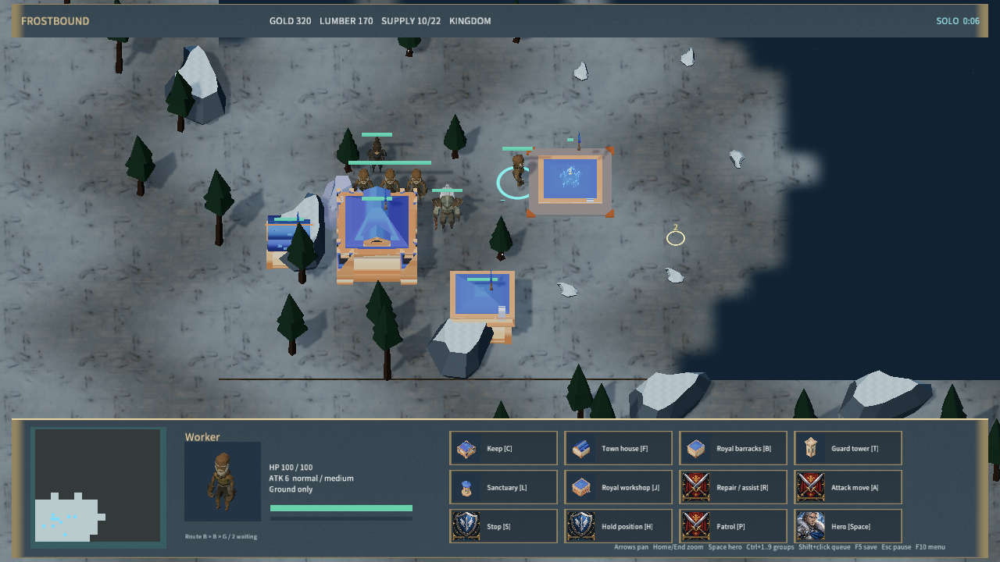
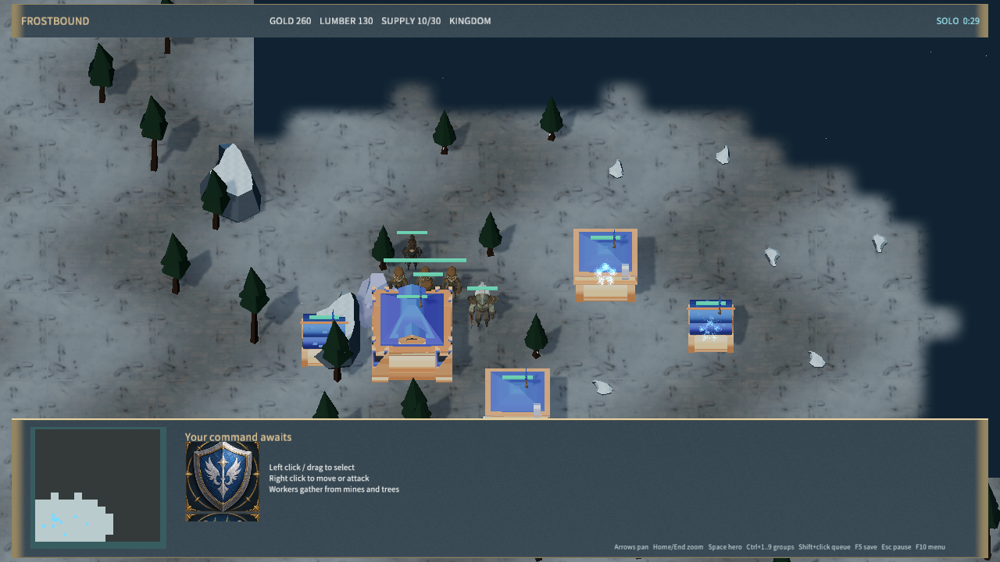

### 英雄背包

英雄六格背包支持使用、丢弃、右键走近拾取和主城出售；配方购买原子结算，出售返还含部件价值的50%，换装保持当前生命比例。生命/魔法药水回复250 HP/100 MP，共享10秒冷却。地面物品、拾取路径、物品冷却随存档和联机重连恢复；协议升级为6，拒绝1–5。任务单位每次死亡生成独立掉落ID，地面最多160件，满包保留掉落。

[背包原生验收](native-inventory-qa.json) 使用平坦无AI地图，英雄初始HP300/MP0并放置在商店范围内、基地回血范围外；所有购买、合成、丢弃、拾取、出售、药水和保存加载操作通过原生Agent输入。规则/TCP全套通过，新增真实TCP合成/掉落/拾取/重连/出售链路，实际QuickJS 3/3、[双原生客户端协议7与重连](native-network-qa.json) 通过。当前81模型、1899实体；本阶段沿用现有许可素材。

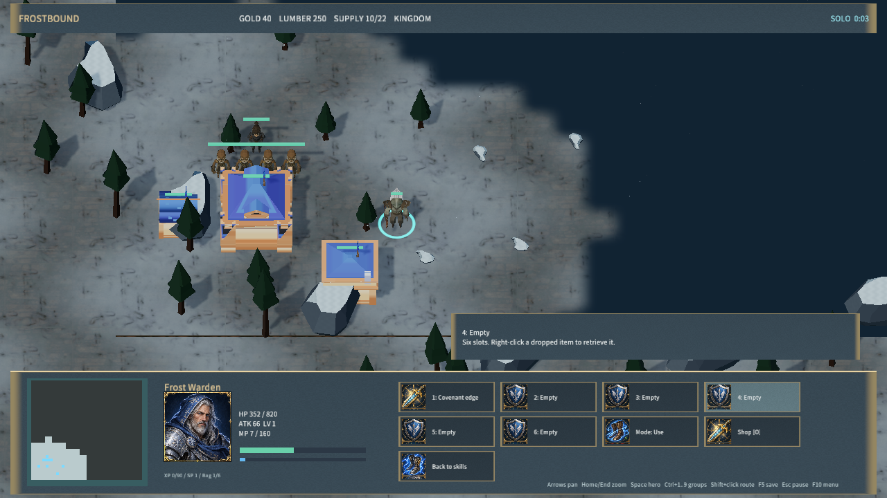
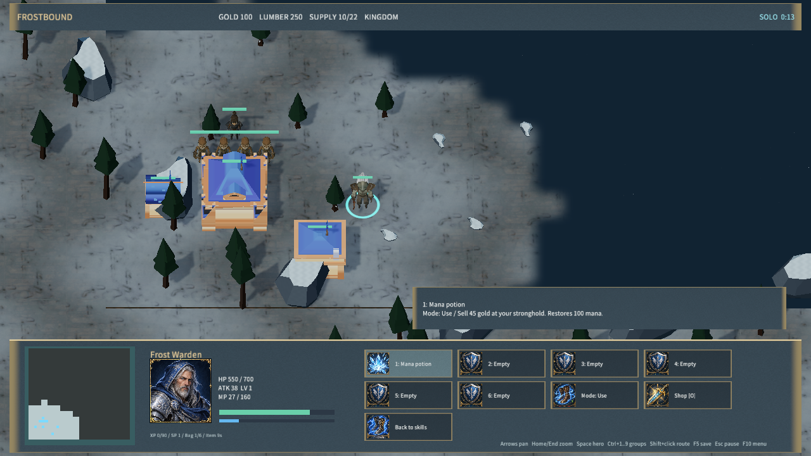

### 骨骼兵种与原生头像

本阶段增加 KayKit 官方 CC0 骷髅弩手和骷髅法师，分别用于 Bone archer 与 Necromancer。弩和法杖挂接到原作者 `handslot.r`，保留身体骨架、帽子/披风层级；按实际状态播放待机、行走、射击/施法，模型随攻击目标转向。来源固定到官方Git提交，8个源文件、原文许可、配方和派生哈希见 [skeleton-sources.json](../../../samples/frostbound-realms/skeleton-sources.json)。当前81模型、1771实体。

全部18种可移动模型拥有原生渲染头像，训练按钮和选中头像使用同一模型键；英雄选择仍使用已有英雄肖像。图集由实际骨骼姿态和原生几何边界生成，命令见下文。[兵种原生验收](native-units-qa.json) 覆盖两套模型待机/行走/攻击、实际伤害、攻击朝向、选中头像、训练图标和存档恢复；[四阵营原生回归](native-factions-qa.json) 通过。Node全规则/TCP、实际QuickJS 3/3、Rust模型/骨骼3/3通过，重新导入的6个派生文件哈希完全一致。

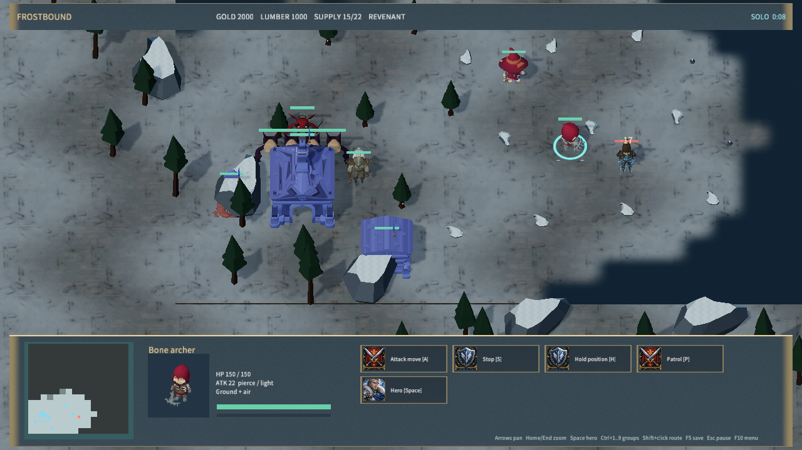
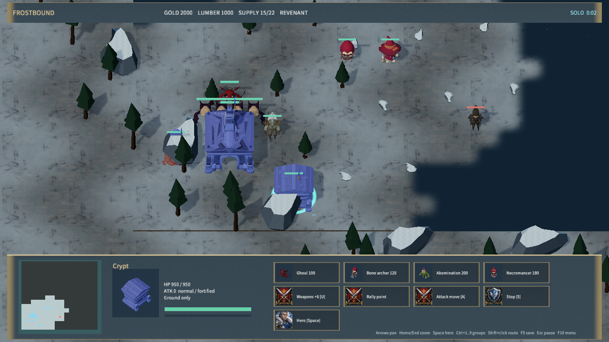

### 密集行军阶段

本阶段优化密集行军的重复寻路计算。相同可见障碍集合及碰撞半径共用动态占用网格，单位在同帧内移动后增量更新；固定网格节点的地形通行边按帧复用。保留整段扫掠、空地分层、编队终点、围攻和塔防入口规则。独立只读复核在混合编队、交错、空地、坡道、封闭高台五类场景各对照220帧，单位状态与优化前完全一致。

Node 全规则/TCP、实际 QuickJS 3/3 通过。[原生验收](native-avoidance-qa.json) 覆盖12人交错到达、6人围攻造成伤害和塔防第一波7个激活单位离开入口；双原生客户端指令及断线恢复见[联机验收](native-network-qa.json)。

[实际 QuickJS CPU 对照](avoidance-quickjs-cpu.json) 使用 Release 测试程序：20/40/80人密集出发首tick中位数由287.92/484.29/789.57 ms降至230.07/358.45/489.03 ms。40人混合编队整段行军均在235tick到位，模拟总耗时9.90→9.88秒，基本持平；该整段数据各运行一次，不表示稳定性能提升。优化降低密集出发峰值，持续行军与5ms整体预算仍待改进。测量不含原生渲染或IPC，也不代表整机帧率。

[Node 首tick记录](avoidance-cpu.json) 的20/40/80人中位数为8.96/14.58/21.71 ms。游戏仍为1771实体、79模型，复用已有免费资产及Release引擎。新增 `frost_traffic` 手动基准，可设置 `FROST_TRAFFIC_SOURCE` 对照历史模拟源码；运行命令见下文。

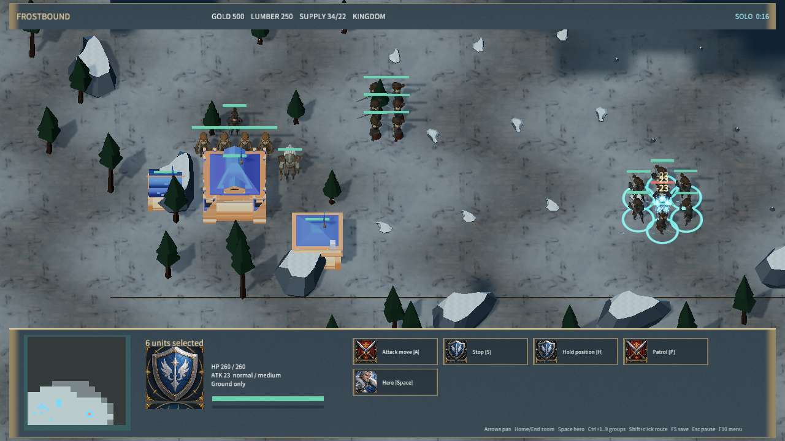
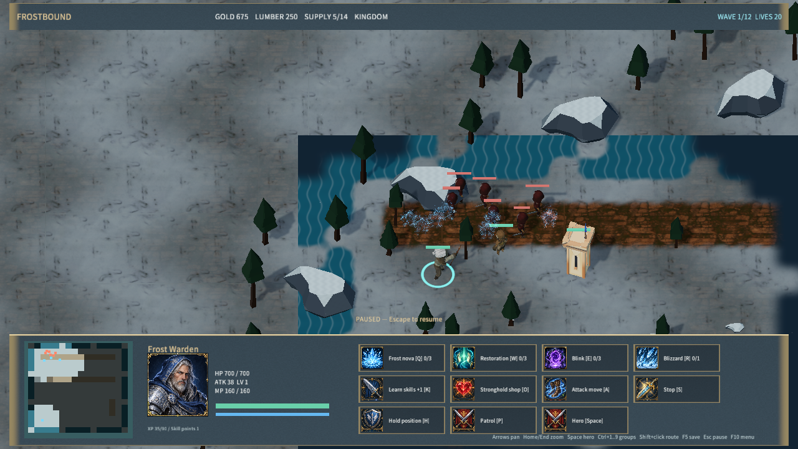

本阶段增加 H 驻守、P 巡逻和对应按钮：驻守只攻击射程及视线内敌人，巡逻在原地与指定编队落点间反复往返，遇敌后继续路线；S 解除驻守。两种命令清除旧移动队列，巡逻的两端显示蓝色编号，存档及重连保留端点。塔防火塔快捷键为 Y。复用已有资产与场景标记，仍为 1771 实体、79 模型。

Node 全规则/TCP 回归与实际 QuickJS 3/3 通过。[原生驻守巡逻验收](native-patrol-qa.json) 覆盖驻守不移动、巡逻战斗、往返、存档恢复及停止；[双客户端验收](native-network-qa.json) 通过驻守、巡逻和第二次断线后的端点恢复。原生 Agent 输入不代表物理键鼠验收。

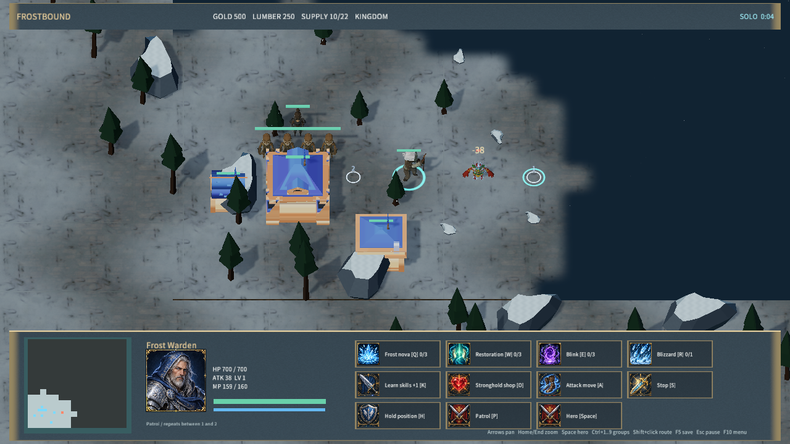

本阶段增加 Shift 移动/攻击移动队列：每单位最多8个等待落点，整组上限检查，未来编队按前一个落点朝向分配；普通改令和停止清空后续路线。工作、闪现、死亡和触发器改令同步清理队列。界面增加首个选中单位的编号路线，绿色移动/橙色攻击移动，越出战场的屏幕编号隐藏。地图场景新增18个标记/文字实体，保留既有实体编号；资产仍为79模型，1771场景实体。

规则验证覆盖顺序到达、攻击移动遇敌后续行军、混合编队存档回放、上限原子拒绝、改令/工作/闪现/死亡清理、旧档迁移、坏档拒绝及对手队列保密。Node全规则/TCP与真实QuickJS 3/3通过，服务器队列和主机重连有专门断言。[原生路线验收](native-waypoints-qa.json) 验证左右Shift、编号显示、保存/加载后继续完成和停止清空；[原生联机验收](native-network-qa.json) 检查协议7、两个客户端和重连。工人工作队列见本次范围。

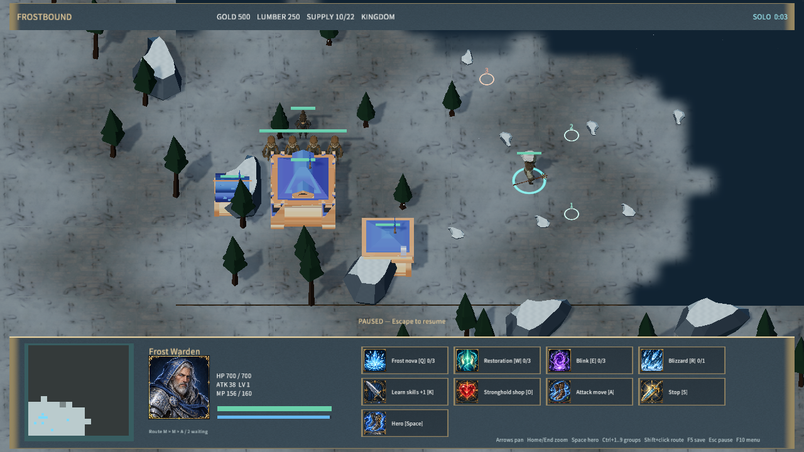

本阶段完善玩家多单位移动：最多 40 个单位按行军方向、射程与体型分配各自的可达位置，地面/空中独立编队，单单位精确到达点击点。河流、封闭高地、建筑和边界会调整落点；无足够空间时整组保留原命令。寻路和编队分配只使用可见敌方建筑，目标被新发现的建筑占用后重新落位。

`test-frost-formations.mjs` 验证 40 单位混合编队实际到达、近战/远程排序、输入顺序确定性、行军中存档恢复、坡道、封闭崖壁、河流、空军、建筑、边界和原子拒绝，并比较隐藏建筑存在/不存在时的己方公开路径和命令。Node 全部规则/TCP 回归、服务端四单位目标分配及实际 QuickJS 3/3 通过。[原生编队验收](native-formations-qa.json) 在隔离的平地测试地图验证 12 单位框选、Ctrl+1 编组、1 召回、右键移动、各自到达与保存恢复；未改动交付默认地图。工人工作队列见本次范围。

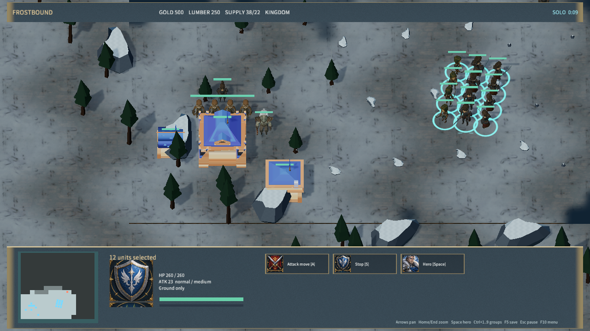

最新 Player 包284文件、1771 实体、81 模型，内容哈希 `1362668f15059a0c866fa9ff1101e8f25720dcb72e7cb7c8297fec153a5c9910`，逐文件与 Release exe 哈希核验及 30 秒启动结果见 [player-smoke.json](player-smoke.json)。

本阶段接入四阵营 32 个建筑模型与 5 个骨骼动画怪物，模型目录共 79 项。建筑由 Kenney Castle/Nature/Graveyard 的 46 个模块组合，包含各阵营三级主基地与五类功能建筑；怪物来自 Quaternius Ultimate Monsters。下载原件、CC0 许可、源地址、配方和派生 SHA-256 分别留存于 faction-sources.json、monster-sources.json。32 个建造图标由真实建筑的原生渲染生成，建造菜单、预览、头像和升级外观保持对应。

本阶段 Node 规则/TCP 与资源校验通过，frost_skins 2/2、实际 QuickJS frost_sample 3/3 通过；[四阵营原生验收](native-factions-qa.json) 覆盖四族初始建筑、动画工人选择、建造预览、图标、头像和名称，着色器拒绝数为 0。下图为实际游戏画面。资产阶段 Player 包 276 文件、1753 实体，内容哈希 `24811ac4891cccbe9b099000f2ee7696648077b1ebdb0ab08f0738f2ee3f4f58`；逐文件哈希与 Release exe 一致，启动证据见 player-smoke.json。

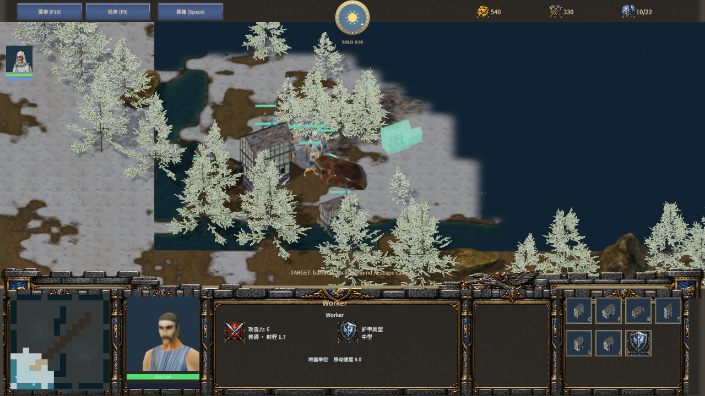
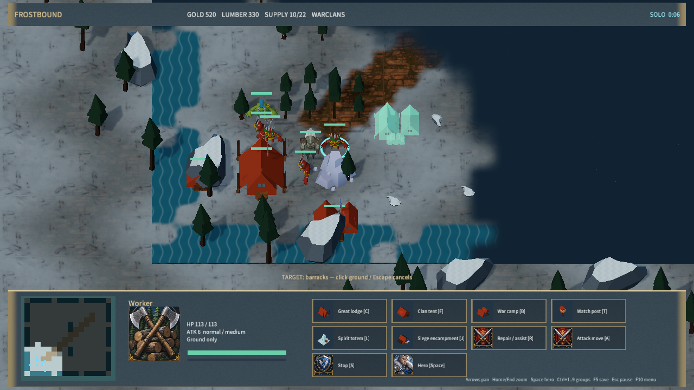
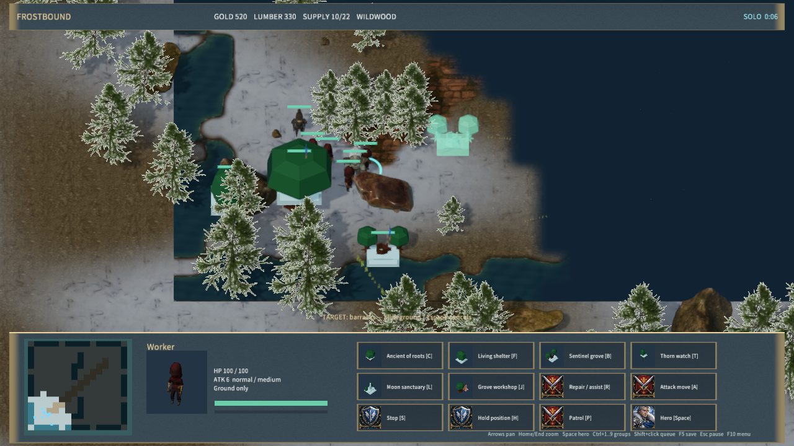
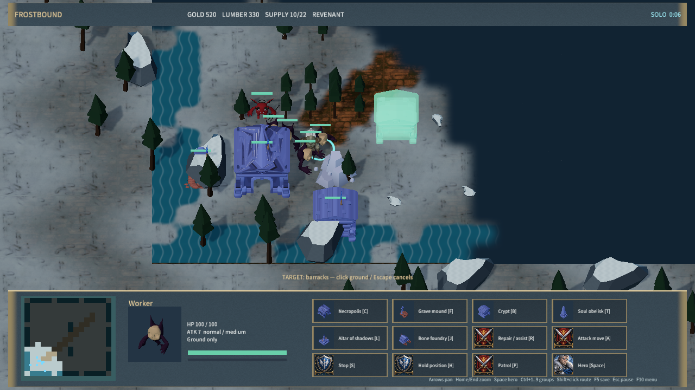

新增四级高度、四向坡道、真实崖壁网格和 Highland Pass 示例。高度页支持刷写、撤销、保存加载和试玩；旧地图自动补零高度。64 个区块保持原有地表贴图和迷雾，共享免费 Poly Haven 雪地/岩石素材。地面寻路、移动、建筑地基、工人施工/采集、远程地形遮挡和鼠标拾取接入高度；单位、资源、标记、弹道和伤害文字跟随地形。

本次新增地图区域与多条件/多动作事件链：条件组合、相对延迟、重复调度、原子增援、队伍公告、依赖保护和运行状态存档。编辑器六页支持区域与事件配置，F8 的 Supply Road 模板经合法命令和原生操作完成护送。名称和公告复用 InputField 支持 Unicode 文本，新增 Noto Sans SC 中文字体与随包许可。原生 Game 命中布局使用与原生渲染相同的 Y-down 坐标，修复输入框显示位置与点击区域偏离；隐藏交互实体不触发浏览器快照。编辑器 textarea 支持组合输入，Player 接通普通字符及 IME 提交；物理输入法尚待设备验收，节点连线编辑器仍未实现。

- 四族施工：持续协作、工人驻留、消耗工人自然生长、领地内召唤；工人到场后开工、受损工地、取消75%退款、维修、扩张据点与最近完工据点交货。使用阵营建筑模型，Kenney 地基模块和粒子反馈表示工地。
- 四阵营 16 个地面兵种、4 个攻城兵种、4 个飞行兵种定义、三级据点科技、采集建造生产、战争迷雾、四名独立英雄及 16 技能、机器人对战。
- 攻城工坊、三级祭坛飞行单位、对空限制、攻击/护甲倍率、建筑集结和取消队尾全额退款；F9 攻城地图可直接游玩。采集支持耗尽后交付尾货并转向下一处资源，修复快速阵营在据点交付距离外停住的问题。
- 原创四阶段 RPG，任务角色、装备掉落、成长、死亡复活与存档；规则回放用合法命令在 676 tick 完成任务，并覆盖中途恢复。
- 三路 MOBA、三件基础装备与三套合成配方；十二波塔防、三类塔、升级出售、首领与快速波。
- 地图编辑器支持地形、单位、RPG 角色、玩家阵营与 AI、条件和动作触发器、前置依赖、三槽保存加载与试玩。RPG 地图校验必需角色。
- 服务端权威 TCP 房间、准备开局、可见性过滤、重连和退出后 AI 接管；两个独立原生编辑器进程验证真实收发。
- 44 个 Quaternius/Kenney 来源模型与 35 个模块组合建筑，Poly Haven 地表贴图、粒子贴图及 Cinzel 字体。21 项来源/派生文件/许可/字体哈希核对通过。原始 ZIP 与贴图保留，冬季材质由代码适配；原创菜单插画、技能图集的完整生成提示词和哈希保存在 generated-art.json，合成配乐与四类音效由生成器重建。

引擎补充项目 JSON 存储、GLB 骨骼姿态、实体激活接口、Canvas 子节点索引、无物理组件场景快速路径，以及 GLB 姿态引用的打包依赖识别。原生视口 profiler 记录实际 renderSize，区分逻辑截图尺寸与编辑器预览尺寸。地表使用 64 个共享边界数据的区块，采用实际雪地/岩土贴图和插值迷雾；并接入冬季松林/岩石、建筑预览、技能图标、悬停说明、英雄状态条、远程弹道和伤害数字。

英雄支持技能点、普通技能 1/3/5 级学习门槛、6 级终极技能，以及护盾、缠绕、眩晕、加速、持续区域和临时飞龙召唤。主菜单/大厅 H 选人，K 学习、Shift+Q/W/E/R 加点、O 商店；地图英雄类型保存并进入试玩。服务端协议为 7，换英雄清除双方准备状态；存档恢复校验技能等级和点数，兼容旧单机英雄存档。新增四张头像与 16 个技能图标，提示词和 SHA-256 见 [hero-art.json](../../../samples/frostbound-realms/hero-art.json)。

## 验证

此前快照阶段引擎改进：World 按实体修改版本缓存不可变快照，脚本和编辑器复用未变化实体；原生 Play 逐帧传输变化实体及顺序，显式编辑全量校正。实体删除、编号复用、换场景和旧帧隔离有回归覆盖。修复重复名称组件覆盖运行中改名；停止操作绑定会话，启动/停止有序执行，编译超时为 30 秒。

| 验证路径 | 结果 |
| --- | --- |
| Node 游戏规则与真实 TCP | 通过；含完整 RPG 合法命令回放、科技、地图、迷雾、TD、合成和断线恢复 |
| mengine-core 库 / mengine-script 库 | 11 + 20 通过，含快照缓存更新与旧帧隔离 |
| Play runtime / Play compiler | 8 + 1 通过；另 1 手动性能测试未运行 |
| 编辑器 Play 前端 | 4 通过，含增量合并与异步停止/重启 |
| mengine-scene 库 | 18 通过 |
| mengine-physics 库 | 17 通过 |
| mengine-runtime UI | 85 通过 |
| gltf_pose / frost_skins | 2 + 1 通过；四个下载角色模型的蒙皮顶点变化，含 Dragon 飞行动画 |
| editor-host frost_sample | 3 通过；中文保存/取消/撤销、真实游戏与地图流程、35帧快照传输检查 |
| CLI pcPackage | 63 通过 |
| editorProfiler / nativeViewportFrame | 14 通过 |
| 编辑器前端及 Release 编辑器/Player | 构建通过，编辑器启用 tauri/custom-protocol |

地图事件阶段的完整 [native-qa.json](native-qa.json) 记录原生 Agent 菜单点击、英雄移动、施法、暂停、存档恢复、地图绘制与保存加载试玩、单位/触发器持久化、RPG 保存，以及双客户端真实 TCP 开局与强制断线重连。最新额外验证生产建筑选择/右键集结/取消队列、四种攻城模型、飞龙空中选中及跨河移动、塔防工人选择/建造预览/下单、RPG 施法、地表自定义材质未被拒绝；共享边界、玩家施法跨 tick 保留、AI 施法不重复发送均有规则回归。本轮还覆盖四英雄选人/学习/施法/存档、编辑器指定英雄保存加载试玩、两客户端分别选择圣骑士和法师并重连；规则检查覆盖全部 16 技能、等级门槛、非法存档、临时效果及旧档迁移。地图事件阶段运行了 Node规则/TCP、真实QuickJS两项和完整原生QA；本阶段中文编辑验收结果见文末。新规则回归覆盖四族到场施工、暂停/协作、维修扣费、占用工人、取消退款、摧毁释放、最后据点胜负、最近完工据点、旧档迁移与四族 AI 持续经济；完整原生 QA 和独立施工 QA 均覆盖选工人、下单、停止、右键继续、选工地取消退款。QA 使用独立配置和独立 storageId，不触碰用户存档。

Agent 输入没有覆盖物理键鼠设备；未听取实际音频，未做跨机器局域网和弱网验收。独立 Player 启动后保持响应，窗口标题正确，日志无 ERROR；本次未核验音频设备状态或实际听感，日志仍有 wgpu downlevel 能力警告。见 [启动证据](player-smoke.json) 和 [日志](player-stderr.txt)，不能替代 Player 窗口内完整操作验收。

地图事件新增验证：`test-frost-triggers.mjs` 覆盖原子增援、动作顺序、全部/任一条件、区域筛选、重复调度存档、旧地图迁移和合法护送流程；真实 TCP 使用上传的事件地图，验证服务器增援与对手公告隔离。`native-triggers-qa.json` 记录区域尺寸/命名/边缘移动、点选不污染撤销、Tab 模式切换撤销、依赖保护、条件/动作/公告编辑、保存加载、护送完成与任务存档恢复。独立只读审查所报公告泄露、撤销历史、边缘限制和 Tab 引用错误均已修复。

引擎和服务端消息上限统一512 KiB，脚本库21项测试通过（含Unicode分片往返和超限拒绝）。新Release原生客户端实际上传263,398字节合法复杂地图，两端游玩及重连通过，证据见 [native-large-map-qa.json](native-large-map-qa.json)。

## 原生画面

截图由原生 Game 路径生成，逻辑截图尺寸 1280×720。


另有 [攻城战场](siege.png)、[飞行单位](flight.png)、[生产与集结](production.png)、[标题](title.png)、[MOBA](ancients.png)、[大厅](lobby.png)、[联机](multiplayer.png)、[建造预览](placement.png)、[RPG 伤害反馈](combat.png)。

## 性能口径

施工阶段为 1611 实体，完整 QA 短采样 59 次，模拟均值 7.779 ms、原生命令 8.157 ms、呈现约 18.80 FPS。该轮包括先行施工流程，不能与此前开局专项测试直接作性能因果比较。以下保留快照阶段对照，5 ms 目标仍未达到。

| 指标（ms） | 初始基线 | 英雄阶段 | 当前缓存阶段 |
| --- | ---: | ---: | ---: |
| 模拟 | 46.990 | 15.354 | 6.775 |
| 原生渲染（已包含在命令内） | 46.645 | 7.386 | 7.295 |
| 原生命令 | 59.454 | 10.514 | 7.894 |
| 上传 | 0.689 | 1.434 | 1.479 |
| 浏览器绘制（按 sampleCount 加权） | 10.912 | 5.111 | 5.028 |
| 整体工作预算代理值 | 118.045 | 32.412 | 21.176 |
| 原生请求延迟 | 101.763 | 49.853 | 40.931 |
| 模拟请求延迟 | 120.742 | 56.755 | 23.134 |
| 呈现间隔 | 171.161 | 58.738 | 48.262 |
| P95 呈现间隔 | 220.800 | 100.100 | 94.500 |

此前快照阶段完整 QA 的实际原生预览 **1280×720**，**1579 实体**，62 次原生采样，呈现约 **20.72 FPS**。整体工作预算约 **21.18 ms**，**未达到 5 ms**。

独立性能对照使用相同 Skirmish、1280×720、预热 5 秒，再记录三组 5 秒窗口；开局单位数随游戏由 20 增至 21/22。三组中位数：模拟 **15.616 → 6.217 ms**，模拟请求 **54.724 → 17.644 ms**，整体工作预算代理 **32.631 → 19.893 ms**，呈现 **17.60 → 21.33 FPS**。实际 QuickJS 的 35 帧传输从 35,148,665 字节降至 1,060,789 字节（约减少 97%）。原始 [之前采样](performance-hero-baseline.json)、[之后采样](native-performance-qa.json) 和 [对照汇总](performance-cache-comparison.json) 保留；这是短窗口诊断，未进行独占机器长期基准或大军团压力测试。

采样场景是开局 20 单位 Skirmish，不能代表 160 单位压力测试。CPU 为 Intel Core Ultra 7 265K；系统安装 AMD Radeon RX 6800 XT 和 Intel Graphics，编辑器本次实际选择的适配器未记录。未接入 GPU timestamp，表内原生渲染是 CPU/提交墙钟耗时，不能作为 GPU 执行时间。

原生命令已经包含渲染，不能再次相加。整体工作预算采用模拟 + 原生命令 + 上传 + 浏览器绘制的平均值之和；这是多个采样流的工作预算代理值，不是逐帧端到端延迟。IPC 请求、呈现间隔另列。采样窗口约三秒，尚无长期或独占机器基准；基线未记录真实渲染尺寸，不能视为严格同分辨率对照。原始数据见 [基线](performance-baseline.json)、[最新回归](native-qa.json)、[汇总](performance-summary.json)。

## 运行与复现

```powershell
node scripts/build-frostbound.mjs
node scripts/render-frost-unit-icons.mjs
node scripts/test-frostbound.mjs
pnpm.cmd run build:editor
cargo build --release -p mengine-runtime -p mengine-editor-tauri --features tauri/custom-protocol
node scripts/qa-frostbound.mjs
node scripts/qa-frostbound.mjs --units-only
node scripts/qa-frostbound.mjs --performance-only
cargo test -p mengine-script --release --test frost_traffic -- --ignored --nocapture
node scripts/qa-frostbound.mjs --work-queues-only
node scripts/qa-frostbound.mjs --inventory-only
node scripts/qa-frostbound.mjs --formations-only
node scripts/qa-frostbound.mjs --waypoints-only
pnpm.cmd --filter @mengine/cli build
node packages/cli/dist/cli.js build samples/frostbound-realms --runtime target/release/mengine-runtime.exe --skip-runtime-build --out samples/frostbound-realms/Builds/windows-x64 --clean
./scripts/smoke-frostbound.ps1
```

运行 `samples/frostbound-realms/Builds/windows-x64/Frostbound Realms.exe`。生成脚本 Main.js 和 Builds 目录按仓库惯例不提交；新检出必须先运行生成器。最终包的内容哈希、文件数与启动检查留存于 player-smoke.json。

## 剩余工作

原作战役、四阵营完整美术和科技/空军/攻城、完整 Dota 英雄池与装备规则、长篇 RPG、可视化触发器图、桥梁/洞穴等重叠地形、录像观战、大规模导航、公网匹配/认证/NAT 尚未实现。界面、美术与动画也仍处于原型阶段；已实现的系统和本次验证不等于这些功能的验收。

## 中文编辑验收

N 打开区域/事件名称或公告编辑，点击输入框编辑，再点击保存/取消/清空。原生窗口语义输入已验证“霜境补给营地”和“补给已抵达，请护送至山口”保存/重载；实际物理输入法候选操作未验收。Player目前支持末尾输入和退格，没有选区/剪贴板编辑。

QuickJS 3/3、Player输入与CJK字形2/2、编辑器相关测试14/14、CLI引用字体2/2通过。新增[中文编辑截图](editor-unicode-input.png)，原生流程见[native-triggers-qa.json](native-triggers-qa.json)。独立包162文件、1753实体、42模型，所有文件哈希及Release runtime一致；启动30秒正常，零ERROR。Noto Sans SC及生成信息见[font-sources.json](../../../samples/frostbound-realms/font-sources.json)，字体许可随包交付。


## 分层地形阶段验收

规则/TCP 总套件通过，新增四向坡道连续性、旧图迁移与存档、逐步移动/空路径回退防穿崖、飞行跨崖、地基平整、隔崖施工和射线穿崖回归。实际 QuickJS 3/3，Rust 地形几何测试 1/1，Release 编辑器/Player 构建通过。原生 [native-terrain-qa.json](native-terrain-qa.json) 验证 64 个区块、204 个高地格、11 个坡道、笔刷/撤销/保存加载和英雄沿坡道上山，shader 拒绝数为 0。记录内 profiler 包含编辑/存档/切换操作，不作为稳定帧率基准；5ms 目标仍未验收。

截图：[地图编辑](highland-editor.png)、[高度笔刷](highland-brush.png)、[英雄上山](highland-ascent.png)。最终独立包 163 文件、1753 实体、42 模型；所有文件 SHA-256 和 Release exe 一致，内容哈希 `7b2436d0545fb19fbdc2a7d6008dd711ce04f932a4615dc6b4dac4cf39ddc4ed`。Player 启动 30 秒、正常响应、零 ERROR，见 [player-smoke.json](player-smoke.json)。本阶段未新增下载模型，使用已记录许可的 Poly Haven 地表和 Kenney/Quaternius 模型。物理输入、音频听感、跨机 LAN 均不由这些自动化结果证明。

新增第六编辑页后的 native-triggers-qa 回归通过：区域选择/缩放/命名、中文公告、条件动作编辑、依赖保护、保存加载和 Supply Road 护送完成均通过。
