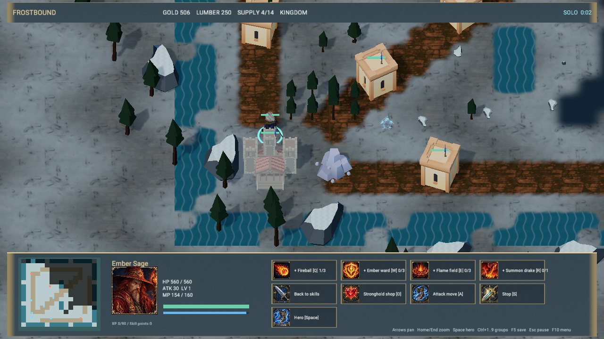
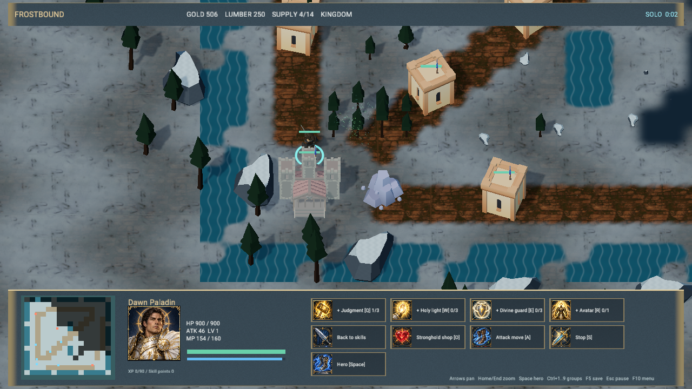
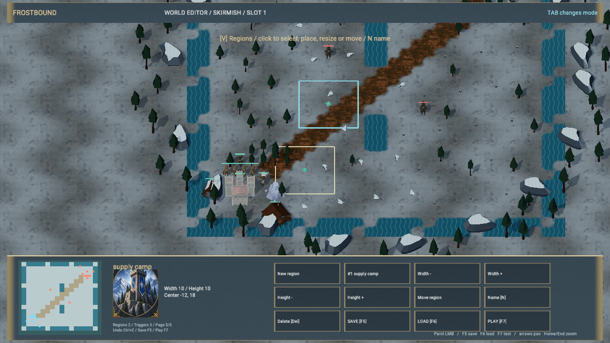
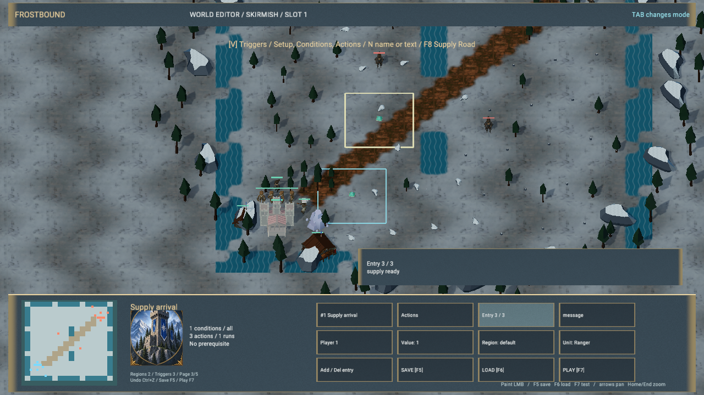
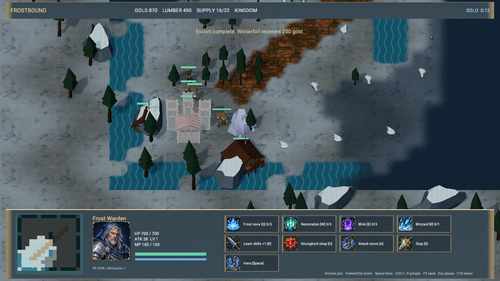
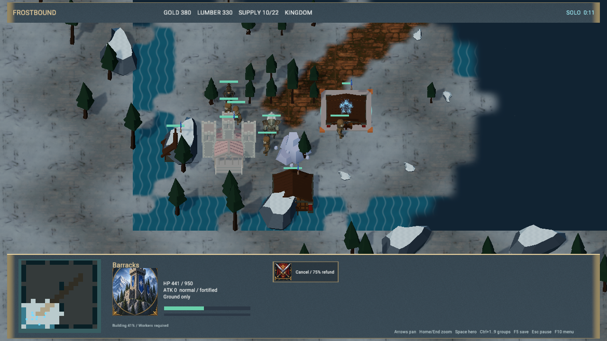
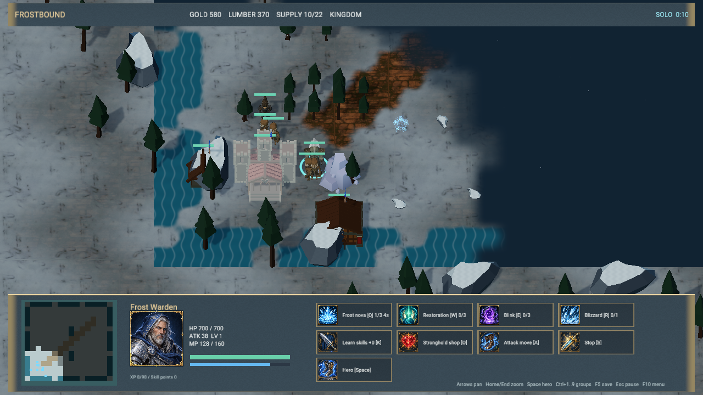
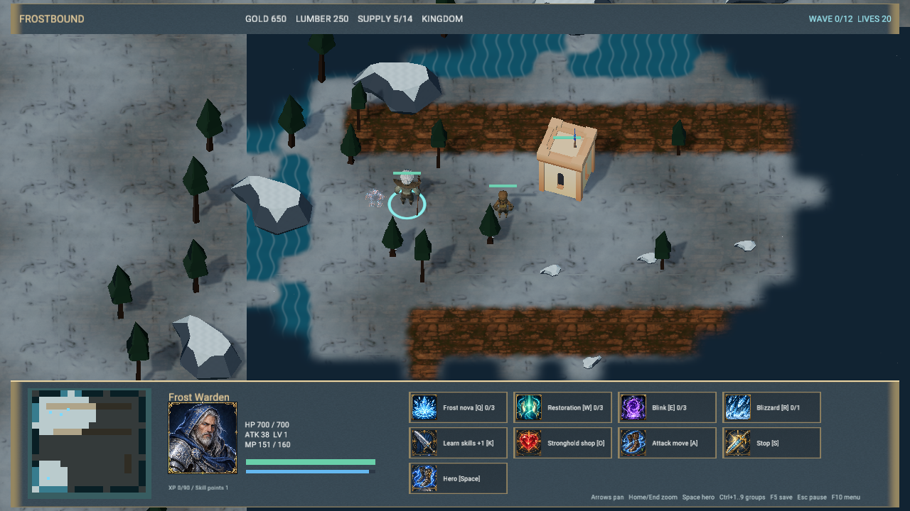
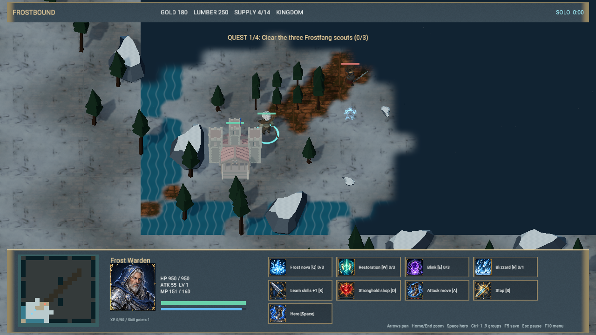
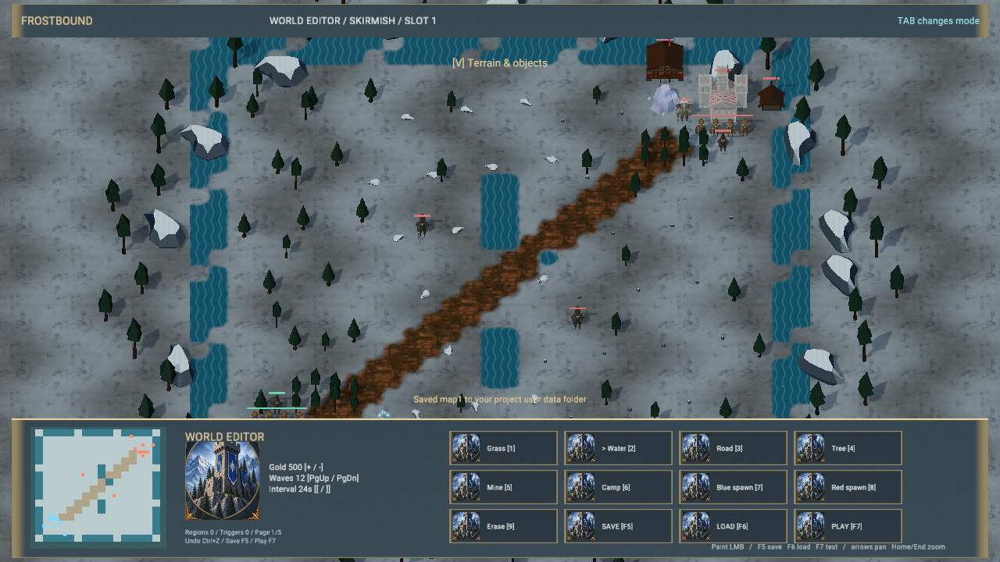

# Frostbound Realms 交付证据

2026-09-28。工程与操作说明见 [样例 README](../../../samples/frostbound-realms/README.md)。这是原创 RTS/RPG/MOBA/塔防基础版本；《冰封王座》完整内容复刻与约 5 ms 整体帧预算尚未完成。

## 本次范围

本次新增地图区域与多条件/多动作事件链：条件组合、相对延迟、重复调度、原子增援、队伍公告、依赖保护和运行状态存档。编辑器五页支持区域与事件配置，F8 的 Supply Road 模板经合法命令和原生操作完成护送。键码文本输入支持英文/数字/标点，Unicode/IME 和节点连线编辑器仍未实现。

- 四族施工：持续协作、工人驻留、消耗工人自然生长、领地内召唤；工人到场后开工、受损工地、取消75%退款、维修、扩张据点与最近完工据点交货。共用已下载的建筑模型，Kenney 地基模块和粒子反馈表示工地。
- 四阵营 16 个地面兵种、4 个攻城兵种、4 个飞行兵种定义、三级据点科技、采集建造生产、战争迷雾、四名独立英雄及 16 技能、机器人对战。
- 攻城工坊、三级祭坛飞行单位、对空限制、攻击/护甲倍率、建筑集结和取消队尾全额退款；F9 攻城地图可直接游玩。采集支持耗尽后交付尾货并转向下一处资源，修复快速阵营在据点交付距离外停住的问题。
- 原创四阶段 RPG，任务角色、装备掉落、成长、死亡复活与存档；规则回放用合法命令在 676 tick 完成任务，并覆盖中途恢复。
- 三路 MOBA、三件基础装备与三套合成配方；十二波塔防、三类塔、升级出售、首领与快速波。
- 地图编辑器支持地形、单位、RPG 角色、玩家阵营与 AI、条件和动作触发器、前置依赖、三槽保存加载与试玩。RPG 地图校验必需角色。
- 服务端权威 TCP 房间、准备开局、可见性过滤、重连和退出后 AI 接管；两个独立原生编辑器进程验证真实收发。
- 39 个 Quaternius/Kenney 来源模型与 3 个模块组合塔楼，Poly Haven 地表贴图、粒子贴图及 Cinzel 字体。21 项来源/派生文件/许可/字体哈希核对通过。原始 ZIP 与贴图保留，冬季材质由代码适配；原创菜单插画、技能图集的完整生成提示词和哈希保存在 generated-art.json，合成配乐与四类音效由生成器重建。

引擎补充项目 JSON 存储、GLB 骨骼姿态、实体激活接口、Canvas 子节点索引、无物理组件场景快速路径，以及 GLB 姿态引用的打包依赖识别。原生视口 profiler 记录实际 renderSize，区分逻辑截图尺寸与编辑器预览尺寸。地表使用 64 个共享边界数据的区块，采用实际雪地/岩土贴图和插值迷雾；并接入冬季松林/岩石、建筑预览、技能图标、悬停说明、英雄状态条、远程弹道和伤害数字。

英雄支持技能点、普通技能 1/3/5 级学习门槛、6 级终极技能，以及护盾、缠绕、眩晕、加速、持续区域和临时飞龙召唤。主菜单/大厅 H 选人，K 学习、Shift+Q/W/E/R 加点、O 商店；地图英雄类型保存并进入试玩。服务端协议为 4，换英雄清除双方准备状态；存档恢复校验技能等级和点数，兼容旧单机英雄存档。新增四张头像与 16 个技能图标，提示词和 SHA-256 见 [hero-art.json](../../../samples/frostbound-realms/hero-art.json)。

## 验证

此前快照阶段引擎改进：World 按实体修改版本缓存不可变快照，脚本和编辑器复用未变化实体；原生 Play 逐帧传输变化实体及顺序，显式编辑全量校正。实体删除、编号复用、换场景和旧帧隔离有回归覆盖。修复重复名称组件覆盖运行中改名；停止操作绑定会话，启动/停止有序执行，编译超时为 30 秒。

| 验证路径 | 结果 |
| --- | --- |
| Node 游戏规则与真实 TCP | 通过；含完整 RPG 合法命令回放、科技、地图、迷雾、TD、合成和断线恢复 |
| mengine-core 库 / mengine-script 库 | 11 + 20 通过，含快照缓存更新与旧帧隔离 |
| Play runtime / Play compiler | 8 + 1 通过；另 1 手动性能测试未运行 |
| 编辑器 Play 前端 | 4 通过，含增量合并与异步停止/重启 |
| mengine-scene 库 | 18 通过 |
| mengine-physics 库 | 17 通过 |
| mengine-runtime UI | 85 通过 |
| gltf_pose / frost_skins | 2 + 1 通过；四个下载角色模型的蒙皮顶点变化，含 Dragon 飞行动画 |
| editor-host frost_sample | 2 通过；真实 QuickJS 游戏与地图流程、35 帧快照传输检查 |
| CLI pcPackage | 63 通过 |
| editorProfiler / nativeViewportFrame | 14 通过 |
| 编辑器前端及 Release 编辑器/Player | 构建通过，编辑器启用 tauri/custom-protocol |

本轮最终完整 [native-qa.json](native-qa.json) 记录原生 Agent 菜单点击、英雄移动、施法、暂停、存档恢复、地图绘制与保存加载试玩、单位/触发器持久化、RPG 保存，以及双客户端真实 TCP 开局与强制断线重连。最新额外验证生产建筑选择/右键集结/取消队列、四种攻城模型、飞龙空中选中及跨河移动、塔防工人选择/建造预览/下单、RPG 施法、地表自定义材质未被拒绝；共享边界、玩家施法跨 tick 保留、AI 施法不重复发送均有规则回归。本轮还覆盖四英雄选人/学习/施法/存档、编辑器指定英雄保存加载试玩、两客户端分别选择圣骑士和法师并重连；规则检查覆盖全部 16 技能、等级门槛、非法存档、临时效果及旧档迁移。本次地图事件阶段重新运行 Node 规则/TCP、真实 QuickJS 两项和完整原生 QA，其余引擎套件为此前阶段结果。新规则回归覆盖四族到场施工、暂停/协作、维修扣费、占用工人、取消退款、摧毁释放、最后据点胜负、最近完工据点、旧档迁移与四族 AI 持续经济；完整原生 QA 和独立施工 QA 均覆盖选工人、下单、停止、右键继续、选工地取消退款。QA 使用独立配置和独立 storageId，不触碰用户存档。

Agent 输入没有覆盖物理键鼠设备；未听取实际音频，未做跨机器局域网和弱网验收。独立 Player 启动后保持响应，窗口标题正确，日志无 ERROR；本次未核验音频设备状态或实际听感，日志仍有 wgpu downlevel 能力警告。见 [启动证据](player-smoke.json) 和 [日志](player-stderr.txt)，不能替代 Player 窗口内完整操作验收。

地图事件新增验证：`test-frost-triggers.mjs` 覆盖原子增援、动作顺序、全部/任一条件、区域筛选、重复调度存档、旧地图迁移和合法护送流程；真实 TCP 使用上传的事件地图，验证服务器增援与对手公告隔离。`native-triggers-qa.json` 记录区域尺寸/命名/边缘移动、点选不污染撤销、Tab 模式切换撤销、依赖保护、条件/动作/公告编辑、保存加载、护送完成与任务存档恢复。独立只读审查所报公告泄露、撤销历史、边缘限制和 Tab 引用错误均已修复。

引擎和服务端消息上限统一512 KiB，脚本库21项测试通过（含Unicode分片往返和超限拒绝）。新Release原生客户端实际上传263,398字节合法复杂地图，两端游玩及重连通过，证据见 [native-large-map-qa.json](native-large-map-qa.json)。

## 原生画面

截图由原生 Game 路径生成，逻辑截图尺寸 1280×720。












另有 [攻城战场](siege.png)、[飞行单位](flight.png)、[生产与集结](production.png)、[标题](title.png)、[MOBA](ancients.png)、[大厅](lobby.png)、[联机](multiplayer.png)、[建造预览](placement.png)、[RPG 伤害反馈](combat.png)。

## 性能口径

施工阶段为 1611 实体，完整 QA 短采样 59 次，模拟均值 7.779 ms、原生命令 8.157 ms、呈现约 18.80 FPS。该轮包括先行施工流程，不能与此前开局专项测试直接作性能因果比较。以下保留快照阶段对照，5 ms 目标仍未达到。

| 指标（ms） | 初始基线 | 英雄阶段 | 当前缓存阶段 |
| --- | ---: | ---: | ---: |
| 模拟 | 46.990 | 15.354 | 6.775 |
| 原生渲染（已包含在命令内） | 46.645 | 7.386 | 7.295 |
| 原生命令 | 59.454 | 10.514 | 7.894 |
| 上传 | 0.689 | 1.434 | 1.479 |
| 浏览器绘制（按 sampleCount 加权） | 10.912 | 5.111 | 5.028 |
| 整体工作预算代理值 | 118.045 | 32.412 | 21.176 |
| 原生请求延迟 | 101.763 | 49.853 | 40.931 |
| 模拟请求延迟 | 120.742 | 56.755 | 23.134 |
| 呈现间隔 | 171.161 | 58.738 | 48.262 |
| P95 呈现间隔 | 220.800 | 100.100 | 94.500 |

此前快照阶段完整 QA 的实际原生预览 **1280×720**，**1579 实体**，62 次原生采样，呈现约 **20.72 FPS**。整体工作预算约 **21.18 ms**，**未达到 5 ms**。

独立性能对照使用相同 Skirmish、1280×720、预热 5 秒，再记录三组 5 秒窗口；开局单位数随游戏由 20 增至 21/22。三组中位数：模拟 **15.616 → 6.217 ms**，模拟请求 **54.724 → 17.644 ms**，整体工作预算代理 **32.631 → 19.893 ms**，呈现 **17.60 → 21.33 FPS**。实际 QuickJS 的 35 帧传输从 35,148,665 字节降至 1,060,789 字节（约减少 97%）。原始 [之前采样](performance-hero-baseline.json)、[之后采样](native-performance-qa.json) 和 [对照汇总](performance-cache-comparison.json) 保留；这是短窗口诊断，未进行独占机器长期基准或大军团压力测试。

采样场景是开局 20 单位 Skirmish，不能代表 160 单位压力测试。CPU 为 Intel Core Ultra 7 265K；系统安装 AMD Radeon RX 6800 XT 和 Intel Graphics，编辑器本次实际选择的适配器未记录。未接入 GPU timestamp，表内原生渲染是 CPU/提交墙钟耗时，不能作为 GPU 执行时间。

原生命令已经包含渲染，不能再次相加。整体工作预算采用模拟 + 原生命令 + 上传 + 浏览器绘制的平均值之和；这是多个采样流的工作预算代理值，不是逐帧端到端延迟。IPC 请求、呈现间隔另列。采样窗口约三秒，尚无长期或独占机器基准；基线未记录真实渲染尺寸，不能视为严格同分辨率对照。原始数据见 [基线](performance-baseline.json)、[最新回归](native-qa.json)、[汇总](performance-summary.json)。

## 运行与复现

```powershell
node scripts/build-frostbound.mjs
node scripts/test-frostbound.mjs
pnpm.cmd run build:editor
cargo build --release -p mengine-runtime -p mengine-editor-tauri --features tauri/custom-protocol
node scripts/qa-frostbound.mjs
node scripts/qa-frostbound.mjs --performance-only
pnpm.cmd --filter @mengine/cli build
node packages/cli/dist/cli.js build samples/frostbound-realms --runtime target/release/mengine-runtime.exe --skip-runtime-build --out samples/frostbound-realms/Builds/windows-x64 --clean
```

运行 `samples/frostbound-realms/Builds/windows-x64/Frostbound Realms.exe`。生成脚本 Main.js 和 Builds 目录按仓库惯例不提交；新检出必须先运行生成器。最终包的内容哈希、文件数与启动检查留存于 player-smoke.json。

## 剩余工作

原作战役、四阵营完整独立建筑和科技/空军/攻城、完整 Dota 英雄池与装备规则、长篇 RPG、可视化触发器图、复杂地形、录像观战、大规模导航、公网匹配/认证/NAT 尚未实现。界面、美术与动画也仍处于原型阶段；已实现的系统和本次验证不等于这些功能的验收。
