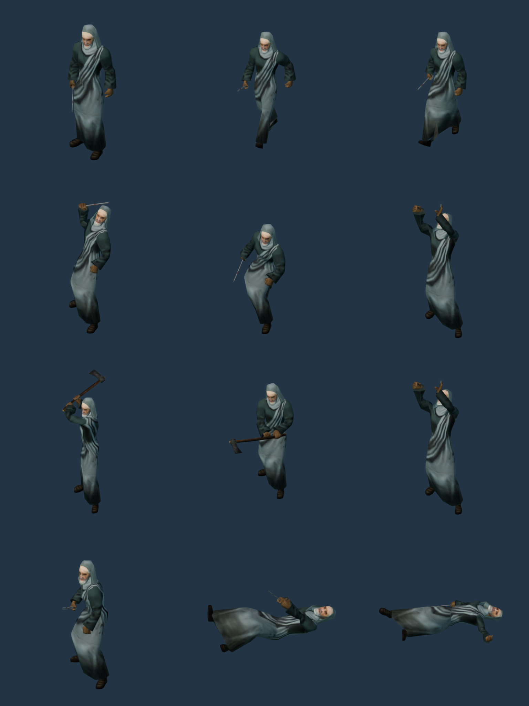
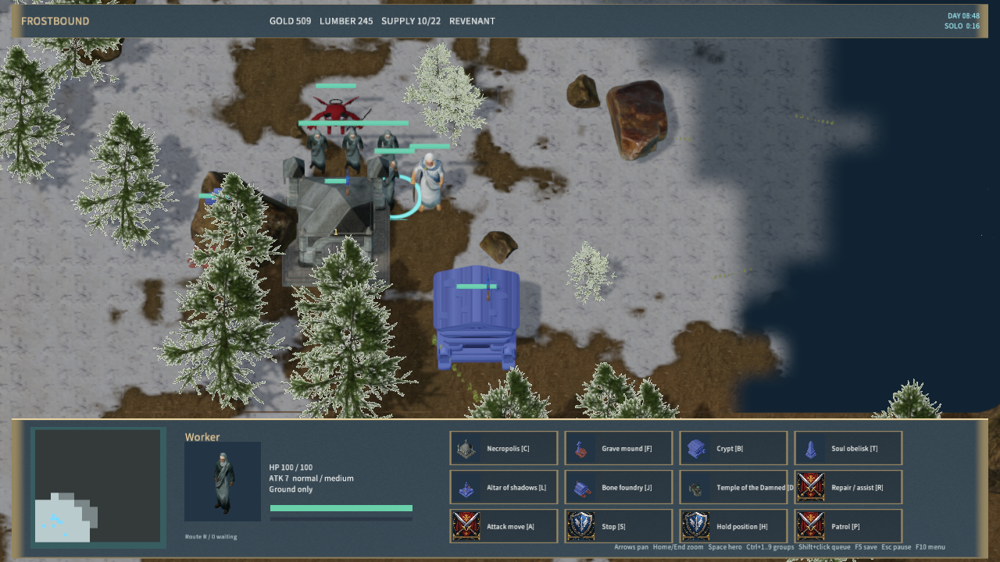

# Revenant Acolyte artwork

Revenant workers use a dark-robed human model with a hood, face, hands and short blade. Movement, melee attacks and death use the base mesh. Gold gathering and repair use a two-handed ritual animation; woodcutting uses a separate axe assembly. The worker retains its base portrait while changing action meshes, faces its actual work target and returns to its normal equipment when stopped, stunned, carrying a full load or unable to work.

The models adapt Wildfire Games' 0 A.D. meshes, textures and animations under CC-BY-SA-3.0. The 17 pinned source files were already retained in `SourceAssets/0ad`. `acolyte-sources.json` records their URLs, revision, hashes, material colors, blade transformation and animation assignments. Both license copies include attribution and the derivative model, texture, material and portrait paths.

| Model | Triangles | Bones | Native animation samples |
|---|---:|---:|---:|
| RealAcolyte | 1,127 | 102 | 80 |
| RealAcolyteMine | 1,079 | 102 | 50 |
| RealAcolyteBuild | 1,079 | 102 | 50 |
| RealAcolyteWood | 1,183 | 102 | 28 |

Rebuild with Blender 4.5.9: `--background --disable-autoexec --python-exit-code 1 --python scripts/import-frost-humans.py -- --manifest acolyte-sources.json`, followed by `node scripts/build-frostbound.mjs`. The main importer includes this step. Repeated import reproduced all 20 model, material and texture hashes. The shared importer supports an optional whole-material color factor; existing manifests retain their original color behavior.

`test-frost-acolyte.py` passed all 208 native samples, finite geometry, skin-weight normalization, joint/index limits, texture coordinates and attachment bounds. The full rule/TCP suite passed; visual tests cover both human and Revenant worker equipment, gathering, repair, save restoration, stopping and autonomous Revenant construction. The 31-entry portrait atlas was regenerated from native meshes.

`qa-frostbound.mjs --acolyte-only` passed native worker selection/portrait, gold delivery, woodcutting, work facing, repair, repair save/load, stopping and independent summoned-building progress. Zero material-pipeline rejections; evidence is in `native-acolyte-qa.json`. The pose sheet uses `render-frost-unit-icons.mjs --acolyte-sheet`.

The packaged Release contains 637 files with content hash `f8649feeffbb745b493cfa0f8ab61efc8da3c7f7602765c480cd525a9d9e6f3e`. Manifest validation and the 30-second Player startup/responsiveness check passed with zero logged errors (`player-smoke.json`).

This is textured low-polygon artwork, not a photorealistic scan or an exact Warcraft Acolyte mesh. Gameplay still uses the sample's shared worker economy, including wood harvesting and gold delivery. Haunted mines and the original Acolyte/Ghoul division of resource work remain incomplete. Physical mouse, audio listening and cross-machine LAN were not verified by this stage.
