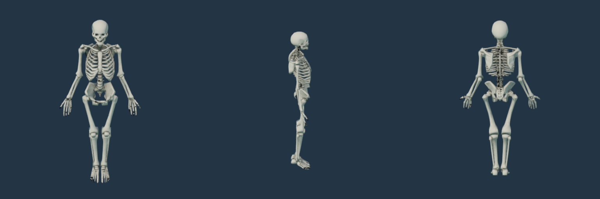

# 解剖骨架基础资产

Gord Goodwin 的 [Skeleton with rig](https://opengameart.org/content/skeleton-with-rig) 提供 CC0 解剖骨架和完整绑定。原始 Blender 文件保存在 `SourceAssets/anatomical-skeleton/fgc_skeleton.blend`，固定下载地址与 SHA-256 见 `anatomical-skeleton-sources.json`。

`SkeletonBody` 使用原始基础网格，统一为 3.2 世界单位高，合并八个身体部分，三角化并将每个顶点限制为四个归一化骨骼权重。237 根导出骨骼中有 116 根影响网格，共 15,581 个三角形。重新展开 UV 后烘焙 1K 骨缝遮蔽贴图，材质采用骨白色、非金属和固定粗糙度。原始控制器与约束保存在未修改的源文件中，派生文件保留绑定层级。



这三张视图来自 MEngine Release 原生渲染，模型使用绑定姿势。源文件没有动画。本阶段没有将它设为可训练兵种，也没有替换现有骷髅弩手；射击、行走、死亡、握持武器和装填动作需要后续适配。该基础资产不代表弩手运行验收完成。

## 验证

来源与派生哈希、许可、骨骼索引、四权重归一化、UV 范围、骨缝贴图及原生几何边界通过。重复导入的 GLB、PNG 和材质三个哈希一致。结构化证据见 [资产检查](anatomical-skeleton-qa.json)、[重复生成](anatomical-skeleton-repro-qa.json) 与 [原生视图](anatomical-skeleton-views.json)。

```powershell
blender --background --disable-autoexec --python-exit-code 1 --python scripts/import-frost-anatomical-skeleton.py
python scripts/test-frost-anatomical-skeleton.py
$env:MENGINE_QA_ROOT='D:/MEngineNativeQA'
node scripts/render-frost-unit-icons.mjs --skeleton-body-sheet
```

主资产导入器包含这一生成步骤。原始模型及派生模型采用 CC0，来源说明同时保存在 `Licenses/Gord-Goodwin-Skeleton.txt` 和 `Assets/Licenses/Gord-Goodwin-Skeleton.txt`。
