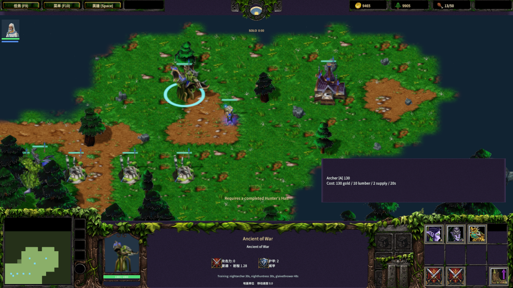
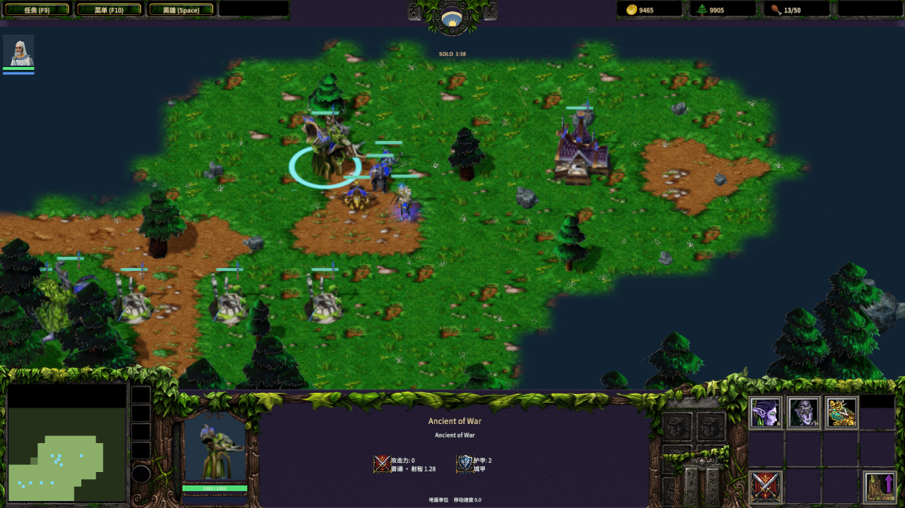
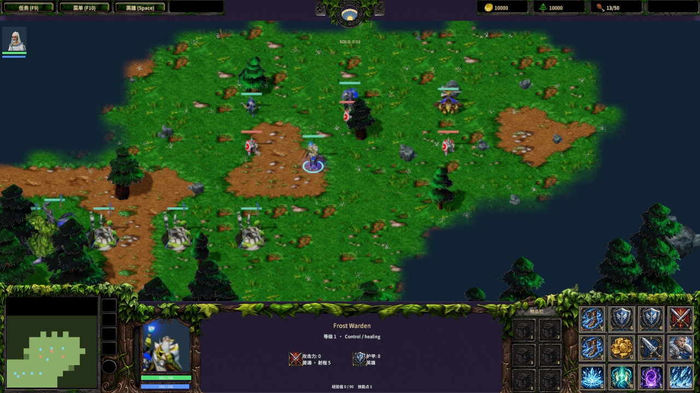

# 战争古树训练与原版兵种

作者：MiYu

新近战对局的战争古树训练弓箭手、女猎手和刃车。三种单位采用已导入的原版模型、动画和选择圈比例，训练按钮使用原版图标与禁用图标。弓箭手、女猎手、刃车位于第一行的第 1、2、3 个槽位，热键为 A、H、T。扎根／拔根仍位于 `(3,2)`。

| 单位 | 金／木 | 训练／人口 | 生命／护甲 | 平均伤害／类型 | 射程／间隔 | 模型 |
|---|---:|---:|---:|---|---|---|
| 弓箭手 `earc` | 130／10 | 20秒／2 | 245／0、中甲 | 17／穿刺 | 5／1.5秒 | 原版 Archer |
| 女猎手 `esen` | 195／20 | 30秒／3 | 600／2、无甲 | 17／普通 | 2.25／1.8秒 | 原版 Huntress |
| 刃车 `ebal` | 210／65 | 48秒／3 | 300／2、重甲 | 44.5／攻城 | 11.5／3.5秒 | 原版 Ballista |

女猎手与刃车需要己方已经完成、仍然存活的猎手大厅 `edob`。猎手大厅可在一本建造，费用 210 金／100 木、完整施工 60 秒、1100 生命、5 城甲；该建筑不训练攻城单位。已付款的队列在战争古树拔根时暂停，扎根后继续，取消队列退回对应的源费用。前置建筑被摧毁会阻止新训练，已经支付的队列继续。

弓箭手可攻击地面和飞行单位；女猎手和刃车仅攻击地面。发射速度分别为 9／9／14，攻击前摇为 0.72／0.46／0.10 秒，使用固定 0.1 秒模拟步长。女猎手默认共攻击两个目标，第二个目标位于首次命中点 4 单位范围内、伤害为 50%，不会再次命中同一个目标。弹跳只选择敌方地面目标，不给友军或飞行单位造成伤害。

刃车最小射程为 2.5，自动索敌会跳过距离不足的单位。弹道锁定发射时的落点，所有落点附近单位，包括移动后的主目标，都按 0.25／0.5／1.5 半径分别受到 100%／40%／25% 伤害。该武器没有敌方限定，友军也会受到溅射；友军伤害正常经过护甲与护盾，友军死亡不产生反补、金币或击杀奖励。[原版官方说明](https://classic.battle.net/war3/nightelf/units/glaivethrower.shtml)确认刃车基础溅射与穿透升级属于不同效果。

三种单位使用默认 `Units/MiscGame.txt` 的普通／穿刺／攻城伤害矩阵，保留 NORMAL 与 DIVINE 槽，未采用旧版 `Melee_V0` 数据。其他现有样例单位仍使用其原有规则。新兵种不额外叠加样例阵营生命、移动和伤害倍率，也不使用样例的即时“武器 +6”升级。弓箭手与女猎手夜间每秒恢复 0.5 生命，并使用当前夜间隐身命令；隐身待命时不会自动发动攻击。

三种原版投射物均使用源网格的全部可见材质层与 Stand 动画；箭矢、月刃、刃车投射物分别使用 1、3、2 个部件。投射物保留源 +X 朝向，旋转到实际飞行方向，按源 modelScale 默认值与当前世界比例 2 渲染。原始发射偏移随单位局部轴变换，源 Missilearc 值驱动当前抛物线实现。前摇、在途弹道、弹跳已命中列表和剩余目标数随存档保存；服务器向敌方隐藏攻击前摇目标、订单和训练队列，仅公开可见的投射物。

新对局保存 `ancientWarVersion=1`。旧存档缺少该版本时恢复为 0，保留原样例训练列表及队列。新单位使用独立的 `nightarcher`、`nighthuntress`、`glaivethrower` 类型，可通过地图编辑器的单位列表放置。TCP 协议为 45。

数据来自当前安装的 Warcraft III **1.27.0.52240** 的 MPQ 覆盖层。`ancient-war.json` 保留选中的 SLK 行、单位功能／字符串节和原版伤害矩阵；`ancient-war-sources.json` 记录 12 个原始文件及 20 个源／输出文件的来源、大小和 SHA-256。原版资产版权属于 Blizzard Entertainment，未将其下载可得性解释为统一免费再分发许可。导入器可使用签名原始文件脱离游戏安装重生成，并拒绝覆盖已经被修改的输出。

```text
python scripts/import-frost-ancient-war.py
node scripts/build-frostbound.mjs
python scripts/test-frost-ancient-war-assets.py
node scripts/test-frost-ancient-war.mjs
node scripts/test-frost-ancient-war-client.mjs
node scripts/test-frost-ancient-war-network.mjs
node scripts/test-frostbound.mjs
node scripts/qa-frost-ancient-war.mjs
```

规则检查覆盖一本训练、缺失／未完成前置的原子拒绝、费用／人口／退款、完整 20／30／48 秒队列、猎手大厅完整施工、原版属性／目标／伤害矩阵、前摇及弹跳中途保存、分层溅射与友伤、移动目标落点伤害、最小射程自动索敌、夜间回血和隐身待命。生成客户端检查实际图标点击、A／H／T、扎根暂停和菜单存读档。真实 TCP 检查所有权、原版费用与队列、断线重连、完整固定步长生产结果、源投射物及敌方隐私；网络规则测试加速推进权威模拟步长，不能视为墙钟 98 秒运行。

素材验证：[逐字节复现](ancient-war-art-validation.json)。原生验收：[报告与步骤计时](native-ancient-war-qa.json)。

本阶段全量规则、客户端和真实 TCP 回归产生 89 条 PASS、退出码 0。Release QuickJS 原生验收通过实际弓箭手按钮点击、女猎手／刃车热键、未完成猎手大厅拒绝、一本原版费用、完整 20／30／48 秒生产队列、源模型比例及三个多部件 Stand 投射物。已查看最终训练、军队和投射物截图；材质管线拒绝与控制台错误为 0，验收进程正常退出，专属临时工程和测试存档清理完成。验收产品 Main.js 与 Main.mscene 的 SHA-256 与当前生成结果一致。

原生阶段耗时：工程打开／就绪 67.331 秒，前置与真实命令 170.301 秒，完整训练／模型检查 274.565 秒，源投射物 42.199 秒。四段合计约 9 分 14 秒；98 秒是原生固定步长推进的游戏时间，不能等同于墙钟耗时。后续脚本在启动编辑器前校验夹具，并即时记录阶段耗时与每 100 步训练进度。





战争古树的哨兵、硬弓、射击术、月刃与穿透升级，以及猎手大厅的完整科技列表尚未接入。当前伤害仍使用平均值；原版随机掷骰、精确攻击取消时相、隐身淡出、原版弹道曲线和碰撞边界、Attack Ground／树木攻击需继续完善。完整战役、经典地图、完整地图编辑器与全部兵种／技能仍未完成；物理键鼠、音频及跨机器 LAN 尚未独立验收。完整游戏复刻目标保持 active。
