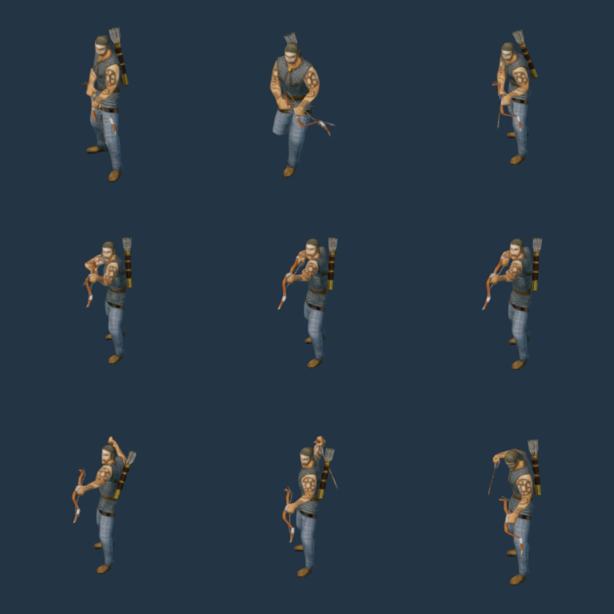

# 写实弓箭手与箭矢

人族游侠使用链甲身体、背部箭袋和带骨骼的弓。待机时右手持箭；射击时装填箭挂在身体的 projectile 挂点，弓弦与上下弓臂随机械动画变形。飞行箭矢使用实际箭头与箭羽模型，沿弹道切线转向。



从左到右、从上到下：待机、行走、起弓、拉弓中段、拉满、释放、随动、取箭、准备。此图由原生 Release 渲染器生成，各格按实际姿态边界适配。

## 来源与转换

原作者为 [Wildfire Games](https://www.wildfiregames.com/)，来自 [0 A.D.](https://github.com/0ad/0ad) 固定版本 `61a3b9507d974084e6badb88a0826bd89a6d5b8b`，许可为 [CC-BY-SA 3.0](https://creativecommons.org/licenses/by-sa/3.0/)。人类角色共 66 个源文件、15,917,092 字节，原件和派生资源 SHA-256 记录在 `human-sources.json`；署名随 Player 分发。

导入器保留弓的四根骨骼和原始蒙皮权重，把弓骨架接到身体的 weapon_bow 挂点；身体动画和机械弓动画按归一化时刻同步。三种弓手模型共享逻辑身份 RealArcher，分别用于手持箭、已释放和已装填状态，头像与训练入口始终使用相同身份。

射击从源动画的 event=0.45 开始，按模拟战斗冷却推进；load=0.72 后显示装填箭。行走优先使用持弓行走动作。存档或网络恢复不依赖本地播放时钟。RealArrow 长度归一化为 1.5，引擎局部 +Z 指向箭尖；此阶段仍沿用即时命中规则，飞行过程是表现效果。

近战命中后调整包围位置时，只要仍在攻击范围且视线可达，朝向保持对准目标；范围外追击沿移动方向转身。

## 重建与验收

```powershell
& $env:BLENDER --background --factory-startup --python-exit-code 1 --python scripts/import-frost-humans.py
node scripts/build-frostbound.mjs
node scripts/render-frost-unit-icons.mjs
node scripts/render-frost-unit-icons.mjs --archer-sheet
python scripts/test-frost-humans-import.py
node scripts/test-frostbound.mjs
node scripts/qa-frostbound.mjs --humans-only
```

资源重建验证覆盖全部 43 个派生文件；几何验证覆盖 54 个原生蒙皮姿态、弓弦变化、箭尖方向和尺寸。原生玩法验收包括三个人类模型的移动、伤害、朝向、选中头像、训练按钮、箭矢发射、装填/释放切换和存档恢复。详细结果及当前运行包哈希见 [阶段验收](archer-art-qa.json)。

其余英雄、兵种和两族建筑仍需统一美术。完整游戏复刻与 5 ms 性能目标尚未完成；物理鼠标、音频听感、独立 Player 帧率及跨机器联机未在本阶段验收。
