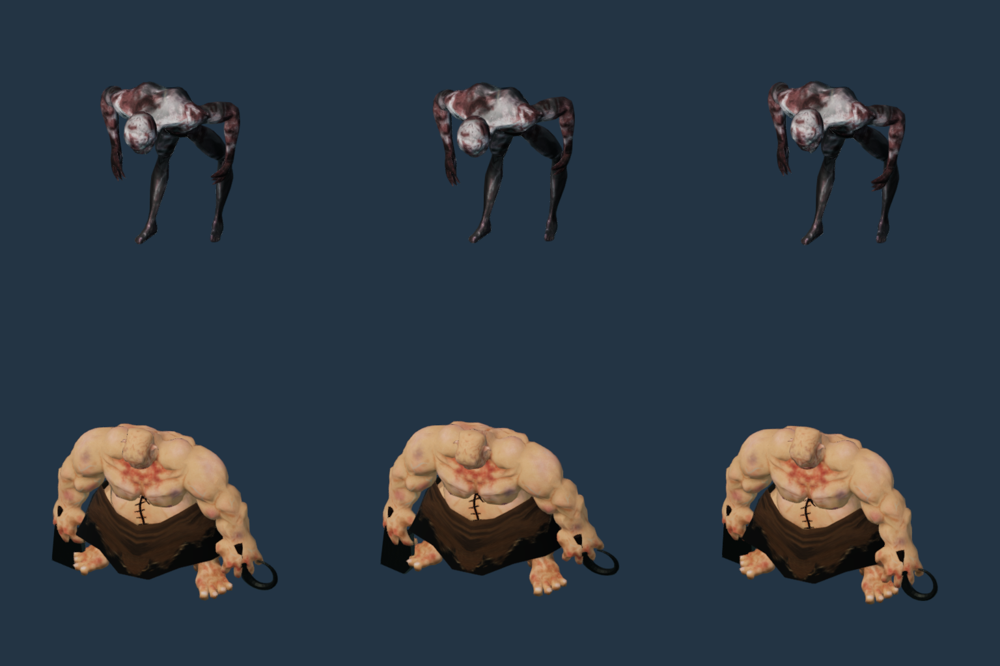
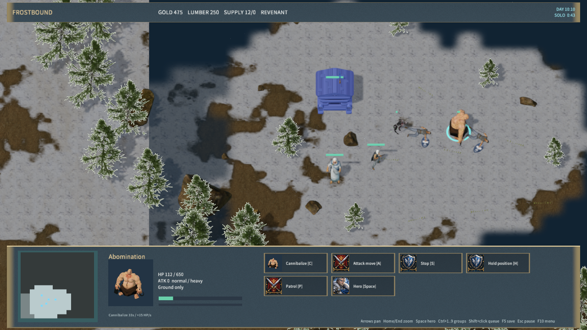

# Cannibalize

The Crypt researches Cannibalize for 75 gold in 30 seconds. The C command assigns nearby visible non-hero corpses to injured ghouls and abominations, prioritizing the lowest health fraction. Each corpse has one claimant and is unavailable to Raise Dead until released. Units approach within 1.7 world units before healing. Ghouls heal 10 HP/s, abominations 15 HP/s, for up to 33 seconds. Full health or channel completion consumes the corpse. A single-unit order or stun interrupts the channel; group orders preserve units already eating. The AI researches and uses the ability when injured troops are safe.

Research cost, duration, healing rates and group-command behavior were checked on 2026-10-01 against Blizzard's classic [Ghoul](https://classic.battle.net/war3/undead/units/ghoul.shtml) and [Abomination](https://classic.battle.net/war3/undead/units/abomination.shtml) references. Search radius and approach distance use MEngine world units. Meat Wagon stored corpses and Exhume Corpses are not implemented yet.

Both existing licensed rigs now have an authored Cannibalize clip, with head/torso motion and native healing particles. The ghoul has 120 sampled poses and the abomination 96. All 176 pre-existing pose bounds match the previous commit exactly; reimport reproduces the five ghoul and seven abomination derived hashes. Portraits retain the unchanged idle poses. Source ownership and attribution remain in their asset manifests and runtime licenses.

Research, claimed corpses and remaining channel time survive saves and authoritative TCP reconnects. Opponent snapshots omit research and corpse-target orders while retaining visible feeding animation. Protocol 19 is required on both client and server. Old single-player saves default to unresearched. Invalid research and duplicate claims are rejected; network-only display fields are removed on restore. Pending unreachable corpses still decay, and match completion does not freeze corpses.

Validation uses `node scripts/test-frostbound.mjs`, both asset import tests, `cargo test -p mengine-editor-host --test frost_sample`, and `node scripts/qa-frostbound.mjs --cannibalize-only`. The native fixture researches through keyboard input, generates two corpses through actual rifle kills, feeds both units, saves/restores research and feeding, interrupts/restarts one ghoul, and checks full-health and timed completion. The rule suite additionally checks priority, reservation, Raise Dead exclusion, rates, cancellation/refunds, research-building destruction, AI, malformed saves, privacy and post-victory decay. TCP checks research and active-healing reconnects.

Evidence: `native-cannibalize-qa.json`, `cannibalize-validation.json`, `cannibalize-poses.json` and the native screenshots below. Native tests use Agent input; physical mouse/audio and cross-machine LAN are not covered. The full Warcraft III recreation and a consistently realistic art style remain unfinished.

