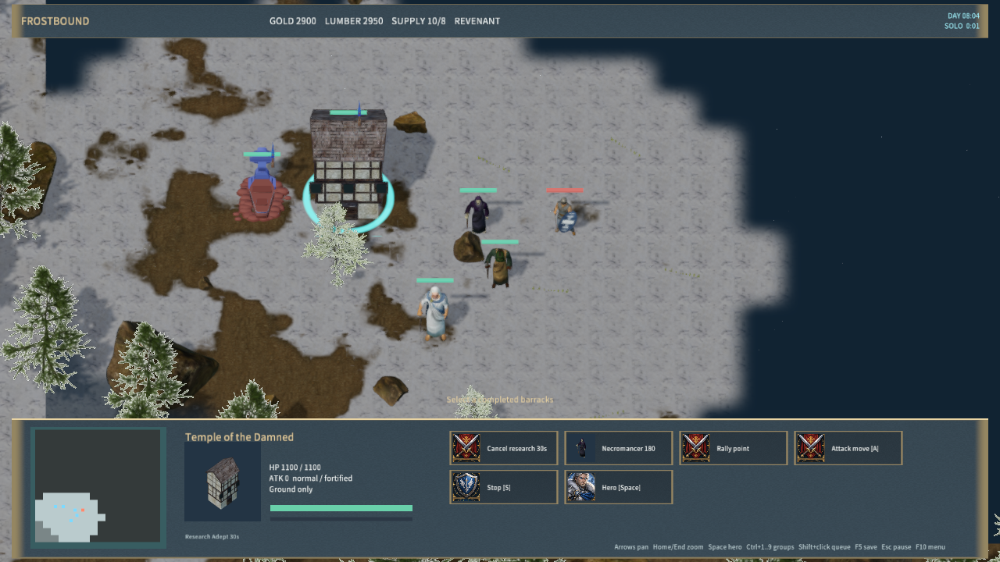
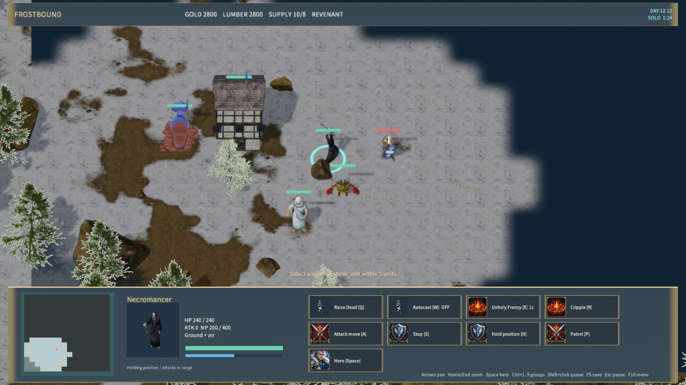

# Necromancer training, targeted magic and Purge

Revenant workers can build a Temple of the Damned with D once the stronghold reaches tier 2. Necromancers train there. The Temple researches Adept Training (100 gold,50 lumber,30 seconds), then Master Training (100 gold,150 lumber,45 seconds; tier 3). Only one research can run per team, and a researching Temple cannot train simultaneously. Cancellation refunds the research cost; destruction ends research. Each rank adds 40 HP,100 maximum mana and .25 mana regeneration per second to existing and future necromancers. The old crypt's saved necromancer queues can still finish; new orders use the Temple.

The Temple currently shares the existing licensed KingdomAltar model and portrait. Its dedicated undead architecture remains unfinished. No new third-party asset was downloaded for this stage; the Shaman still uses its earlier Tribal artwork.

| Ability | Input | Cost / cooldown | Behavior |
| --- | --- | --- | --- |
| Unholy Frenzy | Necromancer E, then unit | 50 mana / 1s | Adept rank. Organic ground/air target, ally or enemy, within 5 units. +75% attack rate, drains 4 HP/s for 45s. |
| Cripple | Necromancer R, then enemy | 175 mana / 10s | Master rank. Organic enemy within 6 units. -75% movement speed, -50% attack rate and attack damage for 60s; heroes 10s. |
| Purge | Shaman Q, then unit | 75 mana / 1s | Target within 7 units. Removes supported dispellable buffs/debuffs. Enemy speed initially becomes 20%, then recovers in five steps over 15s; heroes 5s. Brief initial root,400 damage to enemy summons. Friendly targets are not slowed. |

Base ability/training values were checked against Blizzard's classic [Necromancer](https://classic.battle.net/war3/undead/units/necromancer.shtml) and [Shaman](https://classic.battle.net/war3/orc/units/shaman.shtml) references on 2026-10-01. Ranges use this project's world scale. Existing base unit balance is retained. Shaman Lightning Shield and Bloodlust are implemented in [Spirit Lodge and Shaman spells](shaman-spells.md). Skeletal Mastery and Skeletal Longevity remain unfinished.

Attack cooldown stores nominal attack work; Frenzy and Cripple change the rate at which that work advances, including an attack already in progress. Their attack-rate bonuses add (+.75-.5 gives 1.25 total), avoiding double application. Cripple damage is captured when a projectile launches, so subsequent dispel cannot change a shot in flight. Cripple movement multiplies the existing slow/haste modifiers. Life drain bypasses shields and uses the shared death/corpse/respawn path without on-hit lifesteal or slows. Friendly drain gives no deny event, gold or XP; enemy drain credits the original caster even after their death. Attribution remains server-private.

The native command panel exposes training, rank locks, cooldowns and target selection; selected affected units show remaining durations. Necromancer and Shaman spells use authored staff gestures facing their targets. The [robed orc shaman](shaman.md) has a textured face, gloves and robe; Purge casting also resumes after saving and loading. AI builds Temples, researches available ranks, casts targeted magic and uses Purge against debuffs or summons. The server validates caster ownership/readiness, rank, mana, cooldown, target class, range, visibility and terrain before changing state. Protocol 16 is required on both sides. Save validation covers training, ranks, timers and drain source data.

Validation:

- `node scripts/test-frost-casters.mjs`: construction gates, research/cancel/costs, global upgrades, legacy production saves, target rejection atomicity, additive attack progress, movement, projectile damage snapshots, ally/enemy drain deaths, hero durations, dispel/summon death events, AI, malformed saves and exact restored state passed.
- `node scripts/test-frostbound.mjs`: full rule/TCP suite passed, including Temple research and targeted Frenzy across real TCP reconnect, with private damage provenance.
- `cargo test -p mengine-editor-host --test frost_sample`: 3 passed,0 failed.
- `node scripts/qa-frostbound.mjs --casters-only`: native Adept/Master research, research save, spell targeting, health drain, Cripple, effect save, Purge and expiry passed. Zero rejected material pipelines (`native-casters-qa.json`).
- Windows package:586 files / 270,349,438 bytes; content SHA-256 `3d289ad5e66be0312d4532718bcd67d2fac3270a5147ec2dbf9bd177dbd12abf`. Hash validation and 30-second Player startup passed; responsive,zero logged errors (`player-smoke.json`).

Native inputs use the Agent bridge. Physical input, audio listening and cross-machine LAN acceptance are not covered. The full requested game remains incomplete.

