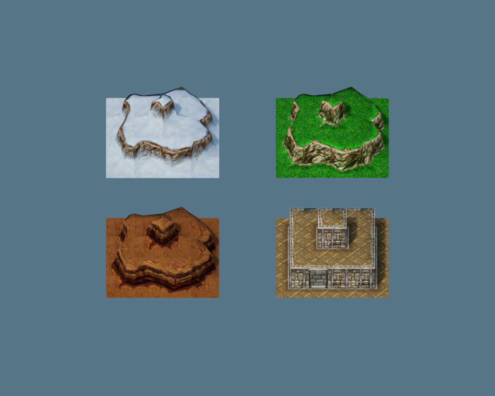

# Original Warcraft cliff conversion

205 original cliff meshes are available as native grid templates: 94 `Cliffs` and 111 `CityCliffs`. Each family contains 64 normalized corner patterns, with the actual variation list retained for each pattern. Source model names encode corners in SW, NW, NE, SE order; A/B/C correspond to 0/1/2 before adding the cell's base height. Models use local X/Z approximately in [-1, 0]. Uniform scale 2 gives two engine units per original cliff level.

`Assets/WarcraftIII/Models/Terrain/ClassicCliffs.mpatch` preserves each converted GLB's positions, normals, UVs and indices. `classic-cliff-catalog.json` records source MDX, mesh and material hashes. `classic-cliff-sources.json` records the generator and all 20 imported runtime files. Reimport refuses to overwrite manually modified generated assets.

The `cliff-skins-ready` collection preserves five original BLPs and converted PNGs. The four preview materials use `W_Cliff1` for Lordaeron Winter, `Cliff1` for Forest, `B_Cliff0` for Barrens, and `Y_Cliff1` for masonry. `N_Cliff1` remains available for Northrend. Materials retain the original layer's shading, blending, culling and addressing properties. Blizzard Entertainment's asset ownership and original usage terms still apply.



The image uses the shared native editor GPU renderer and runtime mesh cache. Each panel is a 4×4 patch; positions, materials and template choices are recorded in `classic-cliff-patches.json`. The preview package passes native validation: 23 files, nine runtime assets and seven entities. The standalone renderer and runtime were rebuilt; the installed Tauri editor executable was not updated in this stage.

`classic-cliff-validation.json` records 615 native compositions of every template at three heights, 14,781 compared vertices, zero position error, exact normal/UV preservation, and source index equality. Unit tests additionally check composed index rebasing. All 96 shared edges in the four selected preview patches pass within the 0.00001 coordinate tolerance. Thirty sub-tolerance intervals at floating-point step boundaries are recorded separately.

Arbitrary patterns with matching edge-corner heights do not guarantee matching authored edge profiles. The audit compares only opposing E/W or S/N edges with matching normalized endpoints, using piecewise linear upper envelopes on open intervals. Of 9,523 candidate comparisons, 377 are flagged: 144 differ in sampled height and 233 have missing boundary coverage at the stated tolerance. Some original vertices are slightly offset from their nominal cell edges; ten corner offsets are retained in the report. These are source diagnostics, not a reconstruction of Warcraft's legal adjacency rules. The original geometry is unchanged.

The current Frostbound battlefield still uses `terrain4h`. These templates have not replaced its ground surfaces or navigation. Integration must replace covered ground, derive picking/collision/height from the same authored triangles, and enforce compatible adjacency including ramps. The asset preview does not establish gameplay, physical input, or audio acceptance.

Reproduce from the repository root:

```powershell
python scripts/import-frost-classic-cliffs.py
node scripts/render-frost-classic-cliffs.mjs
python scripts/test-frost-classic-cliffs.py --pose-probe <release/examples/gltf_bounds.exe>
```

Set `MENGINE_ASSET_PREVIEW_EXECUTABLE` to the built `render_asset_preview.exe` when its build directory differs from the local default. Use the preview JSON's `project` path with `mengine-runtime --validate-package --project-root <project> --scene Assets/Scenes/Main.mscene`.
