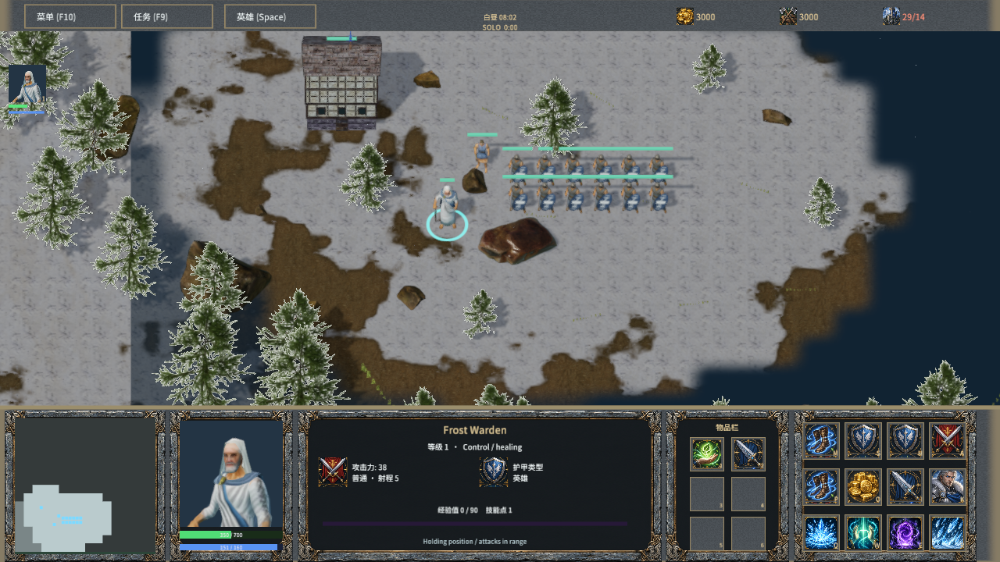
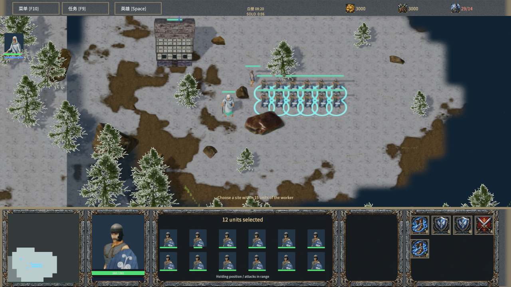
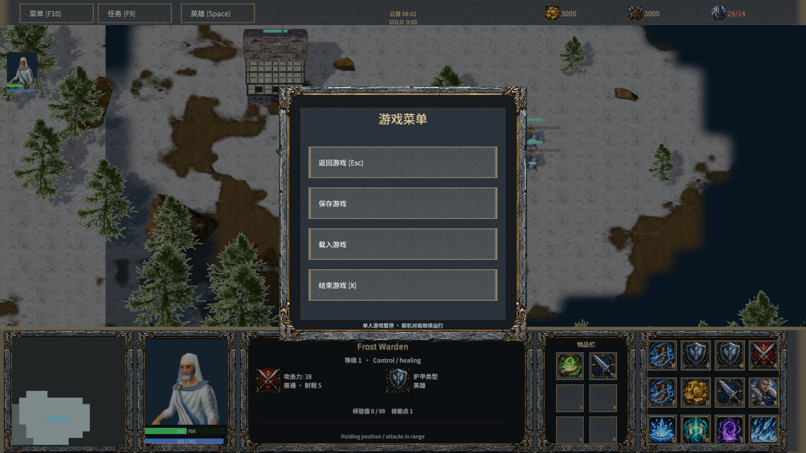

# Classic RTS interface

The gameplay screen uses a bottom strip with a minimap, character portrait, unit information, six inventory slots and a four-column, three-row command card. Move, Stop, Hold, Attack and Patrol occupy fixed slots; hero abilities occupy the bottom row. Workers open a construction submenu and Escape returns to their normal commands. The left hero shortcut and twelve selectable group portraits retain real selection and control-group behavior.

The information panel shows live attack damage/range, armor category, hero level, experience and available skill points. Health and mana values remain over their bars. The F10 menu opens over the current battlefield, suspends single-player simulation and provides resume, quicksave, quickload and exit. Multiplayer simulation continues while the local menu is open. Main-menu labels and resources are localized; the game retains its Frostbound Realms identity.

The primary portrait now displays a native animated mesh using an independent camera in a `RawImage`. The twelve models in `head-portraits.json` reuse the camera close-ups recorded by `scripts/render-frost-head-portraits.mjs`; selection changes the model and framing. Idle/attack/cast poses use the existing game animation sampling. The portrait freezes with the single-player game menu and hides outside gameplay. Other units and buildings retain the static atlas fallback. Attribution and adaptation terms are packaged in `Assets/Licenses/Head-Portraits.txt` and the original character notices. The atlas is CC-BY-SA-4.0; original sources retain their stated licenses.

Five bottom panels use an original carved limestone and bronze gryphon frame, drawn with nine-slice geometry so the corners retain their proportions. `Assets/Licenses/Royal-Stone-Frame.txt` records the generation prompt and asset hash.

Engine support: `RawImage.render_camera` stores a stable Camera2D/Camera3D reference; `render_root` optionally restricts meshes to a subtree. Empty camera uses the ordinary texture; invalid camera/root uses the texture fallback. The shared frame compiler supports screen and world canvases, remaps references on scene/prefab reload, and caps a frame at eight views of up to 1024 pixels per dimension. Each view owns its output, depth and HDR/MSAA targets and restores the main render state after submission. Mesh/material/texture resources synchronize once over the main/view union. Generated textures use GPU bindings directly, without CPU readback. Views currently render meshes and scene lights; world sprites and particle emitters are outside this portrait feature.

Validation is recorded in `live-portrait-validation.json`, `live-portrait-pixels.json` and `native-classic-hud-qa.json`. Run `node scripts/build-frostbound.mjs`, `node scripts/test-frostbound.mjs`, `cargo test -p mengine-editor-host --test frost_sample` and `node scripts/qa-frostbound.mjs --hud-only` with `MENGINE_QA_ROOT` set to the isolated native QA directory. Run `python scripts/check-frost-live-portrait.py` with Pillow to compare the native portrait pixels while idle and paused. Packaged startup is checked separately by `scripts/smoke-frostbound.ps1`.

This is an interface implementation stage, not a complete Warcraft III reproduction. Distinct race-specific frame art, animated framing for every remaining model, full localization, alliance/chat panels and full save-file browsing remain unfinished. The current frame art, models and icons are adaptations or original assets, not Blizzard assets. Native Agent input does not establish physical mouse, audio-listening or cross-machine LAN acceptance.
