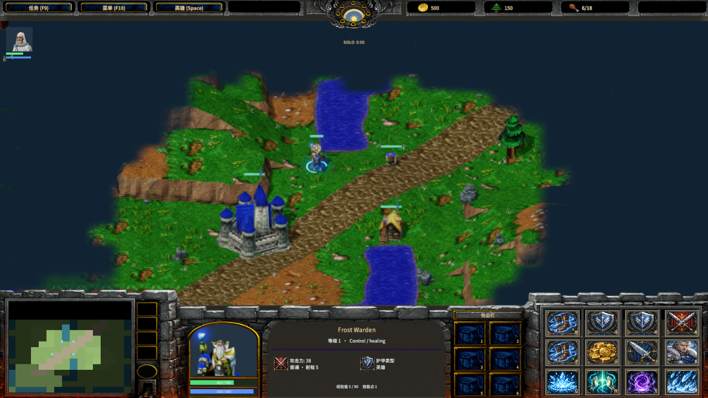
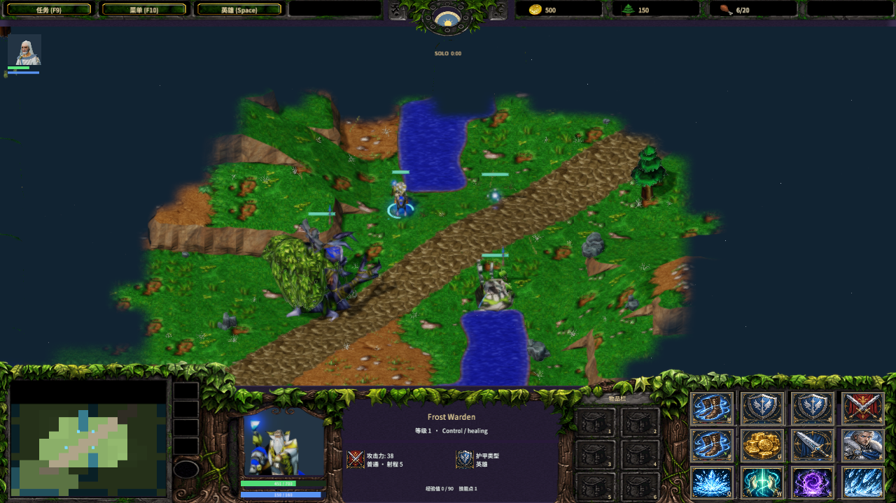
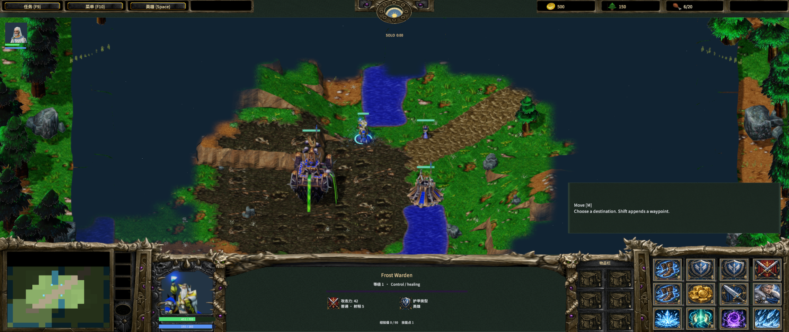

# Classic RTS interface

Author: MiYu.

The battle screen uses the original Warcraft III race consoles, button states, resource icons, clock frames and inventory covers. The original ConsoleUI.fdf defines the nine console texture pieces. The sample retains a minimap, animated portrait, unit information, six inventory slots, a four-column by three-row command card, hero shortcuts and twelve selection portraits. The console follows the local player's race when loading a save or joining a multiplayer match.

Controls and their click regions use the same native RectTransform coordinates. The canvas covers the viewport, uses the smaller width/height scale and anchors edge controls to their screen edges. The center console extends horizontally between the portrait and inventory pieces. Minimap markers and health fills use their panel's local coordinates. The information panel and editor command grid stay inside their frames at 4:3, 16:9 and wide aspect ratios.

The primary portrait renders the selected classic model through an independent camera and RawImage.render_root. Portrait animation shares the main actor's sampled pose and freezes while single-player simulation is paused. The F10 game menu supports resume, save, load and exit; multiplayer simulation continues while the local menu is open. Move, Stop, Hold, Attack and Patrol have fixed command slots. Single Wisp selection has no Attack command. Construction, research, training and inventory controls retain their actual simulation behavior.

The day/night dial follows simulation time and daylight. Its hover text shows the current hour. HUD task and gathering status use a separate row above movement and resident information. Multi-line status occupies that space until it ends; movement information then returns. HUD statistics show health, mana, attack, armor and movement; hero selection also shows experience, skill points and inventory. The editor has its own panel layout, terrain controls, save and page navigation.





Source paths, archives, original bytes and SHA-256 records are retained in console-frame-sources.json, console-sources.json and SourceAssets/WarcraftIII. Original game asset terms apply to the Blizzard console assets. Rendering, input scaling and source composition are described in [console-layout.md](console-layout.md). Native input and screenshot acceptance is recorded in native-console-layout-qa.json; editor layout acceptance is included for 1280×720, 1024×768, 1920×1080 and 2560×1080.

```powershell
python scripts/import-frost-console.py
node scripts/build-frostbound.mjs
node scripts/test-frostbound.mjs
node scripts/qa-frost-console.mjs
```

The source console layout is implemented. Full original hero statistics, the original animated day/night art and all Warcraft UI interactions remain part of the ongoing game work. Native Agent input does not establish physical mouse, audio-listening or cross-machine LAN acceptance.
