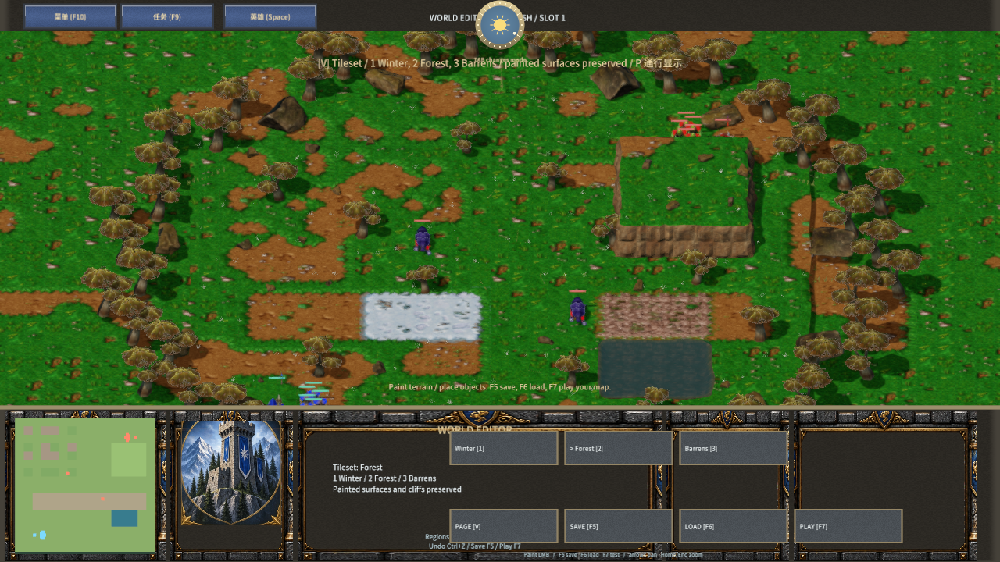
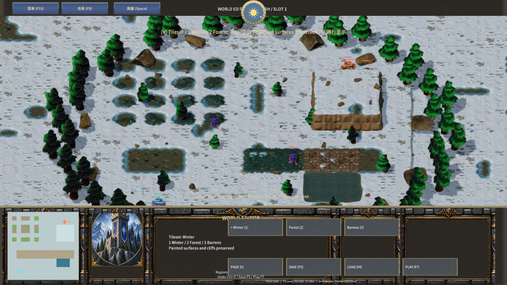
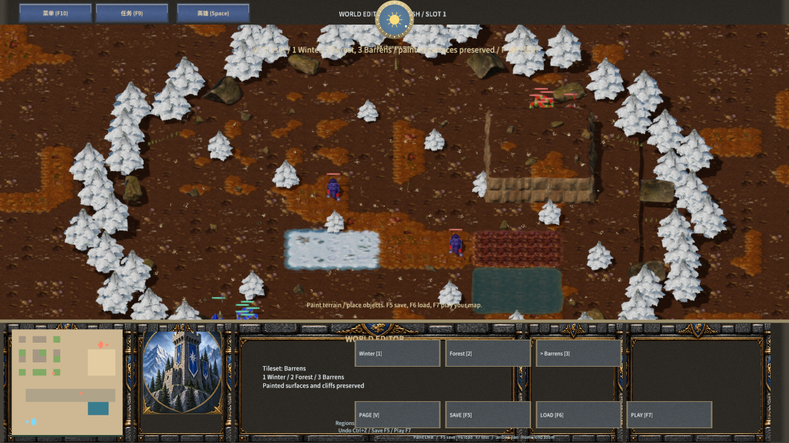

# 原版地面 tile

Winter、Forest、Barrens 地表使用 14 张 Warcraft III 原版图集，覆盖土壤、雪、草、岩石、道路和腐地。六张运行时图集为每张源 tile 保留 64×64 像素，按 NW/NE/SW/SE 的 1/2/4/8 位选择透明边缘；完整地块按世界坐标选择源变体。每块增加两像素边缘填充，显式梯度排除格子与材质索引的跳变。材质基底由四角最低材质确定，其他实际出现的材质通过自己的 alpha 遮罩叠加。

64 个 `terrain4h:` 网格区块保留高低地、坡道和连续地表几何。图集在世界坐标中拼接，区块读取同一格 halo；战争迷雾仍使用模拟中的可见/已探索数据。道路上绘制 Soil、Snow、Grass 或 Rock 会显示所绘表面，腐地使用原版对应气候贴图。崖壁几何、水面、河床及部分地表装饰仍沿用当前实现，尚未完成原版 cliff 模块和水动画接入。

## 生成与验证

```powershell
python scripts/import-frost-classic-terrain.py
node scripts/build-frostbound.mjs
python scripts/test-frost-classic-terrain.py --runtime <mengine-runtime.exe 的完整路径>
node scripts/test-frost-terrain.mjs
node scripts/qa-frostbound.mjs --classic-terrain-only --deterministic-input
```

`classic-terrain-sources.json` 保存来源、工具与运行时文件哈希以及每个 tile 的原图/图集矩形。导入器保留已修改文件，原始资产库只读。资产仍适用 Blizzard 的原始使用条件。

像素验证检查 40 个运行时文件哈希、14 张源图集哈希、576 个源像素 tile 及全部边缘填充；三种地面材质经实际原生加载器验证。地形规则测试覆盖保存、联机数据、坡道、通行、地基和遮挡。原生编辑器测试包含三套材质、16 种四角拼接、高地、水域、地图保存加载与直接试玩，同时检查材质加载日志、管线拒绝和错误材质像素。

原生验收使用 Agent 输入，未验收物理鼠标或音频。截图为同一可编辑场景，记录于 `native-classic-terrain-qa.json`：




