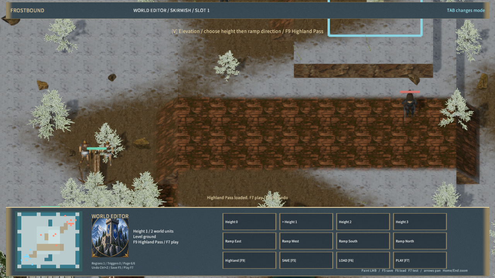

# 自然岩壁扫描材质

高地竖直面使用 Poly Haven 的 [Rock Face 03](https://polyhaven.com/a/rock_face_03)。摄影作者为 Dario Barresi，处理作者为 Rico Cilliers，许可为 CC0。新增 1K 颜色、OpenGL 法线、粗糙度和高度原件，下载地址及 SHA-256 固定在 `ground-sources.json`，署名随 Player 的 `Assets/Licenses/ground.txt` 分发。

岩壁按世界坐标投影，并按表面方向混合两组采样。颜色使用 sRGB，法线 XY、粗糙度和相对高度打包为线性 RGBA。Ground 材质使用已有的标准颜色与金属粗糙度纹理绑定承载岩壁颜色和打包数据，由自定义地表着色器提供最终 PBR 通道；该打包数据不适用于普通 ORM 材质。自定义纹理槽仍为六个，总纹理绑定上限保持不变。



同机位[更新前](cliff-before-highland.png)。[游戏中沿坡道登高](highland-ascent.png)展示当前材质在实际游玩中的效果。截图均来自原生 Release 编辑器。

## 验证

- 16 份源文件、4 张派生贴图哈希与逐像素通道检查通过；重复生成哈希一致。
- 法线方向检查使用 X/Z、Y/Z 斜率与高度梯度比较，覆盖陡峭岩面的归一化法线。四种扫描材质的相关系数均大于 0.7。
- 实际地表着色器的 WebGPU、Vulkan、D3D12、Metal 编译检查通过。
- 村庄、河岸、高地原生渲染通过，64 个地块材质管线拒绝为 0；高度笔刷、撤销、存档读取及英雄登高通过。
- 最终 Player 包为 540 文件、234,752,451 字节，内容哈希 `bb809c31c557c1ca3fc870e411b97e42ef1c879053e4b9480ac3ff5cd0e64ac9`。运行验证见 [阶段结果](cliff-art-qa.json)，帧循环实测见 [Player 测量](native-player-performance.md)。

地形仍采用可编辑的分层几何，没有扫描网格位移。当前为写实素材的 RTS 原型，完整游戏复刻、美术风格统一与 5 ms 性能目标仍未完成。Free3D 此前返回访问限制，本批素材来自 Poly Haven。

```powershell
python scripts/import-frost-ground.py
python scripts/test-frost-ground.py
cargo test -p mengine-rhi frost_ground_shader_compiles_for_all_backends
$env:MENGINE_QA_ROOT='D:/MEngineNativeQA'
node scripts/qa-frostbound.mjs --ground-only
node scripts/qa-frostbound.mjs --terrain-only
```
