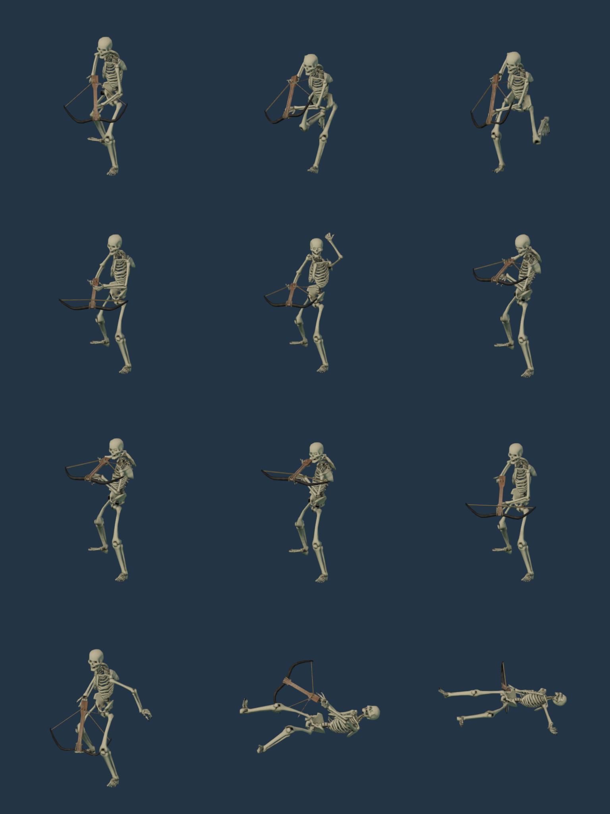
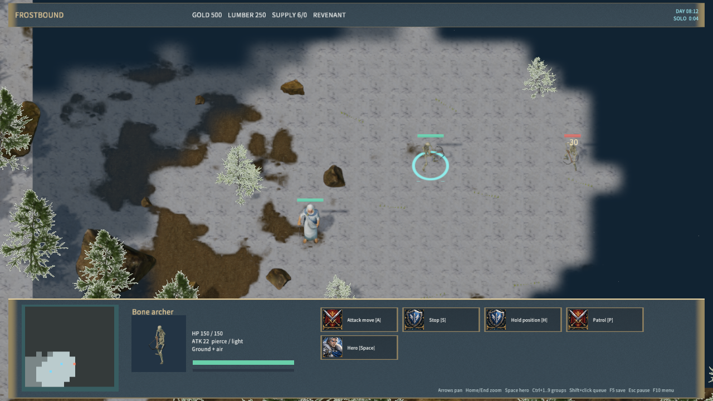

# Anatomical skeletal crossbowman

`bonearcher` now uses `RealBoneArcher`: Gord Goodwin's anatomical skeleton, retargeted 0 A.D. crossbowman actions, and the Han Nu crossbow. The model has an idle pose, locomotion, a complete reload/aim/fire cycle and a grounded death. Its portrait comes from the same native model.

The body is CC0; Wildfire Games' rig reference, animations, crossbow and projectile are CC-BY-SA-3.0. The adapted model and atlas are CC-BY-SA-3.0. Original source files, source URLs, hashes, generated input hashes and license notices are retained in `crossbowman-sources.json` and `Licenses/Anatomical-Crossbowman.txt`. No Free3D asset is included.

The importer preserves anatomical limb lengths, rebuilds the deform hierarchy, corrects the left-hand reach, curls the fingers and samples the crossbow's mechanical rig. The maximum left-hand reach clamp over all actions is 0.117 world units; it is zero during the aiming interval. Every authored frame is grounded before export. Runtime interpolation can introduce a small ground offset, bounded by the native pose test.

The loaded and empty models share 125 bones and four animations. The loaded model has 16,054 triangles. The original actor specifies loading at 47% and release at 85% of the attack cycle; the visual model follows those events and the existing authoritative projectile simulation. The unit's combat rules and cooldown are unchanged.

## Rebuild and verification

Use Blender 4.5.9 with `--background --disable-autoexec --python-exit-code 1 --python scripts/import-frost-crossbowman.py`. Inputs are the checked-in SkeletonBody, RealRifleman rig reference and RealArrow outputs; their dependency manifests document their own regeneration. The main asset importer also invokes this importer after the anatomical body.

- `python scripts/test-frost-crossbowman.py`: source and input hashes, licenses, normalized skin weights, atlas UVs, loaded/empty geometry, mechanical movement and all 178 native pose samples passed.
- Repeat import: all four derived file hashes were identical (`crossbowman-repro-qa.json`).
- `node scripts/test-frostbound.mjs`: visual selection/attack phase checks and the rule/TCP suite passed.
- `cargo test -p mengine-editor-host --test frost_sample`: 3 passed, 0 failed.
- `node scripts/qa-frostbound.mjs --crossbowman-only`: native Release selection, portrait, movement, projectile before damage, save/restore and corpse rendering passed; zero rejected material pipelines.
- `node scripts/render-frost-unit-icons.mjs --crossbowman-sheet`: native idle, walk, reload, aim, release and death views. The regular portrait command rebuilt the 28-unit atlas.
- Packaged Player: 570 files, 260,321,466 bytes, content SHA-256 `c37c9d59a11395192614435047381016b5baceb975dc8ee051dfc6db7c01ba96`. Startup was responsive for 30 seconds with zero logged errors.

Native gameplay evidence uses Agent input, not physical mouse/keyboard or listening tests. This stage replaces the skeletal crossbowman; other fantasy units and the full requested Warcraft-style recreation remain unfinished.

