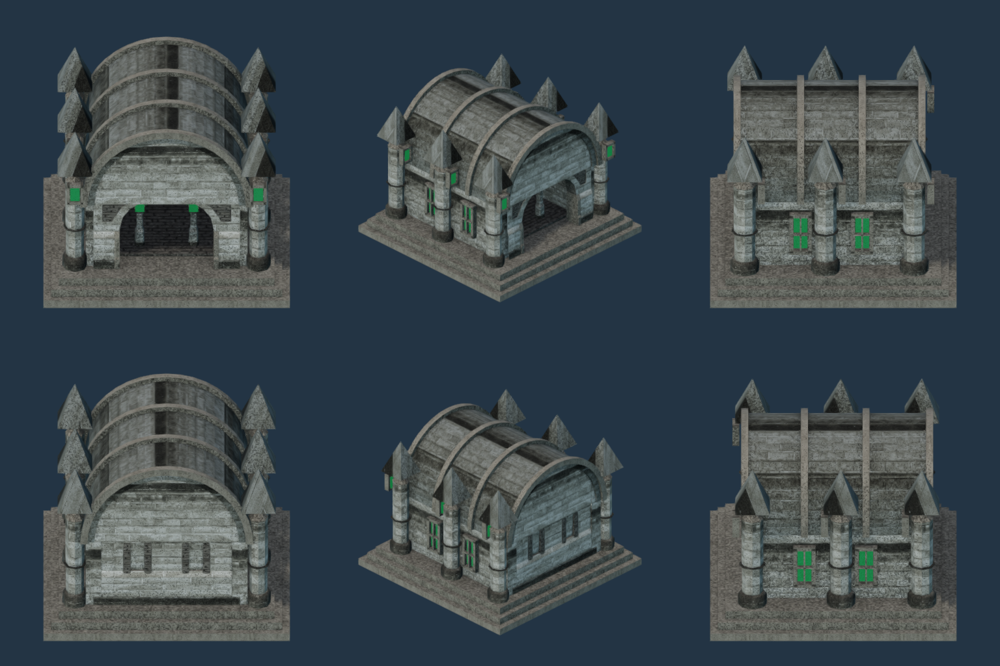
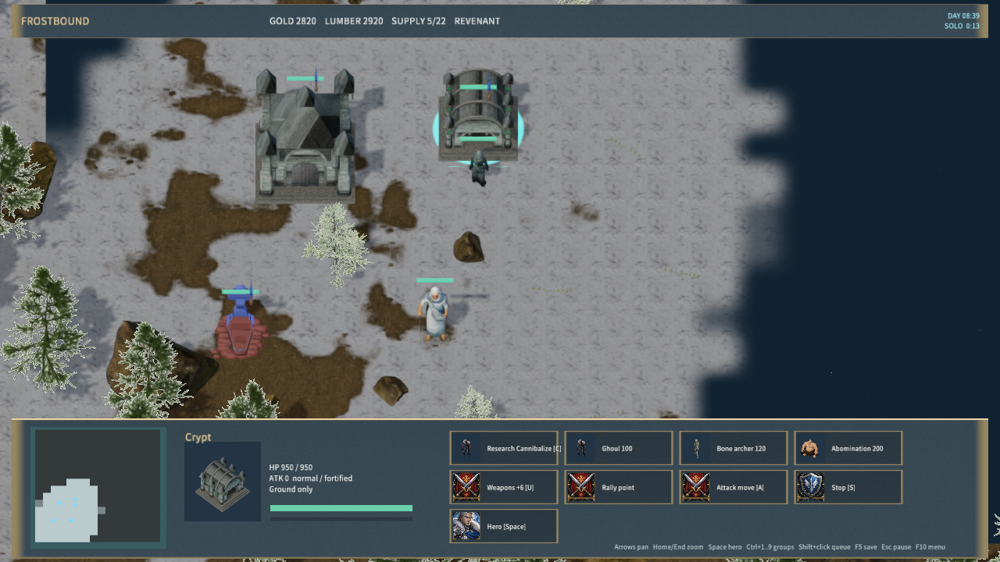
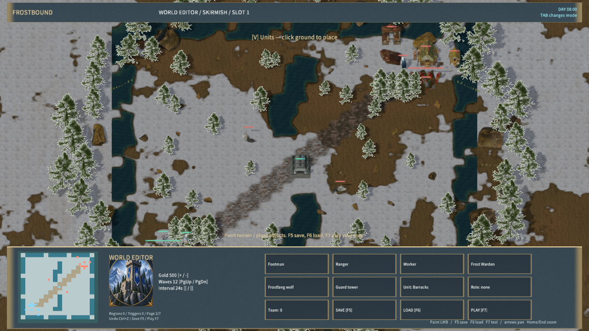

# Stone Revenant Crypt

The Revenant barracks uses `RealRevenantBarracks`: a stone mausoleum with a recessed entrance, closed barrel vault, stone ribs, six buttressed pinnacles and framed green windows. Placement previews, construction, completed buildings, portraits and map-editor placement share the model. Its gameplay footprint, production and Cannibalize research use the existing barracks rules.

## Source and adaptation

The masonry modules and textures come from rubberduck's CC0 [Castle / Dungeon Tileset Extended](https://opengameart.org/content/3d-castle-dungeon-tileset-extended). The existing source archive is shared with the Revenant stronghold and Haunted Mine. `crypt-sources.json` records the source URLs, licenses, source hashes and eight derived file hashes. Both packaged and source license files credit the original texture contributors.

MiYu's layout adds foundations, a ribbed vault, closed gables and framed windows. The runtime building contains 4,316 triangles, one mesh/material and four 2048-square base, normal, ARM and emissive atlases. Relief normals are derived from the source color textures. This is an original textured mausoleum, not scanned architecture or Blizzard's Crypt geometry. No Free3D download is included.

## Rebuild and evidence

Use Blender 4.5.9 with `--background --disable-autoexec --python-exit-code 1 --python scripts/import-frost-revenant-fortress.py -- --crypt-only`. The full asset importer invokes this step. A second import reproduced all eight derived hashes. `scripts/test-frost-revenant-fortress.py --crypt-only` checks provenance, geometry, native bounds, atlas content and localized emission; `scripts/test-frost-visuals.mjs` verifies live, saved and public-state selection and the 34-building portrait atlas.

`scripts/render-frost-unit-icons.mjs --crypt-sheet` defines the six native views below. During this run, automatic editor startup timed out at `project.open`. The same Release editor was launched with redirected diagnostics and the same isolated project was reused for capture. The building atlas likewise completed after the existing editor finished loading. These captures establish native rendering; they do not establish a fix for cold-start bridge timeouts.

Native gameplay acceptance and package evidence are recorded in `crypt-validation.json` and `native-crypt-art-qa.json`. `node scripts/qa-frostbound.mjs --crypt-art-only` passed with the standard launcher: placement preview, construction, mid-construction save/load, completed material and portrait, ghoul training, Cannibalize research, editor placement, map save/load and playtest. The renderer reported zero material-pipeline rejections. The editor assertion counts the existing default-map barracks plus the newly placed building.

The full Node rule/TCP suite passed, and all three native-host Frostbound tests passed. Release packaging validated 661 files with content hash `3d10d0c6380825e9b5a137c1351c46ed332a1c774ab05570713ac63293ae77c1`. The packaged Player remained responsive for 30 seconds with zero error logs. The adapter still reports its existing WebGPU downlevel-capability warning.

This stage replaces one building. Consistent realistic art across the full roster and complete game fidelity remain unfinished. Agent input and startup checks do not establish physical mouse, audio-listening or cross-machine LAN acceptance.
