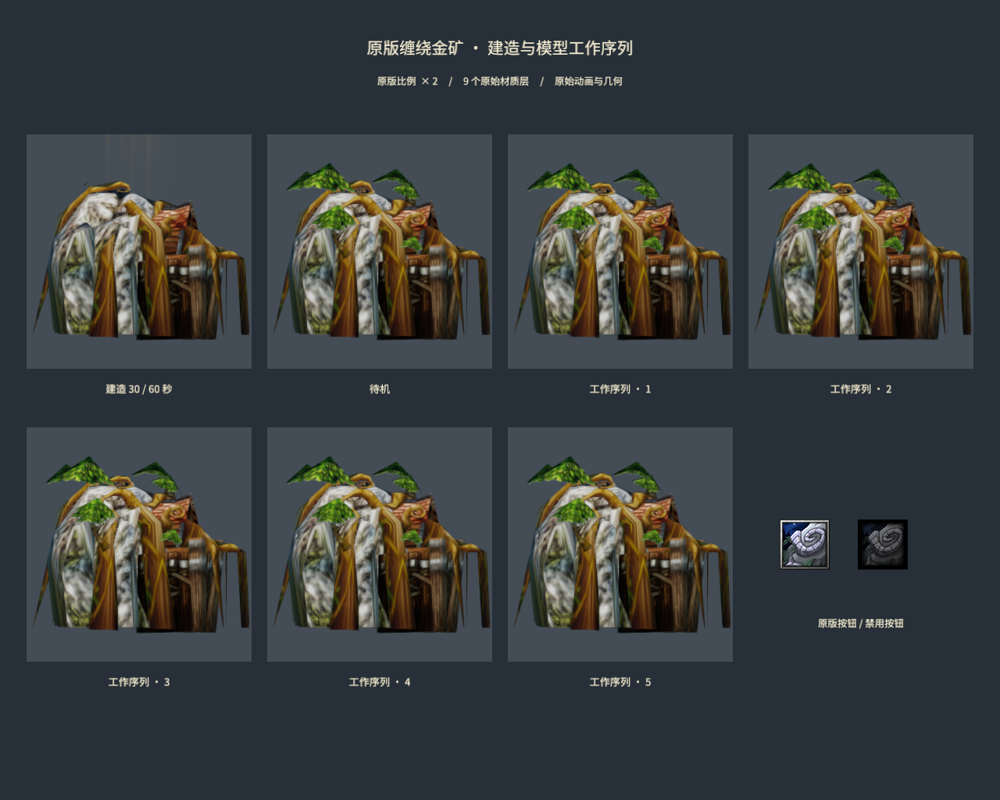

# Original Entangled Gold Mine assets

Author: MiYu.

`ClassicEntangledMine` binds the original `buildings/NightElf/EntangledGoldmine/EntangledGoldmine.mdx` from the read-only Warcraft asset library. All nine material layers, original geometry, complete source node hierarchy, attachment definitions and animations are retained. The original `egol` object record supplies modelScale 1; the existing world scale 2 applies to this model independently of its bounds. Selection dimensions come from the same original object table.

The original `BTNEntangleMine.blp` and `DISBTNEntangleMine.blp` are decoded to 64×64 PNGs. The source MDX, both source icons and signed billboard/attachment conversion receipts are retained in `SourceAssets/WarcraftIII`. Source paths, archives, input and output SHA-256 records are in `entangled-asset-sources.json`; the full runtime binding receipt is `classic-sources.json`. Blizzard's original game asset terms apply.



The native GPU preview renders Birth at 30 seconds, Stand and all five Stand Work sequences with source scaling and seven independent cameras. It verifies the assets and source animation clips. It does not establish Entangle casting, construction rules, loaded Wisp display, capacity, income, unloading or multiplayer behavior. Those game rules remain unfinished. The source model's five EntangleWisp attachment paths are retained; their runtime use must be validated with the actual cargo behavior.

`entangled-mine-node-validation.json` compares 98 native poses and 8,330 node positions against the pinned original MDX animator at 30/60 Hz in two camera directions. Maximum position error is 4.29e-7 world units, and maximum matrix error is 4.75e-7. Nine binary geometry buffers are unchanged; 36 native geometry loads match the billboard base exactly. The GPU preview has zero rejected material pipelines.

`test-frost-classic-billboards.py` reproduces all 1,272 overlay outputs and 5,027 imported files, verifies the explicit overlay source path and protects modified outputs atomically. `test-frost-entangled-assets.py` verifies source hashes, reproducible icon decoding from retained sources and atomic protection of artist changes. Complete shared simulation, client and real TCP tests also pass with this asset binding.

```powershell
python scripts/convert-frost-classic-billboards.py --metadata-reader tmp/warcraft-effects/node-metadata/NodeMetadata.dll --bindings samples/frostbound-realms/classic-sources.json --output tmp/entangled-assets/billboards
python scripts/convert-frost-classic-attachments.py --metadata-reader tmp/warcraft-effects/attachment-metadata/AttachmentMetadata.dll --base tmp/entangled-assets/billboards --output tmp/entangled-assets/attachments
python scripts/import-frost-classic.py --pose-probe D:/MEngineNativeQA/attachment-build/release/examples/gltf_bounds.exe --billboard-library tmp/entangled-assets/attachments
python scripts/import-frost-building-scales.py
python scripts/import-frost-unit-scales.py
python scripts/import-frost-entangled-assets.py
python scripts/test-frost-entangled-assets.py
node scripts/build-frostbound.mjs
node scripts/render-frost-entangled-mine.mjs
```

The overlay is generated under `tmp`; the asset library is never modified. `classic-sources.json` records the actual repository-relative overlay path. Native preview and source-pose checks use the source assets and existing Release engine tools. No C# or runtime Rust change is required for this conversion.
