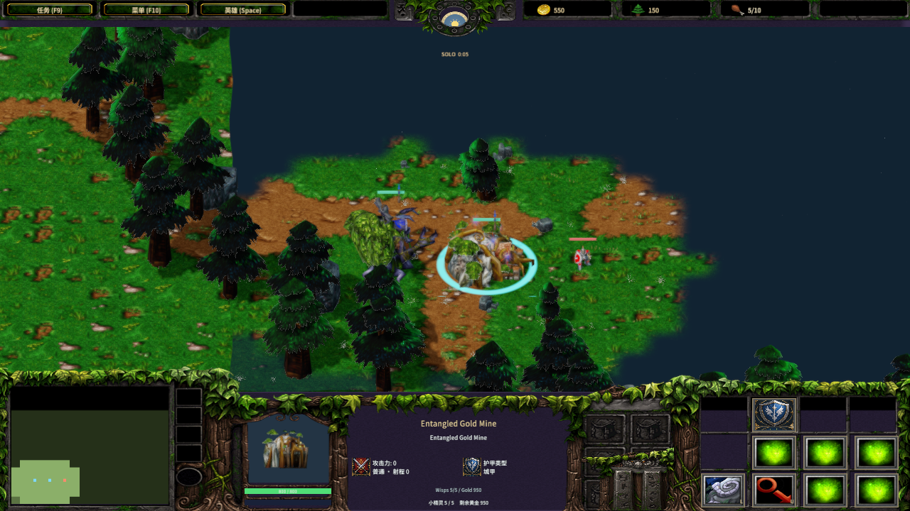
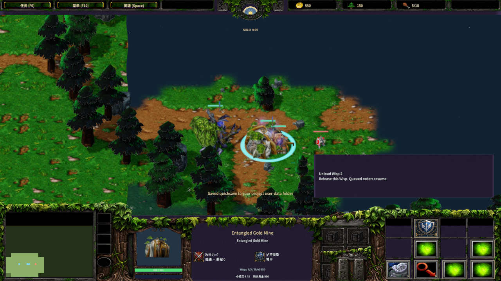
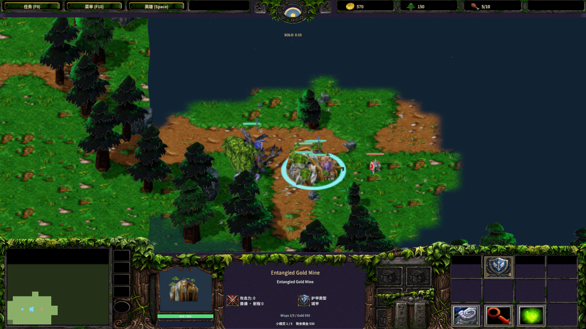

# Entangled Gold Mine

Author: MiYu

New Night Elf melee games start with an original Entangled Gold Mine bound to the rooted main Tree. Additional rooted Trees can entangle an unused visible deposit: a 3-second cast creates a mine that grows for 60 seconds. The mine has 800 HP, 2 fortified armor and five Wisp seats. Original `egol`, `Aent`, `Aenc`, `Aegm` and `Slo2` rows supply the rules in `entangled-rules.json`; source tables and hashes are recorded in `entangled-rule-sources.json`.

Wisps enter the mine, become hidden cargo and receive gold directly. A single shared timer advances one cargo index each second. Each occupied turn yields up to 10 gold, giving one resident approximately 10 gold per five seconds and five residents 50 gold per five seconds. The rotating index follows the [pinned Warsmash reference](https://github.com/Retera/WarsmashModEngine/blob/f9e0aeed4be372d6016519d0e97b384aa873f374/core/src/com/etheller/warsmash/viewer5/handlers/w3x/simulation/abilities/mine/CAbilityEntangledMine.java). The original Warcraft client’s exact initial timer phase has not been measured.

The command card exposes Load, Unload All and individual resident slots. Original Wisp, Unload, Cancel and Entangle icons are decoded from preserved BLP files. The information panel shows current residents and remaining gold, with task status and resident information on separate rows. Multi-line Tree status uses the available information area and restores the movement row when that status ends. `G` on an unbound rooted Tree targets Entangle; an unfinished cast or mine can be canceled. `L` on a finished mine targets a Wisp, and `U` unloads all residents. Right-clicking a deposit with a rooted Tree also targets Entangle. Building proportions continue to use original model dimensions and UnitUI modelScale through the existing shared world conversion.

Unloading reserves every required exit before changing cargo. Blocked exits leave residents in place. Shift-queued work resumes after that resident’s next income turn; a blocked queued exit pauses that resident’s further earnings. Uprooting, mine or Tree death, canceled growth and exhausted deposits release occupants and clear the binding. Rooting an unbound Tree automatically looks for a nearby unused deposit. AI keeps lumber workers outside while staffing its mine and training additional Wisps.

The original mine selects `Stand` or `Stand Work First` through `Fifth` by resident count. Each occupied seat displays the original seven-part `SharedModels\EntangleWisp.MDX` with its looping Stand clip and sampled particles, at the mine’s original animated attachment transform. These cargo attachments are activated by resident state; the mine’s authored visibility track is zero. Child material visibility still follows the source animation. Growth uses the original Birth sequence, and the underlying ordinary deposit mesh is hidden.

Save files retain the Tree binding, resident seats, entry points, queued exits and exact shared timer/cursor. Legacy saves keep their previous Wisp gold cargo behavior. Enemy snapshots show the visible mine’s resident count and work art while hiding resident bodies, orders, bindings and income clocks. Protocol 41 keeps clients and the authoritative server on the same rules.

Validation commands:

```powershell
python scripts/import-frost-entangled-rules.py
python scripts/import-frost-entangled-wisp-icon.py
python scripts/test-frost-entangled-rules.py
python scripts/convert-frost-construction.py --metadata-reader tmp/warcraft-effects/attachment-metadata/AttachmentMetadata.dll --sampler tmp/warcraft-converter/4fe46a0772520fc7b55078bf32cda1237d1b5f2e/bin/MdxExport.dll --owner asset-library/warcraft-iii/classic-attachment-ready --owner tmp/entangled-assets/attachments --output tmp/entangled-rules/construction-ready
python scripts/import-frost-construction.py --library tmp/entangled-rules/construction-ready
python scripts/validate-frost-construction.py --library tmp/entangled-rules/construction-ready --metadata-reader tmp/warcraft-effects/attachment-metadata/AttachmentMetadata.dll --sampler tmp/warcraft-converter/4fe46a0772520fc7b55078bf32cda1237d1b5f2e/bin/MdxExport.dll --probe D:/MEngineNativeQA/attachment-build/release/examples/gltf_bounds.exe
node scripts/build-frostbound.mjs
node scripts/test-frostbound.mjs
node scripts/qa-frost-entangled.mjs
```

The independent geometry check covers four embedded source models, 34 parts, four camera views, 408 native loads and 29,244 compared vertices. Maximum position error is `5.0527e-7`; all original binary buffers and skins are preserved. Conversion reproduces 229 files and import reproduces 219 files, with atomic refusal of modified outputs. The rules and command icons also reproduce byte for byte. Direct TCP tests exercise gather, Load, Unload, duplicate delivery, resident reconnect, private enemy data and deposit exhaustion. Native results are recorded in `native-entangled-qa.json`; physical mouse and listening acceptance remain separate. The editor uses the asset baseline available when each scan finishes and discards results from closed project sessions. This keeps an initial scan from reporting an existing scene as an external addition and interrupting a running lobby. Regression evidence is retained in `asset-scan-race-validation.json`.




