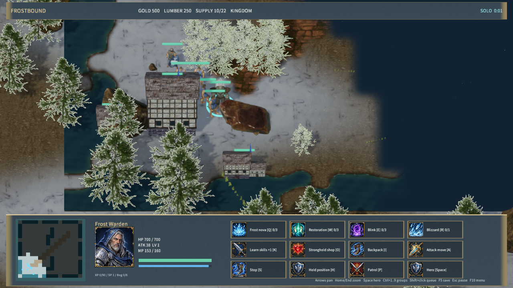

# 写实比例工人与链甲步兵

王国工人使用布衣、长发和斧具；步兵使用链甲、铁盔、剑和椭圆盾。模型、选中头像和训练按钮统一引用实际资源。身体与装备保持原骨骼绑定，具备待机、行走、攻击三个动作；工人的指定攻击、攻击移动、巡逻及自动攻击均可播放战斗动作，采集和施工冷却不会误触发攻击动画。



## 素材与转换

原作者 [Wildfire Games](https://www.wildfiregames.com/)，源自 [0 A.D.](https://github.com/0ad/0ad)，固定版本 `61a3b9507d974084e6badb88a0826bd89a6d5b8b`。33 个原件共 7,445,000 字节，URL、SHA-256、模块组合和生成资源哈希见 `samples/frostbound-realms/human-sources.json`。源文件保留在 `SourceAssets/0ad`。

素材和派生资源遵循 [CC-BY-SA 3.0](https://creativecommons.org/licenses/by-sa/3.0/)，包含组合后的单位头像图集。署名文件 `Assets/Licenses/0ad-humans.txt` 随运行包分发。步兵采用不列颠链甲剑士模块，保留盾体、不包含盾上独立装饰件；工人由官方男性长衣、凯尔特头部和斧具模块组合。本阶段未从 Free3D 下载资源。

Blender 4.5.9 导入脚本按身体坐标统一旧 Collada 的单位标记；按命名挂点装配装备；把各动画的骨骼变形转换到身体骨架的静止姿态基准；选择包含实际骨骼的动画对象，并检查所有加权骨骼存在。导出保留最强四个权重并归一化。纹理烘焙为 1024² 颜色、法线和 ARM 图集，颜色 Alpha 按染色遮罩处理，高光强度近似转换成粗糙度。模型高度归一化为 3，游戏缩放沿用单位规则。

| 模型 | 三角形 | 骨骼 | 动作与 12 Hz 帧数 |
| --- | ---: | ---: | --- |
| RealFootman | 1,616 | 102 | Idle 30 / Walk 20 / Sword_Attack 12 |
| RealWorker | 1,238 | 102 | Idle 30 / Walk 20 / Sword_Attack 15 |

## 验证与重建

```powershell
& $env:BLENDER --background --factory-startup --python-exit-code 1 --python scripts/import-frost-humans.py
node scripts/build-frostbound.mjs
node scripts/render-frost-unit-icons.mjs
python scripts/test-frost-humans-import.py
node scripts/test-frostbound.mjs
node scripts/qa-frostbound.mjs --humans-only
```

主资产导入入口也包含本步骤。10 个派生模型、纹理、材质二次生成逐字节一致。检查覆盖归一化蒙皮权重、装备尺寸、动作时长、18 个原生姿态的有限边界和真实几何变化。完整规则及 TCP 测试通过；原生输入验收覆盖移动、攻击朝向及伤害、选中头像、训练按钮与存档恢复；原有骷髅单位和近远景渲染回归通过。运行包文件哈希、署名和启动记录见 [阶段验收](human-art-qa.json)。

其他英雄、兵种及部分阵营仍有简化美术，工人的采集和施工专属动作仍待补齐。完整游戏复刻及 5 ms 性能目标未完成，本阶段不宣称独立 Player 帧率、物理鼠标、音频听感或跨机器联机已经验收。
