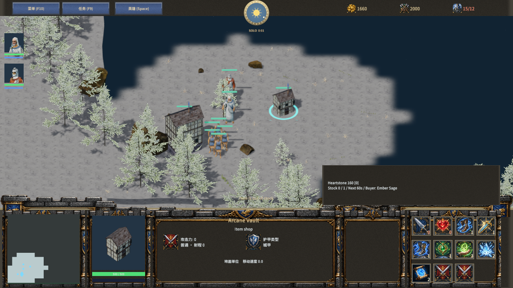
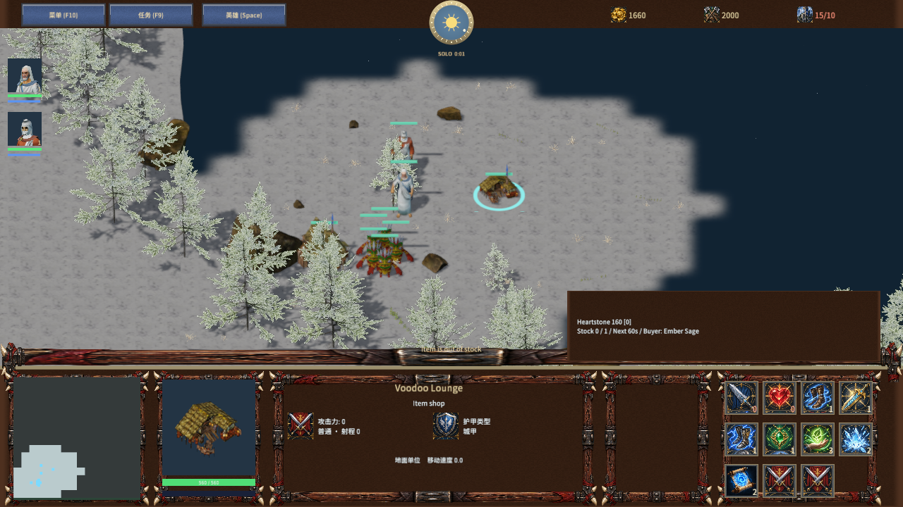
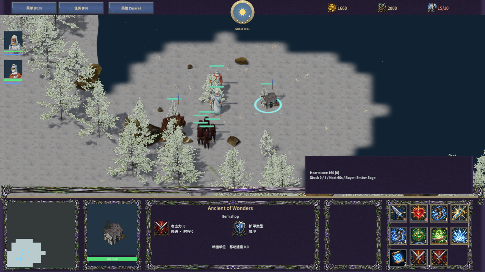
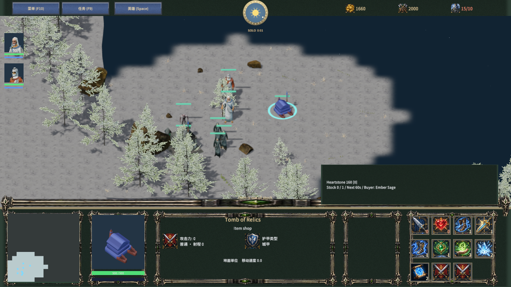

# 近战物品商店

Author: MiYu

新近战对局使用可建造的物品商店。工人 B → V，费用 130 金币、30 木材，基础建造时间 18 秒；保留各族现有的施工、召唤、变形与取消退款规则。AI 在拥有存活英雄后建商店，商店建设与部队生产可在同一次决策中处理。

四族名称分别为 Arcane Vault、Voodoo Lounge、Ancient of Wonders、Tomb of Relics。选择商店后，九个商品按钮显示余量；提示框显示名称、价格、库存上限、下一件补货剩余秒数和购入英雄。第十个按钮切换附近的英雄，第十一个按钮进入该英雄背包。英雄按 O 打开购物页面。新开对局重置购入英雄选择。

## 规则

购买和出售要求己方存活、完工的商店，英雄距离小于 10 单位，地形以及树木、岩石可通行。购买先验证物品、英雄、指定商店、合成材料、背包容量、库存和金币，全部通过后才同时扣款、消耗材料与库存、发放物品。多名英雄共享同一商店库存。默认购买选择附近有货的商店；指定商店按指定库存处理。英雄购物页面指定当前显示的商店。

| 商品 | 库存上限 | 单件补货模拟秒数 |
| --- | ---: | ---: |
| Runic blade / Heartstone / Wayfarer boots | 各 1 | 60 |
| Covenant edge / Stormstride / Sanctuary charm | 各 1 | 60 |
| Healing potion | 3 | 30 |
| Mana potion | 2 | 45 |
| Town Portal Scroll | 2 | 120 |

库存满时计时为零，缺货后逐件补货，出售物品只退款。未完工、死亡、单机暂停和胜利后冻结补货。存档保留库存与补货剩余时间，并拒绝非法数量、计时、数组以及版本字段。Dota / TD / RPG 保留基地无限购物；在编辑器预置的商店仍可进行有限库存交易。这些模式不能由工人新建商店。旧单机存档缺少 itemShopVersion 时保留原有基地购物，新近战需要独立商店。

客户端与服务器协议 35。敌方快照隐藏库存；所有购买、竞争、补货与重连由服务器规则处理。

## 美术与范围

本阶段复用现有四族三维工坊模型及已有材质、商品图标，没有新下载或改动资产许可证。来源保留在 realistic-sources.json 及 Licenses 中。商店不是专属原作美术，九种商品也不是冰封王座完整的四族商品表。AI 本阶段建商店，尚未实现自动采购或使用物品。商店仅出售物品，未实现中立商店、雇佣兵、单位招募或独立商品编辑数据库。

## 验证

- test-frost-item-shops.mjs：四族实际建造、完工/归属/距离/路径限制，共享库存与多个商店路由，购买事务、逐件补货与上限、胜利冻结、精确保存续跑、异常和旧存档、出售语义、敌方库存隐藏。
- test-frost-item-shops-network.mjs：真实 TCP 连续购买同一最后库存只支付一次，重连恢复库存/背包/计时，权威补货和敌方非法购买拒绝。补货边界测试缩短服务器测试状态的剩余计时。
- test-frost-item-shops-client.mjs：生成场景与实际客户端脚本接收按钮/键盘/鼠标输入，验证商店购买、缺货提示与无扣款、英雄切换/选择、背包、英雄页面购物、保存恢复、补货与非近战热键限制。
- 全量规则/TCP 回归：66 项 PASS，进程退出 0。最终客户端调整后再次通过针对性客户端输入测试。
- [原生报告](item-shops-native-qa.json)：隔离的 Release 编辑器，真实 QuickJS 与 Agent 输入，四族商店按钮、三维模型绑定、工人实际施工，完整 60 模拟秒补货、暂停冻结以及存档加载。测试地图从隔离项目用户数据加载，只增加 qaMap / qaUnits 观察字段。
- [交付校验](item-shops-validation.json)与 [Player 检查](item-shops-player-smoke.json)：源码/原生资产/分发包一致，所有文件大小与 SHA-256 校验、着色器变体校验、30 秒 Player 启动及响应。

原生 Agent 输入验收不代表物理鼠标、音频试听、跨机器局域网或稳定 Player 帧性能验收。完整冰封王座复刻目标仍未完成。

