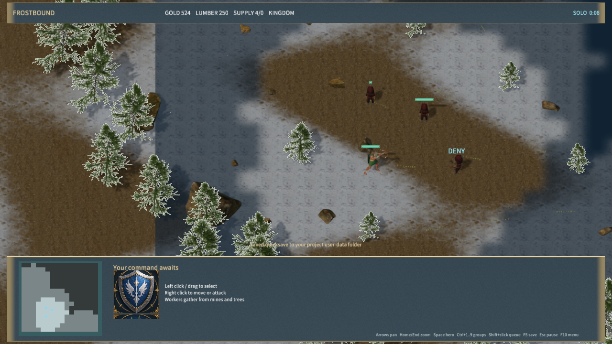

# MOBA 小兵反补

Ancients of the Vale 中，右键或 A 后左键血量不高于 50% 的己方小兵，可命令选中单位反补。A 后点击地面仍为攻击移动。满血小兵、己方英雄、建筑和其他单位不接受反补；不能攻击自身。自动索敌、攻击移动、巡逻、范围伤害及溅射仍只选择敌方。

目标资格在命令、持续攻击和弹道命中时检查。被治疗到半血以上会取消反补攻击，飞行中的追踪弹道也不会继续伤害该目标。近战、即时火枪和远程弹道使用同一结算路径；射手死亡后，已经发射的有效反补弹道仍可完成结算。反补攻击不触发吸血或减速。

反补方不获得金币、击杀数或经验。对方距离目标小于 18 世界单位的存活英雄分摊 17.5 点经验，即当前小兵总经验 35 的一半。普通 MOBA 击杀经验也在附近英雄间分摊；其他模式保持原有经验规则。死亡与尸体表现继续使用正常路径，反补命中显示青色 `DENY` 飘字，并遵循战争迷雾可见性。

客户端在每次模拟推进或收到服务器状态时收集可见事件，渲染时统一消费。同一模拟帧的重复状态不会重复播放。展示队列保留最近 48 条事件，沿用 12 条飘字和 24 个特效槽；战斗结算不依赖展示队列。



[飞行中保存](deny-in-flight.png)、[A 键点击反补](deny-second.png)。截图来自隔离的原生测试场景：游侠、两只低血量己方小兵、一只满血己方小兵和静止敌方英雄。测试固定了初始冷却以拍摄飞行状态，使用真实客户端输入处理、规则与渲染。

## 验证

- 规则检查覆盖半血边界、非法友军/自身、其他模式、近战/远程、经验分配、无金币/击杀/吸血收益、治疗取消、战争迷雾、尸体、射手死亡和飞行中存档恢复。
- 真实客户端脚本检查覆盖同画面帧内两次模拟，以及一次接收多条/重复网络状态；确认只生成一次可见反补提示。
- 本机真实 TCP 检查覆盖服务器拒绝满血反补、执行友军攻击、飞行中断线重连及一次收益结算。
- 原生 Release 编辑器检查通过右键、A 键点击、存档恢复和实际 `DENY` 文本渲染，材质管线拒绝为 0。既有原生 QuickJS 集成测试 3 通过、0 失败；完整规则与 TCP 检查通过。
- Windows 包更新为 540 文件、234,753,874 字节，内容哈希 `02d6edae05a58b08a5d81e681e3c631ffc0deeaab92b3bcf40bd6a809cb58a03`。启动检查与阶段汇总见 [验证结果](moba-denies-qa.json)。

本阶段实现小兵反补及当前 MOBA 经验规则，尚未涵盖建筑、特殊英雄反补或原版 Dota 的全部版本差异、英雄与地图内容。未进行物理输入、声音听感或跨机器联机验收；帧率数据仍为此前岩壁阶段的测量。

```powershell
node scripts/build-frostbound.mjs
node scripts/test-frost-denies.mjs
node scripts/test-frost-feedback.mjs
node scripts/test-frostbound.mjs
cargo test -p mengine-editor-host --test frost_sample
$env:MENGINE_QA_ROOT='D:/MEngineNativeQA'
node scripts/qa-frostbound.mjs --denies-only
```
