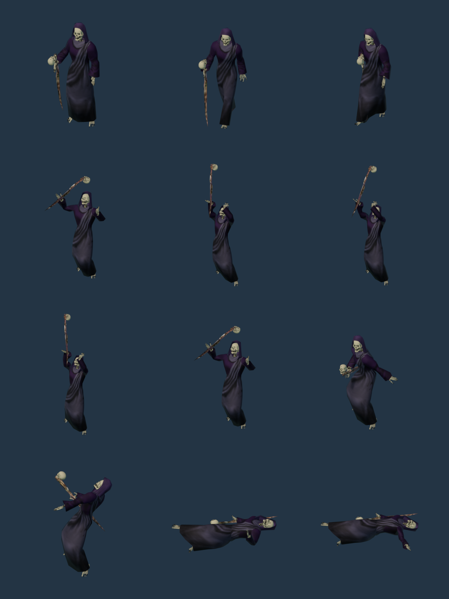
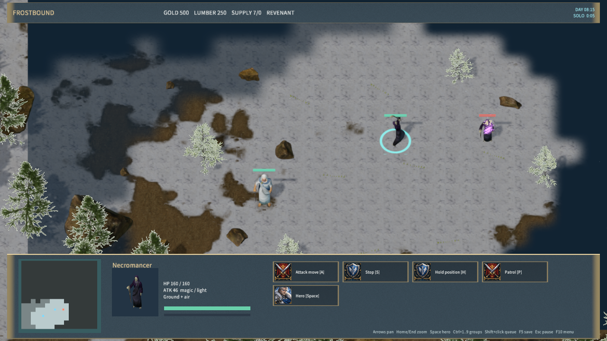

# Anatomical robed necromancer

`necromancer` now uses `RealNecromancer`: an anatomical skeletal face, hands and feet, a dark purple robe and hood, and a wooden staff with a skull cap. Idle, walk, staff casting and death use the authored 0 A.D. caster actions. The selection portrait uses the same native model. Existing shadow projectiles, damage, cooldown and lifesteal rules remain intact.

Gord Goodwin's anatomical skeleton is CC0. Wildfire Games' garment, hood, staff, rig and actions are CC-BY-SA-3.0. The adapted model, textures and portrait are CC-BY-SA-3.0. Original sources, dependency manifests, pinned input hashes and derived hashes are recorded in `necromancer-sources.json`; the notice is shipped in `Assets/Licenses/Anatomical-Necromancer.txt`.

`prepare-frost-necromancer.py` removes 189 human neck/hand/shoe vertices, fits the anatomical parts to the caster rig, preserves garment UVs, dyes the fabric, adds the skull staff cap and exports a prepared rigged body. The original source assets remain unchanged. The runtime model has 10,697 triangles and 102 bones.

The shared human importer accepts a prepared body's `attachmentSource` to retain the original Collada attachment frames. Its optional `groundClips` list lifts penetrated poses before export; this model enables it for Death so the staff and body remain above the ground while falling. Other models retain their current import behavior.

## Rebuild

With Blender 4.5.9, run `scripts/prepare-frost-necromancer.py`, then `scripts/import-frost-humans.py -- --manifest necromancer-sources.json`, both using `--background --disable-autoexec --python-exit-code 1 --python`. The preparation uses the checked-in anatomical body outputs; their generator is documented in `anatomical-skeleton-sources.json`. The main asset importer includes both necromancer steps after the anatomical body.

Run `node scripts/render-frost-unit-icons.mjs` and `node scripts/build-frostbound.mjs` to refresh the portrait atlas and game script. The `--necromancer-sheet` portrait option renders the native pose sheet below.

## Verification

- `scripts/test-frost-necromancer.py`: provenance, garment/skin separation, anatomical skull geometry, staff skull, normalized weights, material maps and all 115 native pose samples passed.
- Both preparation outputs and all five runtime outputs reproduced identical hashes (`necromancer-repro-qa.json`).
- `node scripts/test-frostbound.mjs`: visual selection/cast phase checks and the complete rule/TCP suite passed.
- `cargo test -p mengine-editor-host --test frost_sample`: 3 passed, 0 failed.
- `node scripts/qa-frostbound.mjs --necromancer-only`: native selection/portrait, movement, shadow flight before impact damage, save/restore and death passed; zero rejected material pipelines.
- Windows package: 576 files, 263,247,396 bytes; content SHA-256 `5abd967d216f91b97b53384e582d066280da80d87fe2b5ea9201a793d2915e9a`. The 30-second Player startup check passed with zero logged errors.

Native interaction evidence uses Agent input. Physical mouse/keyboard, audio listening and a new cross-machine LAN run are not covered by this stage. This replaces the caster's artwork and animation; corpse raising, the remaining faction artwork and the full Warcraft-style game remain unfinished.

