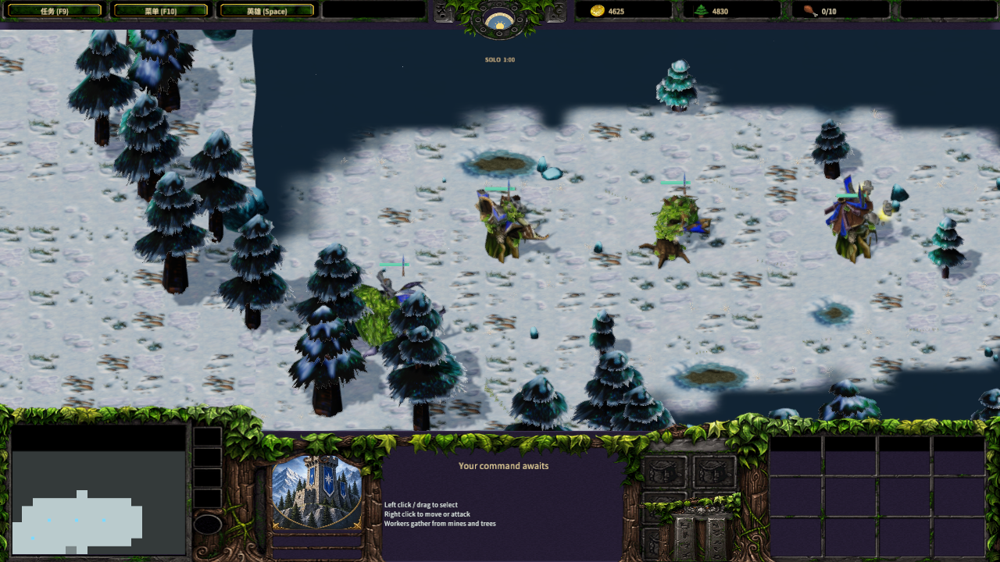
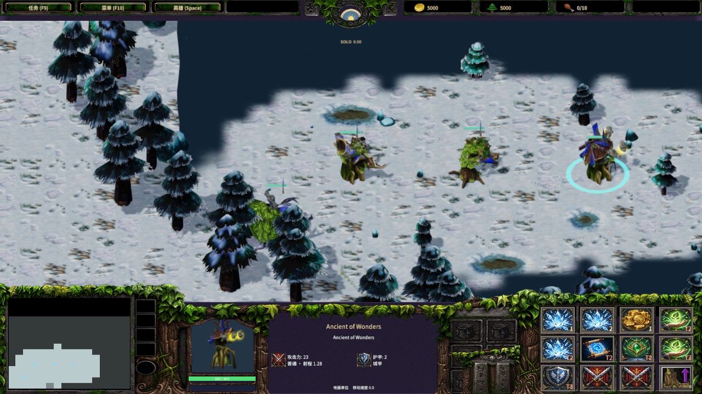
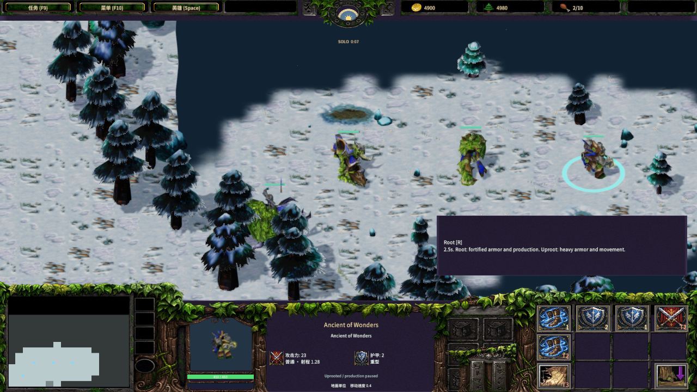
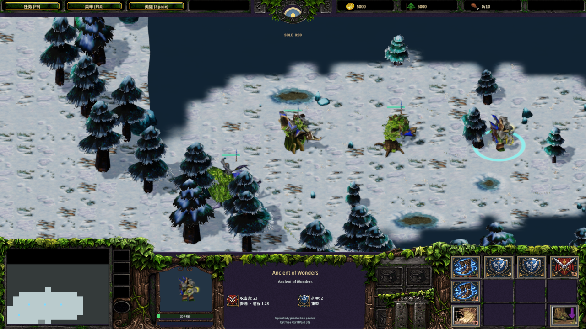
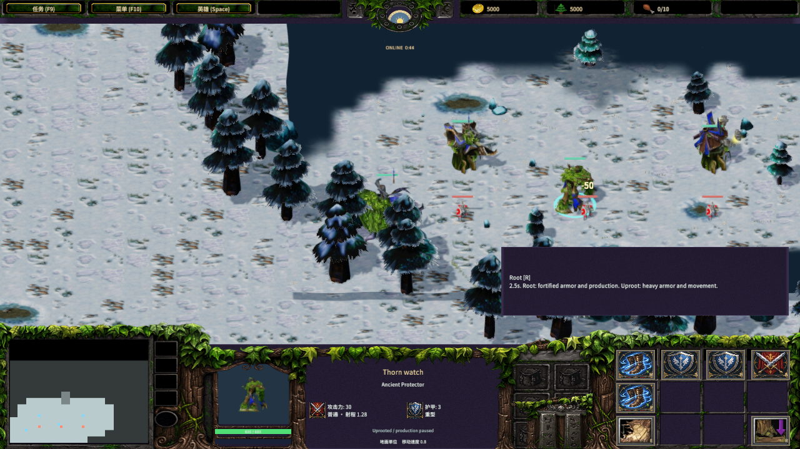

# 原版生产古树形态与命令栏

作者：MiYu

新近战游戏的战争古树、远古守护者和奇迹古树使用原版源单位 eaom、etrp、eden 的数值，并支持拔根、移动、扎根和吃树。三种主树的金矿缠绕及自然的祝福研究仍只属于主树；生产古树不会提供主树科技前置或获得金矿缠绕能力。

| 古树 | 生命 | 金／木 | 建造 | 基础护甲 | 拔根速度 | 扎根／拔根平均攻击 |
|---|---:|---:|---:|---:|---:|---:|
| 战争古树 | 1,000 | 150／60 | 60 秒 | 2 | 0.4 | 50／50 |
| 远古守护者 | 600 | 135／80 | 60 秒 | 1 | 0.4 | 49.5／29.5 |
| 奇迹古树 | 450 | 90／30 | 60 秒 | 2 | 0.4 | 23／23 |

`UnitBalance.slk`、`UnitWeapons.slk`、`UnitAbilities.slk` 和 `AbilityData.slk` 决定上述数据。Aro1 的扎根／拔根武器掩码为 1／2，Aro2 为 2／1；形态切换工期为 2.5 秒。扎根使用城甲，拔根使用重甲。远古守护者扎根时使用 700 源单位范围、2 秒间隔的对地／对空投石；拔根时改为 128 源单位范围、1.5 秒间隔的地面近战。投石按源表 25／75／125 单位半径与 100%／15%／5% 地面溅射，飞行中的弹道保留发射时的武器形态，保存后继续。伤害沿用当前引擎平均伤害规则，未加入原版掷骰随机波动。

夜间每秒恢复 0.5 生命。自然的祝福为战争／奇迹古树增加 5 护甲，守护者增加 2，拔根速度变为 0.8。拔根与形态切换暂停已付款生产队列、商店购买和补货，扎根后恢复；暂停和保存保留剩余计时。施工使用源费用和完整 60 秒工期。旧存档没有 `productionAncientVersion` 时保持原有生产建筑规则，新存档采用版本 1；单位保留 `ancientProduction=1`，恢复时检查版本、单位身份、形态和队列。TCP 协议为 44，敌方快照保留可见形态、护甲及移动速度，隐藏队列、商店库存和订单。

命令栏使用原版 BTNRoot、BTNUproot 与 BTNEatTree，R 和 E 快捷键分别继承 Aroo／Aeat 定义。扎根／拔根位于 `(3,2)`，吃树位于 `(0,2)`；扎根奇迹古树保留购物按钮及拔根入口。施工预览和已建建筑都选择原版对应形态。模型继续使用源几何、原版 modelScale、节点／材质动画与 Stand Alternate、Morph、Morph Alternate、Walk、Attack、Spell EatTree 序列。三个模型已经随经典资产导入，本阶段没有重制或归一化它们的网格。

来源收据 `production-ancient-sources.json` 签名九个原始文件与十四个源／输出文件，保留真实 MPQ 层、原始 BLP 和规则行。版权沿用 Blizzard Entertainment 的原版资产条款。导入器可脱离游戏安装重生成，并在写入前拒绝覆盖被手工修改的输出。Root 的能力分组与武器切换另参照 [固定版本的 Warsmash 实现](https://github.com/Retera/WarsmashModEngine/blob/f9e0aeed4be372d6016519d0e97b384aa873f374/core/src/com/etheller/warsmash/viewer5/handlers/w3x/simulation/abilities/nightelf/root/CAbilityRoot.java)，该实现不是原版客户端测量结果。

```text
python scripts/import-frost-production-ancients.py
node scripts/build-frostbound.mjs
node scripts/test-frost-production-ancients.mjs
node scripts/test-frost-production-ancients-client.mjs
node scripts/test-frost-production-ancients-network.mjs
python scripts/test-frost-production-ancient-assets.py
node scripts/test-frostbound.mjs
node scripts/qa-frost-production-ancients.mjs
python scripts/verify-frost-production-ancient-bundles.py
```

规则验收覆盖三种完整形态计时、生产／商店暂停和恢复、吃树的完整 500 生命／30 秒、夜间恢复、原版武器和投石溅射、形态切换后的在途弹道、保存及旧存档。生成客户端测试执行实际图标点击、R、暂停和菜单存读档，TCP 测试执行三单位批量形态切换、真实中途断线重连、原版加成、所有权与敌方隐私。

完整规则回归 86 项 PASS。原生 Release QuickJS 双工程验收执行三个实际小精灵的 B/B、B/T、B/V 建造和地面落点，frame 0 付款 375 金／170 木，frame 599 三座尚未完成，frame 600 全部建成并消耗三个小精灵。原版三种模型、命令图标和 R/E，完整 2.5 秒形态切换、移动／停止／Walk、已付款队列暂停及恢复、暂停和精确菜单存读档、实际吃树与 Wonders 源动画均已通过。

双原生 Release QuickJS 客户端通过实际大厅加入／准备／开局、HUD 拔根命令、完整权威形态计时、自然的祝福护甲／速度、敌方订单隐私及客机断线重连。两端控制台错误和材质管线拒绝均为 0。联机输入在短暂暂停编辑器后等待按下／抬起各一帧的原生执行完成，再恢复运行；测试覆盖真实 TCP，并非物理键鼠验收。两份独立测试工程各 6,660 个文件与当前产品逐文件一致，差异仅为工程标识、临时 TCP 端口和 qaUnits 观察字段。所有十四个签名源／输出文件与导入器签名在 Git index 和 Windows 实际检出后保持一致。

报告：[原生验收](native-production-ancients-qa.json)、[产品字节比对](production-ancient-native-bundle-validation.json)、[素材复现](production-ancient-art-validation.json)、[Git 检出签名](production-ancient-index-validation.json)。







建筑源比例、四族控制台和多宽高比布局使用当前共享实现，详见 [建筑比例](building-proportions.md) 和 [控制台布局](console-layout.md)。本次生产古树命令与状态信息使用同一控制台；没有修改源网格尺寸或统一各建筑的边界。

当前扎根命令使用古树所在位置及现有圆形建筑占地检查，战争古树训练／研究列表仍沿用当前样例。原版指向地点的扎根命令、准确路径贴图／碰撞、战争古树完整训练／研究列表、风之古树和知识古树独立兵种树、完整暗夜单位／科技、战役、经典地图及全部编辑器功能仍需完善。原版客户端的完整动画时相、物理键鼠、音频与跨机器 LAN 尚未独立验收。完整游戏复刻目标保持 active。
