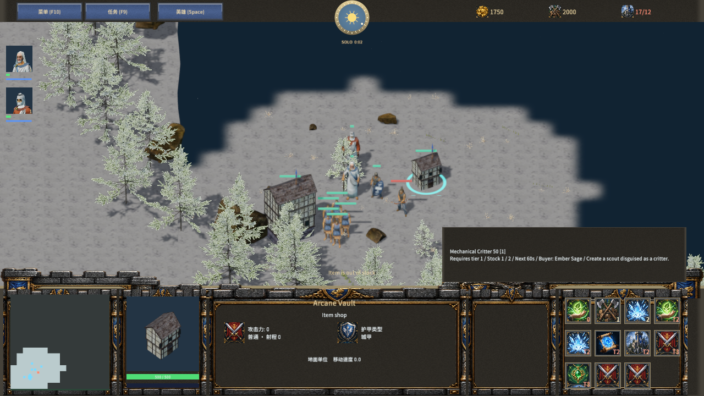
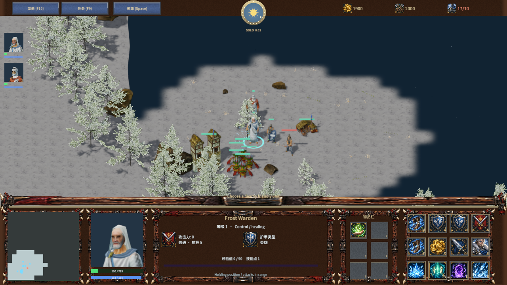
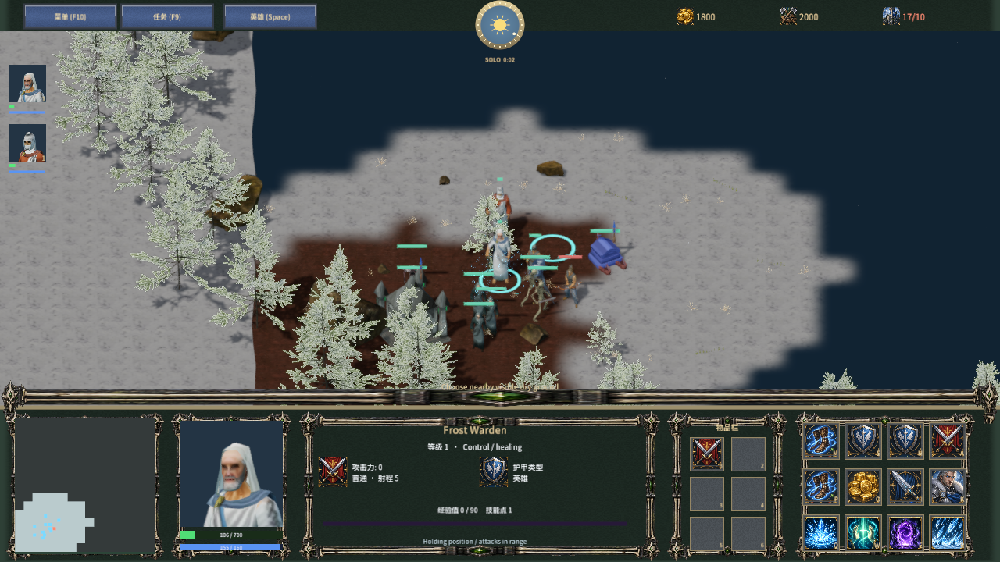

# 四族经典商店物品

Author: MiYu。新近战使用各族经典商品表，参照 2026-10-05 获取的 Blizzard Classic Warcraft III 官方指南快照。目录为 `samples/frostbound-realms/game/racial-items.json`，客户端 QuickJS 与权威 Node 服务器使用同一份定义，协议 36，存档商店版本 2。

| 商店 | 商品 |
| --- | --- |
| Arcane Vault | 恢复卷轴、机械小动物、次级净化药水、生命药水、魔法药水、回城卷轴、象牙塔、火焰之球、避难权杖 |
| Voodoo Lounge | 治疗药膏、速度卷轴、次级净化药水、生命药水、魔法药水、回城卷轴、闪电之球、迷你大厅 |
| Ancient of Wonders | 月亮石、次级净化药水、显影之尘、生命药水、魔法药水、回城卷轴、保存权杖、毒液之球、抗魔药水 |
| Tomb of Relics | 死灵之棒、献祭头骨、显影之尘、生命药水、魔法药水、回城卷轴、腐蚀之球、治疗卷轴 |

共 22 种经典商品，其中回城卷轴沿用已有索引，其余 21 种加入目录。商品按主城科技等级解锁，界面显示 T2/T3、库存、补货秒数及金币/木材。库存按商店共享；购买先检查族别、科技、资源、背包和库存，再一次完成扣费与交付。Dota/TD/RPG 使用原有通用装备与合成，版本 0/1 单机存档延续旧商店规则。

## 操作和效果

选择商店后，前九格为商品，第十格切换附近购入英雄，第十一格选中英雄。英雄 O 打开商店，I 打开背包，点击物品格或小键盘 1–6 使用。药膏、传送杖选择友方单位；象牙塔、迷你大厅和头骨选择地面。背包显示剩余次数，丢弃、拾取、出售、存档及联机重连均保留次数。药膏有 3 次、显影尘 2 次、死灵棒 4 次；部分使用后的出售金额按次数折算。药水共用 20 秒冷却，传送杖可重复使用。

药膏在 45 秒恢复 400 HP，恢复卷轴在 45 秒恢复附近有机友军 225 HP，次级净化药水在 30 秒恢复 100 mana，受到伤害打断持续恢复。速度卷轴提升附近友军移动速度 10 秒；月亮石临时变为夜晚 30 秒，暗夜弓箭手可按 Z 隐身，显影尘侦测附近隐身目标 20 秒。抗魔药水提供 15 秒法术免疫，包括伤害和敌方控制效果。

保存/避难权杖寻找完工主城及空闲落点，传送另一个附近友方移动单位并清除原有路径、工作恢复状态。避难权杖随后按 15 HP/s 治疗至满血，治疗期间单位停止接受命令。当前主城科技按队伍共享，因此同等级主城按稳定 ID 选择；独立主城科技及完整逐建筑升级仍属于后续工作。

象牙塔生成真实 5 秒建造的 Scout Tower，可按 G 花费 100 金币/70 木材升级为 Guard Tower，持续 30 秒；取消返还 75% 升级资源并保留原塔。迷你大厅生成真实 20 秒主城施工。机械小动物使用已有三维野生动物资产，可以移动侦察，敌方快照显示中立小动物身份，自动攻击忽略它；它不占人口、不留下生物尸体。死灵棒消耗附近尸体并召唤两个存活 40 秒的骷髅战士。

献祭头骨生成持久枯萎地区域，不死族可在此建造并以 2 HP/s 恢复有机单位。主城附近同时形成枯萎地；地面使用现有土壤/岩石扫描纹理、PBR 材质和连续地块混合，保留悬崖外观。地图的可编辑地表数据保持五种，枯萎地是对局运行时状态并随存档/重连传输。

四种法球提供 +5 攻击及对空能力，近战英雄对空发射真实投射物。火焰球造成附近溅射；闪电球有 35% 触发驱散及 3 秒减速，并对召唤物造成 150 伤害；毒液球造成 6 秒、9 HP/s 毒伤；腐蚀球降低 5 点护甲、持续 5 秒且驱散不会消除。随机状态及在途法球随存档保留。多法球触发、空中攻击地形、法术免疫与伤害来源由权威规则处理。

## 验证和交付

规则/TCP 回归：`node scripts/test-frostbound.mjs`。针对性规则：`node scripts/test-frost-racial-items.mjs`；真实 TCP：`node scripts/test-frost-racial-items-network.mjs`。覆盖四族商品及资源门槛、原子拒绝、库存、次数转移/丢弃/出售、恢复打断、各类效果、四法球实际战斗及对空、随机回放、畸形和旧存档，联机重复序号只能消耗一次，冷却和次数可重连且对敌方保密。

原生：`scripts/qa-frost-racial-items.mjs`，默认创建隔离工作区；复用本阶段工作区使用 `MENGINE_QA_TAG=1791153832540`。旧 `qa-frost-item-shops.mjs` 入口继续执行此完整商店验收。仅添加 qaMap/qaUnits 观察字段，通过真实游戏菜单加载合法隔离存档；没有替换创建或命令规则。四族商品、T2 标记、库存/买家、菜单存读档、背包次数、目标选择、恢复、塔建造升级、避难治疗、夜晚/侦测、尸体召唤和枯萎地实拍通过，材质拒绝为 0。

最终打包 7c90fc941ba53b4354ee10126b07b7037f4aaabc6e2b32200463d2466b435506，778 文件、4837 场景实体、10 材质变体。`racial-items-validation.json` 记录最终全量回归数量、原生与产品源码/资产一致性以及每个包文件的大小/hash 校验；`racial-items-player-smoke.json` 记录 30 秒启动存活/响应和零错误。构建运行时复用已验证 Release executable。

出处和提取文件指纹见 `racial-items-provenance.json`。本阶段未新增美术下载，图标与部分建筑仍复用现有许可资源；专属商店模型/逐物品图标、AI 购物和完整原作单位/英雄/战役/经典地图内容仍待完善。原生 Agent 输入不覆盖物理键鼠、试听、跨机局域网或稳定 Player 帧性能；完整复刻目标保持进行中。

