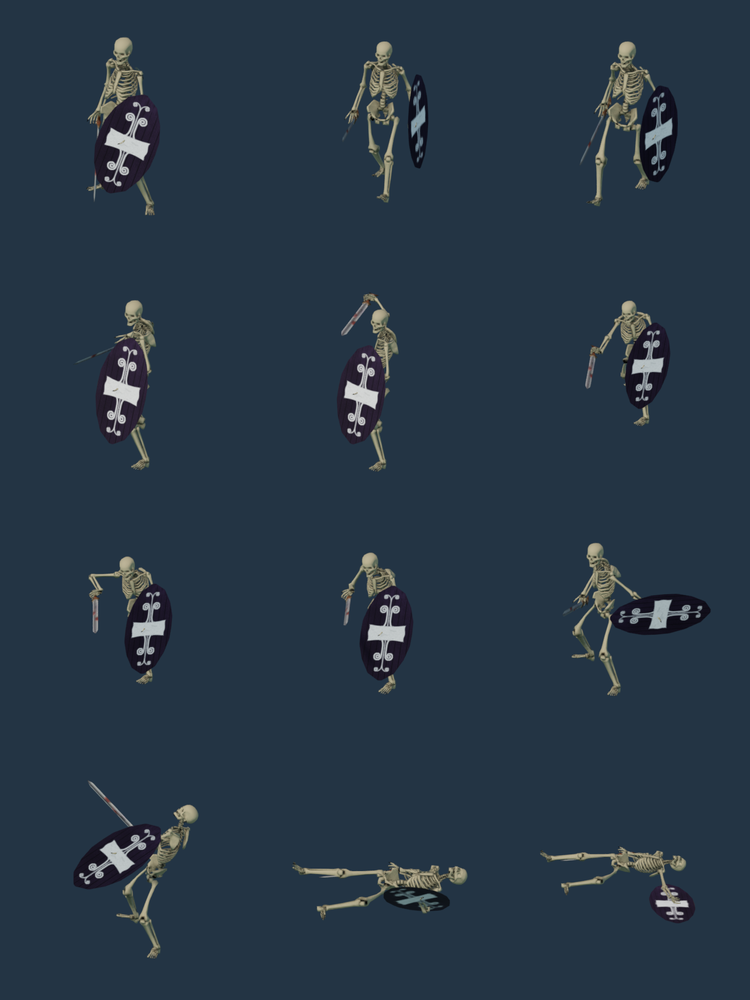
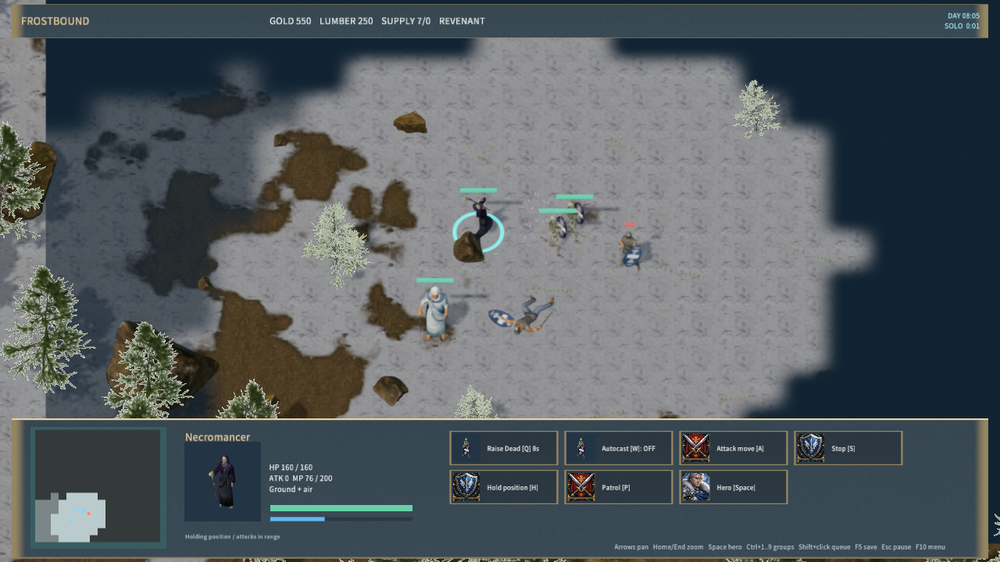
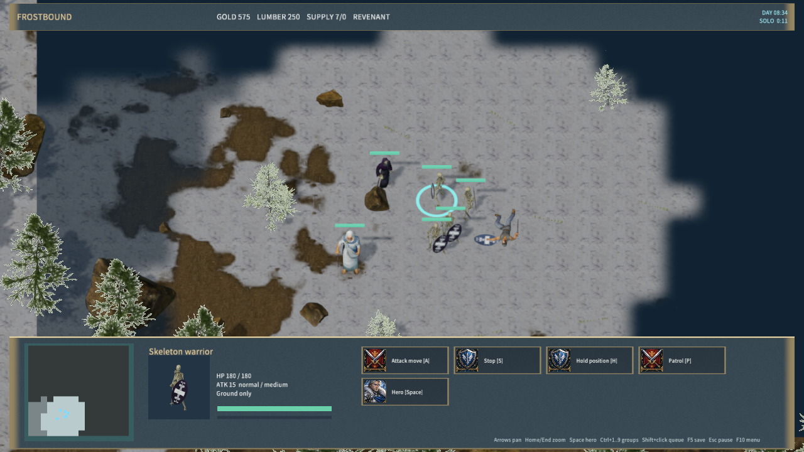

# Raise Dead and anatomical sword/shield warriors

A selected necromancer uses Q to consume the nearest visible non-hero corpse within 6 world units and summon two controllable skeleton warriors. W toggles autocast, initially off. Moving and patrolling take priority; attack-move allows autocast. Each cast costs 75 mana, has an 8-second cooldown and gives each summon a 40-second lifetime. The caster has 200 maximum mana and regenerates .667 per second. Summons use no food and leave no corpse on death or expiry.

The authoritative simulation checks ownership, life/stun state, mana, cooldown, corpse visibility, range, traversability, unit capacity and two collision-free spawn positions before consuming anything. Save restoration validates the new caster fields and retains summon expiry frames; older saves default to autocast off and cooldown zero. Client and server now require protocol 14. Native UI includes spell buttons, hotkeys, mana display, a directed staff gesture, shadow particles and skeleton portraits.

The base cost, cooldown, lifetime, summon count, default autocast state and caster mana/regeneration were checked against Blizzard's [classic Necromancer reference](https://classic.battle.net/war3/undead/units/necromancer.shtml) on 2026-10-01. Range uses this project's world scale. Skeletal Mastery, Skeletal Longevity and the remaining Necromancer skills are not implemented by this stage.

`RealSkeletonWarrior` uses Gord Goodwin's CC0 anatomical body and Wildfire Games' CC-BY-SA-3.0 sword, oval shield, human rig reference and melee actions. The adapted model/atlas/portrait are CC-BY-SA-3.0; source URLs, pinned hashes, dependencies and output hashes are recorded in `skeleton-warrior-sources.json`. Both source and packaged attribution notices are included. Free3D provided no assets for this stage.

The model has 15,649 triangles and 118 bones. Native 12 Hz clips are Idle 30 frames, Walk 20, Sword_Attack 12 and Death 15. Equipment follows the matching hand and source attachment orientation; anatomical bone lengths are retained and each pose is grounded. Rebuild with Blender 4.5.9 using `--background --disable-autoexec --python-exit-code 1 --python scripts/import-frost-skeleton-warrior.py`, then run `node scripts/render-frost-unit-icons.mjs` and `node scripts/build-frostbound.mjs`. The main asset importer includes this stage. `--skeleton-warrior-sheet` generates the native pose sheet.

Validation:

- `scripts/test-frost-skeleton-warrior.py`: source/license/input/output hashes, weights, UVs, sword/shield animation and all 77 native poses passed.
- Repeat import reproduced all three runtime output hashes exactly (`skeleton-warrior-repro-qa.json`).
- `node scripts/test-frostbound.mjs`: complete rule/TCP suite passed, including failed-cast atomicity, fog/ownership, ground/capacity checks, autocast defaults/orders, save/expiry/death and authoritative summon reconnect.
- `cargo test -p mengine-editor-host --test frost_sample`: 3 passed, 0 failed.
- `node scripts/qa-frostbound.mjs --raise-dead-only`: actual corpse consumption, casting, two summons, second autocast pair, melee kill, selection/movement/portrait, save restore and expiry passed. Zero rejected material pipelines (`native-raise-dead-qa.json`).
- The Windows package contains 580 files / 267,559,229 bytes, content SHA-256 `a23cca6099ae9b8e99f51e0ba9ccd5e87b5720613dd035f60d647af37d0b8984`. The packaged Player passed hash validation and 30-second startup, remained responsive and logged no errors (`player-smoke.json`).

Native input is supplied through the Agent bridge. Physical mouse/keyboard, audio listening and cross-machine LAN acceptance are not covered. The full Warcraft-style game remains incomplete.

