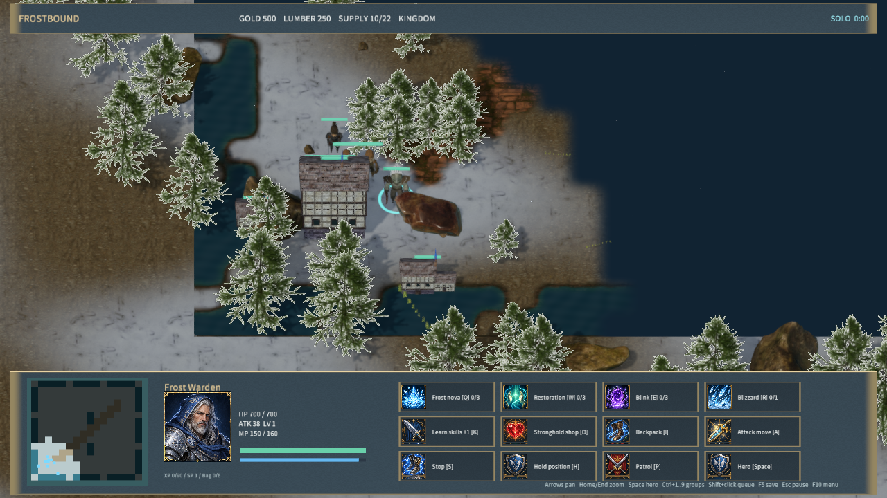

# 写实画面：贴图变换、抗锯齿与湿岸

本页保留贴图变换与 FXAA 阶段记录。当前画面、性能和 Player 包见 [多重采样阶段](multisampling.md)。

2026-09-29。本阶段修正冷杉图集 UV，加入场景 FXAA，并完善湿岸、浅水和深水的材质过渡。

## 最终行为

冷杉源模型的树枝材质通过 `KHR_texture_transform` 指定贴图区域。导入器按 glTF 的缩放、旋转、平移顺序变换 UV，再计算图集平铺范围；纹理扩展指定的 UV 集优先于普通纹理字段。基础色、法线和 ARM 通道须使用相同的变换，无法用统一 UV 表示时导入明确报错。已重新生成三种冷杉的近远六个网格和三张图集，更新派生哈希。Python 回归覆盖实际源材质、变换顺序、UV 集优先级和无变换数据；连续两次导入与树冠烘焙清单一致。

原生渲染在现有 HDR 色调映射阶段加入 FXAA，按曝光和色调映射后的亮度检测边缘，对边缘方向取样并保留中心透明度。界面在此阶段之后绘制，文字和按钮不参与该过滤。GPU 回读验证斜边产生中间覆盖值、纯色和透明度不变，以及 1×1 边界取样安全。

地表在水边加入湿润泥石、浅水透色、深水及低幅波纹，连续重复 UV 交由采样器处理。地块共享边界数据、参数与世界坐标采样一致；地图仍以两单位格子定义水域，因此本阶段没有消除地图本身的矩形轮廓。

## 实测与验收

- RHI 46 通过、0 失败，真实 GPU 测试未跳过；Node 规则、TCP、资源源文件与派生哈希检查通过。
- Release Runtime 与原生编辑器构建通过。[原生美术检查](native-realistic-qa.json)覆盖近景、远景 LOD 和地图编辑器，材质管线拒绝数 0。
- 同一 1280×720、1899 实体场景，预热 5 秒后三次各测量 5 秒：12.09、12.06、12.27 FPS。相对上一阶段，中位数 13.50 → 12.09 FPS，原生渲染耗时中位数 8.32 → 8.93 ms。这是整阶段变更的测量，不能单独归因于 FXAA；5 ms 目标仍未达到。样本、二进制哈希见 [阶段验收](rendering-refinement-qa.json)。
- 本阶段历史包 362 文件，内容哈希 `79e6b430e95c52542161a3062a86e49f34550af1de6be7dd67fba8ca0b757ba5`。当时逐文件核验通过，启动 30 秒后窗口响应且错误日志 0。最新包检查保存在 [Player 检查](player-smoke.json)。物理键鼠、音频听感和跨机器 LAN 不在此次验收内。

近景针叶仍偏暗、稀疏；抗锯齿与 UV 修正尚不足以完成植被质量目标。其他阵营、角色写实化、自然地图轮廓和整体性能仍需推进，完整游戏目标未完成。

## 复现

```powershell
python scripts/test-frost-realistic-import.py
cargo test -p mengine-rhi --lib
python scripts/import-frost-realistic.py
& $env:BLENDER --background --factory-startup --python-exit-code 1 --python scripts/bake-frost-foliage.py
node scripts/build-frostbound.mjs
node scripts/test-frostbound.mjs
node scripts/qa-frostbound.mjs --realistic-only
node scripts/qa-frostbound.mjs --performance-only
```

导入依赖和固定版本见 [写实美术记录](realistic-art.md)。两种原生 QA 模式依次运行。




