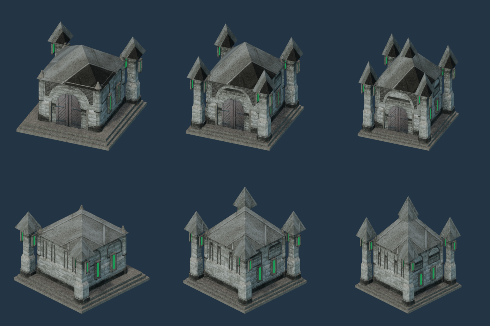
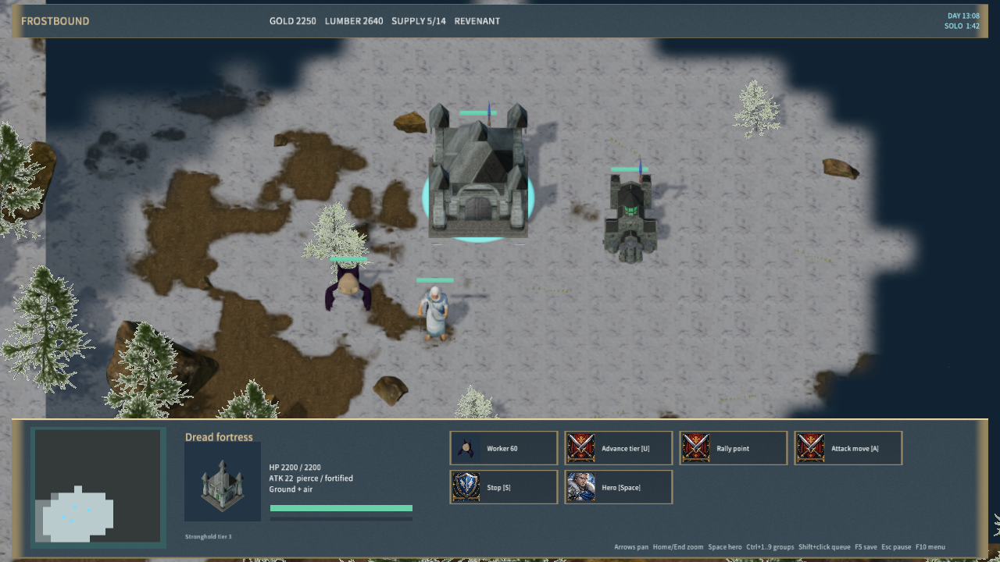

# Revenant stone stronghold tiers

The three Revenant stronghold tiers use textured stone architecture, framed green windows, stepped foundations and distinct tower silhouettes. Tier 1 has two rear towers; tier 2 adds front towers and a higher roof; tier 3 adds a central spire. All tiers retain the same horizontal footprint and use the existing upgrade rules, ownership flags and selection rings. The native building atlas contains their updated portraits.

| Tier | Runtime mesh | Triangles | Texture atlases |
|---|---|---:|---|
| 1 | RealRevenantHall.glb | 4,044 | Base, normal, ARM, emissive; 2048² each |
| 2 | RealRevenantHall2.glb | 4,884 | Base, normal, ARM, emissive; 2048² each |
| 3 | RealRevenantHall3.glb | 5,172 | Base, normal, ARM, emissive; 2048² each |

The source is rubberduck's CC0 [Castle / Dungeon Tileset Extended](https://opengameart.org/content/3d-castle-dungeon-tileset-extended). Its archive includes textures and normals, with upstream CC0 credits retained in the source readme. `revenant-fortress-sources.json` pins the archive, source page and 20 derived files. Both source and adaptation are CC0; the packaged license lists the modules, authors and derived portraits.

Rebuild with Blender 4.5.9: `--background --disable-autoexec --python-exit-code 1 --python scripts/import-frost-revenant-fortress.py`. The importer also runs through `import-frost-assets.py`. Repeating the import reproduced all three meshes, twelve textures, three materials and two license hashes. Run `node scripts/build-frostbound.mjs` after importing; regenerate portraits with `render-frost-faction-icons.mjs`, and six native views with `render-frost-unit-icons.mjs --fortress-sheet`.

Validation passed:

- `test-frost-revenant-fortress.py`: source/generated hashes, finite vertices/normals/UVs, index bounds, native geometry bounds, equal footprints, increasing height, atlas channels and localized emission.
- `test-frostbound.mjs`: complete rules and TCP regression, including tier changes and saved/network model selection. `test-frost-visuals.mjs` also verifies all three current meshes and the final portrait atlas.
- `qa-frostbound.mjs --fortress-art-only`: native UI upgrades through tiers 1–3, matching portraits, mid-upgrade save/load, completed-tier save/load, worker training and tier-3 placement preview. Zero material-pipeline rejections. Evidence: `native-revenant-fortress-qa.json`.
- Packaged Release: 616 files, content hash `f0226fc48b74c42f19a87cdd71b69b5e16835d0354d60dd49187b5f7292766a9`; manifest validation and a 30-second Player startup/responsiveness check passed with zero logged errors (`player-smoke.json`).

These are original stone stronghold layouts adapted from licensed modules. They improve material detail and faction consistency; they do not reproduce the exact Warcraft Necropolis geometry or animation. Other Revenant buildings still need an art pass; the worker uses the [robed Acolyte](acolyte.md). Native Agent input does not prove physical mouse, audio-listening or cross-machine LAN acceptance.
