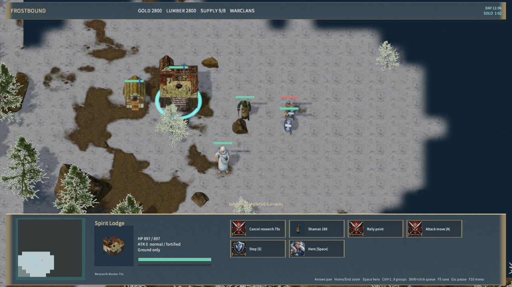
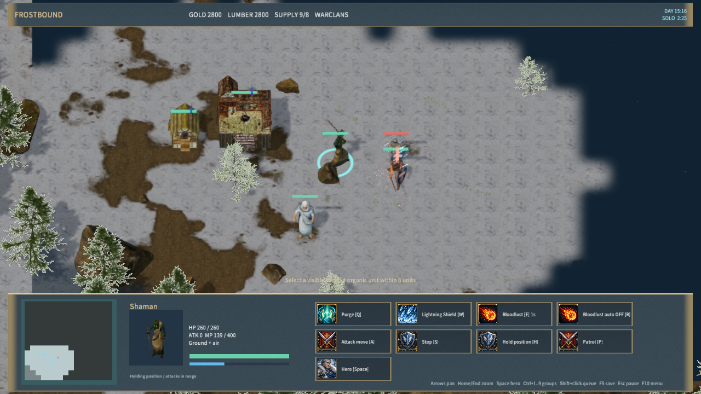
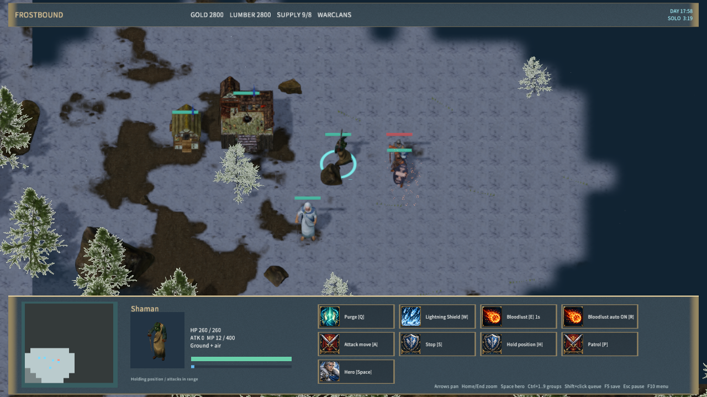

# Spirit Lodge and Shaman spells

Warclans workers build a Spirit Lodge with D at stronghold tier 2. It costs 150 gold and 150 lumber, has 800 base HP and takes 70 seconds. Shamans train there; existing saved Barracks Shaman queues still finish. The Lodge currently reuses the licensed `WarclansAltar` building and portrait, pending dedicated art.

U researches Adept Training (100 gold, 50 lumber, 60 seconds), then Master Training (100 gold, 150 lumber, 75 seconds; requires tier 3). Each rank adds 40 HP, 100 maximum mana and .25 mana/second to existing and future Shamans. Base regeneration is .667/second. Research is exclusive within the team's school, blocks training in that building and refunds its cost when cancelled. Destruction stops it.

| Command | Rules |
|---|---|
| Q — Purge | Existing dispel also removes Bloodlust and Lightning Shield. Friendly targets are not slowed. |
| W — Lightning Shield | Adept; 100 mana; no cooldown; cast range 6; lasts 20 seconds. Deals 20 damage/second within radius 1.6 to nearby ground units of either team. Excludes the bearer, buildings, flying units and magic-immune types. Ground mechanical carriers are legal. |
| E — Bloodlust | Master; 40 mana; 1-second cooldown; cast range 6; lasts 60 seconds. Friendly organic ground/flying units and self gain 40% attack rate and 25% movement. |
| R — Bloodlust autocast | Enabled by default, toggleable. Buffs eligible nearby allies during combat, prioritizing greater attack damage. Move/patrol orders suppress new automatic casts. |

Values were checked against Blizzard's classic [Shaman](https://classic.battle.net/war3/orc/units/shaman.shtml) and [Spirit Lodge](https://classic.battle.net/war3/orc/buildings/spiritlodge.shtml) references on 2026-10-01. Distances use the project's world scale. Existing base-unit and faction stat modifiers remain; this is not full Warcraft III balance parity. Witch Doctors and Spirit Walkers are not implemented in this stage.

Lightning Shield follows its carrier, expires while a worker is inside construction and stops dealing damage while hidden. Its final partial tick deals proportional damage. Friendly deaths give no deny, gold or XP; enemy kill credit survives the original caster's death. The source is server-private. Bloodlust adds to Frenzy's attack-rate bonus and the existing haste movement bonus. Purge removes timers and source attribution together. Save validation includes ranks, research, effects and source data; old saves default to untrained Shamans with autocast enabled. Protocol 16 is required by client and server.

The client displays a sustained electrical aura for Lightning Shield and a larger, red-tinted model for Bloodlust. Effects follow visibility, carrier position, expiry and dispel. Spell gestures retain their target direction. AI researches at the Lodge, uses Shield on enemy groups, dispels shields threatening clustered allies and uses Bloodlust autocast.

Validation:

- `node scripts/test-frost-shaman-spells.mjs`: training gates/costs/refunds/inheritance, old queue compatibility, friendly damage/rewards, target exclusions, partial expiry, private attribution, dispel, autocast, AI and restored simulation passed.
- `node scripts/test-frostbound.mjs`: full rules/TCP suite, including master-research reconnect, mixed-team shield damage, private sources, Bloodlust/autocast restoration and Purge passed.
- `cargo test -p mengine-editor-host --test frost_sample`: 3 passed, 0 failed.
- Native `node scripts/qa-frostbound.mjs --shaman-spells-only`: both training ranks, mid-research save, aura, friendly damage, Bloodlust tint, effect save, Purge cleanup and autocast passed; zero rejected material pipelines. Evidence: `native-shaman-spells-qa.json`.

Windows package: 586 files / 270,349,438 bytes; content SHA-256 `3d289ad5e66be0312d4532718bcd67d2fac3270a5147ec2dbf9bd177dbd12abf`. Package hashes and 30-second Player startup passed, with a responsive window and zero logged errors (`player-smoke.json`).

Native inputs use the Agent bridge. Physical mouse/audio and cross-machine LAN acceptance remain unverified. The full game, campaign content and final realistic art remain incomplete.

