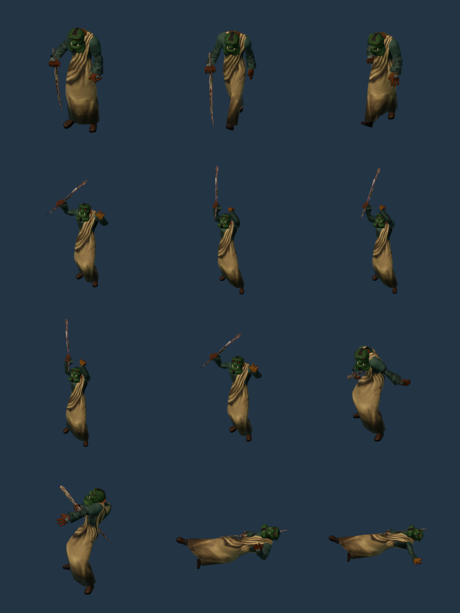
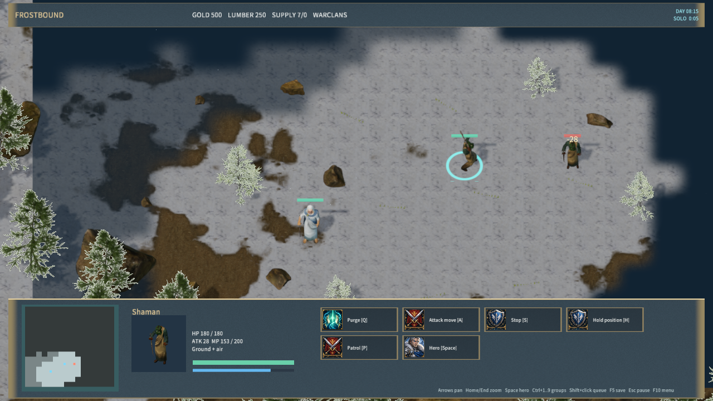
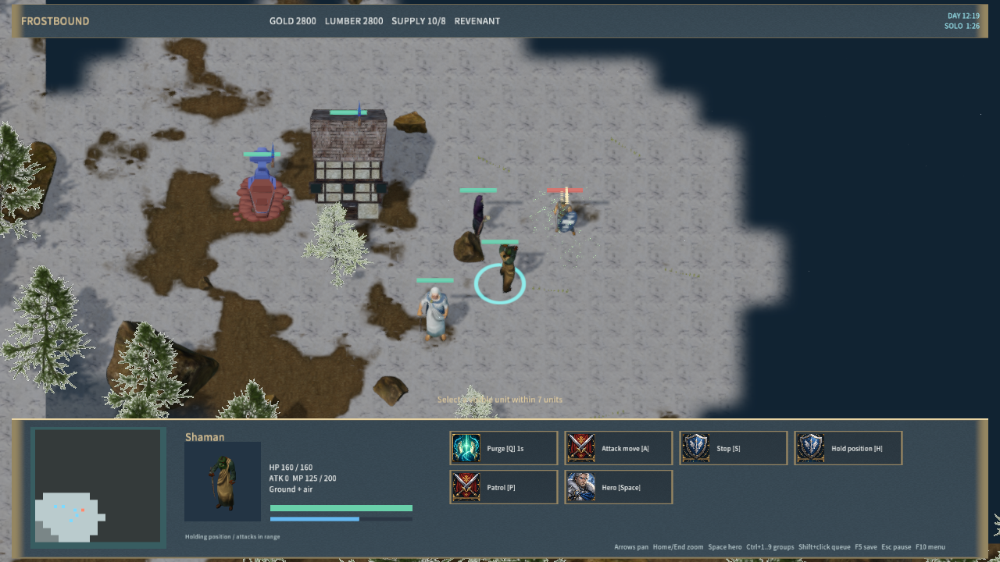

# Robed orc shaman

The Warclans Shaman uses `RealShaman`: a textured orc face and leather-gloved hands, woven robes and a wooden staff. The source is an older low-polygon, hand-painted model; this improves the prototype's material detail but is not a photorealistic character. The right hand keeps a closed staff grip, and the open left hand follows the casting gesture. Idle, walking, staff attack and grounded death have 115 native samples in total. The model has 1,340 triangles and 102 joints, with 1024-pixel base, normal and roughness textures.

Purge plays an 0.8-second staff gesture facing its target. Movement and stun take priority; saved cast time and direction restore the gesture after loading. Ordinary ranged attacks retain their existing frost projectile and damage rules. Portraits, training and map placement resolve the same model.

Sources: [Guillaume “GuieA_7” Englert's Orc](https://opengameart.org/content/orc-3d), CC-BY-SA-4.0; Wildfire Games' 0 A.D. robe, staff, rig and animations, CC-BY-SA-3.0. The combined adaptation is CC-BY-SA-4.0. Original and prepared files, attribution and SHA-256 hashes are retained in `shaman-sources.json` and `Licenses/Orc-Shaman.txt`. Free3D assets were not used.

Rebuild with Blender 4.5.9, auto-execution disabled:

```text
blender --background --disable-autoexec --python-exit-code 1 --python scripts/prepare-frost-shaman.py
blender --background --disable-autoexec --python-exit-code 1 --python scripts/import-frost-humans.py -- --manifest shaman-sources.json
node scripts/build-frostbound.mjs
node scripts/render-frost-unit-icons.mjs
node scripts/render-frost-unit-icons.mjs --shaman-sheet
```

Validation completed:

- Repeated preparation/import reproduced all five runtime asset hashes exactly. The shared GLB importer excludes Blender's hidden bone-shape helper meshes.
- `scripts/test-frost-shaman.py`: source/license hashes, garment/skin separation, four-weight skinning, animation motion, textures and all 115 native samples passed.
- `node scripts/test-frostbound.mjs`: complete rule and TCP suite passed. Caster tests include cast direction, movement/stun interruption and restored animation.
- `cargo test -p mengine-editor-host --test frost_sample`: 3 passed, 0 failed.
- Native `--shaman-only`: selection, portrait, movement, projectile flight before damage, combat save/load and death passed. Native `--casters-only`: Purge model, portrait, cast direction and mid-cast save/load passed, along with research and effect checks. Both report zero rejected material pipelines.
- Windows package: 586 files, 270,092,806 bytes; content SHA-256 `831ddde4e26aae0936a2186edaf0ffeea63a281cdb9fd2717056f75f23c85eee`. Package hashes and 30-second Player startup passed, with a responsive window and zero logged errors.

Native interaction uses the Agent bridge. Physical mouse/audio and cross-machine LAN acceptance are not covered. Other temporary faction art and the full requested game remain unfinished.




