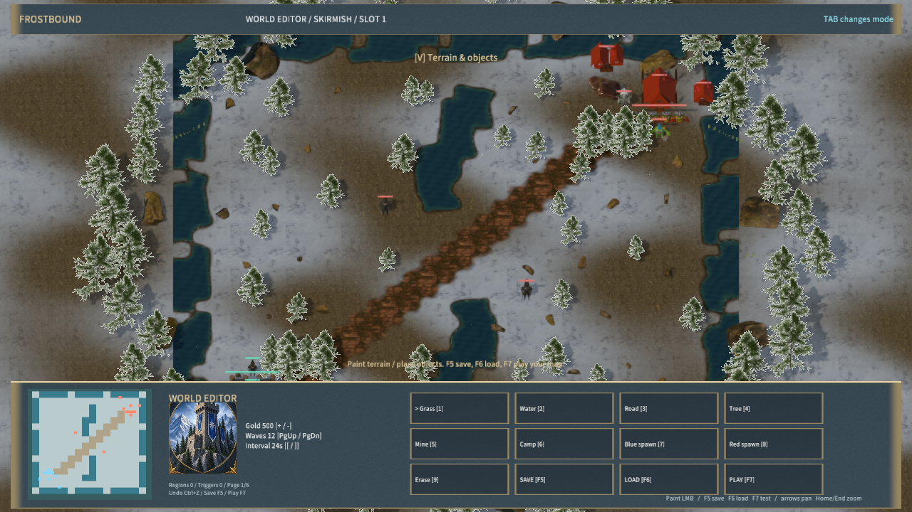

# 写实水岸阶段

默认遭遇战地图采用旋转对称的弯曲河道，中央六行保留陆地通道。水岸用世界坐标噪声偏移、湿润碎石、浅水颜色和稀疏泡沫过渡；偏移每轴不超过 0.7 世界单位，位于相邻地形区块共享的一单位插值范围内。道路和战争迷雾使用原坐标，寻路仍以地图水域格为准，视觉边沿可能有小幅偏移。

河道改动同步生成遭遇战、补给路和高地地图。塔防、MOBA 与 RPG 保持各自水域布局。没有新增下载资产；树木及地表素材来源继续见 [写实素材清单](../../../samples/frostbound-realms/realistic-sources.json)。Free3D 此前访问被验证拦截，本阶段没有从该站下载素材。

## 验证

- `node scripts/build-frostbound.mjs`：生成 1,899 实体、93 个模型条目。
- `node scripts/test-frostbound.mjs`：规则与真实 TCP 测试通过。新增河道对称、中央通道、双向出生点寻路与其他模式水域回归。
- `node scripts/qa-frostbound.mjs --realistic-only`：原生近远景、LOD 和编辑器渲染通过，4× MSAA，材质管线拒绝数 0；截图为实际原生运行画面。
- `node scripts/qa-frostbound.mjs --terrain-only`：64 区块、204 个高地格、11 个坡道；绘制、撤销、保存读取及英雄上坡通过。
- `node scripts/qa-frostbound.mjs --performance-only`：1280×720，预热 5 秒，三个 5 秒窗口分别为 12.64、12.42、12.92 FPS，中位数 12.64；平均原生渲染约 11.13–11.34 ms。近景单窗口 13.53 FPS、12.31 ms。前阶段标准视角中位数为 14.74 FPS，本次更慢；场景和着色均已变化，顺序短窗口不构成独立 GPU 成本测量。5 ms 目标仍未达到。

独立 Player 的包内容哈希、文件数量、启动检查及本阶段源文件摘要见 [阶段记录](shorelines-qa.json)。沿用现有 Release 程序，只重建和打包游戏脚本及资源。物理输入、音频听感及跨机器 LAN 未在本阶段验收。

## 后续范围

写实建筑和角色仍未覆盖全部阵营，红方建筑仍明显偏简化；水面纹理尚未随时间流动，远景树冠仍依赖固定相机角度。完整战役、完整游戏复刻和性能目标尚未完成。
