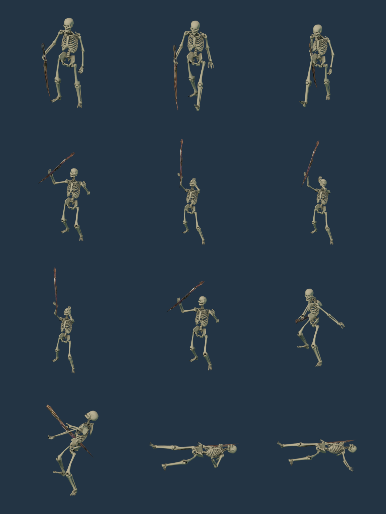
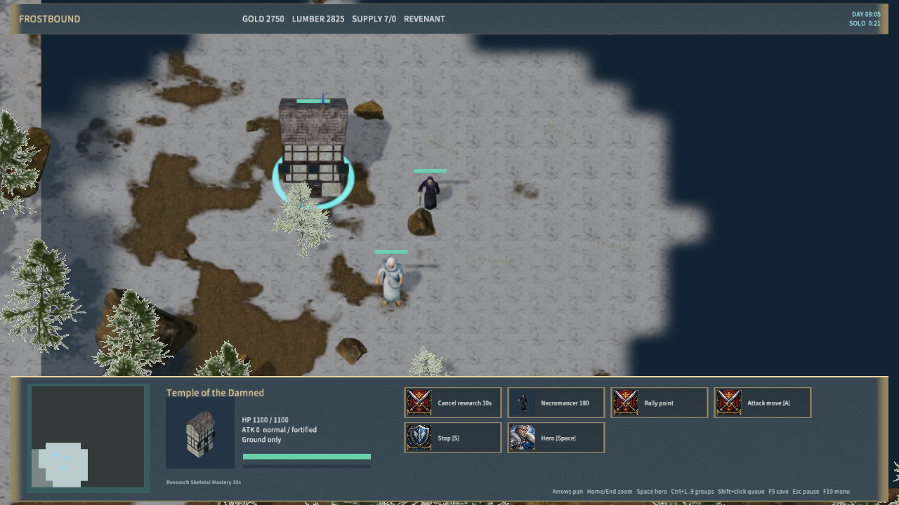
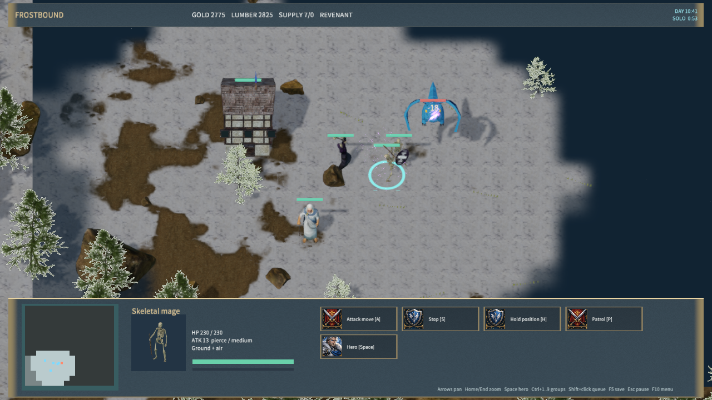

# Skeletal research and anatomical mage

The Temple of the Damned offers L — Skeletal Longevity (50 gold, 75 lumber, 15 seconds) and M — Skeletal Mastery (200 gold, 100 lumber, 30 seconds, tier 3). Each upgrade can be researched once per team. A Temple cannot train or run another research simultaneously; separate Temples may research different upgrades. Cancellation refunds the full cost. Destruction stops research without a refund. AI falls back to affordable caster training or unit production when skeletal research is unavailable.

Raise Dead consumes one corpse and creates two warriors, or one warrior and one skeletal mage with Mastery. Longevity changes newly summoned skeletons from 40 to 55 seconds; existing summons retain the expiry recorded at casting. This explicit lifetime rule is not a claim of verified Warcraft III retroactive-upgrade behavior. Summons consume no supply and leave no recyclable corpse. Saved research, upgrades and summon expiry survive load and TCP reconnect; enemy research details remain private. Client and server require protocol 17.

The mage has 230 base HP, 11.5 base damage, medium armor, 1.5-second attack cooldown, movement 2.7 and range 5 in project units. Its shadow projectile deals piercing damage and can attack ground and air. Existing faction modifiers and three-dimensional range checks apply. Reference values: Blizzard's [Necromancer](https://classic.battle.net/war3/undead/units/necromancer.shtml) and [Skeletal Mage](https://classic.battle.net/war3/undead/units/skeletalmage.shtml), checked 2026-10-01.

`RealSkeletonMage` combines Gord Goodwin's CC0 anatomical skeleton with Wildfire Games' 0 A.D. staff and caster animation under CC-BY-SA-3.0. It contains 15,615 triangles, 117 bones and Idle/Walk/Staff_Attack/Death clips. Source URLs, hashes and dependencies are in `samples/frostbound-realms/skeleton-mage-sources.json`; both license copies ship with the sample. The shared Blender importer supports `-- --mage`, runs after the necromancer import, and reproduces all three runtime hashes. Existing warrior outputs remain byte-identical. This improves anatomical proportions but does not complete the requested realistic art direction. Free3D supplied no assets in this stage; the Temple still uses the existing KingdomAltar model.

Validation:

- `scripts/test-frost-skeleton-warrior.py --mage`: provenance, skin weights, staff animation, all 115 native pose samples and grounded death passed; warrior checks also passed.
- `scripts/test-frost-skeleton-mastery.mjs`: costs/refunds, tier/ownership/queue gates, atomic rejection, malformed command payloads, destruction, lifetime, mixed summons, piercing air impact, Purge, saves and AI fallback passed.
- `scripts/test-frostbound.mjs`: full rule and TCP suite passed, including malformed payload rejection, mid-research reconnect and mixed-summon expiry continuity.
- `cargo test -p mengine-editor-host --test frost_sample`: 3 passed, 0 failed.
- Native `scripts/qa-frostbound.mjs --skeleton-mastery-only`: research via UI, mid-research save, mixed summons, model/portrait, projectile flight and air damage, summon save and expiry passed; zero rejected material pipelines. AI is disabled in this fixture and covered by the rule tests.

Windows package: 590 files / 276,039,544 bytes; content SHA-256 `935f546e90c5e7fcab7ab6a74cdc66a5ee867d7cb180ce4d4494814cd175fafc`. Package hash validation and the 30-second Player startup passed with a responsive window and zero logged errors. Physical mouse/audio and cross-machine LAN remain unverified. The full-game recreation remains incomplete.

