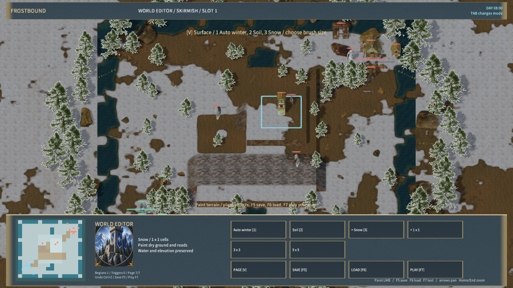

# 地表材质编辑

地图编辑器按 V 切到第七页，选择自动冬景、裸土或积雪，再选择 1×1、3×3、5×5 笔刷。数字 1、2、3 可切换材质。按住左键可连续绘制，Ctrl+Z 撤销，F5 保存地图，F6 读取，F7 试玩；试玩后 F10 返回编辑。

材质笔刷绘制干燥地面和道路，自动跳过水域，不改变道路位置、高度、坡道或通行规则。道路上的积雪仍按石缝高度混合，裸土笔刷可清除道路残雪。小地图显示裸土和积雪的对应颜色，迷雾继续限制可见范围。

地图的 `surfaces` 数组含 1024 格：0 自动冬景、1 裸土、2 积雪。缺少该字段的旧地图和存档默认使用自动冬景。非法长度、非整数和越界材质会被拒绝；存档和服务器快照保留材质。协议版本为 13，双方需同步更新。

编辑好地图后返回主菜单进入多人界面，点击 CREATE ROOM 或按 Enter，以当前编辑地图建房。F1/F2 则创建对应的默认 RTS/MOBA 地图。



## 验证

- 规则检查覆盖旧地图、非法数据、存档、公用状态、路径和地基不变、三种迷雾强度及相邻地块打包一致性。
- 全部 JavaScript 规则和真实 TCP 检查通过，含服务器地图传输和重连后材质保留；旧协议 1–12 被拒绝。
- 原生 QuickJS 集成检查 3 通过、0 失败；地表着色器四后端编译通过。
- 原生编辑器通过三种材质、三种尺寸、撤销、保存读取、试玩返回。两个独立原生客户端以编辑地图建房、加入和断线重连通过；双方材质组件均收到裸土和积雪数据，材质管线拒绝为 0。见 [原生证据](native-surface-qa.json)。
- Windows Release 包共 561 文件、250,553,663 字节，内容哈希 `5984d88a604339ea40ac0d9a872b23e1a513e58f61d58952c2552aeb1e96be69`。资源哈希校验和 30 秒启动响应检查通过，日志错误为 0；见 [启动证据](player-smoke.json)。

```powershell
node scripts/build-frostbound.mjs
node scripts/test-frostbound.mjs
cargo test -p mengine-editor-host --test frost_sample
cargo test -p mengine-rhi frost_ground_shader_compiles_for_all_backends
$env:MENGINE_QA_ROOT='D:/MEngineNativeQA'
node scripts/qa-frostbound.mjs --surface-only
```

窗口操作由 Agent 输入完成，未进行物理键鼠、听音或跨机器局域网验收。当前为固定网格方形笔刷，尚无圆形笔刷、笔刷轮廓预览或连续强度控制。完整游戏复刻仍未完成。
