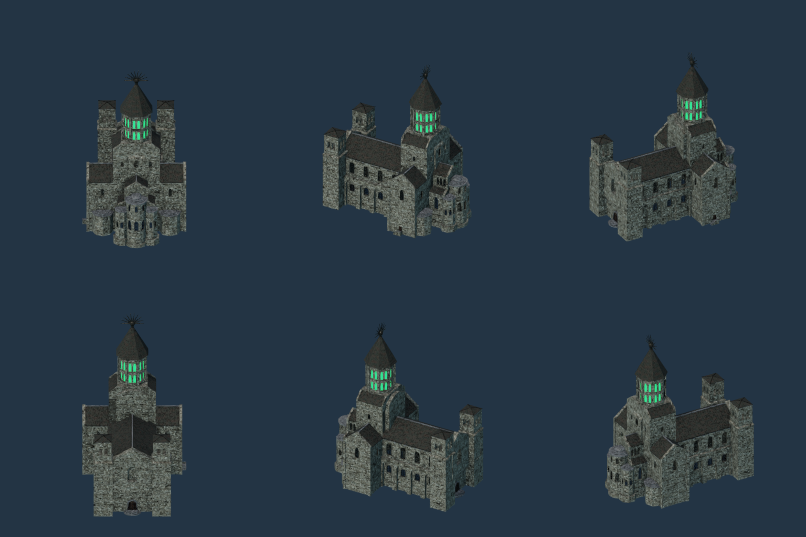
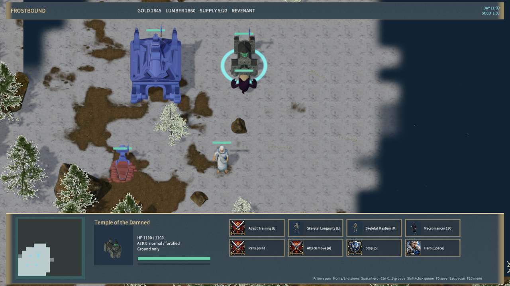
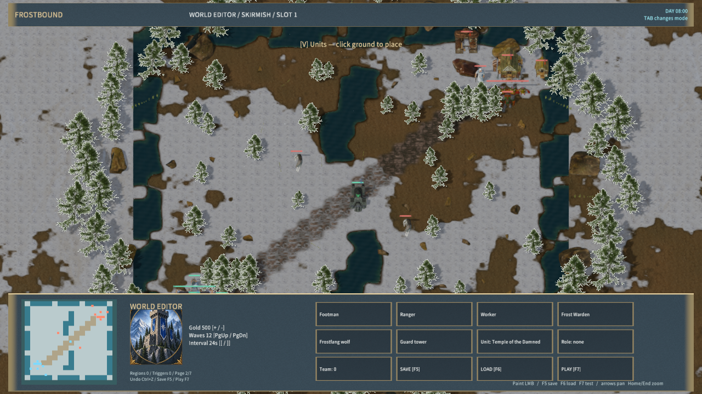

# Stone Temple of the Damned

The Revenant Temple uses `RealTemple`: a textured stone cathedral exterior with side towers, a recessed doorway, pitched roofs and green light inside the upper tower. Construction previews, completed buildings, training portraits and map-editor placement share this model. Gameplay costs, footprint and research remain defined by the existing Temple rules.

## Source and adaptation

Daniel Andersson's [Medieval Church](https://opengameart.org/content/medieval-church) and AnyRPG's [interior adaptation](https://opengameart.org/content/medieval-church-interior) are CC0. The source blend contains packed textures. `temple-sources.json` pins the source files and every generated model, texture, material and license by SHA-256.

The importer retains the exterior, removes the detailed interior and bell mechanism, fits the referenced geometry to the gameplay footprint and adds the tower lantern. The runtime asset has 16,560 triangles, 28,398 exported vertices, one mesh/material and four 2048-square texture atlases. Stone relief normals are approximated from the source color textures; this is not a scanned PBR asset or a reproduction of Blizzard's building.

Free3D listing and detail pages were accessible during research. The inspected [Church W UV](https://free3d.com/3d-model/church-w-uv-35204.html) page lists a personal-use license and no included textures. Its archive download did not return a confirmed local file. No Free3D asset is included in this stage.

## Rebuild and validation

Run Blender 4.5.9 with `--background --disable-autoexec --python-exit-code 1 --python scripts/import-frost-temple.py`, then `node scripts/build-frostbound.mjs`. The main asset importer also invokes this step. A repeated import reproduced the model, four textures, material and both license hashes.

`scripts/test-frost-temple.py` checks provenance, finite geometry, indices, native exported bounds, atlas content and localized green emission. `scripts/test-frost-visuals.mjs` checks model selection, gameplay footprint, 33 building portraits and pinned hashes. Native views are generated by `scripts/render-frost-unit-icons.mjs --temple-sheet`; building portraits use `scripts/render-frost-faction-icons.mjs`.

`node scripts/qa-frostbound.mjs --temple-art-only` passed placement preview, construction, mid-construction save/load, completed material and portrait, necromancer training, research, editor placement, map save/load and playtest. The native renderer reported zero material-pipeline rejections. Evidence: `native-temple-art-qa.json` and the screenshots below. The full rule/TCP suite passed, as did all three `mengine-editor-host` Frostbound tests.

The packaged Release contains 597 files with content hash `f95d7af843b13d0f6795a69ea31f190b8e650dcf00b25ebd7f37f44346fcd693`. Manifest validation and a 30-second Player startup/responsiveness check passed with zero logged errors (`player-smoke.json`).

This stage improves one building. Other faction buildings and some units still need a consistent realistic art pass. Native Agent input does not establish physical mouse, audio-listening or cross-machine LAN acceptance.
