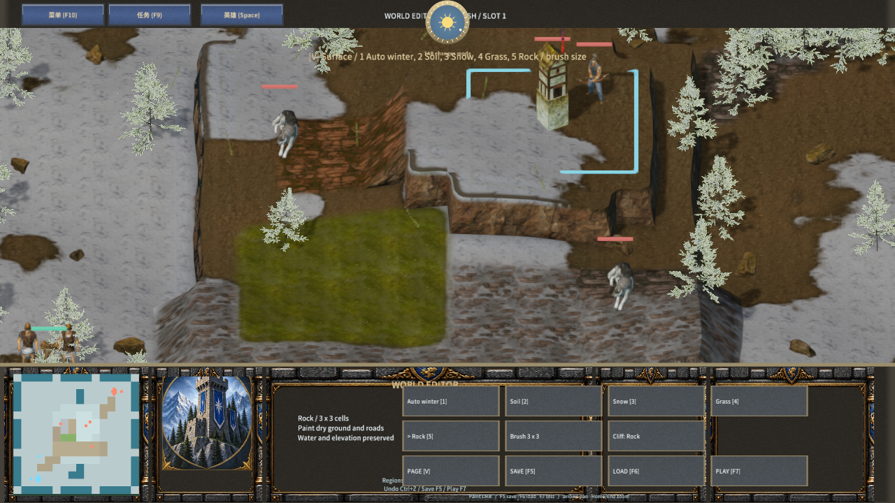
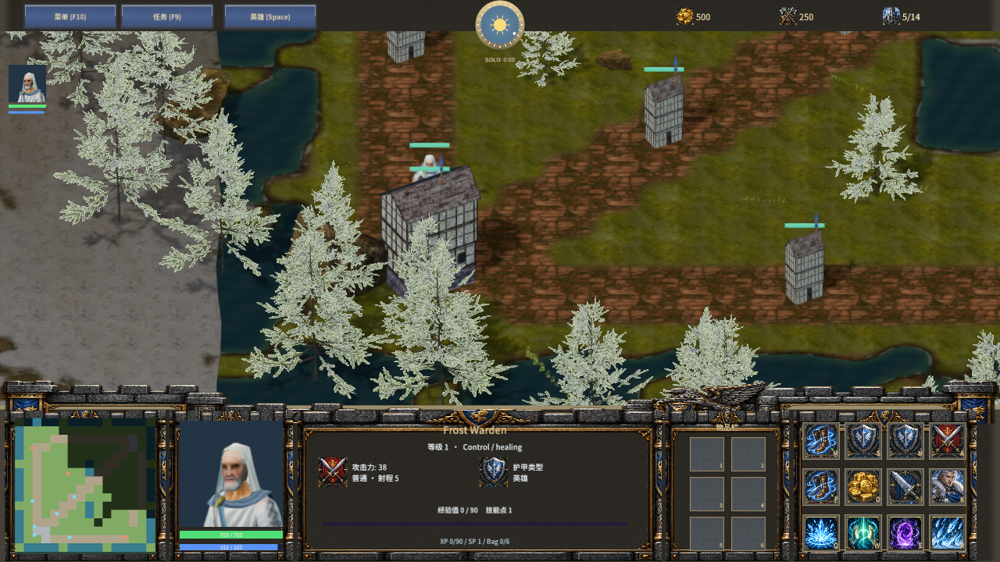

# 五种地表与 MOBA 草地兵线

Author: MiYu

地表页支持自动冬景、泥土、积雪、草地和裸岩，快捷键为 1–5。Brush 按钮循环 1×1、3×3、5×5；绘制跳过水域，保留地形高度、坡道、地表雕刻和悬崖类型。小地图显示草地与岩地颜色，旧地图保留已有地表；缺少 surfaces 的地图补自动冬景。

默认 MOBA 的非道路干地使用草地，三条兵线使用裸岩，河流仍使用原来的水域数据。地表绘制可覆盖道路的外观，通行、寻路和战斗遮挡继续读取逻辑地形与实际高度。单机地图与游戏存档保留五种地表；联机协议 26 验证新范围并拒绝旧协议。

草地来自 Poly Haven 的 CC0 aerial_grass_rock 扫描，由 Rob Tuytel 创作。原始颜色、OpenGL 法线、粗糙度和高度的地址与 SHA-256 保存在 ground-sources.json，下载原件随源项目保留。草地与泥土颜色、NRH 各合成一张双层图集，四像素环绕边界保留原图像素；着色器使用连续的显式采样梯度，按同一权重混合颜色、法线与粗糙度。仍使用六个自定义纹理槽。

```powershell
python scripts/import-frost-ground.py
python scripts/test-frost-ground.py
node scripts/build-frostbound.mjs
node scripts/test-frostbound.mjs
cargo test -p mengine-rhi frost_ground_shader_compiles_for_all_backends
node scripts/qa-frostbound.mjs --surface-only --deterministic-input
```

验收记录见 terrain-palette-validation.json 与 native-surface-qa.json。原生 QA 使用两个独立 Release 编辑器、QuickJS 与 Agent 输入，检查五种画刷、三个尺寸、草地撤销、地图保存加载、试玩、主机自定义地图、客机地表参数及断线重连。截图为实际渲染。物理键鼠、听音和稳定帧率另待验证；完整原版地形套件和游戏内容仍未完成。



