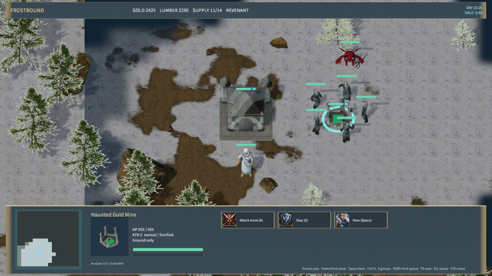
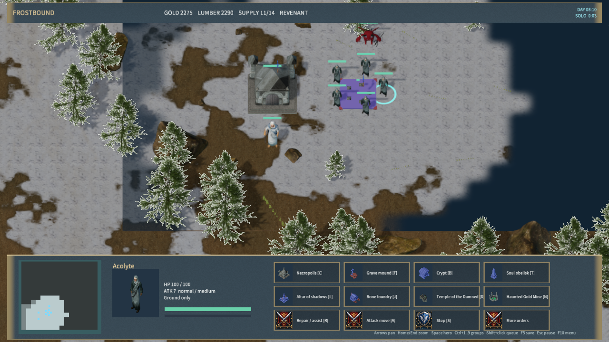

# Revenant mining and lumber

New skirmishes give Revenant players a completed Haunted Gold Mine at their nearest starting deposit, four mining acolytes and a lumber ghoul. An acolyte summons another mine with **N** or the construction button: 225 gold, 210 lumber and 30 seconds. Placement snaps to a visible gold deposit, rejects occupied deposits and requires space for five stations. Expansion mines do not require stronghold territory.

Each mine supports five assigned acolytes. They walk to separate positions and channel the existing two-handed ritual animation. Each stationed acolyte credits 10 gold directly every five seconds; no gold cargo or return journey is created. Unfinished mines produce nothing. Stopping, moving, building, death, depletion or destruction releases the station. Shift-queued orders continue after the next gold payment. Mining acolytes remain visible and vulnerable.

Ghouls right-click trees to harvest and carry up to 20 lumber to a completed friendly stronghold. They can queue movement or combat after delivery. Acolytes cannot harvest lumber in new skirmishes. The AI maintains its mine and assigns up to two idle ghouls to lumber. Other game modes retain their existing economy.

The mine panel shows assigned acolytes and remaining gold. **H** retains its hold-position command. The worker's **More orders** button exposes hold and patrol when construction commands fill the panel. The editor accepts a Haunted Mine only on a deposit assigned to a Revenant map player. A multiplayer faction override to another race leaves that preplaced deposit unclaimed.

## Assets

The mine uses 22 stone modules and authored components assembled from rubberduck's [Castle / Dungeon Tileset Extended](https://opengameart.org/content/3d-castle-dungeon-tileset-extended), under CC0. It has 2,304 triangles and four 2048-square texture atlases: color, normal, roughness/metallic and localized green emission. It shares the fortress's pinned source archive. `haunted-mine-sources.json` records source and generated SHA-256 hashes; both authoring and runtime license folders contain the attribution.

Rebuild with Blender 4.5.9:

```powershell
blender --background --disable-autoexec --python-exit-code 1 --python scripts/import-frost-revenant-fortress.py -- --mine-only
node scripts/render-frost-faction-icons.mjs
node scripts/build-frostbound.mjs
```

All eight generated model, texture, material and license hashes reproduced on a second import. The native building portrait atlas contains 34 entries.

## Saves, networking and validation

New saves carry `economyVersion: 1`. Saves without that field retain the original worker economy as version 0, including acolyte lumber and ordinary gold delivery. This preserves their existing resources, units and orders; start a new match to use Haunted Mines. Invalid old missing-resource orders become idle. New saved mining slots must be integers from zero through four and unique among living miners at a deposit.

TCP protocol 18 runs the rules on the server. Visible enemy miners expose only their work animation target position; their actual orders, queues and treasury remain private. Reconnection preserves the owner's assigned mining slot and income.

Validation includes `test-frost-undead-economy.mjs`, `test-frost-undead-network.mjs`, the full Frostbound rules/TCP suite and `test-frost-revenant-fortress.py --mine-only`. Tests cover construction/cancel/refund, five-slot limits, depletion, destruction, ghoul delivery and queues, old/new saves, multiple nearby starting deposits, editor validation, faction overrides and private network state.

`qa-frostbound.mjs --undead-economy-only` uses native Release rendering, QuickJS and Agent input. It verifies placement, summoning, a construction save, the mine portrait, five simultaneous ritual poses, direct gold, ghoul lumber, occupied save/load, stopping a miner and the expanded command panel. See `native-undead-economy-qa.json` and `haunted-mine-import-qa.json`.




This remains a prototype: the mine is an original modular stone layout, and the ghoul still uses the stylized Demon model. Exact Warcraft artwork, physical mouse/audio and cross-machine LAN acceptance are not established by these checks. Free3D contributed no downloaded asset to this stage.

The packaged Release contains 644 files with content hash `030cefefda757d20ebb97a85586d674eb52128e0d88b556547dca2fa9e20bcd5`. Package hash verification and a 30-second Player startup/responsiveness check passed with zero logged errors. All three native `mengine-editor-host` Frostbound tests passed.
