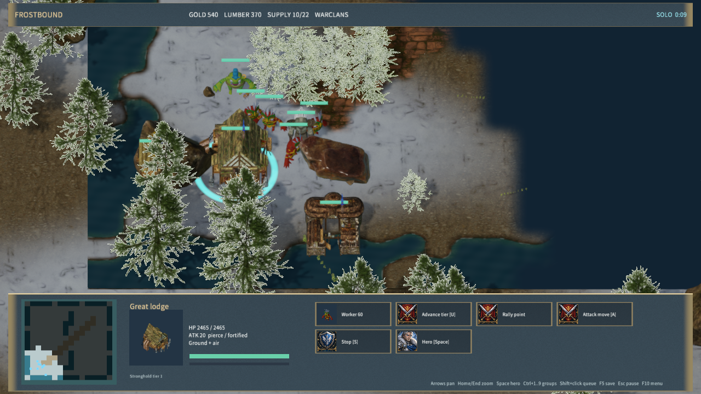
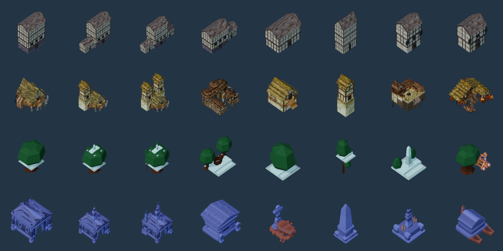

# 写实部落建筑

Warclans 六类建筑与三级主城外观采用 0 A.D. 的高卢、不列颠木构和茅草建筑。主城保留入口、侧棚和木梁；兵营包含围栏、武器架与陈设；祭坛采用围墙环绕的祭祀建筑；工坊采用军事作坊。两级主城升级分别加入一座、两座哨塔。建筑占地仍由现有游戏半径约束，界面名称、建造预览和模型图标统一引用实际资源。





## 来源与适配

原作者 [Wildfire Games](https://www.wildfiregames.com/)，[0 A.D. 上游](https://github.com/0ad/0ad)，固定版本 `61a3b9507d974084e6badb88a0826bd89a6d5b8b`。原始美术及本次派生资源遵循 [CC-BY-SA 3.0](https://creativecommons.org/licenses/by-sa/3.0/)。82 个源文件共 22,020,172 字节，模型、材质、纹理、Actor 定义及许可保存在 `SourceAssets/0ad`，URL、SHA-256 和组合方案见 [来源清单](../../../samples/frostbound-realms/warclans-sources.json)。该目录禁止 Git 换行转换，以保持下载原件字节不变。原始 source license 包含 CGTextures 派生纹理的上游授权说明。

[署名和派生资源许可](../../../samples/frostbound-realms/Assets/Licenses/0ad-warclans.txt) 随 Player 的 `Assets/Licenses` 分发，覆盖新模型、纹理、材质与包含这些模型的建筑图标图集。本阶段没有从 Free3D 下载文件。

导入使用原作者网格和 UV：合并静态主体及根节点附属物，归一化到建筑占地，三角化后烘焙到 1024×1024 图集。原始 Alpha 是阵营着色遮罩，按棕色布料处理；原作者第二套 UV 的环境遮蔽独立写入 ARM 红通道，法线按新 UV 烘焙，原始高光强度近似转换为粗糙度。颜色不含预烘焙直射光。单位归属仍由游戏旗帜、血条和选中圈显示。源素材的地面贴花、粒子及驻军旗帜不参与建筑静态网格。

| 外观 | 三角形 |
| --- | ---: |
| Great lodge | 4,620 |
| War hall | 5,076 |
| Iron stronghold | 5,532 |
| War barracks | 3,734 |
| Clan dwelling | 1,872 |
| Watch post | 456 |
| Spirit sanctuary | 5,627 |
| Siege workshop | 12,679 |

## 验证与重建

`scripts/test-frost-warclans-import.py` 检查单网格、三角形索引、尺寸、地面锚点、法线、UV 和材质图集通道；`scripts/test-frostbound.mjs` 验证建筑占地、升级、存档、建造规则与 TCP，并核对源文件和派生资源哈希。四阵营原生 QA 检查实际网格和材质、工人选择、建造预览、模型图标及名称。二次重建的 40 个派生文件及模型统计逐字节一致。

```powershell
& $env:BLENDER --background --factory-startup --python-exit-code 1 --python scripts/import-frost-warclans.py
node scripts/build-frostbound.mjs
node scripts/render-frost-faction-icons.mjs
python scripts/test-frost-warclans-import.py
node scripts/test-frostbound.mjs
node scripts/qa-frostbound.mjs --factions-only
```

使用 Blender 4.5.9；Python 检查需要 numpy、Pillow。完整资产导入入口 `scripts/import-frost-assets.py` 已包含此阶段。原生截图使用 Release 编辑器和 Agent 输入。最新渲染、性能、包文件与启动记录见 [阶段验收](warclans-art-qa.json)。

标准视角 1280×720 预热 5 秒，三个 5 秒采样窗口为 11.50、13.46、11.67 FPS，中位数 11.67；平均原生渲染约 11.11–11.60 ms。前阶段标准视角中位数 12.64 FPS，本次更低；窗口波动明显，未隔离机器负载，不能归因于单一建筑或材质。最近视角单窗口 12.52 FPS、平均原生渲染 12.49 ms。材质管线拒绝数为 0，MSAA 为 4。5 ms 目标尚未达到。

其余两族建筑和部分角色仍是简化美术，完整战役、完整兵种及游戏复刻尚未完成。物理输入、音频听感和跨机器联机未在本阶段验收，性能目标仍待完成。
