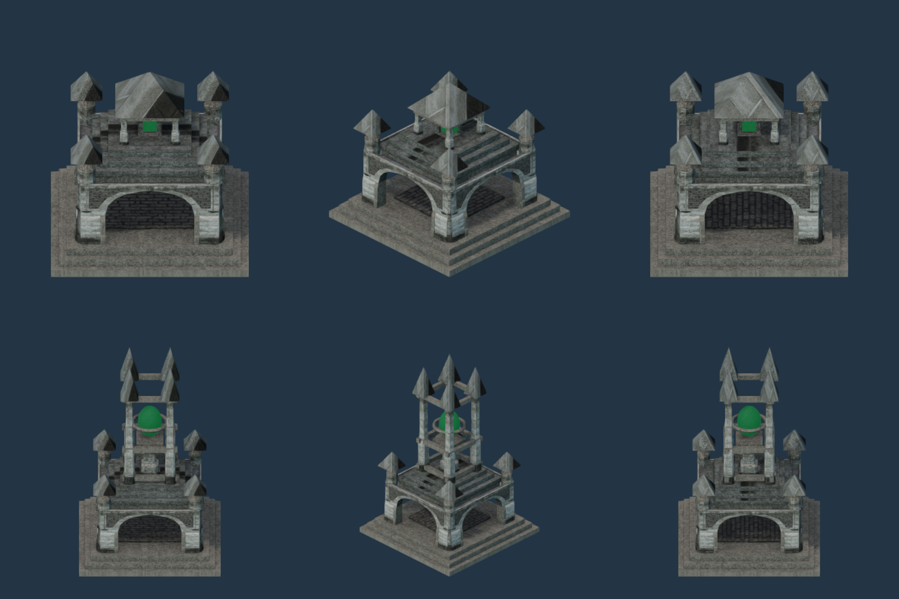
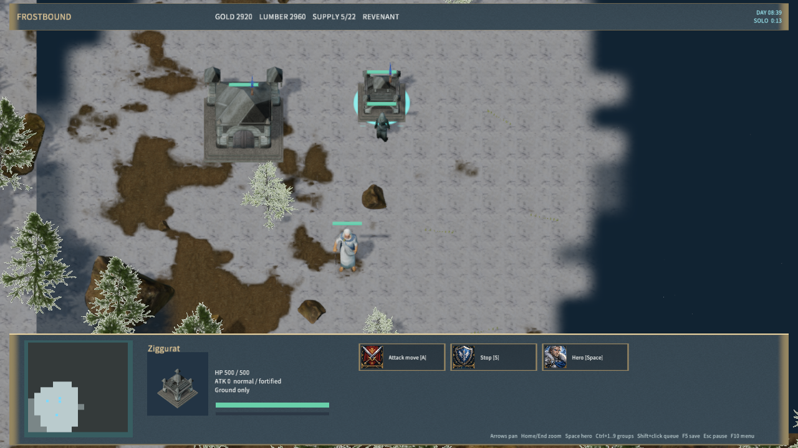
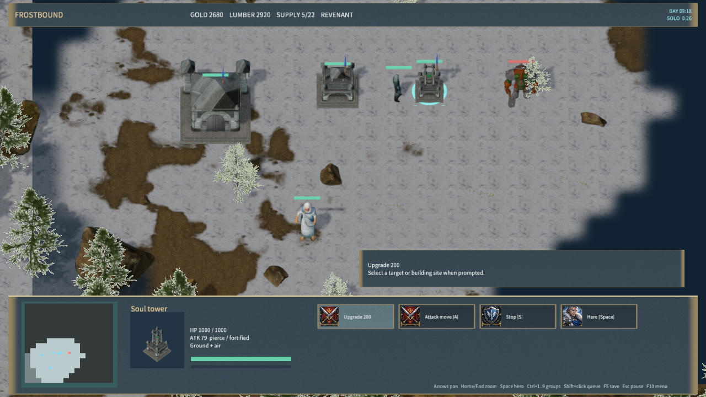
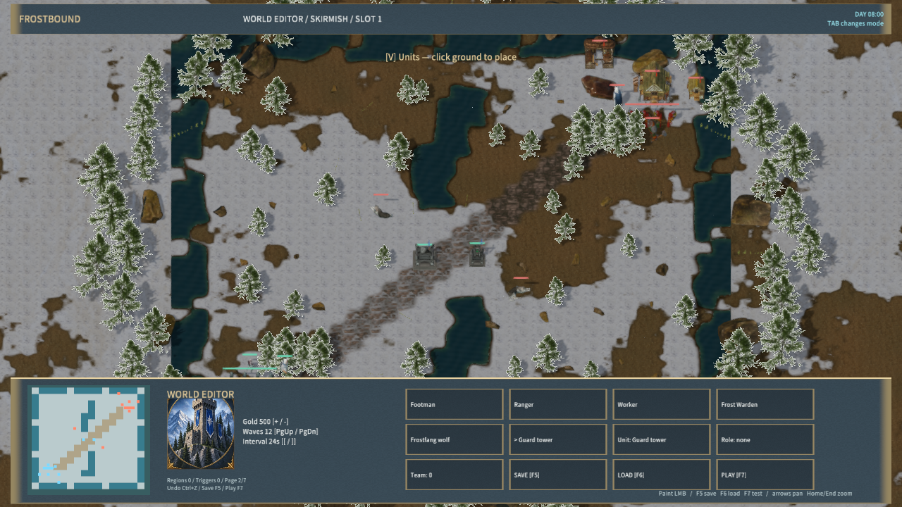

# Revenant Ziggurat and Soul tower

The Revenant supply and defense buildings use `RealRevenantLodge` and `RealRevenantTower`. Both have a stepped masonry foundation, four arched facades, carved buttresses and dark stone roof terraces. The supply building has a framed lantern under a small canopy. The defense building adds an upper cage and ring around its soul core. Game labels are Ziggurat and Soul tower; construction previews, portraits and editor placement use the same models.

## Source and geometry

The stone modules and textures are from rubberduck's CC0 [Castle / Dungeon Tileset Extended](https://opengameart.org/content/3d-castle-dungeon-tileset-extended), shared with the existing Revenant main buildings and Crypt. MiYu authored the arrangement, terraces, lantern, cage and core. `ziggurat-sources.json` pins the source archive, source page and 14 generated files. Credits are in both `Licenses/Revenant-Ziggurat.txt` and the packaged `Assets/Licenses` copy.

The supply model has 3,870 triangles and the defense model has 5,062. Each uses one mesh/material and four 2048-square base, normal, ARM and emissive atlases. Footprint fitting uses the existing gameplay radius. The geometry is an original adaptation; the buildings are not scans or Blizzard models. No Free3D asset is included.

## Rebuild and acceptance

Use Blender 4.5.9 with `--background --disable-autoexec --python-exit-code 1 --python scripts/import-frost-revenant-fortress.py -- --ziggurat-only`. The full asset importer invokes this step. A repeated import reproduced all 14 generated hashes. Geometry, native bounds, normals, UVs, atlas content and localized emission are checked by `scripts/test-frost-revenant-fortress.py --ziggurat-only`. Visual selection tests cover live, restored and public states and the 34-building atlas.

Native views use `scripts/render-frost-unit-icons.mjs --ziggurat-sheet`; portraits use `scripts/render-frost-faction-icons.mjs`. The dedicated `scripts/qa-frostbound.mjs --ziggurat-art-only` scenario checks both construction previews, mid-construction saves, completed materials/portraits, supply completion, tower projectiles, upgrade persistence and map-editor save/playtest. Results are recorded in `native-ziggurat-art-qa.json` and `ziggurat-validation.json`.

The native scenario passed with zero material-pipeline rejections. The full Node rule/TCP suite passed and all three native-host Frostbound tests passed. Release packaging validated 674 files with content hash `3152fb2f3c2a85800f8403d0ab29642eccd3524057a0a2285102012149b98f29`; the packaged Player remained responsive for 30 seconds with zero error logs. The adapter retains its existing downlevel-capability warning. All 14 derived files also matched their hashes in the Git index and after checkout filtering. Packaged license files now preserve their exact bytes across platforms.

This stage changes art and labels. Supply still adds 8 only after construction, and towers retain the existing three-level gold upgrades and projectile rules. Warcraft III's Ziggurat-to-Spirit/Nerubian transformation branches and their precise costs, prerequisites and supply rules remain to be implemented. Full game fidelity and consistent realistic art across all factions remain unfinished. Native Agent input does not establish physical mouse, audio-listening or cross-machine LAN acceptance.
