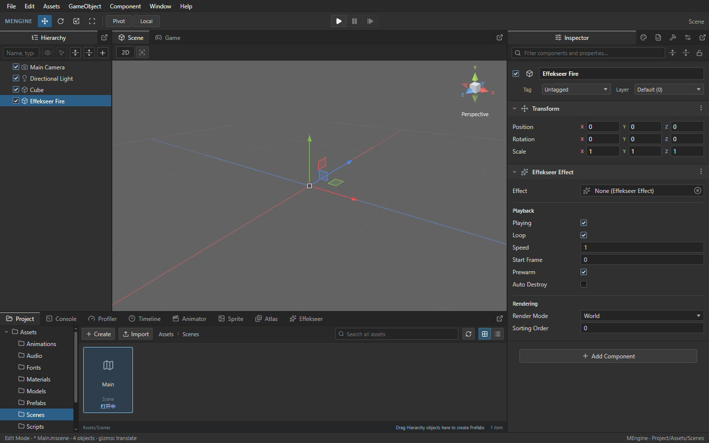
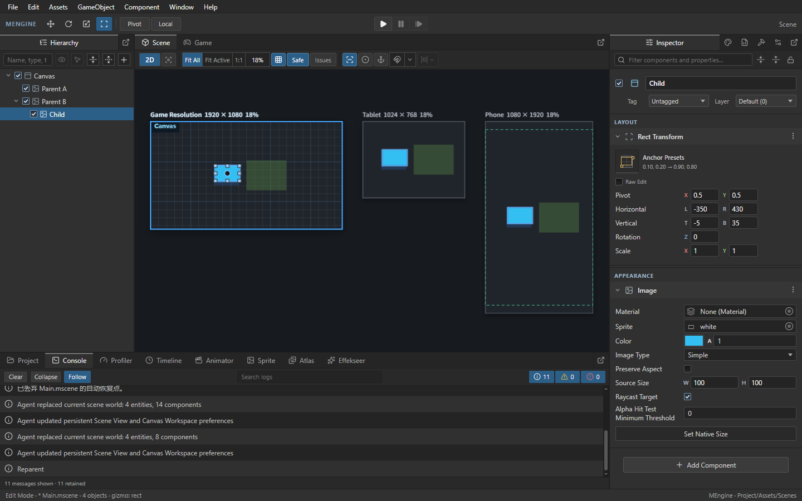
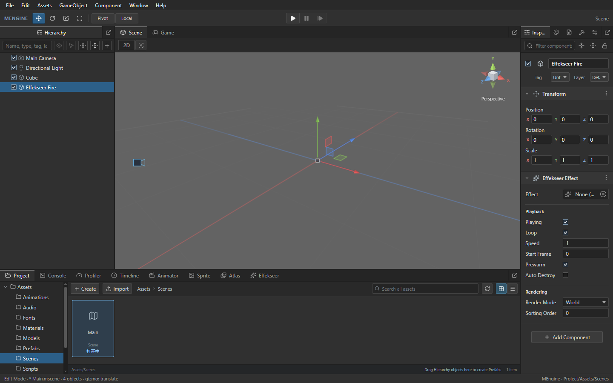

# MEngine Editor UI

编辑器采用 Unity 的暗色工作区结构：菜单与工具栏位于顶部，Hierarchy 位于左侧，Scene/Game 位于中间，Inspector 占据右侧全高，Project/Console 位于底部。停靠、分隔条、标签页和属性编辑使用同一套控件规则。

## 共用控件

- 字体：Segoe UI / 微软雅黑，正文 12px；辅助说明 11px；数值使用等宽数字。
- 面板 `#303030`，次级工具栏 `#292929`，输入框 `#242424`，文字 `#cfcfcf`，选择色 `#2c5f88`。
- 标签页高 28px、组件标题高 30px、字段高 22px。使用纯色面板和细分隔线表达层次。
- 图标使用现有 Lucide 矢量图标，组件标题与资源引用按组件类别选择图标。
- 分隔条保持 2px 视觉宽度、6px 鼠标命中宽度。聚焦后用方向键调整 8px，Shift + 方向键调整 32px。
- 连续拖动以当前布局状态累计位移；每个分隔比例限制在 15% 至 85%。

## Inspector

对象名称、启用状态、Tag 和 Layer 放在对象标题区。Name 数据由对象名称输入框编辑。组件按标题、字段、上下文操作组织。

Transform、内置组件与扩展字段共享标签列宽。XYZ 采用彩色字母，输入框保持中性背景。Inspector 小于 280px 时，三维向量标签独占一行，数值仍可编辑。保留标签拖拽、混合值、搜索、折叠、锁定和 Undo/Redo。

Effekseer 按资源、Playback、Rendering 分组；Screen Position 和 Screen Scale 仅在 Screen 模式显示。资源槽显示实际的内置 Cube / Default 引用。空引用显示 None。

## Scene 手柄

移动手柄采用细轴线、双面箭头和半透明平面；缩放手柄使用方形端点；旋转手柄区分前后半环。视觉尺寸与鼠标命中容差分别维护。

方向导航器使用与场景相机一致的投影基底，绘制六向锥体和中心立方体；透明命中区覆盖轴标签。中心方块始终可点击以返回 Perspective。相机与灯光常驻紧凑图标；选中后显示视锥或光照方向。碰撞体保持细线框。

## Agent API

- 材质参数通过 `Surface Shader <parameter label>` scope 区分，避免多个 Value 字段同名。
- 分隔条暴露 separator 角色、方向、比例和拖动能力，支持键盘与拖动操作。
- `project.open` / `project.create` 遇到启动对话框时返回 `NOT_READY`，错误数据含 `reason: dialog`、`activeDialog`、`windowLabel` 和 `nextQuery`。调用方选择对话框操作后查询 `project.state`，无需重复打开项目。

## 原生验收截图

截图由 Windows Tauri / WebView2 后台窗口生成，不是设计稿。Effekseer 截图使用空资源引用，验证属性布局与操作，不代表特效渲染验收。

