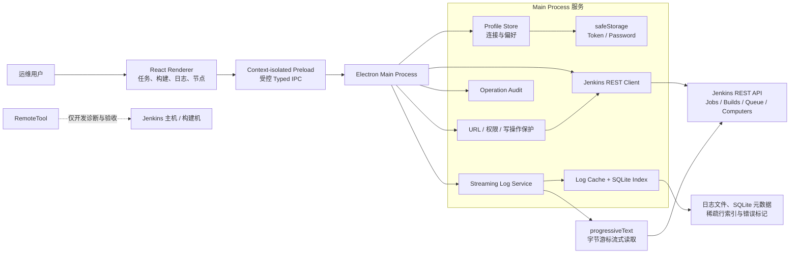
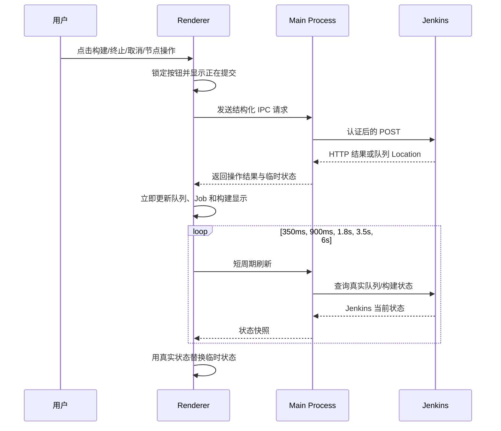
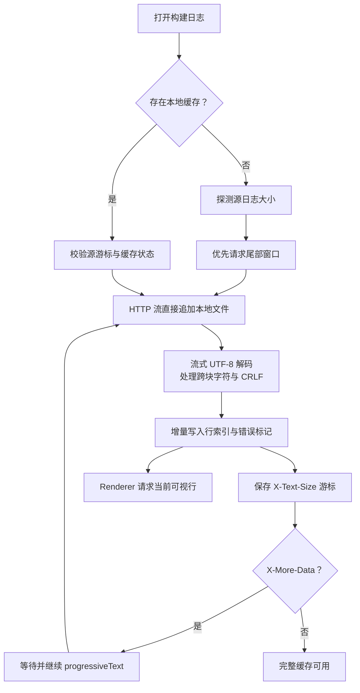
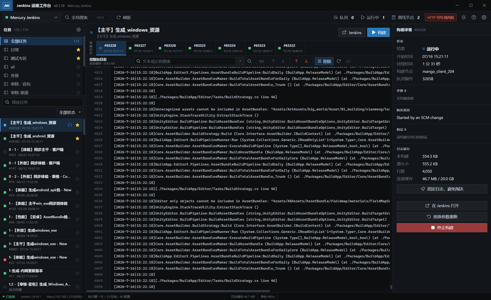
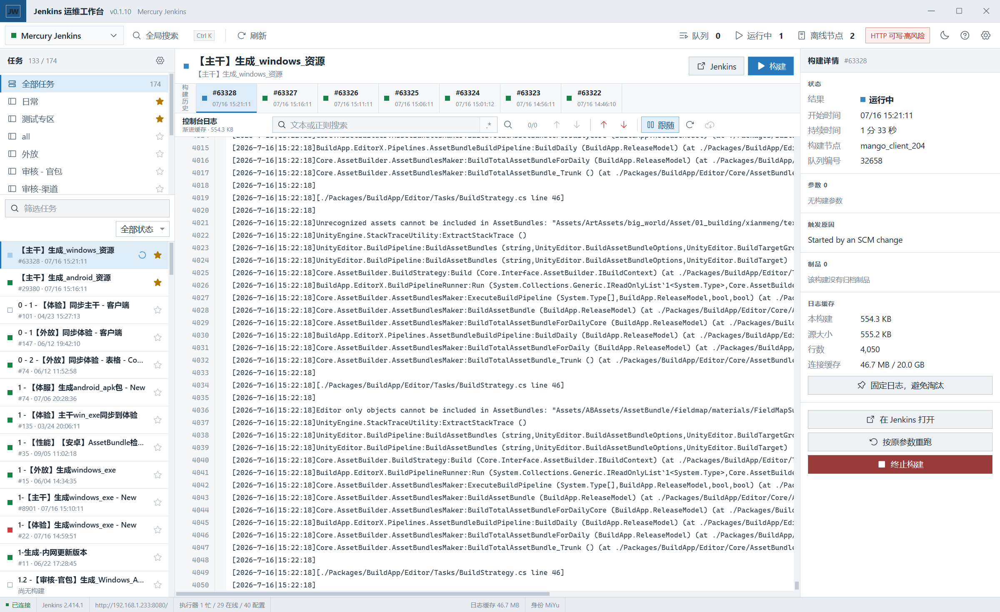
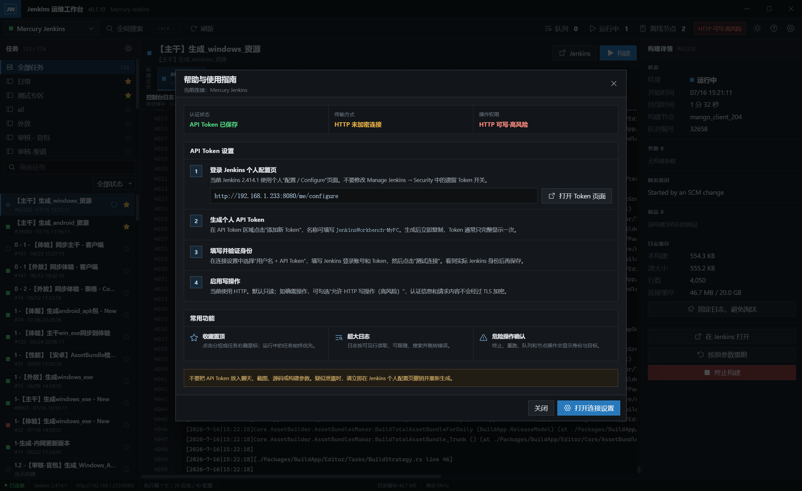
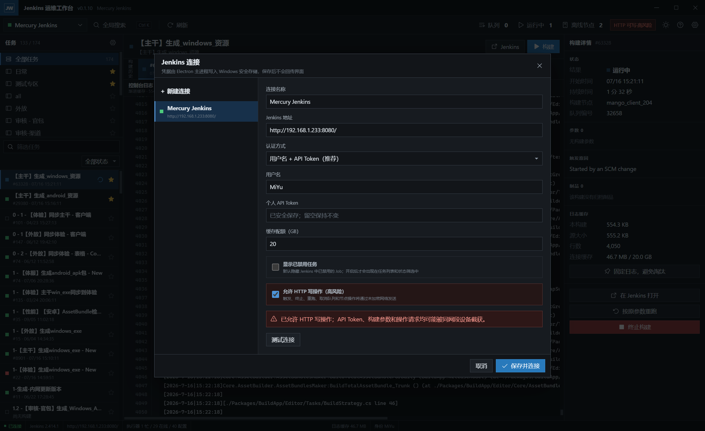

# Jenkins 运维工作台整体技术方案与界面设计

> 文档基线：Jenkins Operations Workbench `v0.1.10`
>
> 编写日期：2026-07-16
>
> 作者：MiYu
>
> 适用环境：Windows x64、Jenkins `2.414.1`、Freestyle Job

## 1. 文档目的

Jenkins 运维工作台（Jenkins Operations Workbench）是一个独立的 Windows 桌面应用，用于替代 Jenkins 网页版中高频但体验较差的任务浏览、构建操作、队列管理、节点观察和超大日志阅读流程。

当前 Jenkins 网页在打开超大控制台日志时，会一次性创建大量文本节点并占用浏览器主线程，容易造成首屏等待时间过长、搜索迟缓甚至页面无响应。本工具把 Jenkins 访问、凭据、日志下载和索引放在 Electron Main Process 中执行，Renderer 只请求当前可视范围内的日志行，从体系结构上避免把完整日志放进浏览器 DOM 或通过 IPC 一次性传输。

本文档以已经实现并打包的 `v0.1.10` 为准，不是概念稿。文中的界面截图来自当前版本连接真实 Jenkins 后的运行画面；环境验收使用只读接口，没有触发、终止或重跑真实构建。

## 2. 交付物与版本基线

| 项目 | 当前基线 |
| --- | --- |
| 产品名称 | Jenkins Operations Workbench / Jenkins 运维工作台 |
| 应用版本 | `0.1.10` |
| 前端技术栈 | React `19.2.0`、Vite `6.4.2` |
| 桌面运行时 | Electron `41.2.0` |
| 开发环境 Node.js | `22.19.x` |
| Jenkins | `2.414.1` |
| 当前任务类型 | 174 个 Freestyle Job |
| 源码仓库 | `svn://svn3.taole.com/mercury_resource/core/Tools/Tools_Python/JenkinsWorkbench` |
| 固定发布文件 | `F:\work\mercury\mercury_common\tools\common_tools\Jenkins-Operations-Workbench.exe` |
| 发布文件 SVN 版本 | `r66180` |
| 源码 SVN 版本 | `r214203` |
| 发布文件 SHA-256 | `F3832521C0DB655AB4FAB204F110DF1E8A345C4E7A3BD2D2C3608FC18A77FA18` |

### 2.1 当前真实环境验证结果

2026-07-16 运行 `npm run validate:live` 得到以下只读结果：

| 验证项 | 结果 |
| --- | ---: |
| Jenkins 版本 | 2.414.1 |
| Job 总数 | 174 |
| View 总数 | 12 |
| 节点总数 | 9 |
| 离线节点 | 2 |
| Executor 总数 | 40 |
| 当前队列 | 0 |
| 默认 View | 日常（源数据 25 个 Job） |
| 抽样历史日志 | 388,042 bytes |
| 抽样尾部流式读取 | 65,269 bytes |

截图中的任务栏显示 133/174，是因为默认隐藏了已禁用 Job；该行为可在连接设置中按 Jenkins 实例开启。

## 3. 产品范围

### 3.1 当前版本包含

- 多 Jenkins 连接配置和身份验证。
- View 分组、任务搜索、状态过滤、收藏分组、收藏 Job。
- 收藏内容置顶，正在运行的 Job 优先置顶。
- 默认隐藏已禁用 Job，可在设置中显示。
- 构建历史、构建详情、触发原因、参数、节点、耗时和制品。
- 无参数构建、标准参数化构建、按原参数重跑。
- 构建队列跟踪、取消排队、终止运行中构建。
- 节点临时离线与上线。
- 超大日志分块下载、本地缓存、虚拟滚动、实时跟随和搜索。
- 深色/亮色主题。
- Token 配置、HTTP 风险和操作权限帮助界面。
- Windows x64 Portable EXE 构建和固定文件名发布。

### 3.2 当前版本不包含

- Jenkins 插件、用户、全局安全策略和系统配置管理。
- Pipeline Stage Graph、Blue Ocean 或 `wfapi` 阶段视图。
- 基于 Rebuild 插件私有接口的重建。
- 把 RemoteTool 作为日常 Jenkins 数据通道。
- 自动绕过 Jenkins 权限或 TLS 安全策略。

目前所有 Job 均为 Freestyle，因此首版没有引入 Pipeline 专用依赖。未来发现 Pipeline 后，可在保持现有任务与日志模块不变的前提下增加 `wfapi` 适配器。

## 4. 总体架构



### 4.1 进程边界

应用创建无系统边框的 `BrowserWindow`，默认尺寸为 1600 × 980。安全选项固定为：

- `contextIsolation: true`
- `nodeIntegration: false`
- `sandbox: true`
- Renderer 页面来源受开发地址或已打包资源约束

Renderer 没有 Node.js、文件系统和网络凭据访问能力。所有 Jenkins 请求均由 Main Process 发出，Preload 只暴露显式定义的业务方法。这样可以把 Jenkins 日志视为不可信输入，即使日志中包含 HTML、ANSI 控制码或构造内容，也不能直接取得本机能力。

### 4.2 组件职责

| 层/模块 | 主要职责 |
| --- | --- |
| `src/App.jsx` | 三栏工作区、连接/帮助弹窗、任务与构建交互、主题切换 |
| `src/job-filter.js` | View 与搜索条件联合过滤、禁用任务策略 |
| `src/favorites.js` | View/Job 收藏、稳定排序、运行中优先级 |
| `src/status-model.js` | Jenkins 状态到统一 UI 状态的映射 |
| `src/operation-feedback.js` | 写操作后的临时状态、队列与运行状态即时反馈 |
| `electron/preload.cjs` | 白名单 IPC API，隔离 Renderer 与 Main Process |
| `electron/main.js` | 窗口生命周期、IPC 参数校验、服务编排 |
| `electron/jenkins-client.js` | REST 请求、身份、crumb、构建/队列/节点操作 |
| `electron/profile-store.js` | 多连接配置、用户偏好、凭据引用 |
| `electron/security.js` | URL/Origin 校验、敏感字段清理、写操作策略 |
| `electron/log-service.js` | progressiveText 下载、刷新、检索和可视行读取 |
| `electron/log-cache.js` | 本地日志文件、SQLite 元数据、行索引、LRU 淘汰 |
| `electron/audit-log.js` | 操作结果与身份审计，敏感数据脱敏 |

## 5. Jenkins 接入设计

### 5.1 连接模型

每个 Jenkins Profile 保存以下非敏感配置：

```text
id, name, baseUrl, username, authMode, credentialRef,
allowInsecureWrites, cacheQuotaGb, showDisabledJobs,
favoriteViews, favoriteJobs, helpDismissed
```

Token 或密码不保存在 Profile 中。Profile 只保存不可读的 `credentialRef`；实际凭据由 Electron `safeStorage` 加密后写入独立凭据文件。Renderer 只会得到“已保存/未保存”状态，不能读取明文 Token。

支持两种认证方式：

1. 用户名 + API Token，推荐使用。
2. 用户名 + 密码，供现有 Jenkins 登录策略兼容使用。

请求优先使用 Basic Auth。若 Jenkins 对 POST 仍要求 CSRF crumb，则通过 `/crumbIssuer/api/json` 获取，并只在当前 Main Process 会话内缓存 crumb，不写入磁盘。

### 5.2 数据读取

Jenkins JSON API 支持 `tree` 投影。客户端对任务、构建、队列和节点分别声明所需字段，避免下载 Jenkins 默认返回的大型递归 JSON。

主要只读接口如下：

| 场景 | 接口/策略 |
| --- | --- |
| 连接测试 | 根 `/api/json` + `/me/api/json`，验证版本、身份和认证状态 |
| Dashboard | 根任务/View、`/queue/api/json`、`/computer/api/json` 并行请求 |
| Job 详情 | 编码后的 `/job/{name}/api/json`，最多加载最近 100 个构建 |
| Build 详情 | `/job/{name}/{number}/api/json`，读取状态、参数、原因和制品 |
| 日志 | `/consoleText` 的 HEAD/范围探测与 `/logText/progressiveText` |
| 权限探测 | 结合 `whoAmI`、接口响应码和实际能力生成 UI 可用状态 |

所有 Job、View、节点和制品路径段统一编码，支持中文、空格和特殊字符。Renderer 不得提交任意 Jenkins URL；Main Process 根据结构化参数生成 URL，并验证最终地址仍属于当前 Profile 的 Origin。

### 5.3 写操作

| 操作 | Jenkins 请求 | 后续跟踪 |
| --- | --- | --- |
| 无参数构建 | `POST /job/{name}/build` | 读取 `Location` 中的队列项 |
| 参数化构建 | `POST /job/{name}/buildWithParameters` | 发送标准参数后跟踪队列 |
| 按原参数重跑 | 读取原构建 ParametersAction 后重新调用构建接口 | 不依赖 Rebuild 插件 |
| 取消排队 | `POST /queue/cancelItem?id={id}` | 刷新队列和 Job 状态 |
| 终止构建 | `POST /job/{name}/{number}/stop` | 轮询直至 Jenkins 确认停止 |
| 节点上下线 | `POST /computer/{node}/toggleOffline` | 刷新节点状态 |

触发构建后，客户端从响应 `Location` 取得队列地址，每 1 秒查询一次，最长跟踪 120 秒。队列项出现 `executable.number` 后，UI 自动切换到真实构建号；如被取消、拒绝或超时，则撤销临时状态并显示 Jenkins 返回的原因。

参数编辑器原生支持字符串、长文本、布尔、选择和密码参数。遇到插件自定义参数类型时，不猜测其数据结构，而是引导用户“在 Jenkins 中打开”。

## 6. 操作即时反馈与状态一致性

网络请求完成到 Jenkins Dashboard 刷新之间可能存在几秒延迟。若只依赖 10 秒 Dashboard 轮询，用户点击“构建”后会感觉按钮没有生效。当前版本采用“即时临时状态 + 高频短刷新 + 服务端校准”的模型。



具体规则：

- 构建成功提交后立即把 Job 标为“排队中”，并立即增加本地队列提示。
- 队列分配构建号后，立即创建/选中新构建并标为运行中。
- 终止、取消、节点上下线操作在响应成功后立即显示目标状态。
- 短刷新时间点为 350、900、1800、3500、6000 ms；正常 Dashboard 继续每 10 秒刷新。
- 当前选中的运行中构建每 1.5 秒刷新详情与日志。
- 临时状态最终以 Jenkins 响应为准，最长保留 120 秒；失败、超时或服务端状态冲突时自动回滚并提示。

同一套标准状态模型同时驱动左侧 Job 列表和上方构建历史，避免“左边仍在运行、右边已经完成”之类的显示分叉。

## 7. 超大日志引擎

### 7.1 设计目标

- 1 GB 级日志不整体进入 Main Process 或 Renderer 内存。
- DOM 同时保留的日志行不超过约 500 行。
- 历史日志优先显示尾部，运行中日志持续追加。
- 下载中断后按 Jenkins 字节游标继续，而不是重新下载全部内容。
- 文本/正则搜索可以取消，并逐步返回命中结果。
- 缓存退出后可恢复，异常关闭不破坏已完成索引。

### 7.2 progressiveText 流程

Jenkins `/logText/progressiveText?start={offset}` 中的 `start` 是原始日志字节偏移，而不是字符数或行号。实现必须把响应头 `X-Text-Size` 作为下一次游标，并依据 `X-More-Data` 判断是否继续轮询。



HTTP 响应体直接流入本地文件，禁止调用 `response.text()` 汇总整份日志，也禁止通过单次 IPC 传输完整内容。流式 `TextDecoder` 负责 UTF-8 字符跨分块；解析器同时处理 CRLF、ANSI 控制序列和 Jenkins ConsoleNote，不把它们转换为未经净化的 HTML。

如果 Jenkins 日志被截断或重置，服务会检测源大小/游标回退，废弃不一致的尾部索引并从安全位置重新建立缓存。

### 7.3 本地索引与虚拟显示

缓存由原始日志文件和 SQLite 元数据组成：

- `log_entries`：构建、源游标、文件大小、行数、访问时间、固定状态。
- `line_index`：每 128 行记录一次文件字节偏移，支持快速定位任意行区间。
- `log_markers`：错误、警告和搜索标记的位置。
- `(profile, pinned, last_accessed)` 索引：支持按 Profile 的 LRU 淘汰。

Renderer 通常一次读取 260 行，Main Process 硬限制单次最多返回 500 行。滚动时只更换可视窗口，完整日志从不映射成等量 DOM 节点。

搜索在后台按文件块进行，支持普通文本和正则表达式。每批命中增量返回，用户修改查询、切换构建或点击取消时会终止旧搜索。错误索引支持“首个/上一个/下一个错误”跳转，并在概览尺中显示位置。

### 7.4 配额与淘汰

每个 Profile 默认日志配额为 20 GB。超过配额时按最近最少使用顺序删除未固定构建；用户固定的日志不参与自动淘汰。清理仅影响本地副本，不影响 Jenkins 源日志。

默认数据目录：

```text
%APPDATA%\jenkins-operations-workbench\
├─ settings.json
├─ credentials.json
├─ cache\
│  ├─ index.sqlite
│  └─ logs\<cache-key>.log
└─ diagnostics\
   └─ operations.jsonl
```

## 8. 安全设计

### 8.1 凭据保护

- API Token/密码通过 Electron `safeStorage` 使用当前 Windows 用户安全上下文加密。
- 加密结果以 Base64 形式保存到 `credentials.json`，配置文件只保存引用。
- Renderer 不提供读取凭据的 IPC，设置界面只显示“已安全保存”。
- 修改连接时，凭据输入留空表示保持原值，不会把占位符当作新 Token。
- 审计与错误日志对匹配 `token`、`password`、`credential`、`authorization`、`cookie`、`crumb` 的字段自动脱敏。

### 8.2 HTTP 写操作策略

当前 Jenkins 地址为局域网明文 HTTP。默认策略是：

- HTTP 连接允许读取。
- HTTP 连接禁止触发、终止、取消、重跑和节点切换。
- 用户必须在连接设置中明确开启“允许 HTTP 写操作”才能解锁。
- 每个危险操作仍显示目标、当前身份和二次确认。

该开关只解除客户端保护，不会让 HTTP 变安全。明文网络仍可能泄露 Basic Auth、API Token、crumb 和操作内容。生产推荐在 Jenkins 前部署 HTTPS 反向代理，然后关闭该开关。

### 8.3 输入与 IPC 边界

- 所有 Jenkins URL 由 Main Process 生成并执行 Origin 校验。
- Job/View/节点/制品路径独立编码，拒绝路径穿越。
- IPC 只接受结构化参数并限制字符串、数组、日志行数和搜索负载大小。
- 下载制品前验证最终路径和文件名。
- 日志只作为文本和受控 ANSI 样式渲染，不使用未净化的 `innerHTML`。
- Main Process 记录操作类型、目标、身份、结果和时间，不记录凭据或密码参数。

## 9. 界面与交互设计

### 9.1 布局规范

应用采用高密度三栏桌面工作区：

- 标题栏约 36 px：产品名、连接名和窗口控制。
- 命令栏约 42 px：连接切换、全局搜索、刷新、队列、运行中、离线节点和设置。
- 左栏 280 px：View、收藏、任务搜索/过滤、高密度 Job 列表。
- 中央自适应：构建历史、日志工具栏、虚拟化日志视图。
- 右栏 320 px：构建信息、参数、触发原因、制品、缓存状态和操作按钮。
- 底部状态栏约 24 px：连接、Jenkins 版本、URL、执行器、身份、缓存和应用版本。

视觉遵循 UIDesignWorkbench 的专业工具风格：零圆角、方形控件、1 px 分隔线、紧凑字号、无渐变和无装饰性大留白。颜色只表达选中、成功、失败、运行、警告等语义，并同时提供图标或文字，不单独依赖颜色。

### 9.2 深色主工作区



深色主题是默认主题。左侧 View 与 Job 共同决定筛选结果；收藏的 View 位于分组顶部，收藏 Job 置顶，运行中的 Job 在收藏规则内优先显示。中央日志是视觉主体，右侧保留构建操作和上下文，避免频繁跳转页面。

截图显示的是连接真实 Jenkins 后的运行中构建。左侧 133/174 表示默认隐藏禁用任务，不是数据加载不完整。

### 9.3 亮色主工作区



亮色主题与深色主题共享尺寸、状态色和交互模型，只替换语义色变量。主题是全局用户偏好，切换后写入本地设置并在下次启动恢复。

### 9.4 Token 与安全帮助



帮助界面说明 API Token 的生成入口、404 的兼容处理、用户名与 Token 的填写方式、HTTP 写操作风险和常见错误。它用于降低首次配置成本，也作为运维人员确认安全策略的固定入口。

### 9.5 连接设置



连接设置集中管理 URL、用户名、认证方式、凭据、缓存配额、禁用 Job 显示策略和 HTTP 写操作开关。截图中的 Token 仅显示安全保存状态，没有暴露真实值。截图为展示当前局域网配置而开启 HTTP 写操作；这不是推荐的生产安全配置。

## 10. View、收藏与任务排序

任务筛选执行顺序为：

1. 选择的 Jenkins View 限定候选 Job；“全部任务”使用根任务集合。
2. 默认排除 `disabled: true` 的 Job；设置开启后才纳入。
3. 应用任务名称搜索。
4. 应用全部、运行中、失败、成功、禁用等状态过滤。
5. 按“收藏优先、运行中优先、原 Jenkins 顺序/名称”生成稳定排序。

View 收藏和 Job 收藏都按 Profile 独立保存，避免多个 Jenkins 实例之间串用名称。分组切换会立即重算 Job 集合，不保留上一个 View 的列表；如果当前选中 Job 不在新集合中，则选择新集合的首项或进入空状态。

## 11. 状态模型

Jenkins 的 `color`、`building`、`result`、队列和本地操作反馈会归一到以下状态：

| 统一状态 | 来源示例 | UI 表达 |
| --- | --- | --- |
| `queued` | 队列项或刚提交的构建 | 排队图标 + 文本 |
| `running` | `building: true`、`*_anime` | 旋转进度 + 蓝色状态 |
| `success` | `SUCCESS`、`blue` | 绿色方块 + 成功 |
| `failure` | `FAILURE`、`red` | 红色方块 + 失败 |
| `unstable` | `UNSTABLE`、`yellow` | 黄色警告 + 不稳定 |
| `aborted` | `ABORTED`、`aborted` | 中性终止图标 |
| `disabled` | `disabled: true`、`notbuilt` | 空心图标 + 已禁用 |
| `unknown` | 无权限、缺少数据或插件状态 | 灰色图标 + 未知 |

列表和详情共用同一映射函数，并以构建号识别同一次构建，避免仅根据 Job 最后颜色推断运行中构建结果。

## 12. 测试与验收

### 12.1 自动化测试

当前测试套件共 38 项，覆盖：

- Jenkins URL 和 Origin 校验。
- 中文/特殊字符 Job 路径编码。
- View 联合过滤、禁用 Job 开关。
- View/Job 收藏和运行中置顶排序。
- Jenkins 状态归一与两侧状态一致性。
- 构建、排队、分配构建号、终止和失败后的即时反馈。
- 敏感字段脱敏、HTTP 写操作保护。
- 日志游标、UTF-8/CRLF、行索引、搜索和缓存恢复。
- IPC 负载限制和危险参数拒绝。

运行方式：

```powershell
cd F:\work\mercury\core\Tools\Tools_Python\JenkinsWorkbench
npm test
npm run build
npm run smoke
```

当前基线为 `38/38` 通过。

### 12.2 实机只读验证

```powershell
npm run validate:live
```

该命令验证实际 Jenkins 的任务、View、节点、执行器、队列、构建详情和日志尾部读取，不执行 POST 写操作。截图生成也使用只读数据，不触发真实构建。

### 12.3 性能验收基线

以下为发布验收目标，需在对应体量的真实日志上持续回归：

- 1 GB 日志不整体进入内存。
- Renderer DOM 同时渲染不超过约 500 行。
- 局域网内首屏或日志尾部 2 秒内可用。
- 运行中日志追加可见延迟不超过 2 秒。
- 断线后从已确认 `X-Text-Size` 续传。
- 正则搜索可取消，取消后不再向旧视图写入结果。
- 20 GB LRU 淘汰不删除固定日志。
- 异常退出后可恢复缓存元数据与已完成行索引。

## 13. 构建、发布与 SVN 提交流程

### 13.1 本机构建

```powershell
cd F:\work\mercury\core\Tools\Tools_Python\JenkinsWorkbench
npm ci
npm test
npm run dist:win
```

`electron-builder` 生成 Windows x64 Portable EXE，版本化构建产物名称为：

```text
Jenkins-Operations-Workbench-<version>-portable.exe
```

### 13.2 固定名称发布

```powershell
npm run publish:common-tools
```

发布脚本执行以下保护流程：

1. 读取 `package.json` 版本并定位对应 Portable EXE。
2. 验证目标工作副本 URL 必须是 `svn://svn3.taole.com/mercury_common/tools/common_tools`。
3. 如果固定 EXE 正在运行，最多等待 300 秒释放文件锁。
4. 复制为固定名称 `Jenkins-Operations-Workbench.exe`。
5. 比较源/目标 SHA-256，保证复制内容一致。
6. 只提交该 EXE，不把 common_tools 中的其他本地修改带入提交。
7. 使用固定格式提交日志：`Update Jenkins Operations Workbench v<version>`。

固定名称使下游脚本和用户快捷方式无需随版本变化；应用版本显示在帮助/状态区域，版本追溯仍由 `package.json`、SVN 日志和文件哈希保证。

## 14. 故障处理

| 现象 | 排查建议 |
| --- | --- |
| 能读取但不能构建 | 检查是否为 HTTP、是否明确开启 HTTP 写操作、Token 是否具有 Job/Build 权限 |
| `/me/security/` 返回 404 | 从右上角用户菜单进入个人配置，查找 API Token 区域；旧版/定制 Jenkins 路径可能不同 |
| 点击构建后无变化 | 查看即时排队提示、队列项和 `operations.jsonl`；确认 POST 是否成功及 Location 是否返回 |
| 左右状态不同 | 手动刷新，检查构建号；状态会由 1.5 秒详情轮询和短周期 Dashboard 校准 |
| View 切换仍显示全部 | 检查 View API 是否返回 jobs；筛选必须使用 View 集合而不是只记录选中样式 |
| 日志停在旧位置 | 检查 `X-More-Data`、`X-Text-Size` 和网络重连；不能用字符数代替字节游标 |
| Token 已设置但 401/403 | 核对 Jenkins 用户名、Token 是否完整、Token 是否撤销及当前用户权限 |
| 缓存持续增长 | 检查 Profile 配额、固定日志数量和缓存目录可写性 |

## 15. 风险与后续演进

### 15.1 已知风险

- 当前 Jenkins 使用 HTTP，开启写操作后凭据和命令存在明文传输风险。
- Jenkins `2.414.1` 较旧，升级 Jenkins、认证插件或安全策略后需要重做接口兼容验证。
- 当前真实环境只有 Freestyle Job，Pipeline 专用行为尚未经过实机验证。
- Jenkins 插件可能提供自定义参数类型，桌面端只能安全降级到网页操作。
- 日志源可能由 Jenkins 清理或截断，本地缓存需要按源游标重新校准。
- SQLite 接口随 Electron 内置 Node.js 版本变化时，需要在升级 Electron 后执行索引恢复回归。

### 15.2 推荐演进顺序

1. 在 Jenkins 前部署 HTTPS 反向代理，关闭 HTTP 写操作开关。
2. 增加最小权限运维角色，验证触发、取消、终止和节点操作的权限矩阵。
3. 建立 1 GB、超长单行、混合 ANSI/ConsoleNote 日志的性能回归样本。
4. 出现 Pipeline 后增加可选 `wfapi`/Stage 适配层，不改变现有 Freestyle 流程。
5. 增加诊断包导出，默认继续清除 Token、密码参数和请求头。
6. 为应用更新、缓存 Schema 和旧配置迁移建立版本化策略。

## 16. 发布检查清单

- [ ] `package.json` 版本已更新，界面显示一致。
- [ ] `npm test` 全部通过。
- [ ] `npm run build` 与 `npm run smoke` 通过。
- [ ] `npm run validate:live` 只读验证通过。
- [ ] HTTP/HTTPS 写操作策略与帮助说明一致。
- [ ] Token、密码参数、Authorization、Cookie 和 crumb 未出现在日志中。
- [ ] 超大历史日志、运行中日志、断线续传、日志截断已回归。
- [ ] 深色和亮色主题关键页面完成检查。
- [ ] Portable EXE 可在无 Node.js 环境的 Windows x64 机器启动。
- [ ] 固定名称 EXE 哈希与构建产物一致。
- [ ] SVN 提交只包含目标 EXE，日志包含应用版本。

---

本方案的核心原则是：Jenkins 仍是唯一真实状态来源；桌面端负责安全地组织操作、及时反馈结果，并用流式缓存与虚拟化显示解决超大日志问题。任何本地临时状态最终都必须与 Jenkins 服务端状态校准，任何凭据与主机能力都不进入 Renderer。
