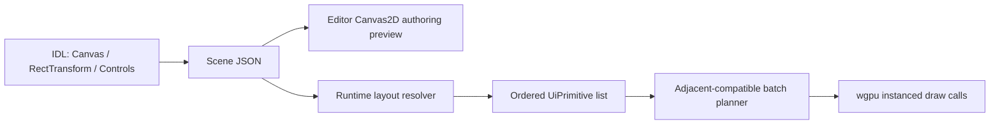

# MEngine 2D Canvas 与 3D 渲染完善方案及实施记录

> 状态：第一阶段已实施
>
> 日期：2026-07-16
>
> 关联方案：[mengine-local-editor-technical-design.md](./mengine-local-editor-technical-design.md)

## 1. 目标与边界

本阶段解决两个直接影响编辑器可用性的问题：

1. Canvas 不再只是浏览器预览数据，运行时必须有真实 wgpu 绘制路径、自动合批和常用交互控件。
2. 3D 不再使用固定视角、硬编码单灯和单颜色；摄像机、灯光、材质必须由场景组件驱动。

第一阶段不把以下能力伪装成已经完成：

- UI Sprite 纹理上传、图集打包和纹理采样尚未接入；当前原生 UI 使用白色图元着色，`sprite` 参与批次键但不采样资源。
- 运行时文本采用内置 5x7 ASCII 位图字形，不是完整 Unicode 字体整形或 SDF 字体系统。
- 3D 暂不包含阴影、IBL、法线贴图、材质纹理、透明物体排序和后处理。
- 本地编辑器的 Scene/Game 仍是 Canvas2D 作者预览；真实 wgpu 路径由 `mengine-runtime` 验证，原生 Surface 嵌入仍属于桌面编辑器后续阶段。

## 2. 2D Canvas 方案

### 2.1 数据与执行链

编辑器与运行时共享同一份组件序列化结构，不建立第二套运行时专用 UI 文件。布局解析遵循 Canvas、CanvasScaler、RectTransform 父子层级；控件绘制和命中区域由同一次布局结果产生，避免“看得到但点不到”。

### 2.2 自动合批规则

批次键由以下字段组成：

- material
- texture/sprite key
- clip rect
- blend mode

只合并绘制序列中相邻且批次键完全相同的图元。算法不会为了减少 Draw Call 重排控件，因此保留 Canvas painter order 和透明叠加语义。每个批次对应一次真实的 wgpu instanced `draw`，不是仅在统计层合并。

实例缓冲包含矩形、颜色、旋转和 pivot。容量不足时按 2 的幂扩容；每帧一次上传实例数据，然后按批次设置裁剪矩形并绘制实例范围。

### 2.3 已实现控件

| 控件 | 编辑器创建/预览 | 原生运行时绘制 | 交互 |
|---|---:|---:|---:|
| Image | 是 | 是，当前为颜色图元 | raycast 区域 |
| Text | 是 | 是，5x7 ASCII | 非交互 |
| Button | 是 | 是 | 点击、回调数据保留 |
| Toggle | 是 | 是 | 点击切换值 |
| Slider | 是 | 是 | 拖动、四方向、整数模式 |

`ui-controls` 样例在实际 GPU 窗口中产生 349 个图元、6 个批次和 6 次 Draw Call，用来验证字形图元和控件背景确实进入同一条实例化管线。

## 3. 3D 方案

### 3.1 摄像机

`Camera3D` 现在完整驱动运行时帧相机：

- `Transform.rotation` 决定局部 `-Z` 朝向和局部 `+Y` 上方向。
- 支持 perspective 与 orthographic。
- 使用 `fov_y_degrees`、`orthographic_size`、`near`、`far` 和实际视口宽高比。
- 对非法 FOV、裁剪面、宽高比和零四元数做安全收敛。

编辑器 Game 预览同步支持正交投影，不再永远按透视相机投影。

### 3.2 灯光

场景支持三种灯光组件：

- `DirectionalLight`：颜色、强度和 Transform 朝向。
- `PointLight`：颜色、强度、范围和 Transform 位置。
- `SpotLight`：颜色、强度、范围、内外锥角、位置和朝向。

单帧最多向当前 shader 提交 1 个方向光、4 个点光和 4 个聚光灯；超出部分按场景遍历顺序截断。编辑器提供三种创建入口，点光和聚光灯使用各自的范围/锥体 Gizmo。

### 3.3 材质

`PbrMaterial` 是 MeshRenderer 实体上的第一阶段材质覆盖组件：

- base color
- metallic
- roughness
- emissive 与 emissive strength
- unlit
- double sided

没有 `PbrMaterial` 时，运行时可从 `MeshRenderer.material` 读取内置名称预设；组件覆盖优先。shader 使用简化的金属度/粗糙度光照模型，并处理环境光、方向光、点光距离衰减、聚光锥衰减和自发光。

### 3.4 多物体 Uniform 修复

旧实现对所有物体复用一块对象 Uniform，并在同一个 RenderPass 中反复写入，不能可靠保证每次绘制读取对应对象数据。

新实现拆分为：

- 帧级静态 Uniform：view-projection、相机位置、环境光和灯光数组。
- 对象级动态 Uniform：model、normal matrix 和材质参数。
- 对象数据按设备要求的 `min_uniform_buffer_offset_alignment` 对齐，一次上传；每个物体通过动态 offset 绑定自己的数据。

该改动是多物体、多材质正确显示的前置条件。

## 4. 编辑器集成

- Add Component 已加入 Point Light、Spot Light 和 PBR Material。
- GameObject 菜单已加入 Directional/Point/Spot Light。
- Scene View 可显示相机视锥、方向光、点光和聚光灯 Gizmo。
- Game View 使用相机 Transform 朝向和正交/透视配置。
- Canvas 菜单可创建 Text、Button、Toggle、Slider；Slider 拖动被合并为单次 Undo 手势。
- Scene 序列化层注册并无损往返新增 UI、灯光和材质组件。

## 5. 验证基线

当前阶段必须同时满足：

1. IDL 生成后的 Rust 与 TypeScript API 构建通过。
2. Core/Scene/RHI/Runtime 单元测试通过，包括批次边界、UI 命中、相机投影、三类灯光和场景往返。
3. Editor TypeScript 与 Vite production build 通过。
4. `ui-controls` 原生窗口持续运行且打印 GPU 批次统计，无 wgpu validation error。
5. `lighting-materials` 原生窗口持续运行，无 WGSL/Uniform/pipeline validation error。
6. 桌面编辑器重新执行 Tauri release 打包和启动冒烟。

## 6. 后续优先级

### P1：资源化

- UI texture array/atlas、UV、九宫格与 Mask/RectMask2D。
- SDF 字体、Unicode shaping、fallback font 和文本缓存。
- `.mmat` 材质资源、纹理槽、资源热重载和材质 Inspector。

### P2：3D 质量

- shadow map 与 shadow caster 管线。
- HDR、IBL、tone mapping 和颜色空间校准。
- normal/metallic-roughness/emissive texture。
- 透明队列、渲染层、culling mask 和多相机 target。

### P3：桌面编辑器原生视口

- 将同一 RHI 帧输出嵌入 Tauri 本地窗口。
- 完成 DPI、多显示器、焦点、Dock Resize 和 GPU 设备丢失恢复门禁。
- 让 Scene/Game 预览从 Canvas2D 作者预览切换为真实运行时渲染结果。
