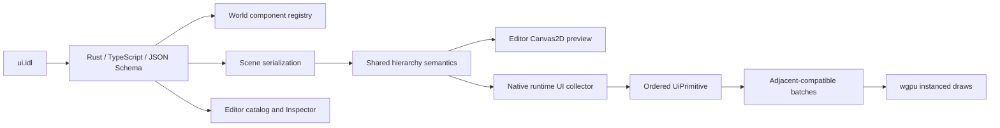

# MEngine 2D 组件扩展与引擎审查重构

> 状态：已实现并验证
>
> 日期：2026-07-16
>
> 关联文档：[本地编辑器技术方案](./mengine-local-editor-technical-design.md)、[2D/3D 渲染升级](./mengine-2d-3d-rendering-upgrade.md)

## 1. 结论

本轮把 Canvas 组件从原有的 `Image / Text / Button / Toggle / Slider` 扩展为可组成常规工具界面和游戏 HUD 的组件集合，同时对组件注册、场景快照、编辑器创建流程、运行时 UI 遍历、裁剪命中和列表渲染做了结构性重构。

新增组件：

- 容器与布局：`Panel`、`CanvasGroup`、`LayoutGroup`、`RectMask2D`
- 展示控件：`ProgressBar`
- 输入与选择：`InputField`、`Dropdown`、`ListView`
- 复合容器：`ScrollView`、`TabView`

这些组件不是只增加 IDL 字段。它们已经贯通 IDL、Rust/TypeScript 生成代码、World 注册、场景往返、编辑器创建与预览、运行时布局与绘制、鼠标/键盘交互和 GPU 自动合批链路。

## 2. 借鉴范围与 MEngine 映射

参考边界以官方文档为准：

- [Godot Control](https://docs.godotengine.org/en/stable/classes/class_control.html)：锚点、偏移、焦点、鼠标过滤和主题是 Control 系统的核心。
- [Godot GUI containers](https://docs.godotengine.org/en/latest/tutorials/ui/gui_containers.html)：Box、Grid、Margin 等容器负责自动重排子控件。
- [Godot TabContainer](https://docs.godotengine.org/en/stable/classes/class_tabcontainer.html)：只显示当前标签对应的子页。
- [FairyGUI Component](https://www.fairygui.com/docs/editor/component)：组件本身是可嵌套的显示列表容器。
- [FairyGUI List](https://www.fairygui.com/docs/editor/list)：列表负责自动布局，并强调虚拟列表以降低大数据量开销。

MEngine 不复制这些引擎的类层次，而是复用现有 ECS 组合模型：

| 外部概念 | MEngine 组件组合 |
|---|---|
| Godot Control 锚点/偏移 | `RectTransform` |
| Box/Grid/Margin Container | `LayoutGroup.direction + padding + spacing + cell_size` |
| CanvasItem 可见性/透明度/输入继承 | `CanvasGroup` |
| Clip Contents / Rect Clip | `RectMask2D` |
| TabContainer | `TabView` + 按 sibling 顺序选择一个子节点 |
| FairyGUI GComponent | ECS 父子层级 + `Panel`/`CanvasGroup` |
| FairyGUI List | `ListView` 可见行生成、选择和滚动偏移 |
| FairyGUI 输入/下拉/进度 | `InputField`、`Dropdown`、`ProgressBar` |

这样保留了 MEngine 的数据驱动和组合式组件边界，不引入第二套 UI 对象模型。

## 3. 组件语义

### 3.1 容器与布局

`Panel` 提供背景色、边框色、边框宽度和可选 raycast blocker。它既可以作为普通视觉面板，也可以与 `LayoutGroup`、`RectMask2D` 组合成复合容器。

`CanvasGroup` 的 `alpha / interactable / blocks_raycasts` 向子树继承。运行时和编辑器预览都在树遍历时合并继承状态，避免每个控件重复查询祖先。

`LayoutGroup` 支持：

- `Horizontal`：水平排列；可按可用宽度均分。
- `Vertical`：垂直排列；可按可用高度均分。
- `Grid`：按 `constraint_count` 指定列数。
- 四边 padding、二维 spacing、cell size 和 child force expand。

布局结果作为子节点的强制 Rect 传入下一层遍历，不修改序列化的 `RectTransform`。因此切换布局方向不会破坏原始手工布局数据。

`RectMask2D` 同时约束绘制裁剪和交互命中。控件的命中区域现在保存最终 clip，鼠标位于遮罩外时不会再触发被裁掉的子控件。

### 3.2 常用控件

| 控件 | 显示 | 交互 |
|---|---|---|
| ProgressBar | 四方向填充、百分比标签 | 只读 |
| InputField | 文本、placeholder、禁用态、单/多行 | 聚焦、IME、文本输入、退格、提交、字符上限 |
| Dropdown | 当前值、展开项、选中态 | 展开、选项选择、回调数据保留 |
| ListView | 背景、可见行、选中态 | 行选择、滚轮、回调数据保留 |
| ScrollView | 视口、矩形裁剪、滚动条 | 横/纵归一化滚动 |
| TabView | 标签栏、选中态、内容背景 | 标签选择；只遍历当前子页 |

本地编辑器 Game View 支持上述鼠标交互和基础键盘文本编辑；原生 runtime 通过 winit IME commit 处理文本输入。`ui-controls` 样例已加入所有新增控件和一个自动水平布局组。

### 3.3 ListView 可见行

运行时和编辑器预览不再为全部数据项生成绘制图元。根据 `scroll_offset`、`item_height`、spacing 和视口高度计算首尾可见索引，只生成可见区以及少量 overscan 行。

这已经消除列表绘制阶段的 O(N) 图元生成，但还不是 FairyGUI 式完整对象池：当前数据源仍是字符串数组，后续需要 item prefab、动态数据适配器和实体复用池。

## 4. 数据与执行链路



IDL 新增 `string_array`，用于 `Dropdown.options`、`ListView.items` 和 `TabView.tabs`。生成器分别输出 `Vec<String>`、`string[]` 和 JSON Schema 的 string array，并带生成器回归测试。

World 注册表现在从生成代码的 `COMPONENT_NAMES` 自动建立，新增 IDL 组件不再要求手工维护一份字符串列表。组件 JSON 插入通过泛型反序列化助手统一执行；快照采集通过宏消除重复分支。

## 5. 引擎审查与重构记录

| 严重度 | 发现 | 处理 |
|---|---|---|
| 高 | IDL、World 注册、JSON 插入、快照存在多份手工组件清单，新增组件容易漏链路 | 注册表改用生成元数据；JSON 插入改为泛型；快照收敛为宏调用 |
| 高 | 遮罩只影响 GPU scissor，不影响控件命中 | `UiControlRegion` 保存 clip，`contains` 先检查裁剪范围 |
| 中 | 编辑器每个 UI 创建函数重复寻找/创建 Canvas，隐式 Canvas 和控件形成两条 Undo | 收敛为 `spawnUiControl`，整个创建过程只入栈一次 |
| 中 | runtime UI walk 参数过多，扩展组件时继续膨胀 | 把父 Rect、scale、clip、forced Rect 聚合为 `UiWalkLayout` |
| 中 | ListView 每帧遍历全部 items | 改为可见索引区间和 overscan |
| 中 | TabView 子页覆盖标签栏，非法索引会隐藏所有子页 | 子页父 Rect 改为标签栏下方内容区；索引安全收敛 |
| 低 | Clippy 暴露排序、同类型转换、复杂类型、默认值初始化和 Option 判断问题 | 全部修复；生成器能对语言默认值派生 `Default` |

## 6. 两轮自省

### 第一轮：功能完整性

检查问题：新增组件是否只是“能序列化”，但无法创建、显示或交互。

检查结果与修正：

- 最初只有 IDL 与 runtime 分支，编辑器没有创建入口；已补全组件目录、GameObject 菜单、Store 创建函数和 Canvas2D 预览。
- 最初 RectMask 只裁剪绘制；已让交互命中共享最终 clip。
- 最初 TabView 只过滤子节点但内容仍占满整个 Rect；已划分标签栏与内容区。
- 最初多行 InputField 的 Enter 只记录 submit；已改为插入换行并遵守字符上限。
- 加入场景往返和 runtime 控件命中测试，避免字段存在但加载后丢失。

### 第二轮：架构、性能与可维护性

检查问题：组件继续增加时，是否会线性扩大手工清单、分支和每帧成本。

检查结果与修正：

- 组件注册和 JSON 插入已从复制粘贴改为生成元数据与泛型助手。
- UI 创建已从每控件一份 Canvas 解析逻辑改为单一事务助手。
- runtime walk 的布局上下文已聚合，新增状态不再增加顶层参数数量。
- ListView 改为可见行生成，避免大列表产生无意义图元和 hit region。
- 保留 painter order 的相邻自动合批，没有为减少 draw call 重排透明控件。
- 全工作区 Clippy 作为审查门禁；静态警告已清零。

## 7. 验证基线

必须通过：

```text
npm run codegen
cargo test --workspace
cargo clippy --workspace --all-targets
pnpm --filter @mengine/editor build
```

重点回归项：

- IDL `string_array` 的 Rust、TypeScript、Schema 输出。
- 新增组件完整场景保存/加载往返。
- LayoutGroup 自动布局和 CanvasGroup alpha 继承。
- RectMask2D 的绘制 clip 与点击 clip 一致。
- ListView 只生成可见行控件。
- Dropdown、ListView、TabView 的子区域命中。
- 编辑器生产构建与 native runtime 样例启动。

本轮实际结果：workspace 全部测试通过，Clippy 全 workspace/all targets 零警告，编辑器 production build 通过。原生 `ui-controls` 显式限定 DX12 后端持续运行 3 秒，输出 `primitives=2003, batches=47, draw_calls=47`，未出现 wgpu pipeline 或 draw validation error。当前显卡驱动报告一项 indirect draw 相关 downlevel flag 缺失，本轮 UI/3D 路径没有使用该能力。机器没有安装 `VK_LAYER_KHRONOS_validation`，且自动探测 Vulkan surface capability 时驱动返回错误，因此 Vulkan 后端不能记为已验证。

## 8. 明确未完成项

以下能力不在本轮完成范围，不能按已具备宣传：

- SDF/Unicode shaping、字体 fallback、富文本和完整编辑器 IME 输入代理。
- UI texture atlas、Sprite UV、九宫格、矢量图形和 MovieClip 动画。
- ListView item prefab、数据适配器、对象池和可变高度行。
- ScrollView 基于真实 content size 的滚动范围、惯性、回弹和拖拽滚动条。
- 键盘/手柄焦点导航、RadioGroup、可访问性语义和主题系统。
- 2D TileMap、骨骼动画、粒子、2D 物理控件属于世界 2D 系统，不应混入 Canvas UI 组件层；应另立方案实现。

建议下一阶段先做“字体与图集资源化”，再做 item prefab/object pool。否则继续堆控件会重复承担文本和纹理基础设施缺失的成本。
