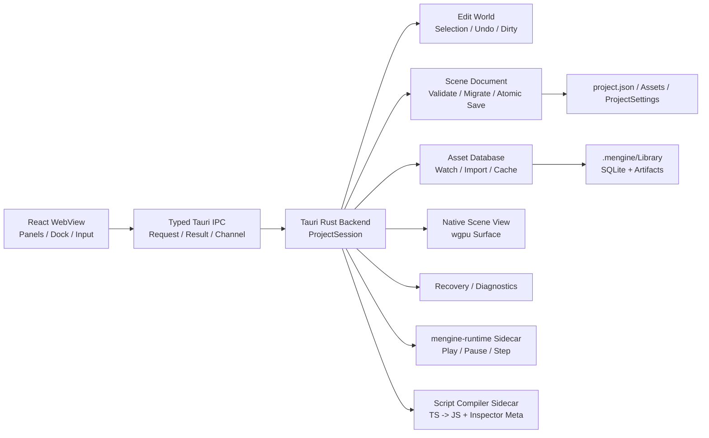

# MEngine 本地编辑器整体技术方案

> 文档状态：实施基线
>
> 编写日期：2026-07-16
>
> 作者：MiYu / Codex
>
> 首要目标：Windows x64 本地编辑器
>
> 参考方案：`jenkins-workbench-technical-design.md`

## 1. 文档目的

MEngine 当前已经具备 React 编辑器界面、Tauri 壳骨架、Rust `mengine-editor-host`、ECS、场景序列化和 wgpu Runtime，但日常编辑仍通过 Vite 浏览器完成。浏览器版本同时存在以下结构性问题：

- 场景在 Vite 私有 HTTP 文件接口和 `localStorage` 之间自动降级，数据位置不明确。
- React 内存 Store 与 Rust `EditorSession` 分别维护场景、选择、撤销和 Play Mode，形成双事实源。
- 当前 Scene/Game 视图是 Canvas2D 模拟渲染，不是 MEngine wgpu Runtime 的真实输出。
- 浏览器生成的 `.mscene` 与 Rust `WorldSnapshot` 字段和组件保留规则已经发生漂移。
- 项目根目录、资源结构、Asset GUID、脚本编译、恢复和发布链路没有统一契约。

本方案建设一个正式的 MEngine 本地编辑器。它不是“把网页套进桌面窗口”，而是以 Rust Host 为唯一真实状态源，以 Tauri 作为受控桌面边界，以 React 复用现有高密度工具面板，并让 Scene View 和 Play Mode 走真实引擎路径。

## 2. 核心决策

| 领域 | 决策 |
| --- | --- |
| 桌面壳 | Tauri 2，不引入 Electron |
| 编辑器 UI | 继续使用 React + TypeScript + 当前 Dock/Panel 体系 |
| 唯一事实源 | Rust `ProjectSession` / `EditorSession` |
| Scene View | Tauri Rust 进程内的原生 wgpu Surface |
| Play Mode | 独立 `mengine-runtime` 子进程，Stop 后销毁 |
| 脚本编译 | 隔离的编译器子进程，生成 Runtime JS 与 Inspector Meta |
| 项目数据 | `project.json` + `Assets` + `ProjectSettings` |
| 本地缓存 | `.mengine/Library`，不进入版本控制 |
| 浏览器版本 | 只作为 Mock UI 开发环境，不承担正式项目编辑 |

## 3. 产品范围

### 3.1 首个正式版本包含

- 最近项目、打开项目、创建项目和项目迁移报告。
- Hierarchy、Inspector、Project、Console、Scene View、Game View。
- 场景新建、打开、保存、另存为、原子写入和异常恢复。
- 实体创建、删除、复制、重排、激活、组件增删改。
- Host 事务级 Undo/Redo、Dirty 状态和保存点。
- 原生 wgpu Scene View、选择、相机和 Transform Gizmo。
- Play、Pause、Step、Stop；Stop 不污染 Edit World。
- Asset GUID、资源扫描、导入队列、缓存和基础热更新。
- TypeScript Behaviour 编译、Inspector 元数据和错误展示。
- Windows x64 可安装/便携构建，运行时不要求安装 Node.js。

### 3.2 首个正式版本不包含

- 多项目同时编辑。
- 插件市场和不受信任的第三方原生插件。
- 完整 Prefab Stage、动画时间轴、粒子编辑器和材质图编辑器。
- 跨平台原生视口一致性；macOS/Linux 放到后续阶段。
- 多人实时协作和远程场景编辑。

## 4. 总体架构



### 4.1 进程边界

#### React WebView

只负责：

- 面板布局、筛选、滚动位置、输入框草稿和弹窗状态。
- 展示 Host Snapshot/Event 形成的只读投影。
- 把用户意图转换为结构化 `EditorRequest`。

不得负责：

- ECS World、正式场景数据、Undo/Redo、Play World。
- 任意文件系统、Shell、网络请求和项目脚本执行。
- 把 `localStorage` 当作场景或项目存储。

#### Tauri Rust Backend

- 持有当前 `ProjectSession` 和 `EditorSession`。
- 验证项目根目录和所有项目内路径。
- 管理场景、撤销、资源、编译、恢复、诊断和原生视口。
- 启动白名单 Runtime/Compiler 子进程。
- 只暴露显式的业务命令和有界 Channel。

#### Play Runtime

- 从编辑器生成的临时场景快照启动。
- 使用正式 `mengine-runtime`、Boa、RHI、物理和音频路径。
- 独立维护 Play World；Stop 直接销毁进程和临时目录。

### 4.2 为什么 Edit Host 不做 Sidecar

Edit World、Scene View、Gizmo、输入、DPI 和窗口生命周期属于高频紧耦合链路。如果 Edit Host 独立进程，需要跨进程传递原生窗口关系、输入和每帧状态，复杂度和延迟都会显著增加。现阶段 Edit Host 静态链接到 Tauri Rust 进程；需要崩溃隔离的项目脚本和 Play Runtime 使用子进程。

## 5. 状态与 IPC 协议

### 5.1 请求模型

```text
EditorRequest
- requestId: UUID
- projectId: UUID
- baseRevision: u64
- transactionId?: UUID
- operation: EditorOperation
```

```text
EditorResult
- requestId: UUID
- acceptedRevision: u64
- result?: payload
- error?: EditorError
```

```text
EditorEvent
- sequence: u64
- revision: u64
- causeRequestId?: UUID
- patches: EditorPatch[]
- dirty: bool
- undoState: { canUndo, canRedo, undoLabel?, redoLabel? }
```

### 5.2 同步规则

- 打开项目、打开场景、事件缺号和恢复后发送完整 `SessionSnapshot`。
- 日常操作只发送增量 Patch，不按渲染帧发送完整 World。
- Host 的 Revision 单调递增，是 Dirty、冲突和事件顺序的依据。
- UI 只能对纯视觉状态做本地预测；实体和组件修改必须等待 Host 接受。
- Host 拒绝过旧、越权、路径非法或 Schema 非法的请求。
- 单次 IPC 限制实体数、字符串长度和负载字节数；大列表使用分页或流式 Channel。

### 5.3 事务和撤销

- Inspector 单字段提交形成一个事务。
- Gizmo 使用 `BeginTransaction -> Preview -> Commit/Cancel`。
- 一次拖动只产生一条 Undo，Preview 不进入历史栈。
- Undo 项同时保存 Forward 与 Inverse，Redo 不得重复应用 Inverse。
- `saveRevision` 记录最近成功保存点，`revision != saveRevision` 即 Dirty。

## 6. 项目模型

```text
MyGame/
├─ project.json
├─ Assets/
│  ├─ Scenes/
│  ├─ Scripts/
│  ├─ Prefabs/
│  ├─ Materials/
│  └─ Textures/
├─ ProjectSettings/
└─ .mengine/
   ├─ Library/
   ├─ Recovery/
   ├─ Temp/
   └─ Logs/
```

- `project.json` 是项目识别入口，使用版本化 Schema。
- `Assets` 和 `ProjectSettings` 进入版本控制。
- `.mengine` 默认忽略，保存导入缓存、恢复数据和诊断日志。
- 窗口布局、最近项目和 Scene Camera 放入当前用户 `%LOCALAPPDATA%`。
- 项目根路径在打开时 canonicalize；后续路径必须验证仍位于该根目录。

## 7. Scene v2

### 7.1 磁盘契约

- 磁盘字段统一使用 `snake_case`，IPC 可映射为 `camelCase`。
- Scene Entity 使用稳定 UUID；ECS Entity 只在加载后临时分配。
- `parent`、事件目标和 Prefab 关系引用稳定 UUID。
- 资产引用使用 Asset GUID，不使用易变的绝对路径。
- 组件数据由 IDL 生成 JSON Schema。
- 未知组件和未知字段必须保留，不能静默丢弃。

### 7.2 保存和迁移

保存顺序：

1. 从 Host 生成 Scene Document。
2. Schema 和引用完整性校验。
3. 写入同目录临时文件。
4. Flush/Sync。
5. 原子替换目标文件。
6. 更新 `saveRevision` 和 Recovery 元数据。

迁移 v1 时先创建备份并执行内存往返比较。发现组件、引用或字段丢失时，只读打开并返回迁移报告，不覆盖源文件。

## 8. Asset Database

- `.meta`/MEngine Meta 提供稳定 Asset GUID 和 Importer 设置。
- 兼容外部 Meta 时保留未知字段，不破坏性重写。
- SQLite 保存路径、GUID、类型、源哈希、导入设置哈希、Importer 版本和 Artifact。
- `notify` 文件监听事件先合并、去重，再进入 `mengine-jobs`。
- Artifact Key 由 `sourceHash + settingsHash + importerVersion` 决定。
- Project 面板通过分页接口读取真实数据库，不硬编码资源。
- 导入失败保留旧 Artifact，并在 Console/Inspector 中展示错误。

## 9. TypeScript Behaviour

编译器生成两份产物：

1. Boa Runtime 使用的 JavaScript Bundle。
2. Inspector 使用的字段、装饰器、按钮、依赖和校验元数据。

React WebView 不执行用户项目脚本。正式发行包携带编译器，不要求用户安装 Node.js。编译失败只阻止受影响脚本刷新和 Play，不阻止打开场景或编辑其他组件。

## 10. 原生视口

- Tauri Rust 进程创建专用原生 Window/Surface。
- React 只报告逻辑矩形、物理尺寸、DPI、可见性和激活状态。
- Host 管理 wgpu Surface、Resize、Suspend、Recreate 和渲染帧。
- GPU 帧不通过 IPC，不使用截图流或 CPU 像素回读。
- 输入直接进入原生视口，再转成选择/Gizmo 事务。
- Scene View 使用 Edit World；Game View 使用 Play Runtime。

Windows 原生嵌入必须先完成 WebView2、焦点、DPI、多显示器、最小化和 Dock Resize 验证。验证失败时首版使用独立可停靠原生视口窗口，不回退 Canvas2D 正式渲染。

## 11. 界面设计

- Project Hub：最近项目、打开、创建、迁移结果。
- 顶部菜单：File/Edit/Assets/GameObject/Component/Window/Help。
- 工具栏：Gizmo、坐标系、Play/Pause/Step、保存状态。
- 左侧：Hierarchy。
- 中央：Scene/Game 原生视口。
- 右侧：Inspector。
- 底部：Project、Console、Import Queue。

### 11.1 可扩展菜单与对象创建

顶部 `GameObject` 菜单和 Hierarchy 右键菜单必须读取同一个菜单注册表，禁止在两个组件里分别维护对象清单。菜单路径采用 Unity `MenuItem` 语义：`GameObject/UI/Health Bar` 会自动生成 `UI` 悬浮子菜单；`priority` 控制排序，`separatorBefore` 控制分组，校验函数控制当前上下文中是否可执行。运行时上下文包含 Store、选择对象、来源、日志和刷新入口，因此同一条命令可同时服务顶部菜单与 Hierarchy。

用户扩展在 `.ts` 模块中可以使用装饰器注册自定义控件；模块需由编辑器入口或扩展入口导入一次：

```ts
import { MenuItem, type MenuItemContext } from './editorWindow';

class MyUiMenu {
  @MenuItem('GameObject/UI/Health Bar', false, 330)
  static create(context: MenuItemContext) {
    context.store.createUiControl('Health Bar', {
      RectTransform: {
        anchor_min: [0.5, 0.5],
        anchor_max: [0.5, 0.5],
        pivot: [0.5, 0.5],
        anchored_position: [0, 0],
        size_delta: [240, 24],
        local_rotation: 0,
        local_scale: [1, 1],
      },
      Image: { color: [0.15, 0.15, 0.15, 1] },
      HealthBar: { value: 1 },
    });
    context.log('GameObject/UI/Health Bar');
    context.refresh();
  }

  @MenuItem('GameObject/UI/Health Bar', true)
  static validate(context: MenuItemContext) {
    return context.store.mode === 'edit';
  }
}
```

`.tsx` 模块使用命令式形式，避免 Babel 装饰器差异：

```ts
registerMenuItem('GameObject/UI/Health Bar', createHealthBar, {
  priority: 330,
  validate: (context) => context.store.mode === 'edit',
});
```
- 状态栏：项目、场景、Host、Revision、资源导入和脚本编译状态。

沿用当前编辑器的专业工具方向：零圆角、紧凑尺寸、1 px 分隔线、无渐变、颜色只承担状态语义。

## 12. 安全设计

- Tauri CSP 必须显式配置，禁止 `csp: null`。
- Capability 按窗口限定，不授予 WebView 通用 FS/Shell 权限。
- 自定义 Command 继续校验窗口标签、Project ID、路径和负载。
- Shell 仅由 Rust Backend 启动白名单 Sidecar。
- 项目脚本运行在 Boa/Runtime 隔离边界，不能取得编辑器文件系统能力。
- 日志、错误和诊断包清除项目外绝对路径、环境变量和潜在凭据。

## 13. 恢复与诊断

- 每个已提交事务更新内存恢复状态。
- 空闲周期和固定事务数写增量 Recovery。
- 异常退出后展示源场景、保存版本和恢复版本差异。
- Console 使用有界 Ring Buffer；落盘日志按大小和时间淘汰。
- 诊断包包含版本、项目 Schema、最近操作、编译/导入错误和 GPU 信息，不包含项目脚本正文。

## 14. 测试与验收

### 14.1 自动化测试

- 项目根路径和路径穿越。
- Scene v1/v2 加载、迁移和未知字段保留。
- Rust -> JSON -> TS -> JSON -> Rust 无损往返。
- 原子保存中断恢复。
- Undo/Redo Forward/Inverse 对称。
- Revision、事件缺号和重新同步。
- 超大 IPC、非法组件和损坏场景拒绝。
- Play Stop 后 Edit World 不变。

### 14.2 性能基线

- 10,000 实体 Hierarchy 使用虚拟化，普通交互 P95 小于 50 ms。
- Scene View 基准场景稳定 60 FPS。
- React 面板不跟随渲染帧整树刷新。
- Project 资源列表分页加载，不一次传输完整数据库。
- Console DOM 保持有界，超大日志不进入单次 IPC。

### 14.3 发布验收

- Windows x64 无 Node/Vite 环境可启动。
- 正式项目数据不写入 `localStorage`。
- 打包版使用内置前端资源，不启动本地 HTTP 开发服务器。
- 应用异常退出不会产生截断 Scene。
- Play Runtime 崩溃不会损坏 Edit Scene。

## 15. 实施阶段

### P0：技术门禁

- Tauri 包加入 Cargo Workspace，建立可重复构建。
- 建立 Typed Transport、ProjectSession、Revision 和错误模型。
- 修复 Scene 未知组件保留、字段兼容和原子保存。
- 修复 Undo/Redo 语义并建立测试。
- 验证原生 wgpu Viewport。
- 验证不依赖外部 Node 的脚本编译器打包。

### P1：本地编辑 MVP

- Project Hub 和项目生命周期。
- React 全面切换到 Tauri Transport。
- Host 权威 Hierarchy、Inspector、Undo/Redo、Dirty 和保存。
- 原生 Scene View、选择和 Gizmo。
- 移除正式路径 Vite FS API 和 `localStorage` 场景后端。

### P2：Runtime 闭环

- Runtime Sidecar、Game View、Play/Pause/Step/Stop。
- TypeScript 编译、Boa 加载、Console 和脚本热更新。

### P3：生产资源链路

- Asset DB、Importer、缓存、Prefab 和 PC Build。

### P4：跨平台

- macOS/Linux Viewport Adapter、签名、安装和升级。

## 16. 两轮自省结论

### 第一轮：架构复杂度

曾考虑将 Edit Host 独立为 Sidecar，但原生视口、输入、DPI 和 Gizmo 会变成跨进程高频同步。最终选择 Edit Host 静态链接 Tauri，Play Runtime 和 Compiler 才使用 Sidecar。

### 第二轮：大爆炸风险

完整方案不能一次迁移。P0 把原生视口、场景无损迁移和编译器打包设为硬门禁；P1 只交付可靠的场景编辑闭环。迁移期间可以保留 Vite Mock，但一个正式项目会话不得混用新旧状态源。

## 17. 最终原则

Rust `ProjectSession` 是项目和场景的唯一真实状态来源；React 是投影和交互层；wgpu 是正式视口；`mengine-runtime` 是 Play Mode 的真实执行路径。任何缓存、预测状态和恢复数据最终都必须能与 Host Revision 和磁盘项目契约校准。

## 18. 2026-07-16 落地状态

本次已完成可安装的 P0 桌面纵向闭环：

- Tauri 2 进入 Cargo/npm/pnpm 构建链，可生成 Windows MSI、NSIS 安装包和独立 EXE。
- Project Hub 通过系统目录选择器打开包含 `project.json` 的项目。
- Project Hub 支持选择父目录并新建项目；创建由 Rust Host 执行，生成标准资源目录、ProjectSettings、`.mengine` 缓存树和可立即打开的默认主场景，WebView 不获得通用文件系统写权限。
- Rust `ProjectSession` 负责项目根目录、受限相对路径、当前 Scene、Revision、Dirty 和保存点。
- 桌面正式打开/保存路径使用 Tauri Command；Scene 正文不再以 `localStorage` 为持久化后端。
- Scene 保存采用同目录临时文件、Flush/Sync 和原子替换。
- 未知组件、Hierarchy 顺序和 Active 字段可以经过加载、编辑快照和保存后保留。
- Undo/Redo 同时保存 Forward/Inverse，Redo 重放 Forward。
- Tauri Capability 只开放基础窗口和目录选择器，不给 WebView 通用 Shell/文件系统权限。

仍未越过的门禁必须保持显式：

- 当前 React Store 在打开与保存之间仍保留一份过渡编辑模型；Hierarchy、Inspector、Gizmo 的每一次修改尚未全部改为 Host typed command，因此还不能宣称完成 P1 的“Host 唯一状态”。
- 当前 Scene View 仍是既有 Canvas2D 路径；Tauri + wgpu 原生 Surface、DPI、焦点和多显示器验证尚未完成。
- 内置 TypeScript Compiler Sidecar、Runtime Sidecar、Asset Database、Prefab 与导入链路尚未实施。
- 桌面场景 Rename/Delete 尚未开放，避免在 Host 提供安全事务接口前从 WebView 直接操作文件。

所以下一实施顺序固定为：先把 UI mutation 全部迁入 typed command 和事务化 Undo，再完成原生 wgpu Viewport 技术门禁，随后接入 Compiler/Runtime Sidecar；不得以现有过渡 Store 或 Canvas2D 冒充最终桌面架构。

后续完成的 2D Canvas 自动合批、常用控件以及 3D 摄像机/灯光/材质第一阶段实现，见 [mengine-2d-3d-rendering-upgrade.md](./mengine-2d-3d-rendering-upgrade.md)。该实现已经提供独立原生 Runtime 的真实 wgpu 验证路径，但不改变上述“编辑器内嵌原生视口尚未完成”的边界判断。

## 19. 2026-07-18 PC Build SDK 落地

桌面发行构建不再把源码仓库、系统 Node.js 和 Rust 工具链作为最终用户前置条件：

- 编辑器打包前生成宿主平台专用 `build-sdk`，包含固定版本的 Node.js、MEngine CLI、TypeScript Compiler，以及 Debug/Release `mengine-runtime`。
- Tauri 将 Build SDK 作为只读 Resource 随安装包分发；Rust Host 校验 SDK schema、宿主平台/架构、相对路径和非符号链接文件后才允许执行。
- PC Build 优先使用内置 SDK，并保留源码 checkout 作为开发回退；自动化环境可通过 `MENGINE_BUILD_SDK` 指向同契约的独立 SDK。
- Build Result 回读 manifest，显示引擎版本、平台架构、场景数、已校验资源/引用、文件数、总字节数、内容哈希和实际工具链。

PC Build 当前边界仍保持显式：只构建当前宿主平台，尚未提供交叉编译、代码签名、安装包生成、增量内容包和远程 Build Farm。Play Mode Runtime Sidecar 与编辑器内嵌原生 Viewport 仍属于独立门禁，不能由 Build SDK 的完成状态替代。

## 20. 2026-07-18 Game View 与 Timeline 可用性闭环

- Game View 不再维护独立横屏/竖屏开关；显示方向、letterbox 和 Canvas 逻辑尺寸只由当前分辨率宽高派生。预设和自定义宽高共用同一个状态模型，旧比例/方向偏好只在载入时迁移。
- Timeline 支持在播放头复制/粘贴关键帧和动画事件，粘贴保留 Hermite tangent 与事件参数，并提供 `Ctrl/Cmd+C/V` 操作入口。
- Timeline 可通过工具栏或 `Shift+Space` 进入最大化编辑模式；最大化后 Details 作为保留宽度的右侧检查器，不再覆盖时间轴末端。
- Timeline 局部工具栏采用无边框图标按钮，关键帧命中区域扩展到 24px，轨道、详情和横向时间轴使用 6px 方形滚动条。

该切片解决的是动画资源的基础创作可用性，不代表完整动画系统已完成。后续仍需 Dope Sheet/Curve 双模式、动画层与 Avatar Mask、Timeline Sequencer 轨道类型以及运行时事件调度的系统化完善。

## 21. 2026-07-18 Timeline 多关键帧编辑闭环

- Timeline 选择模型从单一关键帧扩展为稳定的关键帧集合；普通点击设置主关键帧，`Ctrl/Cmd+Click` 切换离散选择，`Shift+Click` 选择同轨连续范围。
- 轨道空白区域支持跨轨框选；`Ctrl/Cmd/Shift` 配合框选可在原选择上追加，选区命中按真实轨道和时间范围计算。
- 拖动任一已选关键帧会对整个选区执行帧对齐偏移，并在片段首尾统一限位；Details 同时提供前后 1 帧的精确偏移按钮。
- 复制、粘贴和删除作用于整个选区。组粘贴保留跨轨时间间隔、值和 Hermite tangent；超出片段末端时扩展 duration，目标片段缺少绑定轨道时给出部分跳过提示。
- 多选状态保存在未落盘的 Clip draft 中，切换资源再返回不会把选区退化为单选；批量移动、覆盖同帧关键帧和删除均由独立纯函数覆盖自动化测试。

动画系统边界仍保持显式：当前完成的是 Animation Clip 的 Dope Sheet 基础批量编辑，不等同于完整 Sequencer。后续阶段继续补齐曲线批量编辑、轨道分组/折叠、动画层混合与 Avatar Mask，再推进音频、粒子、信号和镜头轨道。

## 22. 2026-07-18 可编辑 Curve View

- Timeline 提供 `Dope Sheet / Curves` 双模式切换；Curve 模式保留播放控制、播放头、横向缩放和 Details，并提供独立的数值轨道选择器，离散轨道不会误入曲线编辑。
- Curve View 对标专业引擎的基础曲线工作区：最多同时显示 X/Y/Z/W 四个通道、时间/数值网格、当前播放头、通道显隐焦点和随缩放变化的可视时间窗。
- 曲线关键点支持直接选择和二维拖动；时间仍按 Clip FPS 吸附，数值按曲线坐标连续编辑，移动后沿用统一的关键帧冲突覆盖与 tangent 保留契约。
- Cubic 轨道显示入/出 Hermite 切线手柄，手柄拖动写入指定通道斜率；工具栏提供 Auto 与 Flat 模式，非 Cubic 轨道可在 Curve View 内一键切换为 Cubic。
- 坐标映射、视口逆变换、值域拟合、关键帧单通道编辑、切线斜率与 Auto/Flat 状态均落在无 UI 依赖的纯函数层，并由自动化测试覆盖。

当前 Curve View 完成的是 Animation Clip 曲线的第一阶段编辑闭环。后续仍需曲线点框选与批量变换、垂直缩放/平移、切线联动/断开模式、阶梯与加权切线显示、轨道分组，以及与 Sequencer 轨道和动画层混合的统一时间域。

## 23. 2026-07-18 自定义材质发布依赖闭环

- 自定义材质的发布契约统一为 `.mmat/.mat -> custom_shader -> .mshader`。编辑器负责创作期诊断，CLI 负责构建场景的传递依赖扫描，最终包内的 `mengine-runtime --validate-package` 使用运行时实际加载器再次校验，三层都不能把无效引用当成普通告警。
- 最终包校验不再只遍历材质的五类 PBR 贴图；`shader: custom` 会强制要求非空 `.mshader` 引用，并使用与运行时热加载相同的项目相对路径边界，拒绝绝对路径和 `..` 穿越。
- Surface Shader 必须通过资源层的 UTF-8、大小和 Hook 检查，并继续通过 RHI 的完整 WGSL 组合、解析与验证。缺失文件、损坏源码或与引擎绑定/入口冲突都会让发布校验失败，不再等到首帧渲染才静默退回默认表面。
- 已验证的 Surface Shader 会进入最终运行时资源计数，保证构建结果面板和 `--validate-package` 输出反映真实材质依赖闭包；重复引用仍按规范化路径去重。

这次闭环解决的是现有 PBR/Unlit/Custom 材质从创作到发布的一致性，不代表成熟材质系统已经完备。后续仍需 Shader Graph、材质实例与参数覆盖、全局/局部 Shader Variant 管理、GPU Instancing/SRP Batcher 等价能力、烘焙与运行时关键字、渲染调试视图，以及移动端/桌面端质量分级和离线 Shader Cache。

## 24. 2026-07-18 PC Build 验证与原子发布

- PC Build 的完整暂存目录现在必须先通过包内 Player 的 `--validate-package`，才能进入发布重命名；最终验证覆盖清单哈希、场景加载、脚本载入和运行时资源闭包，不再对已经公开的输出目录做事后检查。
- 首次构建验证失败时删除隐藏暂存目录，不创建目标输出；使用 `--clean` 替换已有构建时，旧成功包在新暂存包验证完成前保持原位，验证失败后文件与 manifest 均不改变。
- 暂存验证成功后仍沿用“旧输出改名为备份 -> 暂存目录原子改名 -> 删除备份”的提交协议；最终改名失败时恢复旧输出。因此资源验证失败和文件系统发布失败都具备明确的回滚边界。
- `--skip-verify` 仅保留给受控自动化和诊断场景；编辑器标准 Build 路径不会使用该开关。底层 `buildPcPackage` 通过显式暂存验证回调保持可测试性，默认库调用方若需要可发布保证，必须提供等价验证器。

该改进保证“Build 成功”不会指向一个已知无效的目录，但不等同于完整发行流水线。代码签名、安装器、符号与崩溃映射上传、分平台矩阵、可复现工具链锁定、增量 Patch、远程 Build Farm 和发布审批仍是后续生产门禁。

## 25. 2026-07-18 官方最小工程契约

- `samples/spinning-cube` 已从仅供 Runtime 特殊入口读取的扁平文件迁移为标准工程：`project.json`、`Assets/Scenes`、`Assets/Scripts` 和 `ProjectSettings` 与编辑器新建工程、PC Build 使用同一目录契约。
- 场景包含可编辑的 Camera3D、DirectionalLight、MeshRenderer 和 PbrMaterial；启动脚本通过 CommandBuffer 更新 Transform，并由 PC Build 从 TypeScript 重新编译为包内 JavaScript，因此样例同时覆盖场景、脚本、3D 灯光/材质和运行时命令桥。
- `npm run build:samples` 优先发现标准工程的 `Assets/Scripts/Main.ts`，仍兼容尚未迁移的旧样例；Runtime `--sample` 同样优先加载标准路径，避免编辑器/打包器与示例运行入口维护两套源码。
- CLI 测试直接把仓库官方样例构建成包，检查标准场景与编译脚本落位；真实 Debug Player 的暂存验证确认该包可载入 1 个场景、3 个实体和启动脚本。

官方最小工程现在是可执行的发布契约，而不是旁路 Demo。后续新增样例必须从标准工程模板派生并进入相同构建回归；旧 `hello-triangle` 仍保留为无场景脚本兼容性样例，待独立迁移或明确降级为底层 Runtime smoke test。

## 26. 2026-07-18 Animator 同步层与 Avatar Mask

- Animator Controller schema 升级到 v2，旧 v1 Controller 在 Rust 资产层和 TypeScript 创作层都会无损迁移；原 `states/transitions/default_state` 继续作为 Base Layer，避免破坏现有场景、脚本 API 和运行时调试字段。
- 附加层提供 Enabled、Weight、Override/Additive 混合模式、Avatar Mask 路径集合，以及按 Base State 配置的 Motion Override。附加层复用 Base Layer 的状态、过渡进度和归一化时间，Base State 改名/删除时编辑器同步维护层 Motion 引用。
- Avatar Mask 使用相对动画目标路径作为包含列表，路径命中时包含完整子树；空列表或 `*` 表示全部目标，`.` 只作用于 Animator 根节点。这样既能覆盖骨骼层级，也能过滤普通节点动画，不依赖模型专有骨骼编号。
- Runtime 先应用 Base Layer，再按列表顺序叠加启用层。Override 从当前值按权重插值；Additive 对标量/向量应用加权增量，对 Transform 四元数使用单位四元数到增量旋转的球面插值后相乘，避免线性相加破坏单位长度。
- Base Layer 过渡期间，附加层对源/目标 Motion 使用相同过渡权重；只有一侧配置 Motion 时自动淡入或淡出。层 Clip 按 Base Clip 的归一化相位采样，不会因片段时长不同产生循环漂移。
- CLI 构建依赖扫描和最终 Player `--validate-package` 都会遍历层 Motion Clip，缺失或越界引用无法发布。资产规范化、层引用、遮罩、Override/Additive、四元数和过渡同步均有自动化回归。

当前落地的是“同步层”第一阶段：附加层共享 Base State Machine，并兼容内嵌 Mask 路径。独立层状态机、独立层参数/权重的运行时脚本控制、Humanoid Body Mask、IK Pass、层级动画事件与 Root Motion 合成仍需后续实现；编辑器本轮通过类型检查与构建验证，未在本轮重新启动浏览器做视觉验收。

## 27. 2026-07-18 可复用 Avatar Mask 资产

- 新增版本化 `.mavatar` 资源，保存名称与相对 Animator 根节点的目标路径集合。路径自动清理分隔符、去重并拒绝 `..`；空集合或 `*` 表示全部目标，`.` 表示根节点，普通路径自动包含子树。
- Project 窗口和桌面/Web 两套资产扫描均识别 Avatar Mask；`Assets/Create/Avatar Mask` 可直接创建资源，双击后在 Animator 窗口编辑，支持未保存标记、Save 与 Save All。
- Animator Controller 升级为版本 3。每个附加层可选择一个外部 Avatar Mask，并保留内联路径作为补充集合；运行时按修改时间缓存外部资源，热更新后重新加载，并在加载失败时报告具体资源路径而不是静默退化。
- PC 构建依赖扫描把层引用的 `.mavatar` 纳入传递闭包，校验扩展名、JSON 结构和路径安全；最终运行时包启动前再次解析资源，防止编辑器可运行但发布包缺失或损坏。

该切片完成的是通用 Transform 路径 Mask，不等同于 Humanoid Avatar 系统。骨骼导入映射、人体部位开关、IK Pass 和独立动画层状态机仍是下一阶段；现有同步层行为保持兼容。

## 28. 2026-07-18 Animator 独立层状态机

- Animator Controller 版本升级为 4。附加层新增 `timing_mode`：`synced` 保持原有 Base State Motion Override 行为；`independent` 则拥有自己的 Default State、State/Clip/Speed 与 Transition/Condition 集合。
- 独立层共享 Controller 参数，但独立维护当前 State、状态时间和过渡进度。运行时会按层推进、按各层 Transition Duration 混合，再通过层 Weight、Override/Additive 和 Avatar Mask 合成到 Base Layer 结果。
- Animator 编辑器可在每层切换 Synced/Independent，直接创建、重命名和删除独立 State，选择 Clip 与速度，配置 Default State、Any State/普通 Transition、Exit Time、Blend Duration 和参数条件。参数改名、类型变更或删除会同步修复 Base 与独立层条件引用。
- CLI 构建依赖扫描和最终运行时包校验均遍历独立层 State Clip；缺失 Clip、无效默认 State、损坏过渡或不兼容参数条件会在发布前失败，不会生成部分输出。

在该切片完成时，层权重覆盖、指定层 Play、独立层实时调试状态和动画事件尚未暴露给脚本/Inspector；其中前三项在下节继续完成，层动画事件仍保留为后续边界。

## 29. 2026-07-18 Animator 层实例控制与实时调试

- Animator 组件新增 `layer_weights_json` 作为实例级启动/运行权重覆盖，并新增只读调试字段 `layers_json`。每个层状态包含 Enabled、Timing Mode、有效 Weight、当前 State、State Time、Normalized Time、Transition To 与 Transition Progress。
- 脚本 API 新增 `engine.setAnimatorLayerWeight(entity, layer, weight)` 与 `engine.playAnimatorLayerState(entity, layer, state)`；前者只接受 `[0,1]`，后者只允许有 Animator 的实体，并在动画更新阶段验证独立层和 State 名称。
- Runtime 将层播放请求排队到下一动画帧，确保脚本在 Animator 首次初始化前调用也不会丢失。有效权重按“实例覆盖优先、Controller 默认兜底”计算，参与 Synced/Independent 两类层的最终混合。
- Animator 面板新增 Instance Layer Weights / Live Layers 区域，可在 Edit Mode 配置启动覆盖，在 Play Mode 查看层状态、归一化时间、过渡目标与进度，并实时调整权重；Reset 会恢复 Controller 默认权重。
- IDL 是组件字段的单一事实源，本轮通过 codegen 同步 Rust Component、TypeScript API 与 JSON Schema；CLI 的项目 TypeScript 声明同时暴露两项层控制 API。

这仍不是完整 Mecanim：层动画事件、IK Pass、Root Motion 分层合成、StateMachineBehaviour 与运行时状态哈希尚未完成。当前完成的是可创作、可构建、可脚本驱动、可观察的层状态机基础闭环。

## 30. 2026-07-18 Timeline Sequencer 信号轨道闭环

- 新增版本化 `.mtimeline` 资源与 `TimelineDirector` 组件。资源采用可扩展的 `tracks[] + type` 结构，首个正式轨道类型为 Signal Track；每个标记保存时间、名称与可选 JSON Payload，轨道具备稳定 ID、名称和静音状态。
- Project 窗口、桌面/Web 资产扫描与导入白名单均识别 Timeline；`Assets/Create/Timeline` 可创建独立资源，双击后进入 Sequencer。原 `.manim` Animation Clip 同时补齐 `Assets/Create/Animation Clip` 与独立双击打开，不再要求先绑定场景实体。
- Sequencer 提供播放/暂停/停止、可编辑播放头、帧吸附、轨道增删/改名/静音、信号增删、时间与 Payload Inspector、标记横向拖拽和双击轨道添加信号。资源可一键绑定到选中实体；Animation Clip 与 Sequencer 面板常驻挂载，切换资源时草稿进入 Save All，不因 Dock/视图切换丢失。
- Runtime 使用独立 Director 时钟推进 Hold/Loop、正播和倒播，按真实跨界顺序派发信号，并设置单帧 4096 条安全上限。信号在项目 `onTick` 前通过 `onTimelineSignal({ entity, track, signal, time, payload })` 交给脚本；首次进入当前时间点的信号只触发一次。
- CLI 依赖扫描把场景中的 Timeline 引用纳入发布闭包，验证版本、时长、轨道 ID/类型和标记范围；最终 Player `--validate-package` 再使用 Rust 资产加载器解析包内资源。无效 Timeline 会在暂存发布前失败，不产生部分输出。

这一阶段完成了可扩展 Sequencer 的第一条真实运行轨道，不宣称 Timeline 已完整；后续的 Activation Track 继续复用同一 Director 时间域。Audio、Animation、Particle、Camera/Cinemachine 风格镜头与嵌套 Timeline 轨道，以及轨道分组、混合区、绑定表、Extrapolation、录制和 Undo/Redo 仍是后续工作。

## 31. 2026-07-18 TimelineDirector 脚本控制与实时调试

- 项目脚本新增 `engine.playTimeline(entity, restart?)`、`pauseTimeline`、`stopTimeline` 与 `seekTimeline`。接口同时接受数字和字符串实体 ID，完整保留 64 位 ID；Seek 拒绝负数、非有限值和超出 `f32` 的时间，运行时仍按资源时长执行最终夹取或循环。
- Restart/Stop 会重置 Director 的运行时激活记录，确保下一次从 0 秒进入时只派发一次 time-zero Signal；Seek 会在下一帧从目标时间重新进入，Pause 保留当前时间。缺失 `TimelineDirector` 的请求输出明确警告，不会写入错误组件。
- Sequencer 在 Play Mode 检测选中实体是否绑定当前 `.mtimeline`，显示 `LIVE PLAYING/PAUSED`、实际 Director 时间，并把播放、暂停、停止和播放头 Scrub 写回 Director；Edit Mode 继续使用无副作用的本地预览时钟。
- CLI 与新工程生成的 `mengine.d.ts` 同步暴露四个接口，脚本桥自动化测试覆盖精确实体 ID、Restart、Pause、Stop、Seek 与无效时间拒绝，避免编辑器声明领先于 Player 实现。

该切片完成 Director 的基础生命周期控制，但尚未提供按轨道/片段级别跳转、Signal 接收器绑定表、已触发通知抑制策略、嵌套 Director 控制和网络确定性同步；这些能力将在更多轨道类型落地后统一设计，避免每种轨道各自维护一套时间状态。

## 32. 2026-07-18 Timeline Activation Track

- `.mtimeline` 新增 `activation` 轨道：轨道用 Director 子节点相对路径绑定目标，片段以 `[start, start + duration)` 控制目标的本地 Active 状态。路径统一为 `/`，禁止空段、`.`、`..` 和绝对路径；同一 Timeline 禁止两条 Activation Track 控制同一目标。
- 运行时在首次覆盖前保存目标的 authored Active 与 sibling index。离开片段、轨道静音、播放停止、Director 失活、资源加载失败、绑定热重载或轨道移除时恢复原状态，避免一次 Timeline 播放永久污染场景；目标不存在时只报告一次带轨道名和路径的错误。
- Sequencer 支持新建 Activation Track、设置子节点路径、新建/拖动/删除片段、编辑起点、时长和 Active/Inactive 值；轨道和片段使用与 Signal 不同的硬边专业工具视觉。保存前拒绝越界片段、重叠片段和目标竞争。
- Rust 资产加载器、编辑器解析器与 PC Build 依赖校验执行同一版本、帧率、路径、时间范围和重叠规则；最终 Player 包验证仍通过 Rust 加载器复核。回归测试覆盖片段应用/还原、停止还原、缺失绑定去重诊断、路径规范化、重叠拒绝和构建失败不发布半成品。

Activation Track 当前故意只绑定 Director 的后代，尚未引入跨层级/跨场景 Binding Table；这避免把不稳定实体 ID 写入资产。后续先建立稳定绑定表，再在其上实现 Animation、Audio、Particle 与 Camera Track，共用一套绑定丢失诊断、Post Playback 策略和预览还原机制。

## 33. 2026-07-18 Lit Surface Shader 与材质契约加固

- Surface Shader 新增推荐入口 `mengine_lit_surface_hook(surface, uv, world_position) -> MEngineSurface`。`MEngineSurface` 暴露 `base_color`、`alpha`、`normal`、`metallic`、`roughness`、`occlusion` 与 `emissive`，Hook 在环境光和直接光 BRDF 之前运行，因此自定义材质可以改变真实光照输入，而不再只能给最终颜色叠效果。
- RHI 在 Hook 返回后重新约束颜色、Alpha、金属度、粗糙度、遮蔽和自发光，并对零长度法线回退到贴图/顶点法线；Hook 修改后的 Alpha 会参与正向 Cutout 判断。旧 `mengine_surface_hook(color, uv, world_position, world_normal)` 保持最终颜色后处理语义；仅实现旧 Hook 的资产无需迁移，同时实现两者时先修改光照表面、再处理最终颜色。
- 新建 `.mshader` 默认生成 Lit Hook。编辑器诊断、CLI 依赖验证、Rust 资源加载器和最终 RHI Naga 组合验证都接受 Lit 或旧 Hook，但继续拒绝用户自定义绑定和着色器入口；构建测试使用 Lit Hook 走完整的场景到发布依赖路径。
- `.mmat/.mat` 明确只接受版本 1–4，旧版本加载后升级到 v4，版本 0 和未来版本拒绝；编辑器保存固定写出 v4。编辑器与 CLI 同步拒绝未知 Shader、Surface、Blend、Wrap、Filter 枚举，防止拼写错误或未来格式被静默降级为 PBR/Repeat/Linear 后进入包体。

这仍不是完整的 Shader Graph 或材质实例系统：参数反射、属性块、关键字与 Variant 预热、离线管线缓存、GPU Instancing、渲染调试视图和平台质量分级仍需继续实现。当前切片补齐的是“自定义表面真正参与 PBR”以及“创作、构建、Player 对资产契约一致失败”的基础。

## 34. 2026-07-18 EditorOnly 发布剔除

- PC Build 在计算最终清单和 SHA-256 前生成 Player 专用场景：带 `EditorOnly` 组件的实体及其全部后代从 `.mscene` 中剔除，被剔除的选中项会清空，保留实体上的 `__*` 编辑器元数据不会进入包体。
- Prefab 使用相同的递归规则：`EditorOnly` 子树整体剔除；根节点为 `EditorOnly` 的 Prefab 属于纯创作资产，最终包中不写入该文件。依赖扫描也忽略已剔除子树，不会因编辑器辅助节点引用了不可发布资源而阻断 Player 构建。
- 剔除数量写入 `assetValidation.strippedEditorEntities`，CLI 和桌面编辑器 Build Result 都显示实际结果。回归用例覆盖场景父子节点、Prefab 子树、EditorOnly Prefab 根、选中项与元数据清理，并核对构建报告计数。

为保持脚本动态加载兼容性，PC Build 的默认模式仍复制完整 `Assets` 树。因此本节完成的是“运行实体与 Prefab 节点剔除”；未引用资源文件裁剪与 Always Include 白名单在下一节作为可选发布模式独立落地。

## 35. 2026-07-18 可选依赖闭包裁剪

- `project.json` 新增 `assetMode: "all" | "referenced"` 和 `alwaysInclude: string[]`。旧工程缺省为 `all`，保持完整 Assets/Scripts 复制行为；`referenced` 只发布 Build Scenes、JavaScript 启动脚本或 TypeScript 编译产物、场景组件引用、材质/动画/Timeline/Spine/glTF 传递依赖与 Always Include 根。
- Always Include 接受 `Assets`/`Scripts` 下的文件或目录，不超过 256 项；目录递归展开后每个资产仍经过同一依赖校验、路径边界和符号链接拒绝。因此白名单不是绕过验证的复制后门。
- 普通图片引用会自动携带已存在的 `.sprite.json` 导入 sidecar，带 `#slice` 的引用仍校验具体切片；重复引用按规范化绝对路径去重。裁剪后文件先进入暂存目录，EditorOnly 改写、TypeScript 编译、清单哈希和 Player `--validate-package` 仍按原子发布顺序执行。
- 桌面编辑器和浏览器开发模式的 Build Settings 都可编辑模式与白名单，Rust ProjectSession 使用原子替换保存工程清单。Build Result 和 CLI 输出显示实际 `assetMode`、裁剪文件数和源文件字节数，避免将全量包误认为已裁剪包，也让体积收益可被直接核对。

Referenced Only 是可用的单包裁剪基础，仍不等同于完整 Addressables/AssetBundle 系统。脚本拼接的动态路径无法被静态推导，必须纳入 Always Include；资源分组、共享包去重、远程内容、增量 Patch、剔除原因/体积报告和可视化依赖图仍是后续发布系统工作。

## 36. 2026-07-18 AudioSource 可定位播放基础

- `AudioSource` 新增可序列化的 `time` 秒数字段。首次播放从该位置启动；运行时把 Kira 的真实播放位置持续回写组件，暂停保留时间，停止销毁底层声音并归零，因此 Inspector、场景序列化和运行时观察使用同一个状态源。
- 音频同步层区分自然推进与外部时间修改。显式修改会调用底层 `seek_to`，新建或切换声音则使用 `start_position`，避免先从 0 播放一帧再跳转；负数和非有限时间在脚本边界被拒绝，底层仍执行有限范围清理作为第二道防线。
- 项目脚本新增 `engine.seekAudio(entity, time)`，与 Play/Pause/Stop 共用精确保留 64 位实体 ID 的请求通道。CLI 与桌面新建工程模板、示例声明和脚本桥回归测试同步更新，避免声明先于 Player 实现或不同脚手架产生不一致 API。

本节完成的是 Timeline Audio Track 所需的底层定位与状态闭环，不宣称音频序列轨已经完成。下一切片仍需把音频片段、绑定、裁剪入点、Scrub/暂停/停止策略、Sequencer 创作、构建依赖与 Player 校验作为同一条链路交付。

## 37. 2026-07-18 Timeline Audio Track 闭环

- `.mtimeline` 新增 `audio` 轨道，绑定 Director 后代路径上的既有 `AudioSource`。片段保存 Timeline 起点/时长、项目内 WAV/OGG/MP3/FLAC、音频入点、音量、音调与循环；同一目标禁止被多条音频轨竞争，片段禁止重叠，路径、数值范围和轨道 ID 在 Rust、编辑器与 CLI 三端保持一致。
- 运行时只在进入片段、Scrub、资源热变更、Director 回卷或漂移超过阈值时定位声音，正常播放由 Kira 时钟推进，避免每帧 Seek。正向 Director 速度参与播放速率；底层暂不支持运行中反向切换，反播时轨道保持静音并更新定位，不伪装成倒放能力。
- Timeline 首次覆盖前保存完整 authored `AudioSource`。Pause 保留轨道覆盖并冻结声音；Stop、播放结束、空隙、静音、资源失败、Director 失活或轨道移除会恢复原组件。Sequencer 的归零 Stop 可与保留时间的 Pause 区分，Activation Track 同步采用冻结/还原语义，恢复播放不会重复触发当前时间点 Signal。
- Sequencer 可创建 Audio Track 和 Audio Clip、拖动片段，并编辑后代绑定、项目音频、Clip In、音量、音调和循环；音频资产输入带项目候选列表，轨道与片段保持零圆角专业工具样式。`AudioSource.time` 的 Inspector 约束同步为非负秒数。
- Referenced Only 构建把 Timeline 音频作为传递依赖纳入闭包；CLI 在暂存发布前拒绝丢失、越界、重叠和非法路径，最终 Player 再用真实 Kira 解码器校验文件并核对 `clip_in` 小于解码时长。损坏音频或越过音频尾部的入点不能生成可发布包。

当前音频轨仍不是完整 DAW：没有波形缓存/峰值预览、淡入淡出和交叉混合、轨道 Mixer 路由自动化、运行时反向播放、音频 DSP 图与采样级 Timeline 时钟。现有切片完成的是可创作、可播放/暂停/停止/跳转、可还原、可裁剪打包且最终包可解码的第一条可靠音频序列轨。

## 38. 2026-07-18 Timeline Animation Track 闭环

- `.mtimeline` 新增 `animation` 轨道，绑定 Director 后代上的专用 `AnimationPlayer`；片段保存 Timeline 起点/时长、`.manim`、动画入点与 `-4..4` 采样速度。同一目标禁止多轨竞争，片段禁止重叠，目标同时带 `Animator` 时明确失败，避免状态机与 Sequencer 同时写同一姿势。
- Runtime 帧序调整为 Timeline 先求值、Animation 再采样、Audio 最后同步。动画轨把目标播放器设为 `playing=true`、`speed=0` 并写入精确采样时间，因此播放、暂停和 Scrub 都在当前帧出姿势，不再晚一帧；负速片段通过时间反向采样，不依赖播放器自然推进。
- AnimationRuntime 现在记录每个活动播放器的 Clip 身份与上次采样时间；Clip 变化会重新进入并重新武装当前时间事件，Timeline 以零自然速度外部推进时仍按前后采样区间派发正向/反向 Animation Event。停止/空隙/静音/Director 失活或轨道移除恢复完整 authored `AnimationPlayer` 后，原动画不会沿用 Timeline Clip 的活动状态。Pause 保留零速采样姿势，Stop 还原原组件。
- Sequencer 可创建 Animation Track/Clip、拖动片段，并编辑后代绑定、项目动画、Clip In 与 Speed；项目动画候选来自 Asset Database。编辑器解析/保存、Rust 资产加载、CLI 依赖闭包与最终 Player 校验共享轨道、路径和范围契约，最终包还会加载 `.manim` 并拒绝超过动画时长的入点。

该轨道目前控制基础 `AnimationPlayer`，尚未实现 Animator State/Layer Track、片段交叉混合、Avatar Mask 覆盖、Root Motion 合成、录制模式和嵌套 Timeline。下一阶段应先抽象稳定 Binding Table 与通用 Clip Blend，再扩展 Animator/Camera/Particle 轨，避免每种轨道各自维护混合规则。

## 39. 2026-07-18 材质采样质量闭环

- `.mmat/.mat` 升级到 v5，新增独立 `mipmap_filter` 与 `anisotropy`。旧 v1–v4 材质继续无损加载并补齐 Linear mip 与 1x 各向异性默认值；版本 0 和未来版本继续拒绝，编辑器保存统一写出 v5。
- Texture Filter 控制放大/缩小采样，Mipmap Filter 独立选择双线性或三线性，Anisotropy 提供 1x/2x/4x/8x/16x。高于 1x 时资产规范化与 Inspector 同时强制两级过滤为 Linear，满足 wgpu 的 sampler 契约；不支持各向异性过滤的适配器安全回退到 1x，不让材质加载导致设备验证失败。
- Runtime 将三项采样状态纳入 sampler cache key，因此具有不同 mip/各向异性设置的材质不会错误复用同一个 GPU sampler。CLI 在暂存发布前校验版本、枚举、范围与组合约束，最终 Player 仍通过 Rust v5 资产加载器复核，避免编辑器可保存但打包后静默降级。

该切片补齐的是基础纹理采样质量，不代表材质系统已经成熟完备。Material Instance/Property Block、Shader 参数反射、关键字与 Variant 预热、GPU Instancing、烘焙/离线 Shader Cache、平台质量分级和渲染调试视图仍需继续实现。
