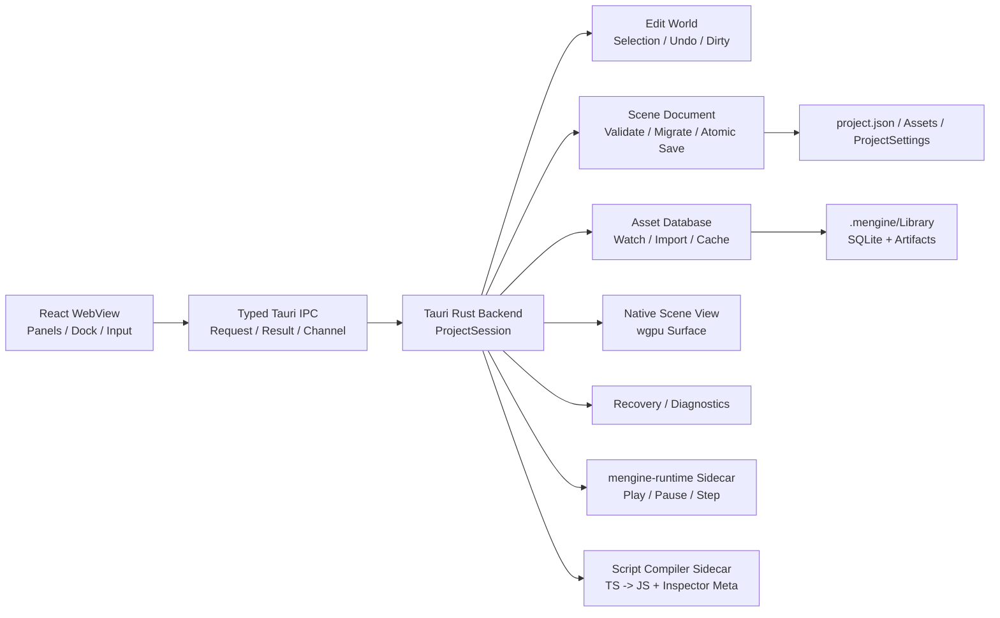

# MEngine 本地编辑器整体技术方案

> 文档状态：实施基线
>
> 编写日期：2026-07-16
>
> 作者：MiYu / Codex
>
> 首要目标：Windows x64 本地编辑器
>
> 参考方案：`jenkins-workbench-technical-design.md`

## 1. 文档目的

MEngine 当前已经具备 React 编辑器界面、Tauri 壳骨架、Rust `mengine-editor-host`、ECS、场景序列化和 wgpu Runtime，但日常编辑仍通过 Vite 浏览器完成。浏览器版本同时存在以下结构性问题：

- 场景在 Vite 私有 HTTP 文件接口和 `localStorage` 之间自动降级，数据位置不明确。
- React 内存 Store 与 Rust `EditorSession` 分别维护场景、选择、撤销和 Play Mode，形成双事实源。
- 当前 Scene/Game 视图是 Canvas2D 模拟渲染，不是 MEngine wgpu Runtime 的真实输出。
- 浏览器生成的 `.mscene` 与 Rust `WorldSnapshot` 字段和组件保留规则已经发生漂移。
- 项目根目录、资源结构、Asset GUID、脚本编译、恢复和发布链路没有统一契约。

本方案建设一个正式的 MEngine 本地编辑器。它不是“把网页套进桌面窗口”，而是以 Rust Host 为唯一真实状态源，以 Tauri 作为受控桌面边界，以 React 复用现有高密度工具面板，并让 Scene View 和 Play Mode 走真实引擎路径。

## 2. 核心决策

| 领域 | 决策 |
| --- | --- |
| 桌面壳 | Tauri 2，不引入 Electron |
| 编辑器 UI | 继续使用 React + TypeScript + 当前 Dock/Panel 体系 |
| 唯一事实源 | Rust `ProjectSession` / `EditorSession` |
| Scene View | Tauri Rust 进程内的原生 wgpu Surface |
| Play Mode | 独立 `mengine-runtime` 子进程，Stop 后销毁 |
| 脚本编译 | 隔离的编译器子进程，生成 Runtime JS 与 Inspector Meta |
| 项目数据 | `project.json` + `Assets` + `ProjectSettings` |
| 本地缓存 | `.mengine/Library`，不进入版本控制 |
| 浏览器版本 | 只作为 Mock UI 开发环境，不承担正式项目编辑 |

## 3. 产品范围

### 3.1 首个正式版本包含

- 最近项目、打开项目、创建项目和项目迁移报告。
- Hierarchy、Inspector、Project、Console、Scene View、Game View。
- 场景新建、打开、保存、另存为、原子写入和异常恢复。
- 实体创建、删除、复制、重排、激活、组件增删改。
- Host 事务级 Undo/Redo、Dirty 状态和保存点。
- 原生 wgpu Scene View、选择、相机和 Transform Gizmo。
- Play、Pause、Step、Stop；Stop 不污染 Edit World。
- Asset GUID、资源扫描、导入队列、缓存和基础热更新。
- TypeScript Behaviour 编译、Inspector 元数据和错误展示。
- Windows x64 可安装/便携构建，运行时不要求安装 Node.js。

### 3.2 首个正式版本不包含

- 多项目同时编辑。
- 插件市场和不受信任的第三方原生插件。
- 完整 Prefab Stage、动画时间轴、粒子编辑器和材质图编辑器。
- 跨平台原生视口一致性；macOS/Linux 放到后续阶段。
- 多人实时协作和远程场景编辑。

## 4. 总体架构



### 4.1 进程边界

#### React WebView

只负责：

- 面板布局、筛选、滚动位置、输入框草稿和弹窗状态。
- 展示 Host Snapshot/Event 形成的只读投影。
- 把用户意图转换为结构化 `EditorRequest`。

不得负责：

- ECS World、正式场景数据、Undo/Redo、Play World。
- 任意文件系统、Shell、网络请求和项目脚本执行。
- 把 `localStorage` 当作场景或项目存储。

#### Tauri Rust Backend

- 持有当前 `ProjectSession` 和 `EditorSession`。
- 验证项目根目录和所有项目内路径。
- 管理场景、撤销、资源、编译、恢复、诊断和原生视口。
- 启动白名单 Runtime/Compiler 子进程。
- 只暴露显式的业务命令和有界 Channel。

#### Play Runtime

- 从编辑器生成的临时场景快照启动。
- 使用正式 `mengine-runtime`、Boa、RHI、物理和音频路径。
- 独立维护 Play World；Stop 直接销毁进程和临时目录。

### 4.2 为什么 Edit Host 不做 Sidecar

Edit World、Scene View、Gizmo、输入、DPI 和窗口生命周期属于高频紧耦合链路。如果 Edit Host 独立进程，需要跨进程传递原生窗口关系、输入和每帧状态，复杂度和延迟都会显著增加。现阶段 Edit Host 静态链接到 Tauri Rust 进程；需要崩溃隔离的项目脚本和 Play Runtime 使用子进程。

## 5. 状态与 IPC 协议

### 5.1 请求模型

```text
EditorRequest
- requestId: UUID
- projectId: UUID
- baseRevision: u64
- transactionId?: UUID
- operation: EditorOperation
```

```text
EditorResult
- requestId: UUID
- acceptedRevision: u64
- result?: payload
- error?: EditorError
```

```text
EditorEvent
- sequence: u64
- revision: u64
- causeRequestId?: UUID
- patches: EditorPatch[]
- dirty: bool
- undoState: { canUndo, canRedo, undoLabel?, redoLabel? }
```

### 5.2 同步规则

- 打开项目、打开场景、事件缺号和恢复后发送完整 `SessionSnapshot`。
- 日常操作只发送增量 Patch，不按渲染帧发送完整 World。
- Host 的 Revision 单调递增，是 Dirty、冲突和事件顺序的依据。
- UI 只能对纯视觉状态做本地预测；实体和组件修改必须等待 Host 接受。
- Host 拒绝过旧、越权、路径非法或 Schema 非法的请求。
- 单次 IPC 限制实体数、字符串长度和负载字节数；大列表使用分页或流式 Channel。

### 5.3 事务和撤销

- Inspector 单字段提交形成一个事务。
- Gizmo 使用 `BeginTransaction -> Preview -> Commit/Cancel`。
- 一次拖动只产生一条 Undo，Preview 不进入历史栈。
- Undo 项同时保存 Forward 与 Inverse，Redo 不得重复应用 Inverse。
- `saveRevision` 记录最近成功保存点，`revision != saveRevision` 即 Dirty。

## 6. 项目模型

```text
MyGame/
├─ project.json
├─ Assets/
│  ├─ Scenes/
│  ├─ Scripts/
│  ├─ Prefabs/
│  ├─ Materials/
│  └─ Textures/
├─ ProjectSettings/
└─ .mengine/
   ├─ Library/
   ├─ Recovery/
   ├─ Temp/
   └─ Logs/
```

- `project.json` 是项目识别入口，使用版本化 Schema。
- `Assets` 和 `ProjectSettings` 进入版本控制。
- `.mengine` 默认忽略，保存导入缓存、恢复数据和诊断日志。
- 窗口布局、最近项目和 Scene Camera 放入当前用户 `%LOCALAPPDATA%`。
- 项目根路径在打开时 canonicalize；后续路径必须验证仍位于该根目录。

## 7. Scene v2

### 7.1 磁盘契约

- 磁盘字段统一使用 `snake_case`，IPC 可映射为 `camelCase`。
- Scene Entity 使用稳定 UUID；ECS Entity 只在加载后临时分配。
- `parent`、事件目标和 Prefab 关系引用稳定 UUID。
- 资产引用使用 Asset GUID，不使用易变的绝对路径。
- 组件数据由 IDL 生成 JSON Schema。
- 未知组件和未知字段必须保留，不能静默丢弃。

### 7.2 保存和迁移

保存顺序：

1. 从 Host 生成 Scene Document。
2. Schema 和引用完整性校验。
3. 写入同目录临时文件。
4. Flush/Sync。
5. 原子替换目标文件。
6. 更新 `saveRevision` 和 Recovery 元数据。

迁移 v1 时先创建备份并执行内存往返比较。发现组件、引用或字段丢失时，只读打开并返回迁移报告，不覆盖源文件。

## 8. Asset Database

- `.meta`/MEngine Meta 提供稳定 Asset GUID 和 Importer 设置。
- 兼容外部 Meta 时保留未知字段，不破坏性重写。
- SQLite 保存路径、GUID、类型、源哈希、导入设置哈希、Importer 版本和 Artifact。
- `notify` 文件监听事件先合并、去重，再进入 `mengine-jobs`。
- Artifact Key 由 `sourceHash + settingsHash + importerVersion` 决定。
- Project 面板通过分页接口读取真实数据库，不硬编码资源。
- 导入失败保留旧 Artifact，并在 Console/Inspector 中展示错误。

## 9. TypeScript Behaviour

编译器生成两份产物：

1. Boa Runtime 使用的 JavaScript Bundle。
2. Inspector 使用的字段、装饰器、按钮、依赖和校验元数据。

React WebView 不执行用户项目脚本。正式发行包携带编译器，不要求用户安装 Node.js。编译失败只阻止受影响脚本刷新和 Play，不阻止打开场景或编辑其他组件。

## 10. 原生视口

- Tauri Rust 进程创建专用原生 Window/Surface。
- React 只报告逻辑矩形、物理尺寸、DPI、可见性和激活状态。
- Host 管理 wgpu Surface、Resize、Suspend、Recreate 和渲染帧。
- GPU 帧不通过 IPC，不使用截图流或 CPU 像素回读。
- 输入直接进入原生视口，再转成选择/Gizmo 事务。
- Scene View 使用 Edit World；Game View 使用 Play Runtime。

Windows 原生嵌入必须先完成 WebView2、焦点、DPI、多显示器、最小化和 Dock Resize 验证。验证失败时首版使用独立可停靠原生视口窗口，不回退 Canvas2D 正式渲染。

## 11. 界面设计

- Project Hub：最近项目、打开、创建、迁移结果。
- 顶部菜单：File/Edit/Assets/GameObject/Component/Window/Help。
- 工具栏：Gizmo、坐标系、Play/Pause/Step、保存状态。
- 左侧：Hierarchy。
- 中央：Scene/Game 原生视口。
- 右侧：Inspector。
- 底部：Project、Console、Import Queue。

### 11.1 可扩展菜单与对象创建

顶部 `GameObject` 菜单和 Hierarchy 右键菜单必须读取同一个菜单注册表，禁止在两个组件里分别维护对象清单。菜单路径采用 Unity `MenuItem` 语义：`GameObject/UI/Health Bar` 会自动生成 `UI` 悬浮子菜单；`priority` 控制排序，`separatorBefore` 控制分组，校验函数控制当前上下文中是否可执行。运行时上下文包含 Store、选择对象、来源、日志和刷新入口，因此同一条命令可同时服务顶部菜单与 Hierarchy。

用户扩展在 `.ts` 模块中可以使用装饰器注册自定义控件；模块需由编辑器入口或扩展入口导入一次：

```ts
import { MenuItem, type MenuItemContext } from './editorWindow';

class MyUiMenu {
  @MenuItem('GameObject/UI/Health Bar', false, 330)
  static create(context: MenuItemContext) {
    context.store.createUiControl('Health Bar', {
      RectTransform: {
        anchor_min: [0.5, 0.5],
        anchor_max: [0.5, 0.5],
        pivot: [0.5, 0.5],
        anchored_position: [0, 0],
        size_delta: [240, 24],
        local_rotation: 0,
        local_scale: [1, 1],
      },
      Image: { color: [0.15, 0.15, 0.15, 1] },
      HealthBar: { value: 1 },
    });
    context.log('GameObject/UI/Health Bar');
    context.refresh();
  }

  @MenuItem('GameObject/UI/Health Bar', true)
  static validate(context: MenuItemContext) {
    return context.store.mode === 'edit';
  }
}
```

`.tsx` 模块使用命令式形式，避免 Babel 装饰器差异：

```ts
registerMenuItem('GameObject/UI/Health Bar', createHealthBar, {
  priority: 330,
  validate: (context) => context.store.mode === 'edit',
});
```
- 状态栏：项目、场景、Host、Revision、资源导入和脚本编译状态。

沿用当前编辑器的专业工具方向：零圆角、紧凑尺寸、1 px 分隔线、无渐变、颜色只承担状态语义。

## 12. 安全设计

- Tauri CSP 必须显式配置，禁止 `csp: null`。
- Capability 按窗口限定，不授予 WebView 通用 FS/Shell 权限。
- 自定义 Command 继续校验窗口标签、Project ID、路径和负载。
- Shell 仅由 Rust Backend 启动白名单 Sidecar。
- 项目脚本运行在 Boa/Runtime 隔离边界，不能取得编辑器文件系统能力。
- 日志、错误和诊断包清除项目外绝对路径、环境变量和潜在凭据。

## 13. 恢复与诊断

- 每个已提交事务更新内存恢复状态。
- 空闲周期和固定事务数写增量 Recovery。
- 异常退出后展示源场景、保存版本和恢复版本差异。
- Console 使用有界 Ring Buffer；落盘日志按大小和时间淘汰。
- 诊断包包含版本、项目 Schema、最近操作、编译/导入错误和 GPU 信息，不包含项目脚本正文。

## 14. 测试与验收

### 14.1 自动化测试

- 项目根路径和路径穿越。
- Scene v1/v2 加载、迁移和未知字段保留。
- Rust -> JSON -> TS -> JSON -> Rust 无损往返。
- 原子保存中断恢复。
- Undo/Redo Forward/Inverse 对称。
- Revision、事件缺号和重新同步。
- 超大 IPC、非法组件和损坏场景拒绝。
- Play Stop 后 Edit World 不变。

### 14.2 性能基线

- 10,000 实体 Hierarchy 使用虚拟化，普通交互 P95 小于 50 ms。
- Scene View 基准场景稳定 60 FPS。
- React 面板不跟随渲染帧整树刷新。
- Project 资源列表分页加载，不一次传输完整数据库。
- Console DOM 保持有界，超大日志不进入单次 IPC。

### 14.3 发布验收

- Windows x64 无 Node/Vite 环境可启动。
- 正式项目数据不写入 `localStorage`。
- 打包版使用内置前端资源，不启动本地 HTTP 开发服务器。
- 应用异常退出不会产生截断 Scene。
- Play Runtime 崩溃不会损坏 Edit Scene。

## 15. 实施阶段

### P0：技术门禁

- Tauri 包加入 Cargo Workspace，建立可重复构建。
- 建立 Typed Transport、ProjectSession、Revision 和错误模型。
- 修复 Scene 未知组件保留、字段兼容和原子保存。
- 修复 Undo/Redo 语义并建立测试。
- 验证原生 wgpu Viewport。
- 验证不依赖外部 Node 的脚本编译器打包。

### P1：本地编辑 MVP

- Project Hub 和项目生命周期。
- React 全面切换到 Tauri Transport。
- Host 权威 Hierarchy、Inspector、Undo/Redo、Dirty 和保存。
- 原生 Scene View、选择和 Gizmo。
- 移除正式路径 Vite FS API 和 `localStorage` 场景后端。

### P2：Runtime 闭环

- Runtime Sidecar、Game View、Play/Pause/Step/Stop。
- TypeScript 编译、Boa 加载、Console 和脚本热更新。

### P3：生产资源链路

- Asset DB、Importer、缓存、Prefab 和 PC Build。

### P4：跨平台

- macOS/Linux Viewport Adapter、签名、安装和升级。

## 16. 两轮自省结论

### 第一轮：架构复杂度

曾考虑将 Edit Host 独立为 Sidecar，但原生视口、输入、DPI 和 Gizmo 会变成跨进程高频同步。最终选择 Edit Host 静态链接 Tauri，Play Runtime 和 Compiler 才使用 Sidecar。

### 第二轮：大爆炸风险

完整方案不能一次迁移。P0 把原生视口、场景无损迁移和编译器打包设为硬门禁；P1 只交付可靠的场景编辑闭环。迁移期间可以保留 Vite Mock，但一个正式项目会话不得混用新旧状态源。

## 17. 最终原则

Rust `ProjectSession` 是项目和场景的唯一真实状态来源；React 是投影和交互层；wgpu 是正式视口；`mengine-runtime` 是 Play Mode 的真实执行路径。任何缓存、预测状态和恢复数据最终都必须能与 Host Revision 和磁盘项目契约校准。

## 18. 2026-07-16 落地状态

本次已完成可安装的 P0 桌面纵向闭环：

- Tauri 2 进入 Cargo/npm/pnpm 构建链，可生成 Windows MSI、NSIS 安装包和独立 EXE。
- Project Hub 通过系统目录选择器打开包含 `project.json` 的项目。
- Project Hub 支持选择父目录并新建项目；创建由 Rust Host 执行，生成标准资源目录、ProjectSettings、`.mengine` 缓存树和可立即打开的默认主场景，WebView 不获得通用文件系统写权限。
- Rust `ProjectSession` 负责项目根目录、受限相对路径、当前 Scene、Revision、Dirty 和保存点。
- 桌面正式打开/保存路径使用 Tauri Command；Scene 正文不再以 `localStorage` 为持久化后端。
- Scene 保存采用同目录临时文件、Flush/Sync 和原子替换。
- 未知组件、Hierarchy 顺序和 Active 字段可以经过加载、编辑快照和保存后保留。
- Undo/Redo 同时保存 Forward/Inverse，Redo 重放 Forward。
- Tauri Capability 只开放基础窗口和目录选择器，不给 WebView 通用 Shell/文件系统权限。

仍未越过的门禁必须保持显式：

- 当前 React Store 在打开与保存之间仍保留一份过渡编辑模型；Hierarchy、Inspector、Gizmo 的每一次修改尚未全部改为 Host typed command，因此还不能宣称完成 P1 的“Host 唯一状态”。
- 当前 Scene View 仍是既有 Canvas2D 路径；Tauri + wgpu 原生 Surface、DPI、焦点和多显示器验证尚未完成。
- 内置 TypeScript Compiler Sidecar、Runtime Sidecar、Asset Database、Prefab 与导入链路尚未实施。
- 桌面场景 Rename/Delete 尚未开放，避免在 Host 提供安全事务接口前从 WebView 直接操作文件。

所以下一实施顺序固定为：先把 UI mutation 全部迁入 typed command 和事务化 Undo，再完成原生 wgpu Viewport 技术门禁，随后接入 Compiler/Runtime Sidecar；不得以现有过渡 Store 或 Canvas2D 冒充最终桌面架构。

后续完成的 2D Canvas 自动合批、常用控件以及 3D 摄像机/灯光/材质第一阶段实现，见 [mengine-2d-3d-rendering-upgrade.md](./mengine-2d-3d-rendering-upgrade.md)。该实现已经提供独立原生 Runtime 的真实 wgpu 验证路径，但不改变上述“编辑器内嵌原生视口尚未完成”的边界判断。

## 19. 2026-07-18 PC Build SDK 落地

桌面发行构建不再把源码仓库、系统 Node.js 和 Rust 工具链作为最终用户前置条件：

- 编辑器打包前生成宿主平台专用 `build-sdk`，包含固定版本的 Node.js、MEngine CLI、TypeScript Compiler，以及 Debug/Release `mengine-runtime`。
- Tauri 将 Build SDK 作为只读 Resource 随安装包分发；Rust Host 校验 SDK schema、宿主平台/架构、相对路径和非符号链接文件后才允许执行。
- PC Build 优先使用内置 SDK，并保留源码 checkout 作为开发回退；自动化环境可通过 `MENGINE_BUILD_SDK` 指向同契约的独立 SDK。
- Build Result 回读 manifest，显示引擎版本、平台架构、场景数、已校验资源/引用、文件数、总字节数、内容哈希和实际工具链。

PC Build 当前边界仍保持显式：只构建当前宿主平台，尚未提供交叉编译、代码签名、安装包生成、增量内容包和远程 Build Farm。Play Mode Runtime Sidecar 与编辑器内嵌原生 Viewport 仍属于独立门禁，不能由 Build SDK 的完成状态替代。

## 20. 2026-07-18 Game View 与 Timeline 可用性闭环

- Game View 不再维护独立横屏/竖屏开关；显示方向、letterbox 和 Canvas 逻辑尺寸只由当前分辨率宽高派生。预设和自定义宽高共用同一个状态模型，旧比例/方向偏好只在载入时迁移。
- Timeline 支持在播放头复制/粘贴关键帧和动画事件，粘贴保留 Hermite tangent 与事件参数，并提供 `Ctrl/Cmd+C/V` 操作入口。
- Timeline 可通过工具栏或 `Shift+Space` 进入最大化编辑模式；最大化后 Details 作为保留宽度的右侧检查器，不再覆盖时间轴末端。
- Timeline 局部工具栏采用无边框图标按钮，关键帧命中区域扩展到 24px，轨道、详情和横向时间轴使用 6px 方形滚动条。

该切片解决的是动画资源的基础创作可用性，不代表完整动画系统已完成。后续仍需 Dope Sheet/Curve 双模式、动画层与 Avatar Mask、Timeline Sequencer 轨道类型以及运行时事件调度的系统化完善。

## 21. 2026-07-18 Timeline 多关键帧编辑闭环

- Timeline 选择模型从单一关键帧扩展为稳定的关键帧集合；普通点击设置主关键帧，`Ctrl/Cmd+Click` 切换离散选择，`Shift+Click` 选择同轨连续范围。
- 轨道空白区域支持跨轨框选；`Ctrl/Cmd/Shift` 配合框选可在原选择上追加，选区命中按真实轨道和时间范围计算。
- 拖动任一已选关键帧会对整个选区执行帧对齐偏移，并在片段首尾统一限位；Details 同时提供前后 1 帧的精确偏移按钮。
- 复制、粘贴和删除作用于整个选区。组粘贴保留跨轨时间间隔、值和 Hermite tangent；超出片段末端时扩展 duration，目标片段缺少绑定轨道时给出部分跳过提示。
- 多选状态保存在未落盘的 Clip draft 中，切换资源再返回不会把选区退化为单选；批量移动、覆盖同帧关键帧和删除均由独立纯函数覆盖自动化测试。

动画系统边界仍保持显式：当前完成的是 Animation Clip 的 Dope Sheet 基础批量编辑，不等同于完整 Sequencer。后续阶段继续补齐曲线批量编辑、轨道分组/折叠、动画层混合与 Avatar Mask，再推进音频、粒子、信号和镜头轨道。

## 22. 2026-07-18 可编辑 Curve View

- Timeline 提供 `Dope Sheet / Curves` 双模式切换；Curve 模式保留播放控制、播放头、横向缩放和 Details，并提供独立的数值轨道选择器，离散轨道不会误入曲线编辑。
- Curve View 对标专业引擎的基础曲线工作区：最多同时显示 X/Y/Z/W 四个通道、时间/数值网格、当前播放头、通道显隐焦点和随缩放变化的可视时间窗。
- 曲线关键点支持直接选择和二维拖动；时间仍按 Clip FPS 吸附，数值按曲线坐标连续编辑，移动后沿用统一的关键帧冲突覆盖与 tangent 保留契约。
- Cubic 轨道显示入/出 Hermite 切线手柄，手柄拖动写入指定通道斜率；工具栏提供 Auto 与 Flat 模式，非 Cubic 轨道可在 Curve View 内一键切换为 Cubic。
- 坐标映射、视口逆变换、值域拟合、关键帧单通道编辑、切线斜率与 Auto/Flat 状态均落在无 UI 依赖的纯函数层，并由自动化测试覆盖。

当前 Curve View 完成的是 Animation Clip 曲线的第一阶段编辑闭环。后续仍需曲线点框选与批量变换、垂直缩放/平移、切线联动/断开模式、阶梯与加权切线显示、轨道分组，以及与 Sequencer 轨道和动画层混合的统一时间域。

## 23. 2026-07-18 自定义材质发布依赖闭环

- 自定义材质的发布契约统一为 `.mmat/.mat -> custom_shader -> .mshader`。编辑器负责创作期诊断，CLI 负责构建场景的传递依赖扫描，最终包内的 `mengine-runtime --validate-package` 使用运行时实际加载器再次校验，三层都不能把无效引用当成普通告警。
- 最终包校验不再只遍历材质的五类 PBR 贴图；`shader: custom` 会强制要求非空 `.mshader` 引用，并使用与运行时热加载相同的项目相对路径边界，拒绝绝对路径和 `..` 穿越。
- Surface Shader 必须通过资源层的 UTF-8、大小和 Hook 检查，并继续通过 RHI 的完整 WGSL 组合、解析与验证。缺失文件、损坏源码或与引擎绑定/入口冲突都会让发布校验失败，不再等到首帧渲染才静默退回默认表面。
- 已验证的 Surface Shader 会进入最终运行时资源计数，保证构建结果面板和 `--validate-package` 输出反映真实材质依赖闭包；重复引用仍按规范化路径去重。

这次闭环解决的是现有 PBR/Unlit/Custom 材质从创作到发布的一致性，不代表成熟材质系统已经完备。后续仍需 Shader Graph、材质实例与参数覆盖、全局/局部 Shader Variant 管理、GPU Instancing/SRP Batcher 等价能力、烘焙与运行时关键字、渲染调试视图，以及移动端/桌面端质量分级和离线 Shader Cache。

## 24. 2026-07-18 PC Build 验证与原子发布

- PC Build 的完整暂存目录现在必须先通过包内 Player 的 `--validate-package`，才能进入发布重命名；最终验证覆盖清单哈希、场景加载、脚本载入和运行时资源闭包，不再对已经公开的输出目录做事后检查。
- 首次构建验证失败时删除隐藏暂存目录，不创建目标输出；使用 `--clean` 替换已有构建时，旧成功包在新暂存包验证完成前保持原位，验证失败后文件与 manifest 均不改变。
- 暂存验证成功后仍沿用“旧输出改名为备份 -> 暂存目录原子改名 -> 删除备份”的提交协议；最终改名失败时恢复旧输出。因此资源验证失败和文件系统发布失败都具备明确的回滚边界。
- `--skip-verify` 仅保留给受控自动化和诊断场景；编辑器标准 Build 路径不会使用该开关。底层 `buildPcPackage` 通过显式暂存验证回调保持可测试性，默认库调用方若需要可发布保证，必须提供等价验证器。

该改进保证“Build 成功”不会指向一个已知无效的目录，但不等同于完整发行流水线。代码签名、安装器、符号与崩溃映射上传、分平台矩阵、可复现工具链锁定、增量 Patch、远程 Build Farm 和发布审批仍是后续生产门禁。

## 25. 2026-07-18 官方最小工程契约

- `samples/spinning-cube` 已从仅供 Runtime 特殊入口读取的扁平文件迁移为标准工程：`project.json`、`Assets/Scenes`、`Assets/Scripts` 和 `ProjectSettings` 与编辑器新建工程、PC Build 使用同一目录契约。
- 场景包含可编辑的 Camera3D、DirectionalLight、MeshRenderer 和 PbrMaterial；启动脚本通过 CommandBuffer 更新 Transform，并由 PC Build 从 TypeScript 重新编译为包内 JavaScript，因此样例同时覆盖场景、脚本、3D 灯光/材质和运行时命令桥。
- `npm run build:samples` 优先发现标准工程的 `Assets/Scripts/Main.ts`，仍兼容尚未迁移的旧样例；Runtime `--sample` 同样优先加载标准路径，避免编辑器/打包器与示例运行入口维护两套源码。
- CLI 测试直接把仓库官方样例构建成包，检查标准场景与编译脚本落位；真实 Debug Player 的暂存验证确认该包可载入 1 个场景、3 个实体和启动脚本。

官方最小工程现在是可执行的发布契约，而不是旁路 Demo。后续新增样例必须从标准工程模板派生并进入相同构建回归；旧 `hello-triangle` 仍保留为无场景脚本兼容性样例，待独立迁移或明确降级为底层 Runtime smoke test。

## 26. 2026-07-18 Animator 同步层与 Avatar Mask

- Animator Controller schema 升级到 v2，旧 v1 Controller 在 Rust 资产层和 TypeScript 创作层都会无损迁移；原 `states/transitions/default_state` 继续作为 Base Layer，避免破坏现有场景、脚本 API 和运行时调试字段。
- 附加层提供 Enabled、Weight、Override/Additive 混合模式、Avatar Mask 路径集合，以及按 Base State 配置的 Motion Override。附加层复用 Base Layer 的状态、过渡进度和归一化时间，Base State 改名/删除时编辑器同步维护层 Motion 引用。
- Avatar Mask 使用相对动画目标路径作为包含列表，路径命中时包含完整子树；空列表或 `*` 表示全部目标，`.` 只作用于 Animator 根节点。这样既能覆盖骨骼层级，也能过滤普通节点动画，不依赖模型专有骨骼编号。
- Runtime 先应用 Base Layer，再按列表顺序叠加启用层。Override 从当前值按权重插值；Additive 对标量/向量应用加权增量，对 Transform 四元数使用单位四元数到增量旋转的球面插值后相乘，避免线性相加破坏单位长度。
- Base Layer 过渡期间，附加层对源/目标 Motion 使用相同过渡权重；只有一侧配置 Motion 时自动淡入或淡出。层 Clip 按 Base Clip 的归一化相位采样，不会因片段时长不同产生循环漂移。
- CLI 构建依赖扫描和最终 Player `--validate-package` 都会遍历层 Motion Clip，缺失或越界引用无法发布。资产规范化、层引用、遮罩、Override/Additive、四元数和过渡同步均有自动化回归。

当前落地的是“同步层”第一阶段：附加层共享 Base State Machine，并兼容内嵌 Mask 路径。独立层状态机、独立层参数/权重的运行时脚本控制、Humanoid Body Mask、IK Pass、层级动画事件与 Root Motion 合成仍需后续实现；编辑器本轮通过类型检查与构建验证，未在本轮重新启动浏览器做视觉验收。

## 27. 2026-07-18 可复用 Avatar Mask 资产

- 新增版本化 `.mavatar` 资源，保存名称与相对 Animator 根节点的目标路径集合。路径自动清理分隔符、去重并拒绝 `..`；空集合或 `*` 表示全部目标，`.` 表示根节点，普通路径自动包含子树。
- Project 窗口和桌面/Web 两套资产扫描均识别 Avatar Mask；`Assets/Create/Avatar Mask` 可直接创建资源，双击后在 Animator 窗口编辑，支持未保存标记、Save 与 Save All。
- Animator Controller 升级为版本 3。每个附加层可选择一个外部 Avatar Mask，并保留内联路径作为补充集合；运行时按修改时间缓存外部资源，热更新后重新加载，并在加载失败时报告具体资源路径而不是静默退化。
- PC 构建依赖扫描把层引用的 `.mavatar` 纳入传递闭包，校验扩展名、JSON 结构和路径安全；最终运行时包启动前再次解析资源，防止编辑器可运行但发布包缺失或损坏。

该切片完成的是通用 Transform 路径 Mask，不等同于 Humanoid Avatar 系统。骨骼导入映射、人体部位开关、IK Pass 和独立动画层状态机仍是下一阶段；现有同步层行为保持兼容。

## 28. 2026-07-18 Animator 独立层状态机

- Animator Controller 版本升级为 4。附加层新增 `timing_mode`：`synced` 保持原有 Base State Motion Override 行为；`independent` 则拥有自己的 Default State、State/Clip/Speed 与 Transition/Condition 集合。
- 独立层共享 Controller 参数，但独立维护当前 State、状态时间和过渡进度。运行时会按层推进、按各层 Transition Duration 混合，再通过层 Weight、Override/Additive 和 Avatar Mask 合成到 Base Layer 结果。
- Animator 编辑器可在每层切换 Synced/Independent，直接创建、重命名和删除独立 State，选择 Clip 与速度，配置 Default State、Any State/普通 Transition、Exit Time、Blend Duration 和参数条件。参数改名、类型变更或删除会同步修复 Base 与独立层条件引用。
- CLI 构建依赖扫描和最终运行时包校验均遍历独立层 State Clip；缺失 Clip、无效默认 State、损坏过渡或不兼容参数条件会在发布前失败，不会生成部分输出。

在该切片完成时，层权重覆盖、指定层 Play、独立层实时调试状态和动画事件尚未暴露给脚本/Inspector；其中前三项在下节继续完成，层动画事件仍保留为后续边界。

## 29. 2026-07-18 Animator 层实例控制与实时调试

- Animator 组件新增 `layer_weights_json` 作为实例级启动/运行权重覆盖，并新增只读调试字段 `layers_json`。每个层状态包含 Enabled、Timing Mode、有效 Weight、当前 State、State Time、Normalized Time、Transition To 与 Transition Progress。
- 脚本 API 新增 `engine.setAnimatorLayerWeight(entity, layer, weight)` 与 `engine.playAnimatorLayerState(entity, layer, state)`；前者只接受 `[0,1]`，后者只允许有 Animator 的实体，并在动画更新阶段验证独立层和 State 名称。
- Runtime 将层播放请求排队到下一动画帧，确保脚本在 Animator 首次初始化前调用也不会丢失。有效权重按“实例覆盖优先、Controller 默认兜底”计算，参与 Synced/Independent 两类层的最终混合。
- Animator 面板新增 Instance Layer Weights / Live Layers 区域，可在 Edit Mode 配置启动覆盖，在 Play Mode 查看层状态、归一化时间、过渡目标与进度，并实时调整权重；Reset 会恢复 Controller 默认权重。
- IDL 是组件字段的单一事实源，本轮通过 codegen 同步 Rust Component、TypeScript API 与 JSON Schema；CLI 的项目 TypeScript 声明同时暴露两项层控制 API。

这仍不是完整 Mecanim：层动画事件、IK Pass、Root Motion 分层合成、StateMachineBehaviour 与运行时状态哈希尚未完成。当前完成的是可创作、可构建、可脚本驱动、可观察的层状态机基础闭环。

## 30. 2026-07-18 Timeline Sequencer 信号轨道闭环

- 新增版本化 `.mtimeline` 资源与 `TimelineDirector` 组件。资源采用可扩展的 `tracks[] + type` 结构，首个正式轨道类型为 Signal Track；每个标记保存时间、名称与可选 JSON Payload，轨道具备稳定 ID、名称和静音状态。
- Project 窗口、桌面/Web 资产扫描与导入白名单均识别 Timeline；`Assets/Create/Timeline` 可创建独立资源，双击后进入 Sequencer。原 `.manim` Animation Clip 同时补齐 `Assets/Create/Animation Clip` 与独立双击打开，不再要求先绑定场景实体。
- Sequencer 提供播放/暂停/停止、可编辑播放头、帧吸附、轨道增删/改名/静音、信号增删、时间与 Payload Inspector、标记横向拖拽和双击轨道添加信号。资源可一键绑定到选中实体；Animation Clip 与 Sequencer 面板常驻挂载，切换资源时草稿进入 Save All，不因 Dock/视图切换丢失。
- Runtime 使用独立 Director 时钟推进 Hold/Loop、正播和倒播，按真实跨界顺序派发信号，并设置单帧 4096 条安全上限。信号在项目 `onTick` 前通过 `onTimelineSignal({ entity, track, signal, time, payload })` 交给脚本；首次进入当前时间点的信号只触发一次。
- CLI 依赖扫描把场景中的 Timeline 引用纳入发布闭包，验证版本、时长、轨道 ID/类型和标记范围；最终 Player `--validate-package` 再使用 Rust 资产加载器解析包内资源。无效 Timeline 会在暂存发布前失败，不产生部分输出。

这一阶段完成了可扩展 Sequencer 的第一条真实运行轨道，不宣称 Timeline 已完整；后续的 Activation Track 继续复用同一 Director 时间域。Audio、Animation、Particle、Camera/Cinemachine 风格镜头与嵌套 Timeline 轨道，以及轨道分组、混合区、绑定表、Extrapolation、录制和 Undo/Redo 仍是后续工作。

## 31. 2026-07-18 TimelineDirector 脚本控制与实时调试

- 项目脚本新增 `engine.playTimeline(entity, restart?)`、`pauseTimeline`、`stopTimeline` 与 `seekTimeline`。接口同时接受数字和字符串实体 ID，完整保留 64 位 ID；Seek 拒绝负数、非有限值和超出 `f32` 的时间，运行时仍按资源时长执行最终夹取或循环。
- Restart/Stop 会重置 Director 的运行时激活记录，确保下一次从 0 秒进入时只派发一次 time-zero Signal；Seek 会在下一帧从目标时间重新进入，Pause 保留当前时间。缺失 `TimelineDirector` 的请求输出明确警告，不会写入错误组件。
- Sequencer 在 Play Mode 检测选中实体是否绑定当前 `.mtimeline`，显示 `LIVE PLAYING/PAUSED`、实际 Director 时间，并把播放、暂停、停止和播放头 Scrub 写回 Director；Edit Mode 继续使用无副作用的本地预览时钟。
- CLI 与新工程生成的 `mengine.d.ts` 同步暴露四个接口，脚本桥自动化测试覆盖精确实体 ID、Restart、Pause、Stop、Seek 与无效时间拒绝，避免编辑器声明领先于 Player 实现。

该切片完成 Director 的基础生命周期控制，但尚未提供按轨道/片段级别跳转、Signal 接收器绑定表、已触发通知抑制策略、嵌套 Director 控制和网络确定性同步；这些能力将在更多轨道类型落地后统一设计，避免每种轨道各自维护一套时间状态。

## 32. 2026-07-18 Timeline Activation Track

- `.mtimeline` 新增 `activation` 轨道：轨道用 Director 子节点相对路径绑定目标，片段以 `[start, start + duration)` 控制目标的本地 Active 状态。路径统一为 `/`，禁止空段、`.`、`..` 和绝对路径；同一 Timeline 禁止两条 Activation Track 控制同一目标。
- 运行时在首次覆盖前保存目标的 authored Active 与 sibling index。离开片段、轨道静音、播放停止、Director 失活、资源加载失败、绑定热重载或轨道移除时恢复原状态，避免一次 Timeline 播放永久污染场景；目标不存在时只报告一次带轨道名和路径的错误。
- Sequencer 支持新建 Activation Track、设置子节点路径、新建/拖动/删除片段、编辑起点、时长和 Active/Inactive 值；轨道和片段使用与 Signal 不同的硬边专业工具视觉。保存前拒绝越界片段、重叠片段和目标竞争。
- Rust 资产加载器、编辑器解析器与 PC Build 依赖校验执行同一版本、帧率、路径、时间范围和重叠规则；最终 Player 包验证仍通过 Rust 加载器复核。回归测试覆盖片段应用/还原、停止还原、缺失绑定去重诊断、路径规范化、重叠拒绝和构建失败不发布半成品。

Activation Track 当前故意只绑定 Director 的后代，尚未引入跨层级/跨场景 Binding Table；这避免把不稳定实体 ID 写入资产。后续先建立稳定绑定表，再在其上实现 Animation、Audio、Particle 与 Camera Track，共用一套绑定丢失诊断、Post Playback 策略和预览还原机制。

## 33. 2026-07-18 Lit Surface Shader 与材质契约加固

- Surface Shader 新增推荐入口 `mengine_lit_surface_hook(surface, uv, world_position) -> MEngineSurface`。`MEngineSurface` 暴露 `base_color`、`alpha`、`normal`、`metallic`、`roughness`、`occlusion` 与 `emissive`，Hook 在环境光和直接光 BRDF 之前运行，因此自定义材质可以改变真实光照输入，而不再只能给最终颜色叠效果。
- RHI 在 Hook 返回后重新约束颜色、Alpha、金属度、粗糙度、遮蔽和自发光，并对零长度法线回退到贴图/顶点法线；Hook 修改后的 Alpha 会参与正向 Cutout 判断。旧 `mengine_surface_hook(color, uv, world_position, world_normal)` 保持最终颜色后处理语义；仅实现旧 Hook 的资产无需迁移，同时实现两者时先修改光照表面、再处理最终颜色。
- 新建 `.mshader` 默认生成 Lit Hook。编辑器诊断、CLI 依赖验证、Rust 资源加载器和最终 RHI Naga 组合验证都接受 Lit 或旧 Hook，但继续拒绝用户自定义绑定和着色器入口；构建测试使用 Lit Hook 走完整的场景到发布依赖路径。
- `.mmat/.mat` 明确只接受版本 1–4，旧版本加载后升级到 v4，版本 0 和未来版本拒绝；编辑器保存固定写出 v4。编辑器与 CLI 同步拒绝未知 Shader、Surface、Blend、Wrap、Filter 枚举，防止拼写错误或未来格式被静默降级为 PBR/Repeat/Linear 后进入包体。

这仍不是完整的 Shader Graph 或材质实例系统：参数反射、属性块、关键字与 Variant 预热、离线管线缓存、GPU Instancing、渲染调试视图和平台质量分级仍需继续实现。当前切片补齐的是“自定义表面真正参与 PBR”以及“创作、构建、Player 对资产契约一致失败”的基础。

## 34. 2026-07-18 EditorOnly 发布剔除

- PC Build 在计算最终清单和 SHA-256 前生成 Player 专用场景：带 `EditorOnly` 组件的实体及其全部后代从 `.mscene` 中剔除，被剔除的选中项会清空，保留实体上的 `__*` 编辑器元数据不会进入包体。
- Prefab 使用相同的递归规则：`EditorOnly` 子树整体剔除；根节点为 `EditorOnly` 的 Prefab 属于纯创作资产，最终包中不写入该文件。依赖扫描也忽略已剔除子树，不会因编辑器辅助节点引用了不可发布资源而阻断 Player 构建。
- 剔除数量写入 `assetValidation.strippedEditorEntities`，CLI 和桌面编辑器 Build Result 都显示实际结果。回归用例覆盖场景父子节点、Prefab 子树、EditorOnly Prefab 根、选中项与元数据清理，并核对构建报告计数。

为保持脚本动态加载兼容性，PC Build 的默认模式仍复制完整 `Assets` 树。因此本节完成的是“运行实体与 Prefab 节点剔除”；未引用资源文件裁剪与 Always Include 白名单在下一节作为可选发布模式独立落地。

## 35. 2026-07-18 可选依赖闭包裁剪

- `project.json` 新增 `assetMode: "all" | "referenced"` 和 `alwaysInclude: string[]`。旧工程缺省为 `all`，保持完整 Assets/Scripts 复制行为；`referenced` 只发布 Build Scenes、JavaScript 启动脚本或 TypeScript 编译产物、场景组件引用、材质/动画/Timeline/Spine/glTF 传递依赖与 Always Include 根。
- Always Include 接受 `Assets`/`Scripts` 下的文件或目录，不超过 256 项；目录递归展开后每个资产仍经过同一依赖校验、路径边界和符号链接拒绝。因此白名单不是绕过验证的复制后门。
- 普通图片引用会自动携带已存在的 `.sprite.json` 导入 sidecar，带 `#slice` 的引用仍校验具体切片；重复引用按规范化绝对路径去重。裁剪后文件先进入暂存目录，EditorOnly 改写、TypeScript 编译、清单哈希和 Player `--validate-package` 仍按原子发布顺序执行。
- 桌面编辑器和浏览器开发模式的 Build Settings 都可编辑模式与白名单，Rust ProjectSession 使用原子替换保存工程清单。Build Result 和 CLI 输出显示实际 `assetMode`、裁剪文件数和源文件字节数，避免将全量包误认为已裁剪包，也让体积收益可被直接核对。

Referenced Only 是可用的单包裁剪基础，仍不等同于完整 Addressables/AssetBundle 系统。脚本拼接的动态路径无法被静态推导，必须纳入 Always Include；资源分组、共享包去重、远程内容、增量 Patch、剔除原因/体积报告和可视化依赖图仍是后续发布系统工作。

## 36. 2026-07-18 AudioSource 可定位播放基础

- `AudioSource` 新增可序列化的 `time` 秒数字段。首次播放从该位置启动；运行时把 Kira 的真实播放位置持续回写组件，暂停保留时间，停止销毁底层声音并归零，因此 Inspector、场景序列化和运行时观察使用同一个状态源。
- 音频同步层区分自然推进与外部时间修改。显式修改会调用底层 `seek_to`，新建或切换声音则使用 `start_position`，避免先从 0 播放一帧再跳转；负数和非有限时间在脚本边界被拒绝，底层仍执行有限范围清理作为第二道防线。
- 项目脚本新增 `engine.seekAudio(entity, time)`，与 Play/Pause/Stop 共用精确保留 64 位实体 ID 的请求通道。CLI 与桌面新建工程模板、示例声明和脚本桥回归测试同步更新，避免声明先于 Player 实现或不同脚手架产生不一致 API。

本节完成的是 Timeline Audio Track 所需的底层定位与状态闭环，不宣称音频序列轨已经完成。下一切片仍需把音频片段、绑定、裁剪入点、Scrub/暂停/停止策略、Sequencer 创作、构建依赖与 Player 校验作为同一条链路交付。

## 37. 2026-07-18 Timeline Audio Track 闭环

- `.mtimeline` 新增 `audio` 轨道，绑定 Director 后代路径上的既有 `AudioSource`。片段保存 Timeline 起点/时长、项目内 WAV/OGG/MP3/FLAC、音频入点、音量、音调与循环；同一目标禁止被多条音频轨竞争，片段禁止重叠，路径、数值范围和轨道 ID 在 Rust、编辑器与 CLI 三端保持一致。
- 运行时只在进入片段、Scrub、资源热变更、Director 回卷或漂移超过阈值时定位声音，正常播放由 Kira 时钟推进，避免每帧 Seek。正向 Director 速度参与播放速率；底层暂不支持运行中反向切换，反播时轨道保持静音并更新定位，不伪装成倒放能力。
- Timeline 首次覆盖前保存完整 authored `AudioSource`。Pause 保留轨道覆盖并冻结声音；Stop、播放结束、空隙、静音、资源失败、Director 失活或轨道移除会恢复原组件。Sequencer 的归零 Stop 可与保留时间的 Pause 区分，Activation Track 同步采用冻结/还原语义，恢复播放不会重复触发当前时间点 Signal。
- Sequencer 可创建 Audio Track 和 Audio Clip、拖动片段，并编辑后代绑定、项目音频、Clip In、音量、音调和循环；音频资产输入带项目候选列表，轨道与片段保持零圆角专业工具样式。`AudioSource.time` 的 Inspector 约束同步为非负秒数。
- Referenced Only 构建把 Timeline 音频作为传递依赖纳入闭包；CLI 在暂存发布前拒绝丢失、越界、重叠和非法路径，最终 Player 再用真实 Kira 解码器校验文件并核对 `clip_in` 小于解码时长。损坏音频或越过音频尾部的入点不能生成可发布包。

当前音频轨仍不是完整 DAW：没有波形缓存/峰值预览、淡入淡出和交叉混合、轨道 Mixer 路由自动化、运行时反向播放、音频 DSP 图与采样级 Timeline 时钟。现有切片完成的是可创作、可播放/暂停/停止/跳转、可还原、可裁剪打包且最终包可解码的第一条可靠音频序列轨。

## 38. 2026-07-18 Timeline Animation Track 闭环

- `.mtimeline` 新增 `animation` 轨道，绑定 Director 后代上的专用 `AnimationPlayer`；片段保存 Timeline 起点/时长、`.manim`、动画入点与 `-4..4` 采样速度。同一目标禁止多轨竞争，片段禁止重叠，目标同时带 `Animator` 时明确失败，避免状态机与 Sequencer 同时写同一姿势。
- Runtime 帧序调整为 Timeline 先求值、Animation 再采样、Audio 最后同步。动画轨把目标播放器设为 `playing=true`、`speed=0` 并写入精确采样时间，因此播放、暂停和 Scrub 都在当前帧出姿势，不再晚一帧；负速片段通过时间反向采样，不依赖播放器自然推进。
- AnimationRuntime 现在记录每个活动播放器的 Clip 身份与上次采样时间；Clip 变化会重新进入并重新武装当前时间事件，Timeline 以零自然速度外部推进时仍按前后采样区间派发正向/反向 Animation Event。停止/空隙/静音/Director 失活或轨道移除恢复完整 authored `AnimationPlayer` 后，原动画不会沿用 Timeline Clip 的活动状态。Pause 保留零速采样姿势，Stop 还原原组件。
- Sequencer 可创建 Animation Track/Clip、拖动片段，并编辑后代绑定、项目动画、Clip In 与 Speed；项目动画候选来自 Asset Database。编辑器解析/保存、Rust 资产加载、CLI 依赖闭包与最终 Player 校验共享轨道、路径和范围契约，最终包还会加载 `.manim` 并拒绝超过动画时长的入点。

该轨道目前控制基础 `AnimationPlayer`，尚未实现 Animator State/Layer Track、片段交叉混合、Avatar Mask 覆盖、Root Motion 合成、录制模式和嵌套 Timeline。下一阶段应先抽象稳定 Binding Table 与通用 Clip Blend，再扩展 Animator/Camera/Particle 轨，避免每种轨道各自维护混合规则。

## 39. 2026-07-18 材质采样质量闭环

- `.mmat/.mat` 升级到 v5，新增独立 `mipmap_filter` 与 `anisotropy`。旧 v1–v4 材质继续无损加载并补齐 Linear mip 与 1x 各向异性默认值；版本 0 和未来版本继续拒绝，编辑器保存统一写出 v5。
- Texture Filter 控制放大/缩小采样，Mipmap Filter 独立选择双线性或三线性，Anisotropy 提供 1x/2x/4x/8x/16x。高于 1x 时资产规范化与 Inspector 同时强制两级过滤为 Linear，满足 wgpu 的 sampler 契约；不支持各向异性过滤的适配器安全回退到 1x，不让材质加载导致设备验证失败。
- Runtime 将三项采样状态纳入 sampler cache key，因此具有不同 mip/各向异性设置的材质不会错误复用同一个 GPU sampler。CLI 在暂存发布前校验版本、枚举、范围与组合约束，最终 Player 仍通过 Rust v5 资产加载器复核，避免编辑器可保存但打包后静默降级。

该切片补齐的是基础纹理采样质量，不代表材质系统已经成熟完备。Material Instance/Property Block、Shader 参数反射、关键字与 Variant 预热、GPU Instancing、烘焙/离线 Shader Cache、平台质量分级和渲染调试视图仍需继续实现。

## 40. 2026-07-18 可追责的 Build Content Report

- `mengine-build.json` 的每个 `files[]` 条目除路径、大小和 SHA-256 外，新增稳定内容类别与 `includedBy[]` 来源。依赖闭包会保留所有去重后的“依赖类型 + 引用资产”，全量模式下未被静态引用的资源明确标记为 `all assets mode <- project.json`，Player、配置、项目清单、ProjectSettings 与编译后的启动脚本也都有独立来源，不再出现无法解释的包内文件。
- 构建阶段按 runtime、scene、script、material、shader、texture、model、animation、timeline、audio、prefab、spine、settings、metadata 和 other 汇总文件数与字节数。汇总按字节降序确定性写入；内容哈希仍只覆盖路径、大小和文件 SHA-256，因此诊断字段不会改变相同产物的内容指纹。
- 桌面 Host 回读清单时重新汇总并核对 `contentSummary.totalBytes`，拒绝缺失类别、缺失包含原因或汇总不一致的构建结果。Build Settings 在成功结果中显示分类占用、Top 20 最大文件、悬停可见的包含原因和实际报告路径，包体优化可以从证据出发。

当前报告解决单次构建的包体归因，尚未覆盖两次构建差异、资源依赖图交互浏览、重复纹理/网格检测、压缩前后体积、AssetBundle/共享组归属、增量 Patch 与远程制品追踪。这些仍是后续构建内容系统的明确工作项。

## 41. 2026-07-19 Timeline Sequencer 基础编辑可用性

- Sequencer 轨道区新增 1x–32x 横向缩放、适配全局、指针锚点缩放与播放头自动跟随；时间刻度按可视像素密度选择稳定的 1/2/5 级距，并保留精确终点。轨道标题在横向滚动时固定，不再随长时间轴移出视口。
- 非 Signal 片段支持主体拖动与首尾边缘裁剪，所有结果按 Timeline 帧率吸附，并受相邻片段与时间轴边界约束。新增片段会寻找下一个可用空隙，轨道已满时明确报错，不再先产生重叠数据、等保存时才失败。
- 拖动保留鼠标按下点与片段/Signal 的原始偏移，避免首次移动跳到指针中心。音频和动画首边裁剪同步修正 `clip_in`，并按正向/反向采样速度限制源时间不得越过 0，保证裁剪前后的内容时间映射连续。
- 工具栏将四个大号“Add Track”按钮收敛为方形弹出菜单，保存、绑定和关闭使用带提示的图标按钮；轨道区与 Inspector 使用窄方形滚动条。`Ctrl/Cmd+S`、Space 和 Delete/Backspace 分别覆盖保存、播放/暂停和删除选中项，输入控件保持文字编辑优先级。

这一切片把现有 Signal、Activation、Audio、Animation 四类轨道推进到基础可编辑状态，但成熟 Timeline 仍需多选/复制粘贴、Undo/Redo、轨道分组与锁定、稳定 Binding Table、片段混合/淡入淡出、Camera/Particle/Animator 轨道、嵌套 Timeline、录制模式和运行时性能分析。后续轨道类型应建立在统一绑定与混合契约上，避免重复实现各自的生命周期。

## 42. 2026-07-19 Material Property Block

- 新增引擎级 `MaterialPropertyBlock` 组件，为 Base Color、Metallic、Roughness、Emissive 与 Emissive Strength 分别提供显式覆盖开关。默认所有开关关闭，因此组件加入旧场景或通过缺省字段反序列化时不会改变渲染结果。
- Player 先完整解析 MeshRenderer 的 `.mmat/.mat`、自定义 Surface Shader 或内置材质预设，再应用 Property Block。覆盖只修改启用的数值参数，材质的纹理、Shader、透明/裁剪模式、混合、深度写入、渲染队列、UV 与采样器状态保持不变；非法数值在运行时边界执行有限值与物理范围清理。
- IDL、Rust 组件工厂、TypeScript API 与 JSON Schema 由同一代码生成源同步。Inspector 只在对应覆盖开关启用时显示数值字段；Add Component 将 Property Block 声明为依赖 MeshRenderer，缺少时自动补齐，避免产生静默无效组件。
- Scene View 预览采用与 Player 相同的“完整材质或旧 PbrMaterial → Property Block”优先级。为 MeshRenderer 重新分配材质资产时仍会移除会完全遮蔽资产的旧 `PbrMaterial`，但保留 Property Block，使实例级调色和粗糙度差异可跨材质替换继续工作。

该切片完成的是不复制材质资产的实例参数覆盖，不等同于 GPU Instancing 或完整 Material Instance 资产系统。后续仍需 Shader 参数反射驱动任意属性、纹理属性块、材质实例继承、SRP Batcher/GPU Instancing 兼容布局、关键字与 Variant 管理、烘焙缓存和渲染调试视图；旧 `PbrMaterial` 继续作为兼容整材质替换存在，后续应提供显式迁移工具而不是静默改变其语义。

## 43. 2026-07-19 Build-to-Build Content Comparison

- 桌面 Host 在启动当前平台与 Debug/Release 配置构建前，读取同一输出目录中上一次已发布的 `mengine-build.json`。只接受普通目录与普通 manifest 文件，符号链接、损坏 JSON、旧格式或缺失哈希会安全跳过比较，不会阻断当前构建。
- 当前构建完成并通过原有 manifest 回读校验后，按规范化文件路径、SHA-256 与大小比较前后清单，分别统计 Added、Removed、Changed、Unchanged 与总字节增量。同路径同大小但哈希不同仍属于 Changed，避免漏掉等尺寸二进制或压缩资源变化。
- 差异明细按字节变化绝对值降序、路径升序确定性排列，向编辑器返回前 20 项；汇总计数不受截断影响。每项保留变化类型、内容类别、前后大小与有符号字节差，完全相同时明确显示上一构建内容哈希的 Byte-identical 结果。
- Build Settings 在单次内容分类和最大文件列表之后显示跨构建摘要与明细。比较基线来自磁盘上的已发布清单，因此关闭并重新打开编辑器后再构建仍可比较；构建失败继续由原子发布协议保留旧输出，也不会伪造一次成功差异。

当前比较解决单一平台/配置输出的相邻两次构建差异，不是完整制品历史库。长期仍需持久化多版本索引、任意两次构建选择、分类/依赖原因变化、重复资源诊断、压缩前后体积、CI 制品 URL、符号与崩溃映射、签名/安装器状态、增量 Patch 生成和远程 Build Farm 追踪。

## 44. 2026-07-19 Timeline Sequencer 可逆编辑与剪贴板

- Sequencer 新增每资产最多 100 步的 Undo/Redo 历史，覆盖轨道创建/删除、Signal 与 Clip 创建/删除、Inspector 字段修改、片段移动/裁剪以及粘贴。历史快照同时保存选择和播放头时间；保存后仍可撤销到已保存版本并正确恢复 Dirty 状态，未保存资产切换时历史随 draft 一起保留。
- 拖拽采用单事务语义：跨过半帧阈值后才记录一次原始快照，后续 Pointer Move 只更新当前事务，不会为每个像素堆积 Undo；`pointercancel` 同时恢复资产、选择、时间和拖拽前的 Undo/Redo 栈。
- Signal、Activation、Audio、Animation 项支持 `Ctrl/Cmd+C/X/V/D` 复制、剪切、粘贴与重复。剪贴板深拷贝 Signal Payload 和 Clip 参数；粘贴优先使用选中的同类型轨道，其次使用源轨道 ID 或第一个兼容轨道，并按播放头/片段尾部寻找不重叠空隙，失败时给出明确诊断。
- 工具栏新增方形 Undo、Redo、Copy、Paste 图标按钮与可访问标签；`Ctrl/Cmd+Z`、`Ctrl/Cmd+Shift+Z` 和 `Ctrl/Cmd+Y` 均可恢复历史。轨道空白区和标尺会聚焦 Sequencer，按钮焦点仍响应组合快捷键；输入框、文本域与下拉框保留系统文字编辑快捷键。

该切片完成的是单项选择下的基础可逆编辑。成熟 Timeline 仍需多选 Clip/Signal、跨轨道组复制、框选、Ripple Edit、吸附参考线、轨道分组、命名剪贴板、跨 Timeline Undo 服务，以及与全编辑器统一 Undo 栈的事务合并；Inspector 的 Focus/Blur 事务合并见第 46 节。

## 45. 2026-07-19 Timeline 持久化轨道锁定与排序

- 四类 Timeline Track 统一新增向后兼容的 `locked` 编辑元数据；旧资产缺省为 `false`，TypeScript 与 Rust 解析器、规范化和序列化保持同一契约。Lock 不影响 Player 求值和打包播放，只保护创作内容。
- 锁定轨道禁止新增、剪切、重复、删除、粘贴、片段移动/裁剪及 Inspector 内容修改；复制、Mute 和解除锁定仍可使用。粘贴算法只解析未锁定的兼容目标轨道，并保持源资产不可变。
- 全局 Duration 缩短不会再暗中裁剪锁定内容：锁定 Marker/Clip 的最晚结束时间成为合法最小时长，实际收缩只调整未锁定轨道。轨道列表以条纹、锁图标和禁止光标明确反馈状态。
- Track Inspector 提供带边界检查的 Move Up/Move Down，排序使用纯函数生成新资产并进入同一 Undo/Redo 历史；锁定、越界和目标失效均返回明确诊断。

轨道锁定解决的是单轨内容保护，不等同于成熟组织系统。后续仍需 Track Group、折叠、组级 Mute/Lock、拖拽排序、多选、Ripple Edit、吸附参考线、通用 Binding Table，以及 Animator 和嵌套 Timeline 轨道；Camera Track 的第一阶段实现见第 48 节。

## 46. 2026-07-19 Timeline Inspector 编辑事务

- Sequencer Inspector 的文本、数字、下拉框按一次 Focus 到 Blur 手势合并历史：首次真实变化记录原始资产、选择和播放头，持续输入只更新同一事务，不再每个字符占用一个 Undo 步骤。
- 事务开始时保留原 Undo/Redo 栈；若用户通过系统文字 Undo 或重新输入把字段改回原值，Blur 时移除空事务并恢复原 Redo 分支。Checkbox 继续作为单次原子历史，Signal Payload 继续在 Blur 完成 JSON 校验后记录一次。
- 资产切换会明确终止正在编辑的事务；保存不会清空历史，因此保存后仍能撤销，并依据序列化指纹正确恢复 Dirty 状态。

该实现先收敛 Timeline 自有历史的手势粒度。成熟编辑器仍应把场景、材质、动画、Timeline 等资源编辑统一到带事务名称、资源路径和合并键的全局 Undo 服务，并在菜单中显示下一步可撤销/重做动作。

## 47. 2026-07-19 Timeline Particle Track 闭环

- `.mtimeline` 新增第五类 `particle` 轨道，使用 Director 后代路径绑定 `ParticleEmitter2D` 或 `ParticleEmitter3D`。片段保存 Start、Duration 与 Clip In/Prewarm；同一资产禁止多条 Particle Track 控制同一路径，片段禁止重叠。
- `ParticleWorld` 新增实体级确定性 Seek 与 Reset。进入片段、暂停 Scrub、循环跳转、倒放、非 1 倍速或单帧跨度超过增量模拟安全上限时，从固定 Seed 按运行时相同子步重建到片段本地时间，并跳过当帧普通更新，避免重复推进或卡顿帧失步；连续 1 倍速正向播放继续使用增量模拟。
- 暂停 Timeline 的播放头变更现在按“资产路径 + 上次求值时间”检测并重采样所有 Activation、Audio、Animation 与 Particle Track，不触发 Signal、也不推进 Director 时间。显式 Stop/Reset 与 Seek 使用独立入口，Stop 仍恢复 authored 状态，Seek 才强制重新求值。
- Pause 冻结现有粒子；离开片段、Mute、Stop、绑定失效或 Director 失活时恢复 authored 粒子组件并清空 Timeline 瞬时粒子。Sequencer 支持创建轨道/片段、拖动和两侧裁剪、Prewarm、Undo/Redo、锁定、复制粘贴与碰撞安全放置。
- Editor、CLI 与 Rust 资产解析共享 300 秒的单片段最大确定性模拟时间（`clip_in + duration`），同时由 `ParticleWorld` 入口兜底，防止异常资产产生无界重建。PC Build 会接受并校验 Particle Track、锁定字段、绑定路径、范围与重叠。

当前 Particle Track 是基础发射控制，不是 Unity Particle System Timeline 的完整替代：尚缺 Burst/Emission Curve、颜色和尺寸曲线、Sub Emitter、碰撞、Trails、GPU 粒子、独立 Time Scale、片段混合和缓存快照。世界空间粒子 Seek 使用目标当帧 Transform 重建，不能还原过去每一帧移动发射器的历史轨迹；后续需引入模拟缓存或可采样的 Transform 历史。恢复 authored 组件时会重置瞬时粒子而非恢复进入 Timeline 前的粒子快照。

## 48. 2026-07-19 Timeline Camera Cut 与 Blend

- `.mtimeline` 新增单一 `camera` 轨道，每个 Shot 片段保存 Director 后代 Camera 路径、Blend In 和 Linear/Ease In-Out 曲线。资产层、Sequencer 和 PC Build 共同校验单轨约束、后代路径、片段范围、非重叠、Blend 范围和曲线枚举。
- Timeline Runtime 不改写 `Camera2D/Camera3D.primary`，而是生成当前帧临时相机覆盖；Pause/Scrub 保留或重采样覆盖，Mute、空隙、Stop 和 Director 失活自动释放。多个 Director 同时控制相机时按 Director 实体 ID 稳定仲裁，结果不依赖 HashMap 遍历顺序。
- 相邻 Shot 的 Blend 从上一台 Camera 过渡；首个或非相邻 Shot 从 authored primary Camera 过渡。兼容的透视相机插值世界位置、旋转、FOV、Near/Far，兼容的正交相机插值姿态、Size、Near/Far，同时平滑背景颜色；透视与正交投影不做矩阵硬插值，而在中点执行明确 Cut。
- Sequencer 支持创建 Camera Track/Shot、拖动和裁剪、片段级 Camera 绑定、Blend In/Curve、锁定、Undo/Redo、复制粘贴和可视化 Blend 区域。轨道资产最多一个，避免多个 Camera Track 的未定义混合优先级。

当前实现是稳定的基础 Camera Cut/Blend，不等同于 Cinemachine：尚缺 Virtual Camera 状态、LookAt/Follow、阻尼、构图器、镜头碰撞、噪声、路径 Dolly、Target Group、镜头事件、Blend Preset 资产和 Scene View Shot Preview。跨透视/正交采用 Cut 是显式限制；后续如需跨投影过渡，应设计投影变形模型，而不是线性插值投影矩阵。

## 49. 2026-07-19 Timeline 多选与 Ripple Delete

- Sequencer 以统一的 `track + item index` 选择模型支持跨轨道多选：`Ctrl/Cmd+Click` 切换单项，`Shift+Click` 在同一轨道内连续范围选择，`Ctrl/Cmd+A` 选择全部项目，`Escape` 清空选择。普通点击与开始单项拖动会收敛为单选，避免旧的单项拖动代码意外移动整组。
- 多选状态与主选择同时进入草稿、Undo/Redo 快照和 Inspector 编辑事务；切换未保存 Timeline 后仍能恢复整组选择。轨道、片段和 Signal 分别显示清晰的选中反馈，工具栏显示选择数量，Inspector 明确提示属性只编辑主选择项。
- 普通 Delete 对所有选中项目执行一次原子事务。删除前先校验全部轨道和索引，只要其中一条轨道锁定或选择失效就整体拒绝，不产生部分删除；成功后只写入一个 Undo 步骤。轨道标题选择仍保留原有整轨删除语义。
- `Shift+Delete` 与工具栏 Ripple Delete 对所有涉及的 Clip 轨道执行逐轨道闭合：删除选中片段后，后续片段按已完全位于其前方的删除时长累计左移，并按 Timeline 帧率吸附。Signal Marker 不参与时长闭合，但可与 Clip 在同一原子操作中删除；仅选 Marker 时明确拒绝 Ripple，Timeline 总时长保持不变。
- 锁定项目可以被纳入多选以便审查和复制语义保持一致，但任何包含锁定轨道的删除都会原子失败。当前组复制、剪切与重复尚未提供可靠的落点/碰撞契约，因此多选时会显示明确错误，而不是静默只处理主选择项。

这一阶段完成的是可撤销的基础多选删除和逐轨道 Ripple Delete。成熟 Timeline 仍需框选、组拖动、组复制/粘贴/重复、Ripple Insert/Move、跨轨道全局 Ripple、吸附参考线、轨道分组与跨资产命名剪贴板；这些能力必须继续建立在同一选择模型和事务边界上，不能为每种手势各自维护一套隐式状态。

## 50. 2026-07-19 Timeline 组剪贴板与组拖动

- 多选项目现在可以整体 `Copy/Cut/Paste/Duplicate`。组剪贴板深拷贝 Signal Payload 和所有 Clip 参数，以最早项目为时间锚点，保留跨轨道相对时间、项目顺序、源轨道 ID 与主选择项；切换 Timeline 资产后也可以把组粘贴到结构兼容的目标。
- 组粘贴优先复用未锁定的同 ID、同类型源轨道；缺失时将每条源轨道独立映射到未占用的兼容目标轨道，绝不把两条源轨道静默压缩到同一轨道。目标映射、组内碰撞、既有片段碰撞和 Timeline 边界全部通过后才一次性插入；任何失败都保持资产不变。
- 粘贴位置从播放头按帧吸附后开始搜索，整体形状无法放下时跳到阻挡片段末尾继续搜索，尾部无空间时再尝试头部。成功后所有新项目进入一次 Undo 事务并保持组选择，主选择与播放头指向组剪贴板原先的主项目。
- 在已选组中按下任一项目主体会拖动整组；边缘裁剪仍明确只作用于主项目。移动算法为所有 Signal/Clip 计算同一个帧吸附增量，同时受 Timeline 两端和每条轨道全部未选片段约束，所以不会改变组内相对间距、穿越阻挡片段或产生部分移动。包含任意锁定轨道时整组拒绝移动、剪切和重复。
- 组 Cut 在复制和删除校验全部通过后才同时更新剪贴板与资产；组 Duplicate 复用同一粘贴放置器，不维护第二套碰撞规则。拖动越过半帧才写入一个 Undo 步骤，回到原位会移除空历史，Pointer Cancel 会恢复资产、选择、播放头和 Undo/Redo 栈。

这一阶段补齐了多选之后最常用的组操作，但 Timeline 仍缺框选、键盘逐帧移动、吸附参考线、Ripple Insert/Move、跨轨道全局 Ripple、轨道分组/折叠和跨进程命名剪贴板。组粘贴当前只映射到已有兼容轨道，不自动创建轨道；这是为了让粘贴保持可预测，后续若增加自动建轨必须作为用户可见选项并纳入同一事务。

## 51. 2026-07-19 全局命名 Undo 事务基础

- 新增编辑器级 `EditorUndoService`，历史项统一包含 Scope、用户可见动作名称、旧快照、当前状态捕获器与恢复器。Undo 在恢复前捕获当前状态形成对称 Redo；新分支自动清空 Redo，默认全局容量为 128，最旧事务按顺序淘汰。
- 服务提供按 Scope 清理，加载/新建场景只清除 `scene` 历史，不会误删后续接入的 Timeline、材质或动画事务。Checkpoint 可以完整保存 Undo/Redo 分支，场景无变化的 Transform 手势会恢复 Checkpoint，因此不会留下空 Undo，也不会破坏手势开始前已有的 Redo。
- 捕获或恢复抛错时历史项不出栈；恢复阶段禁止嵌套 Record、再次 Undo/Redo 或清理历史，避免回调重入破坏栈顺序。订阅者异常被隔离，不会阻断其他窗口更新；App 订阅 Revision，因此历史由非场景面板写入后 Edit 菜单也能立即刷新。
- Scene Store 已从私有 `undoStack/redoStack` 迁移到共享服务，创建、删除、重命名、激活、层级调整、Prefab、组件、材质分配、Transform/UI 手势等入口写入具体动作名称。Edit 菜单现在显示 `Undo <Action>` / `Redo <Action>`，Store 的快捷键入口作为全局历史门面，可恢复最新 Scope 的事务。
- 场景快照仍复用经过验证的深拷贝与选择修复逻辑；这次迁移改变历史编排而不改变场景序列化。服务自身由纯 Node 单测覆盖命名、对称恢复、容量、分支、Scope、Checkpoint、失败原子性和恢复重入保护，Store 接入由完整 TypeScript/Vite 构建覆盖。

这只是统一 Undo 的基础设施和第一位迁移者，不代表所有编辑器已接入。Sequencer 当前仍保留每资产本地历史以维护未保存草稿切换语义；Animation、Animator、Material、Shader、Sprite 与 Project Settings 也需要定义各自 Scope、当前状态捕获器、失活资产恢复策略和保存点 Dirty 计算后逐步迁移。迁移过程中 Edit 菜单只应展示已进入全局服务的事务，本地面板按钮仍负责其尚未迁移的历史，直到对应资产通过完整回归门禁。

## 52. 2026-07-19 Sequencer 全局 Undo 迁移

- Sequencer 删除每资产私有 `undo/redo` 数组，所有创建、Inspector 合并编辑、删除/Ripple、剪切粘贴、轨道排序、单项/组拖动和裁剪都写入共享 `EditorUndoService`，Scope 为 `timeline:<asset path>`。Edit 菜单、全局 `Ctrl/Cmd+Z/Y` 与 Sequencer 工具栏读取同一栈和同一动作名称，不再出现本地已撤销但全局菜单仍指向旧场景事务的双历史漂移。
- Timeline 文档快照包含资产、主选择、多选集合和播放头。恢复器按路径判断目标是否正在显示：当前文档直接更新 React 状态与同步 Ref，非当前文档更新后台草稿；因此按 A、B 两个 Timeline 交替编辑后，可以在仍显示 B 时撤销 A，随后打开 A 会看到正确结果。
- 后台文档不再只缓存 Dirty 资产；打开过的干净文档也保留轻量状态，作为仍在全局历史中的捕获/恢复目标。Dirty 计算逐个比较资产与各自保存基线，Save All 只写入真正变化的后台文档，并更新而不是删除其保存基线，使“保存后撤销”“跨资产撤销后再保存”保持一致。
- Inspector Focus/Blur 事务和 Pointer Drag 使用共享 Checkpoint：连续输入或拖动只产生一个命名步骤，回到原值、组拖回原位或 Pointer Cancel 恢复操作前的 Undo/Redo 分支。加载新文档不会清除其他 Timeline/Scene Scope，保存也不清空历史。
- Timeline 内已处理的 `Ctrl/Cmd+A/C/X/V/D/Z/Y` 和 Delete 会阻止继续传播；App 的窗口级快捷键也先检查 `defaultPrevented`。这修复了过去 Timeline 操作可能同时触发场景复制、重复或删除的双派发问题，资源编辑和场景编辑现在只会产生一个全局事务。

迁移后的历史是主进程 WebView 内的全局顺序；当前原生分离窗口仍有独立 JS 运行上下文，尚不能共享闭包式捕获器。要实现跨原生窗口 Undo，需要把事务状态变为可序列化命令，通过桌面 Host 的单一历史服务和窗口消息总线恢复，而不能简单同步栈标签。Material、Animation、Animator 等资产编辑器仍待迁移，下一阶段应复用同一“路径 Scope + 后台文档”适配模式。

## 53. 2026-07-19 Material Editor 全局 Undo 与安全 Assign

- Material Editor 从“完全没有撤销”迁移到共享全局历史，Scope 为 `material:<asset path>`。Name、Shader/Surface/Blend、颜色、PBR 标量、纹理引用、UV、Wrap/Filter、Anisotropy 等全部修改写入命名事务；Anisotropy 自动联动 Linear Filter 的多个字段保持一个原子步骤。
- 文本、数字、颜色、滑条和下拉框按一次 Focus 到 Blur 合并，连续拖 Metallic/Roughness/Alpha/Occlusion 不再为每个浏览器 `change` 事件生成一步。Checkbox、对象选择、清空和拖放纹理作为单次事务；改回原值时恢复 Checkpoint，不留下空历史。材质工具栏新增带下一动作名称的全局 Undo/Redo。
- 当前材质和后台材质文档都保留独立保存基线；跨材质 Undo 直接恢复非当前草稿，Dirty 状态随之刷新。Save All 仅写变化文档并保留干净后台状态作为仍在历史中的恢复目标；普通 Save 会规范化回读但不清空 Undo，因此支持保存后撤销再保存。
- Assign 现在保证磁盘与用户看到的材质一致：当前材质 Dirty 时按钮显示 `Save & Assign`，先完成序列化、引用刷新和错误校验，成功后才给 MeshRenderer 写入场景引用。保存失败不会产生场景 Assign 事务，也不会让 Scene/Player 继续读取旧材质却显示已分配成功。
- Material 与 Scene 事务共享全局顺序：修改材质后 Assign 会先结束材质输入事务，再记录 `Assign Material` 场景事务，连续 Undo 依次恢复场景引用和材质参数。纹理缺失诊断、Property Block 保留与旧 PbrMaterial 完整覆盖规则保持不变。

这次完成的是材质资产编辑可靠性，不代表材质系统已经完备。仍缺 Shader 参数反射驱动的任意属性面板、Material Instance 继承资产、关键字/Variant 管理与预热、SRP Batcher/GPU Instancing 兼容布局、渲染状态模板、纹理导入语义、烘焙 Shader Cache、平台质量分级、材质依赖图和 Frame Debugger。当前预览球仍是 CSS 近似色块，不是 Player 同管线离屏渲染；这是下一轮材质可视化必须消除的真实性缺口。

## 54. 2026-07-19 Animation Clip 全局 Undo 迁移

- Animation Clip 编辑器从“仅有 Dirty 草稿、没有撤销”迁移到共享 `EditorUndoService`，Scope 为 `animation:<asset path>`。轨道创建/删除、录制关键帧、关键帧与事件增删改、组移动、曲线与切线、复制粘贴、Clip 时长/帧率/循环模式和轨道绑定字段都写入带动作名称的全局事务；Edit 菜单、窗口快捷键与动画工具栏读取同一顺序。
- 历史快照同时保存 Clip、播放头、轨道、主关键帧、多关键帧选择和事件选择。恢复当前文档会同步 React 状态与捕获 Ref，并立即驱动 Scene 预览重新采样；恢复非当前文档则按路径更新后台草稿，因此交替编辑多个 `.manim` 后仍可按真实全局顺序 Undo/Redo。
- 打开过的干净动画也保留后台文档作为历史捕获目标，Dirty 只逐个比较序列化内容与各自保存基线。Save All 仅写入变化的后台动画，写入后更新并保留保存基线；普通 Save 不清空历史，所以保存后撤销会重新变 Dirty，随后可再次保存。
- 文本、数字、下拉框和关键帧值编辑按一次 Focus 到 Blur 合并；返回原值会恢复历史 Checkpoint，不产生空事务。关键帧/事件和曲线拖动只在 Pointer Up 提交一个事务，录制产生的同一批属性变化也作为一个原子步骤。面板处理的 `Ctrl/Cmd+S/Z/Y` 会阻止传播，文本输入继续保留系统文字 Undo。

这次补齐的是 Animation Clip 资产编辑的基础可靠性，不代表成熟动画系统已经完备。仍缺导入模型动画的分段与重定向工作流、Humanoid/通用骨骼 Avatar、Root Motion、动画压缩与误差预览、曲线过滤、批量关键帧工具、Onion Skin/轨迹可视化、嵌套动画层和运行时性能分析；Animator Controller 仍需迁移到同一全局历史。与其他资源面板一样，原生分离窗口目前拥有独立 WebView 历史，跨窗口统一 Undo 必须下沉到桌面 Host 的可序列化命令服务。

## 55. 2026-07-19 Animator Controller 全局 Undo 迁移

- Animator Controller 的全部资产写入口统一经过共享 `EditorUndoService`，Scope 为 `animator:<asset path>`。Controller、Layer、同步/独立状态机、Motion、Parameter、State、Transition、Condition、Avatar Mask 引用和图节点位置修改不再绕过历史；工具栏、Edit 菜单与 `Ctrl/Cmd+Z/Y` 使用同一全局顺序。
- 历史快照包含完整 Controller、当前 State 选择和 Transition 选择。非当前 Controller 也保留带独立保存基线的后台文档，因此跨 Controller Undo/Redo、保存后撤销和 Save All 后继续重做都不会因为草稿被删除而失去恢复目标；Save All 只写真实变化的后台 Controller。
- 文本、数字和下拉框按 Focus 到 Blur 合并，字段动作名优先使用 `aria-label` 或所属 Label，例如 Name、Weight、Blend；Checkbox 与增删按钮保持单次原子事务。输入改回原值会恢复 Checkpoint，保留操作前已有的 Redo 分支；文本框继续使用系统文字 Undo，数字、下拉和面板按钮走全局历史。
- 状态图拖动新增明确的 Pointer 事务：Pointer Down 捕获 Controller、选择和全局历史分支，任意数量 Pointer Move 只更新同一 `Move Animator State` 事务，Pointer Up 提交一次；拖回原位移除空历史，Pointer Cancel 同时恢复资产、选择和 Undo/Redo 分支。运行时参数、Layer Weight、Play/Start 和 Assign 仍通过 Scene Store 记录场景事务，不会被误并入 Controller 资产。

这一阶段解决的是 Animator Controller 创作可靠性，不代表动画状态机已达到成熟引擎标准。仍缺 Blend Tree 与参数化 Motion、Sub-State Machine/Exit 节点、StateMachineBehaviour、Transition 中断源和有序中断、状态标签与 Any-State 细化、图框选/多选/复制粘贴/缩放、运行时断点与条件诊断、动画层性能分析，以及模型 Avatar/Root Motion 的端到端联调。`.mavatar` Avatar Mask 编辑器仍是同一 Animator 面板中的独立资产编辑器，下一切片需要单独接入路径 Scope 与后台文档；跨原生分离窗口历史仍需桌面 Host 服务。

## 56. 2026-07-19 Avatar Mask 全局 Undo 与后台保存

- `.mavatar` 编辑器接入共享全局历史，Scope 为 `avatar-mask:<asset path>`。Mask 重命名、路径编辑、添加与删除路径全部成为命名事务；Animator 面板切换 Controller 与 Avatar Mask 时，两类资产各自保持独立路径 Scope，却共同参与 Edit 菜单、工具栏和窗口快捷键的真实全局顺序。
- 文本输入按 Focus 到 Blur 合并，改回原值恢复 Checkpoint；工具栏 Undo/Redo 读取全局下一动作名称，`Ctrl/Cmd+S` 保存 Mask，文本框继续保留浏览器文字 Undo。打开过的干净 Mask 也保留后台文档，支持切到 Controller 后撤销 Mask、保存后撤销和跨 Mask Redo。
- Dirty 依据每个 Mask 与各自保存指纹计算。Save All 只写真实变化的后台 Mask，保存成功后更新并保留其基线，不再删除历史仍需捕获的文档；后台保存完整进入 `saving/try/finally` 生命周期，避免重复触发，并且没有后台变化时不再重复刷新 Project 资源列表。

当前 Avatar Mask 仍是路径列表级工具，不是成熟骨骼遮罩工作流。后续需要从模型/Spine 骨架生成可搜索层级树、父子联动与部分权重、Scene/Animation 预览高亮、缺失骨骼诊断、Humanoid Body Part 快捷掩码、Mask 比较/合并，以及模型重导入后的路径迁移。跨原生分离窗口的 Mask 历史同样受独立 WebView 限制，必须由桌面 Host 的可序列化历史服务统一。

## 57. 2026-07-19 Build Settings 草稿安全与构建门禁

- Build Settings 的 `Always Include` 不再是游离于编辑器状态之外的文本框。输入按与磁盘上已规范化路径列表的精确差异进入 Dirty；空行和首尾空白不会伪造修改，顺序和重复项仍如实比较。
- Scene/Project 刷新触发的 Build Settings 重读会保留未应用草稿，不再用旧磁盘值覆盖用户输入。`Apply Paths` 可单独持久化；`Save All` 通过统一参与者机制保存同一份草稿，失败会让 Save All 整体返回失败并留下诊断。
- 未应用的构建资源路径会在 Build 页签和窗口标题显示星号，进入浏览器和桌面原生窗口关闭保护。主窗口与分离 Dock 窗口都注册原生关闭检查，并扩展到所有已跟踪资源，不再只检查 Scene。
- `Build Player` 和 `Build & Run` 在草稿 Dirty 时硬性禁用，执行入口也有二次校验，防止用户看到新路径却实际构建旧配置。修改草稿会废弃页面上的上一次构建结果，避免把旧报告误认为当前配置产物。

两轮自审后，这一切片解决的是“编辑器显示值与实际打包输入一致”，不代表 Build Pipeline 已成熟。当前构建过程仍缺结构化进度、安全取消与分阶段耗时；多目标与跨编译、签名/公证/安装器、符号和崩溃映射、增量缓存与 Patch、远程 Build Farm、CI 配置锁定和长期制品索引仍是达到成熟引擎构建系统前的必做项。

## 58. 2026-07-19 Surface Shader 权威编译校验

- 桌面编辑器 Host 直接依赖 `mengine-rhi` 暴露的 Player Surface Shader 校验器，不在 TypeScript 中复制一份会漂移的 WGSL 契约。校验先经 `mengine-assets` 执行 UTF-8、256 KiB、NUL 和 Hook 存在性检查，再把用户 Hook 注入真实 Forward WGSL，由 Naga 执行完整解析与类型验证。
- Surface Shader 工具栏新增 `Validate`。在桌面编辑器中，它与 `Save` 走同一权威链路；未知 `MEngineSurface` 字段、错误返回类型、语法错误或保留绑定在落盘前立即拒绝，不再等到运行 Player 或打包才暴露。
- Save All 中未激活的 Surface Shader 草稿也逐个经过同一组合校验；任意一个失败会保留该草稿并进入 Save All 失败诊断。浏览器版因没有本地 RHI，只执行快速结构检查，界面和日志会明确说明尚需桌面/Build 校验，不伪装为已完整编译。
- Rust 回归用例同时证明：合法 Lit Hook 可通过，而只靠函数名字符串检查无法发现的未知材质字段会被完整 Player Shader 契约拒绝。

该切片前移了自定义 Shader 错误发现时机，但材质系统仍未完备。当前编辑器材质球仍是 CSS 近似，不会展示纹理、Normal/Metallic-Roughness/Occlusion、环境光、透明混合或自定义 Hook 的真实结果；同管线离屏预览、Shader 参数反射、Material Instance、Keyword/Variant 与预热、Shader Cache、GPU Instancing 和 Frame Debugger 仍需继续实现。

## 59. 2026-07-19 Surface Shader 全局 Undo 与异步文档安全

- Surface Shader 文本编辑迁移到共享 `EditorUndoService`，Scope 为 `surface-shader:<asset path>`。Edit 菜单、全局顺序和 Shader 工具栏的 Undo/Redo 指向同一个命名事务，不再出现材质可撤销、Shader 不可撤销的编辑器断层。
- 一次 Textarea Focus 到 Blur 只生成一个 `Edit Surface Shader` 事务；输入回原文会恢复 Checkpoint，不留空历史也不破坏旧 Redo 分支。`Ctrl/Cmd+S` 会先封口当前文本事务，保存不清理历史，因此保存后撤销会正确重新进入 Dirty。
- 打开过的干净 Shader 也作为轻量后台文档保留，使全局历史能在当前显示 B 时撤销 A。Dirty 只比较源文本与各自保存基线；Save All 仅写入真实变化的后台文档，保存成功后保留干净文档作为历史恢复目标。
- Validate/Save 在启动时捕获资源路径与源码快照。若用户在异步 Naga 校验或落盘期间切到另一个 Shader，旧任务只更新旧路径的后台文档和日志，不会覆盖新编辑器的源码、保存基线或错误面板。

两轮自审额外修复了“保留干净后台文档后 Save All 重写所有已打开 Shader”和“异步保存跨文档回写”两个问题。当前历史仍属于每个 WebView；分离原生窗口之间要实现单一全局历史，仍需把可序列化命令和文档仓库下沉到桌面 Host。本切片也不替代第 58 节列出的真实材质预览、参数反射与 Variant/Cache 工作。

## 60. 2026-07-19 Timeline 跨轨框选与连续自动滚动

- Sequencer 可从任意轨道空白区拖出方形选区，一次命中跨轨的 Signal、Activation、Audio、Animation、Particle 和 Camera 项。普通拖拽替换选择，`Shift` 添加，`Ctrl/Cmd` 按命中集切换；重复 DOM 命中和非法索引会在纯选择合并器中去重/拒绝。
- 选区与项目使用实际布局矩形相交，因此短 Clip、Signal Marker 和缩放后的可视宽度都按用户真正看到的范围命中，不依赖重复的时间到像素近似。粘性轨道头和标尺的实际边界参与裁剪，没有把 180/32 像素布局常量写死在手势代码中。
- 指针进入轨道视口四周 28 像素区域后，水平和垂直滚动由 `requestAnimationFrame` 持续推进；即使指针停在边缘不再移动，仍能扩展到长 Timeline 和离屏轨道。框选锚点保存为滚动内容坐标，早先经过的离屏项不会因自动滚动而错误退出选择。
- 手势超过 4 像素才进入框选；普通单击继续移动播放头并选中轨道，空白区双击创建项的旧交互不被 `preventDefault` 破坏。`pointercancel` 恢复手势前的主选择和整组选择，不留下半完成状态。

这一切片让已有的组移动、组剪贴板、Duplicate、Delete 和 Ripple Delete 有了实用的多选入口，但成熟 Timeline 仍缺可视吸附线、键盘逐帧移动、Track Group/折叠/组级 Mute/Lock、Ripple Insert/Move、稳定 Binding Table、Animator/Blend Track、嵌套 Timeline、录制模式与性能分析。框选只改变编辑器选择状态，不伪造一条资产 Undo 事务；后续组级编辑继续复用已有的单事务全局 Undo 边界。

## 61. 2026-07-19 Timeline 键盘逐帧组移动

- Sequencer 获得焦点且已选中一个或多个项时，`Left/Right` 将整组左右移动一帧，`Shift+Left/Right` 移动十帧。跨 Signal/Clip 轨道选择仍使用同一个 `moveSequencerItems` 解算器，统一经过帧吸附、Timeline 边界、未选 Clip 碰撞和轨道 Lock 校验，没有为键盘另写一套绕过规则的移动逻辑。
- 按住方向键的任意数量操作系统 Repeat 只生成一个 `Nudge Timeline Items` 全局 Undo 事务。Key Up、窗口失焦、鼠标接管或资产切换会封口手势；同一手势移回原位时恢复 Checkpoint，不留空历史。
- 键盘手势保存开始时的 Asset、主选择、整组选择和播放头。若按键重复期间全局历史 Token 已不在栈顶，或选择集被 `Ctrl/Cmd+A`、框选等操作更换，旧事务立即封口，后续移动以新状态建立事务，不向失效历史追加修改。
- 选中项到达最左/最右或相邻 Clip 边界时显示明确诊断，不移动播放头。没有选中项时，相同快捷键改为按一/十帧步进播放头，Play Mode 中仍通过已绑定 Director 的 Scrub 通道。

这一阶段完成了逐帧精调的基础交互，但可视 Snap Guide、吸附开关/阈值、数值偏移对话框、Ripple Move 和音频波形仍未实现。键盘移动不改变 `.mtimeline` 格式或 Runtime 语义，保持现有 Player/Build 契约。

## 62. 2026-07-19 Timeline 磁性吸附与可视 Guide

- Sequencer 工具栏新增持久化 Magnet 开关，默认开启，用户关闭后只保留资产强制要求的逐帧量化。磁性阈值固定为屏幕空间 8 像素，再按当前缩放和 Timeline 时长换算为秒，因此 Fit 和 32x 放大下保持一致的手感，不会因时间单位变化而忽松忽紧。
- 单项、跨轨多选组移动和左右边裁剪统一吸附到播放头、Timeline 起止、未选 Marker、未选 Clip 起止边。选中组内部的边不会互相充当目标，避免多个相邻 Clip 在拖动时把整组错误拉回原位；全部候选与输出仍按资产帧率量化。
- 命中时在标尺和每条轨道绘制贯穿的黄色 Guide，并在标尺显示最终时间。只有碰撞、边界、源素材偏移和粒子最大模拟时间等全部约束后的真实落点仍与候选一致时才显示，禁止“线吸住了但资产落在别处”的虚假反馈。
- 单项移动也迁移到 `moveSequencerItems`，与组移动共用 Lock、碰撞和边界解算；Undo 依据最终有效位移创建，碰撞钳制为零不再产生空历史。Pointer Cancel 或拖回原值会同时恢复资产、选择、播放头和操作前全局 Undo/Redo 分支。
- 吸附候选先按时间排序，每个移动边通过二分查找最近候选，避免大量 Clip/多选拖动时在每个 Pointer Move 做选中边与全部候选的平方比较。纯函数测试覆盖边吸附、阈值外不吸附、排除选中项和单边裁剪。

该切片仍不是完整的高级 Timeline 编辑体验。数值偏移/对齐对话框、临时按键反转吸附、用户可调阈值、Ripple Move/Insert、音频波形、Track Group、嵌套 Timeline 和录制模式仍需继续实现；本次仅改变编辑器手势与偏好，不修改 `.mtimeline`、Runtime 或构建格式。

## 63. 2026-07-19 Timeline Track Group 资产与 Runtime 契约

- `.mtimeline` 在保持 `version: 1` 向后兼容的前提下新增可选顶层 `groups`。每组用稳定 `id`、显示名、Mute/Lock/Collapsed 状态和 `track_ids` 记录成员；旧资产缺少字段时规范化为空数组，轨道改名不会破坏引用。
- TypeScript 编辑器解析、Rust `mengine-assets` 和 CLI 打包器共同校验：组 ID/名称非空、组 ID 唯一、成员轨道必须存在，并且同一轨道只能属于一个组。非法关系在编辑保存、Player 加载和发布构建三条路径都会失败，不允许编辑器能开、打包后才静默变义。
- Rust Player 的 Signal、Activation、Audio、Animation、Particle、Camera 六类调度统一读取有效 Mute：轨道自身 Mute 或所属组 Mute 任一开启就停止该轨道。编辑器的删除、移动、轨道排序、粘贴目标选择和锁定内容边界也统一读取有效 Group Lock，不能通过快捷键或剪贴板绕过组锁。
- Group Lock 只影响创作权限，不影响 Player；Collapsed 只影响编辑器显示；Group Mute 属于明确的 Runtime 语义。跨语言回归覆盖旧资产升级、Round Trip、组 Mute、缺失成员、重复成员、组锁编辑门禁和构建校验。

这一提交先固定数据和运行契约，尚未把组行、折叠、成员编辑和组级 Inspector 接入 Sequencer；下一切片将在不再改动 Runtime 语义的基础上完成编辑器工作流。

## 64. 2026-07-19 Timeline Track Group 编辑器工作流

- Sequencer 的 Track 菜单新增 Group。创建时会把当前轨道或跨轨多选项所属轨道收进新组；空选择也可创建空组。组使用稳定 ID，删除组只解除组织关系而不删除成员轨道，删除轨道则同步清理全部组引用。
- 轨道区新增独立组行、展开/折叠、组级 Mute/Lock 和成员数量摘要。折叠只隐藏成员行，组内仍被选中的项目会显示计数，避免隐藏选择在 Delete、Duplicate 或逐帧移动时成为无提示操作；组 Mute/Lock 同时以成员轨道标签、透明度和锁图标反馈有效状态。
- Group Inspector 支持改名、Mute、Lock、Collapsed 和完整成员列表；把轨道加入新组时自动从旧组移出，Track Inspector 也可直接选择归属。组选择、折叠、成员变更和组级状态全部进入同一全局 Undo、Dirty、Save All 与后台文档生命周期，保存后关闭并重新打开仍能恢复成员和状态。
- 第二遍锁定语义自审封堵了结构绕过：已锁定组不可改名、增删成员或删除，成员轨道也不可从 Track Inspector 脱组；不能把轨道移入另一个已锁定组，不能把已锁定轨道直接收进新组。Mute、折叠和解锁仍可操作，符合“锁内容与结构、但不锁可见性/播放控制”的编辑器约定。
- 浏览器真实交互覆盖了创建两类轨道、建组、跨组成员变更、组级 Mute/Lock、折叠/展开、锁定门禁、保存、关闭和 Project 双击重开；全新页面无控制台错误。纯函数回归覆盖唯一归属与锁定组拒绝重分配，编辑器生产构建通过。

这一切片完成的是单层 Track Group 的可靠创作闭环，不代表高级 Timeline 已完备。仍缺组与轨道的拖拽排序/拖拽入组、嵌套组、Solo、组颜色与高度、数值偏移/对齐、Ripple Move/Insert、音频波形、稳定 Binding Table、嵌套 Timeline、录制模式、运行时性能分析，以及跨原生分离窗口的 Host 级统一历史。

## 65. 2026-07-19 Material v6 Clear Coat 分层 PBR

- `.mmat/.mat` 升级到 v6，新增 `clearcoat` 与 `clearcoat_roughness`。旧 v1–v5 资产分别补齐 0 强度和 0.1 粗糙度后安全升级；强度规范到 0–1，粗糙度规范到 0.04–1，编辑器、Rust 资产加载器和 CLI 都接受并发布同一 v6 契约，未来版本继续拒绝。
- Forward HDR 不把 Clear Coat 当作简单增亮。环境 IBL 和方向光、点光、聚光分别计算固定 F0=0.04 的第二层 GGX 高光，并按视角 Fresnel 衰减下层 Base PBR 能量，再叠加清漆层反射；Clear Coat 为 0 时明确走原有 Base 路径，Unlit 在分层光照前返回，不被误加高光。
- Clear Coat 参数走 Object Uniform，不进入 Pipeline/Texture Cache Key，不会为每个强度制造新 Shader Variant。现有 `MEngineSurface` Hook 结构保持不变，旧 `.mshader` 不因新增材质层而 ABI 失效；自定义 Lit Hook 继续修改下层表面，清漆层在其后以材质资产参数组合。
- Material Inspector 为 Lit/Custom Surface 提供 Clear Coat 与条件显示的 Coat Roughness 控件，遵循原有全局 Undo、Dirty、Save All 和后台文档流程。材质球与 Scene Canvas 近似预览同步增强清漆高光，Runtime 仍以真实 GGX/IBL 为权威。
- 回归覆盖 v1–v5 默认升级、v6 范围规范与 Round Trip、Runtime 到 RenderMaterial 的字段传递、Uniform 打包、Forward WGSL 解析/验证、Clear Coat 分层函数存在性，以及 CLI 对 v6 材质的暂存发布。CLI 测试必须先重建 `dist`，避免用陈旧 v5 产物伪造版本失败。

两遍自审确认：Clear Coat 不改变透明混合、深度写入、阴影接收、贴图采样键或旧 Surface Hook ABI；0 强度保持旧材质语义。材质系统仍未完备，后续需要 Clear Coat 独立 Normal/Mask、Specular/IOR、Sheen、Transmission/Thickness、Subsurface、各层贴图 UV、Material Instance、Shader 参数反射与 Keyword/Variant、同 Player 管线的离屏材质预览、Shader Cache 预热和 Frame Debugger。

## 66. 2026-07-19 发布构建成品验真

- Build Settings 在成功构建后新增 `Verify Published Build`。它不是读取编辑器缓存或只检查文件是否存在，而是直接从最终发布目录启动该 Player 的 `--validate-package`，复用 Runtime 对构建清单 SHA-256、全部 Build Scene、脚本加载和场景引用资源的权威校验。
- 验证入口只能接受当前工程正规 `Builds` 目录中的非符号链接可执行文件，并要求它与同目录 `mengine-build.json` 声明完全一致。编辑器把刚构建报告中的预期 Content Hash 一起提交；清单被替换为另一个合法构建时也会因身份不一致而拒绝。
- 后端在运行 Player 前后各读取一次构建身份。验证过程中清单发生切换会作为失败返回；成功结果回传最终 SHA-256、文件数、总字节和 Runtime 验证日志，Build Settings 显示独立的 `VERIFIED` 状态并允许再次验证。
- 构建报告带有仅在编辑器内维护的修订号；构建场景、资源收集设置或新构建使旧报告失效后，在途验证即使成功返回也只能写日志，不能把新配置错误标成已验证。验证失败保留原构建报告，便于修复最终目录后直接重试。
- 该能力覆盖暂存验证之后的风险：发布目录被人工覆盖、同步工具漏文件、磁盘内容损坏或后处理破坏资源引用时，不必启动到具体关卡才发现。构建阶段原有“暂存包先验证、成功后发布”仍保留，成品验真是第二道可重复执行的交付门禁。

两遍自审确认：成品验证不会信任前端传入任意路径，不会把验证失败误标成可运行成功，也不会用编辑器侧较弱的重复实现取代 Runtime。它仍不是完整的成熟构建系统；下一阶段必须继续补结构化阶段进度与安全取消、阶段耗时、增量缓存、Patch、符号/崩溃映射、签名/公证/安装器、多目标/跨编译、CI 配置锁和长期制品索引。

## 67. 2026-07-19 结构化构建进度、耗时与安全取消

- 桌面 Host 把一次 PC Build 建模为单实例任务并分成五个稳定阶段：校验工程与设置、解析工具链、准备构建工具、构建/验证/发布 Player、读取发布报告。每个阶段通过 Tauri 事件发送 Build ID、阶段 ID、用户可读名称、序号、总阶段数、状态和总耗时；Build Settings 显示真实阶段进度，不再用无来源的循环动画冒充百分比。
- 成功报告新增逐阶段耗时与总耗时。Bundled SDK 和源码 Checkout 使用同一结果结构；源码模式会把 CLI 编译明确计入 `Prepare build tools`，Player Runtime 编译、资源收集、暂存验证和原子发布计入 `Build, validate, and publish Player`，便于定位时间究竟消耗在哪个边界。
- 同一桌面 Host 同时只允许一个 Player Build，多主窗口/分离 Dock 不能并发覆盖同一输出。`Cancel Build` 写入由后端生成的临时取消标记；Rust 在外部工具阶段之间检查，CLI 在依赖扫描、逐文件复制、TypeScript 编译、内容哈希、暂存 Player 验证和最终发布前检查。
- 取消是协作式而不是粗暴杀进程：Cargo/TypeScript/单文件复制等不可分割步骤先安全结束，再在下一边界停止。CLI 的 `try/finally` 删除暂存目录，且最终一次取消检查位于原子替换之前；因此旧的发布成品不会因为取消落入半目录状态。如果取消恰好晚于原子发布，构建按成功完成而不是谎报“已取消”。
- 构建 UI 区分 `BUILDING` 与 `CANCELLING`，取消请求被接受后提示等待当前安全步骤；取消完成作为非错误结果记录，同时明确旧发布成品已保留。构建报告修订号继续防止旧的异步验证/进度污染已变化的配置。
- 活动任务槽和取消文件由阻塞构建线程持有的 RAII Guard 清理，而不是依赖发起窗口在 `await` 后仍然存活；构建期间关闭或分离 Dock/WebView 不会把 Host 永久锁在“已有构建运行”的假状态，线程异常展开也会释放任务槽。

两遍自审覆盖了最危险的“暂存验证完成、原子发布尚未开始”取消点：旧 Manifest 保持字节不变、暂存目录无残留；真实编辑器构建还验证五阶段事件严格成对、序号递增、总耗时不小于各阶段之和。当前进度仍是阶段级而非 Cargo/文件级精确百分比；成熟构建系统后续仍需可恢复增量缓存、Patch/Chunk、符号与崩溃映射、签名/公证/安装器、多目标/跨编译、远程 Build Farm、CI 配置锁和长期制品索引。

## 68. 2026-07-19 Animator v5 Base 1D Blend Tree

- `.mcontroller` 升级到 v5，Base State Motion 可以在单个 `clip` 和 `blend_tree` 中二选一。1D Blend Tree 使用一个 Float/Int 参数和 2–32 个 Motion；Threshold 在规范化时排序，保存、Rust 资源加载与 CLI 构建都要求有限且严格递增，重复点、空 Clip、未知或非数值参数会在各自入口明确失败。
- Runtime 按参数值在相邻 Threshold 间线性计算权重，区间外钳制到端点。不同长度 Clip 先以加权 Motion 时长求状态归一化时间，再分别映射到各自采样时间，因此混合不会因素材长度不同而立即失步；状态过渡、Exit Time、调试 Normalized Time 与同步动画层都读取同一 Motion 时长语义。
- Blend Tree 子 Clip 的动画事件携带子 Motion 权重，再与状态过渡权重相乘。零权重子 Motion 不派发事件；普通 Clip 状态和过渡目标零时刻事件保持既有语义。运行时回归覆盖 0.25/0.75 插值、区间外钳制、参数热更新和双子 Clip 事件权重。
- Animator 面板提供 Motion Type、数值参数、Motion 增删、Threshold 与 Clip 编辑；所有操作复用 Animator 路径 Scope 的全局 Undo、Dirty、Save All 和后台文档。重命名参数会同步更新 Blend Tree 引用；正在被 Blend Tree 使用的参数不能删除或改成 Bool/Trigger，避免 UI 主动制造失效 Controller。
- CLI 将所有子 Clip 纳入依赖闭包，发布前校验树结构和参数类型；Player 的最终包校验也逐个加载子 Clip。由此编辑保存、构建收集、暂存验证、成品验真和 Runtime 实际采样使用同一资源闭包，不会只打进 Controller 而漏掉 Motion。

第一遍自审修复了跨语言漂移：Rust/编辑器原先会静默清除同时存在的 Clip，而 CLI 会拒绝；现在三端统一为严格二选一。第二遍自审又封堵了非对象 `blend_tree` 被 CLI 当作不存在，以及过渡起点事件被新采样器跳过的旧语义回归。

当前是 Base State Machine 的 1D 基础闭环，不代表 Animator 已完备。同步层 Motion 与独立层 State 仍只支持单 Clip；后续需要 Direct/2D Simple Directional/2D Freeform Directional/Cartesian、嵌套 Blend Tree、子 Motion Speed/Cycle Offset/Mirror、可视化参数游标、Sub-State Machine/Exit、Transition 中断、StateMachineBehaviour、Humanoid Avatar/重定向、Root Motion、动画压缩与运行时分析。

## 69. 2026-07-19 可验证的本地增量构建缓存

- PC Build 在工程 `.mengine/Library/BuildCache/v1` 建立项目级确定性中间产物缓存。首阶段缓存 Player Scene/Prefab 的 EditorOnly/编辑元数据剥离结果，以及完整 TypeScript Program 的单文件 Bundle；原始纹理、模型、音频和 Runtime 仍按原路径复制，不把“有缓存目录”伪装成全管线增量化。
- Scene/Prefab Key 由源文件 SHA-256、产物域和转换器版本组成；TypeScript Key 还覆盖 TypeScript 版本、固定编译选项、启动脚本以及 Program 实际加载的全部 SourceFile 路径与源码。修改任一脚本、声明文件或编译器契约都会 miss 并重新执行诊断/Emit，不使用 mtime 猜测内容是否变化。
- 缓存 Entry 只引用按输出 SHA-256 命名的 Object。命中时重新检查 Entry Schema、对象类型、大小和完整哈希；对象丢失、截断、篡改或错误 Entry 会被删除并从权威源重建。恢复和写入只用普通复制，不把发布目录与缓存做硬链接，避免用户修改成品反向污染缓存。
- `.mengine`、`Library`、`BuildCache`、`entries`、`objects` 及对象分片目录逐级拒绝符号链接和非目录节点；缓存不可用或单项 I/O 失败只降低为非缓存构建。协作式取消在 Key、查找、恢复和写入边界继续向上终止；取消或暂存验证失败留下的确定性缓存对象不参与发布事务，也不会触碰旧成品。
- 命中/未命中、复用/写入字节、损坏恢复和 I/O 回退作为独立 CLI 诊断传给桌面 Host，并在 Build Settings 显示。它们不进入 `mengine-build.json`，因此同一输入在冷缓存与热缓存下仍产生字节一致的发布 Manifest 和 Content Hash；旧 Build SDK 没有该诊断时编辑器保持兼容并隐藏缓存行。

第一遍自审修复了缓存恢复阶段吞掉取消信号和符号链接目录可能越出缓存根的问题；第二遍验证冷缓存、热缓存、对象损坏重建和脚本内容变更四条路径都保持原子发布与 Manifest 可复现。当前仍是本地中间产物缓存基础：后续必须增加容量配额/LRU 与显式清理、纹理/模型导入产物、Shader 编译与 Variant Cache、Runtime 编译指纹、跨平台命名空间、远程共享缓存、命中原因明细和 CI Cache 协议。

## 70. 2026-07-19 Animation Timeline 可视区域与滚动交互修复

- Animation Timeline 的 Dope Sheet 网格现在至少撑满可用编辑区域。最大化面板且只有少量轨道时，轨道区不再停在内容高度后留下大片不可交互空白，水平滚动条固定在工作区底部；普通 Dock 和大量轨道仍由外层统一纵向滚动，标签、轨道和值列保持同一行高。
- 100% Fit 下不再因为时间尺两端标签和关键帧命中热区溢出数个像素而生成伪横向滚动。时间标签在首尾使用可视范围钳制，Lane 自身裁剪命中热区的视觉溢出；只有 Zoom 大于 100% 且内容确实超过视口时才出现横向滚动。
- Timeline 横向滚动条改为有明确深色轨道和方形 Thumb 的工具型样式，不使用圆角或透明悬浮细条；纵向滚动条与 Details 面板统一为可辨识的 8px 方形样式。放大后支持原生横向滚动，并补充 `Shift + Wheel` 横向浏览和 `Ctrl + Wheel` 缩放提示。
- 尚未绑定 Animation Clip 时明确说明新资源写入 `Assets/Animations`，并会自动添加或更新当前对象的 Animation Player，减少用户面对 Create 按钮时对保存位置和绑定副作用的猜测。Dope Sheet 增加可访问 Region 名称，自动化与辅助技术可以稳定定位真实轨道区域。

第一遍自审在真实 1280×720 编辑器中创建 Clip、添加 `Transform.position` 轨道并最大化 Timeline：修复前网格只有 98px、剩余近 480px 为空区，修复后网格完整占用 577px；100% 时 Lane 的 `scrollWidth` 与 `clientWidth` 都为 890px，不再有伪滚动条。第二遍恢复普通 Dock 并执行 Zoom In、横向滚动和 Fit：156% 时内容宽 1388px、横向滚动可到 180px，Fit 后普通 Dock 的宽度重新严格一致；252 项 Editor 测试与生产构建全部通过。

本切片解决的是 Animation Clip Dope Sheet 的基础可见性和导航阻塞，不代表 Timeline/动画系统已经完备。后续仍需音频波形与 Onion Skin/运动轨迹、模型动画切片与 Avatar 重定向、Root Motion、批量关键帧工具、稳定 Binding Table、录制冲突诊断、嵌套 Timeline、运行时性能分析，以及把 Animation Timeline 与 `.mtimeline` Sequencer 的快捷键和选择语义进一步统一。

## 71. 2026-07-19 Scene 与 Game 工具栏紧凑化

- Scene 工具栏的 Frame、Grid、Tile Brush、Smart Guide、Pivot、Anchors、Snap 和 Align 从文字按钮改为 26px 方形图标命令；Snap Settings 与 Align 使用独立的下拉指示，2D 与缩放数值继续保留文字，因为它们本身承载状态而不是普通命令名称。
- 每个图标命令保留稳定的 `aria-label`、完整 Title、Pressed/Expanded/Disabled 状态。2D 与 Snap 补齐 `aria-pressed`，因此视觉简化没有以牺牲键盘、自动化和辅助技术语义为代价；原有点击处理、设置 Popup 与对齐门禁不变。
- Scene 工具栏间距从通用 Game 工具栏的 12px 收紧到 4px；长操作提示只占剩余空间，强制单行并按可用宽度省略，不再通过多行换行把 Canvas 向下挤压。Game 分辨率下拉同步使用零圆角工具风格，方向标签仍只展示由 W×H 分辨率推导的结果。

第一遍自审在真实默认 Dock 的 696px Scene 宽度下测量：改动前工具栏被提示文字撑到 84px，改动后为 35px；固定命令宽度由 40–55px 降到 20–38px，提示获得 271px 单行空间，工具栏自身没有横向溢出。第二遍逐项验证 Grid Pressed 切换、Snap Settings 打开/关闭、Scene/Game 页签切换和 1080×1920 → portrait 派生；Game 工具栏保持 33px 单行，252 项 Editor 测试及生产构建通过。

这次只统一了高频 Viewport 工具栏，不代表全编辑器视觉系统已经收敛。后续仍需建立共享 IconButton/ToolbarGroup/DropdownButton 组件与尺寸 Token，继续迁移 Hierarchy、Project、Inspector、Sprite、Material、Animator、Build Settings 和 Sequencer，并补 Dock 极窄宽度下的溢出菜单、全局快捷键映射与可配置工具栏。

## 72. 2026-07-19 Animation Timeline 一步式 Add Property

- Animation Timeline 的属性下拉从“选择属性 → 再点 Track”改为选择即创建轨道，成功后立即选中新轨道并生成首尾关键帧，继续复用原有全局 Undo、Dirty、Save All 和 Scene Preview。下拉始终回到 `Add Property...`，可连续添加多个属性。
- 候选项按“目标对象 / 组件”分组，只显示组内短属性路径；已经存在于当前 Clip 的完整 `target + component + property` 绑定不再继续显示。Undo 删除轨道后候选自动恢复，Redo 后再次移除，选项状态由当前权威 Clip 推导而不是维护第二份易漂移缓存。
- 高级 `Component.property` 手工路径不再长期占据工具栏，收进独立 Code 图标。展开后仍支持 Enter 创建、Escape 关闭和显式 Add；成功创建后自动收起。普通用户获得一步式主路径，高级用户没有失去对尚未进入反射列表属性的兜底入口。
- 新增纯函数分组器，保持目标和组件首次出现顺序，并从完整 Label 稳定生成组名。单测覆盖 Root/子对象、同组件多属性和同对象多组件，避免 UI 自行用字符串切割拼装出不一致菜单。

第一遍真实运行自审创建 `Button.manim` 后检查六个组件分组，选择 `Button / Transform / position` 即刻得到 `Transform.position` 与 0s/1s 两个关键帧，候选列表同步移除 position。第二遍验证高级路径展开/Escape、Undo/Redo 与候选恢复；工具栏保持 31px 单行、340px 属性选择区且 `scrollWidth === clientWidth`。测试资产和编辑器状态差异在提交前全部清理。

这次消除了 Animation Clip 最常见建轨动作中的一次多余确认，但成熟动画编辑器仍需可搜索的虚拟化 Property Popup、多属性批量添加、属性收藏、Binding 丢失修复、模型动画曲线映射、Onion Skin/运动轨迹和录制冲突诊断。HTML Select 在超大层级下不是最终形态，后续应升级为键盘可导航、按目标/组件折叠且支持模糊搜索的专用菜单。

## 73. 2026-07-19 Animation Timeline 可搜索 Property Popup

- `Add Property` 从原生 HTML Select 升级为专用搜索弹窗。搜索同时覆盖目标路径、组件名、属性路径与完整标签，空格分隔的多个 Token 必须全部命中；结果继续按“目标 / 组件”分组，最多渲染 240 条并明确显示总命中数与截断提示，避免超大场景一次生成无上限 DOM。
- 弹窗打开后自动聚焦搜索框，支持 Escape、点击外部关闭；选择属性仍然一步创建轨道并自动关闭。已存在的完整 Binding 从权威 Clip 实时排除，因此筛选结果、Undo、Redo 与轨道列表不会维护相互漂移的第二份状态。高级手工路径入口与搜索弹窗互斥，避免两个创建面板同时占用工具栏。
- Property Popup 使用 `createPortal` 挂载到 `document.body`，固定定位在 Add Property 锚点附近，并根据上下可用空间自动选择方向；宽度、最大高度和左右位置都按当前视口钳制，窗口调整尺寸时重新定位。它不再受 Timeline Dock 的 overflow、局部层叠上下文或相邻 Scene/Inspector/Animator 面板遮挡。
- 搜索器抽为纯函数，确定性使用 Unicode 小写匹配并保留原候选顺序；单测覆盖多 Token AND 匹配、空查询顺序、结果上限、真实命中数与截断状态。弹窗保留稳定的 dialog/searchbox/button 辅助语义，视觉继续使用零圆角、方形滚动条和紧凑工具风格。

第一遍自审在 1280×720 的底部 Timeline Dock 中发现原绝对定位弹窗从 y=579.8 延伸到视口外；修正方向计算后向上展开为 y=119.8–549.8，搜索框自动聚焦。第二遍继续执行真实点击，发现局部 `z-index` 下弹窗虽可见但点击会穿透并误切到 Animator；改为全局 Portal 后，底部 Dock 向上、最大化 Timeline 向下的弹窗都挂在 `BODY` 且完整处于视口内。随后以 `transform pos` 精确筛出一项、创建 `Transform.position` 与 0s/1s 关键帧、确认重复候选消失，并验证 Escape、点击外部、Undo/Redo。测试 Clip 与编辑器状态差异在回归前全部清理。

这一切片补齐了大量属性下的基础发现与可点击可靠性，但仍不是成熟动画 Binding 工作流。后续需要方向键/Enter 的完整 roving-focus 导航、真正虚拟化列表、分组折叠、多选批量添加、最近使用与收藏、丢失 Binding 修复/重映射、属性类型和当前值预览，以及模型骨骼层级、Onion Skin、运动轨迹和录制冲突诊断。

## 74. 2026-07-19 Animation Property Popup 全键盘导航

- 搜索输入升级为可编辑 Combobox，结果区使用 Listbox、Group 与 Option 语义；输入焦点始终保留在搜索框，通过 `aria-activedescendant` 指向唯一活动属性。筛选变化会保留仍然有效的活动 Binding，否则选择第一条结果；鼠标悬停与键盘活动项共用同一状态，不维护两套高亮。
- ArrowUp/ArrowDown 在结果首尾循环，PageUp/PageDown 按十项跳转并在边界钳制；活动项变化后使用 `scrollIntoView({ block: 'nearest' })` 保证长列表中的选择可见。Enter 一步创建活动 Binding，空结果时不产生轨道也不触发 Timeline 播放；Escape 继续关闭弹窗。裸 Home/End 保留给可编辑搜索框的文本光标，不用列表导航破坏浏览器原生编辑约定。
- 键盘索引迁移抽成无 DOM 的纯函数，显式处理无结果、无当前项、首尾循环、分页钳制与 First/Last 基础命令。结果按钮保留鼠标点击能力但退出 Tab 顺序，避免键盘用户在搜索框和数百个属性之间逐项 Tab；底栏显示紧凑快捷键提示，实时状态区域只播报结果数量。
- 分组标题从会被辅助技术误识别为页面 Banner 的 `header` 改为由 Group 引用的普通标签；选项暴露稳定的 selected 状态，弹窗关闭后不会残留活动 Binding。样式以同一方形蓝灰高亮覆盖 Hover 与 Keyboard Active，不新增圆角或浏览器默认焦点噪声。

第一遍真实自审在 Button 的十条 `transform` 结果中验证 ArrowDown、首尾滚动可见性，并用 `transform pos`、ArrowDown、Enter 创建 `Transform.position` 与 0s/1s 两个关键帧；随后发现裸 Home/End 与文本编辑语义冲突、分组标题暴露 Banner、状态栏重复包含快捷键提示，均在第二遍前修正。第二遍在 Cube 的 18 条结果中用 PageDown 从首项跳到第 11 项 `is_trigger`，活动项完整位于 Listbox 可视范围且焦点仍在 Combobox；无匹配结果按 Enter 不建轨、不播放，分组不再出现 Banner，440px 弹窗和底栏 `scrollWidth === clientWidth`。测试 Clip 与编辑器状态差异在全量回归前全部清理。

这一切片完成的是单属性发现和创建的键盘闭环，不等同于成熟动画属性管理器。后续仍需真正虚拟化、分组折叠、多选批量添加、最近使用/收藏、类型与当前值预览、丢失 Binding 修复与重映射；Timeline 本体还需要框选后的键盘移动/缩放、轨道层级、录制冲突诊断、Onion Skin、运动轨迹、模型骨骼与 Root Motion 工作流。

## 75. 2026-07-19 Timeline 关键帧精确微调与历史隔离

- Timeline 工作区新增与普通播放头方向键不冲突的精确移动契约：选中关键帧后，Alt+Left/Right 整体移动一帧，增加 Shift 时整体移动十帧；无关键帧选择时 Left/Right 继续只逐帧移动播放头。快捷键映射抽为纯函数并与现有 `moveTimelineKeySelection` 共用同一帧吸附、Clip 边界钳制、同轨碰撞覆盖和选区重映射语义，不在 UI 复制第二套移动算法。
- 详情面板显示权威帧范围：单选展示 Frame 与秒值，多选展示首尾帧和 Span；`−1f/+1f` 改为带 Chevron 的紧凑方形命令，暴露 `aria-keyshortcuts`、完整 Title，并依据整组选区能否继续移动实时禁用。帧范围计算同样是无 DOM 纯函数，覆盖跨轨选择、失效引用与帧率换算。
- 选择 Keyframe 或 Event 后，详情滚动容器自动把对应 Section 定位到可见区域；帧范围和微调命令排在值/切线编辑器之前。由此普通底部 Dock 只有约 90px 详情高度时，也不会先显示 Clip/Track 而把当前选择操作藏在折叠区下方。
- Property Popup 搜索框与高级手工 Binding 输入显式标记为非 Animation 资产字段，提交 Binding 前也防御性结束瞬态编辑事务。它们不再因为 React Portal 的 Focus 事件冒泡而把“Add Animation Track”和后续关键帧移动错误合并成同一 Undo 步骤；属性建轨、每次微调和后续编辑恢复为独立的全局历史顺序。

第一遍真实自审在 Button 的 `Transform.position` 轨道选择 0 帧：向左按钮正确禁用，Alt+Right 移到 1 帧，Shift+Alt+Right 再移到 11 帧；但 Undo 直接删除了轨道。追踪确认搜索 Combobox 在 Portal 中仍向 Timeline 冒泡 Focus，遗留的输入事务吞并了后续移动。修复后第二遍在 Cube 上验证 Undo 标题为 `Move Animation Keys`，撤销只把 1 帧恢复到 0 帧且轨道保留，Redo 回到 1 帧；进一步选择 15–30 帧，十帧整体移动到 25–40 帧后一次 Undo 同时恢复两个关键帧和多选状态。最终 1280×720 小高度 Dock 中详情范围位于 y=605.8–629.8、微调命令位于 y=635.8–657.8，均完整处于 y=578.8–668.8 的详情视口内。测试 Clip、状态差异和本地服务在回归前全部清理。

这一切片解决的是帧级定位、可发现性和 Undo 正确性，不代表 Timeline 关键帧工具已经成熟。后续仍需按住快捷键时合并连续 Repeat 为单一手势、可配置 Nudge 步长、数值/时间批量 Offset、Scale/Reverse/Retiming、碰撞覆盖预览、关键帧标签与颜色、切线批处理、曲线框选联动，以及 Onion Skin、运动轨迹、音频波形和 Root Motion 诊断。

## 76. 2026-07-19 Timeline 批量重定时与拖拽手势闭环

- 多关键帧详情新增 Start/End 帧区间编辑。修改任一端点会对整组选区做线性重定时，保持跨轨相对时间、值和切线；单关键帧详情同时显示可直接编辑的 Frame 与 Time，不再要求用户只用小数秒定位。重定时模型按 Clip 帧率取整并钳制到时长边界，同一轨道的多个选中关键帧若被压缩到同一帧会拒绝操作并记录明确警告，避免静默丢键。
- 关键帧或事件拖动期间显示贯穿轨道的帧导引。单选显示目标帧，多选显示目标首尾帧和带符号的移动量；靠近右边界时标签自动翻到导引线左侧，不再被 Lane 裁掉。释放后继续使用统一的帧吸附与组选区重映射，点击事件不再用拖动前的旧时间把播放头拉回原位。
- 拖拽生命周期不再只依赖关键帧按钮自身收到 `pointerup`：捕获阶段的全局 Pointer/Mouse Up、`lostpointercapture` 都能提交，窗口失焦或 `Escape` 会取消并恢复拖动前时间。由此 Dock 跨窗、浏览器捕获丢失或自动化输入不会留下永久的 Dragging 状态和导引残影。
- 按住 Alt+Left/Right 产生的浏览器 Key Repeat 现在共享一次显式历史事务，直到对应方向键抬起或焦点离开；长按移动多帧只生成一个 `Move Animation Keys` Undo，而两个独立按键仍是两个可撤销操作。快速重复时读取 Clip 与选区 Ref 的最新权威值，避免 React 重渲染间隙用旧关键帧索引继续移动。

第一遍真实自审在 60 FPS Clip 中选择 15–30 帧，将 Start 改为 20 后得到 20–30 帧；Undo 标题为 `Retime Animation Keys`，一次撤销完整恢复 15–30 帧和双关键帧选择。第二遍通过真实拖拽复现释放事件丢失后导引残留，补齐全局捕获兜底后同一路径会结束手势，`Escape` 也能立即清除导引并恢复 15 帧；截图复核普通底部 Dock 中 Frame/Range、微调和蓝色帧导引保持紧凑方形工具风格。测试 Clip、状态文件和本地服务在回归前全部清理。

这一切片补齐了基础批量 Scale、拖拽反馈和手势历史，但仍不代表动画编辑完成。后续需要 Selection Pivot/Center 缩放、Offset/Reverse/Loop/Align/Distribute 命令、碰撞覆盖预览与策略、框选后的曲线联动、关键帧标签/颜色、切线批处理、可配置 Snap、Onion Skin、运动轨迹、音频波形、模型动画切片、Root Motion 与运行时性能诊断。

## 77. 2026-07-19 Timeline 批量时间命令与统一重排内核

- Timeline 关键帧时间变换收敛到统一的无 DOM 重排内核：先按轨道移除选中关键帧，再通过同一帧吸附与覆盖路径重新写入，最后按原选区顺序重映射引用。Retime、Reverse、Align 和 Distribute 不再各自维护删除、排序、覆盖与选区恢复逻辑；同轨多个选中关键帧被变换到同一帧时会在写入前拒绝，避免部分改写。
- 多选详情新增 Reverse、Start、End、Even 四个方形紧凑命令。Reverse 以整个选区首尾帧为轴镜像时间；Cubic 曲线同步交换入/出切线并取反斜率，保持真正的时间反向形状。Start/End 只允许每条轨道选择一个关键帧，避免同轨对齐造成破坏性折叠；Even 对每条拥有至少三个选中关键帧的轨道独立均分，其他已选轨道和关键帧保持原时间与选中状态。
- 原固定 `-1f/+1f` 命令升级为可配置 Step Offset，步长按整数帧钳制，按钮依据整组选区与 Clip 边界实时禁用。快捷键仍保留 Alt+Left/Right 一帧、增加 Shift 十帧的高频约定；可配置按钮和快捷键共用现有 Move 内核、碰撞覆盖语义、选区重映射与全局 Undo，而不是引入第二套时间移动实现。
- 批处理 UI 根据当前选区派生能力：同轨多选禁用 Align，少于三个同轨关键帧禁用 Even，没有时间跨度禁用 Reverse。每次按钮命令仅记录一条具名历史，成功后把播放头、主关键帧和多选引用同步到变换结果；失败只记录警告，不产生 Dirty 或空 Undo。

第一遍真实自审在 60 FPS 同轨选区中验证 0 / 0.2 / 0.7 秒均分为 0 / 0.35 / 0.7 秒，反转为 0 / 0.5 / 0.7 秒；两项分别只生成 `Distribute Animation Keys` 和 `Reverse Animation Keys` 一条 Undo，同轨 Align 正确禁用。第二遍使用 `Transform.position` 与 `Transform.scale` 跨轨选择 0.2 / 0.4 秒关键帧，Start 对齐得到 0.2 / 0.2 秒，恢复后以 Step 5 偏移得到 0.283 / 0.483 秒；普通 Dock 的 319px Details 和最大化的 311px Details 均满足 `scrollWidth === clientWidth`，四命令工具栏没有横向溢出。审计 Clip、状态差异与本地服务在全量回归前全部清理。

这一切片补齐了常用批量时间变换，但成熟 Timeline 仍需碰撞覆盖预览与 Keep/Overwrite/Merge 策略、Selection Pivot/Center 缩放、Loop/Repeat、可配置 Snap、关键帧标签与颜色、曲线视图框选和批量切线模式、Onion Skin、运动轨迹、音频波形、模型动画切片与重定向、Root Motion、动画层混合，以及和 `.mtimeline` Sequencer 共享时间选择与命令体系。

## 78. 2026-07-19 Timeline 关键帧碰撞预检与原子保护

- 统一关键帧重排内核新增显式碰撞结果：在删除任何源关键帧之前，按 `track + frame` 检查目标位置已有且不属于当前选区的关键帧，返回稳定排序的轨道、键索引和目标帧。选区内部关键帧互换或整体移动不会被误报为外部碰撞；同轨选中键折叠仍作为另一类非法变换提前拒绝。
- Details 新增 `Conflicts` 策略，`Overwrite` 保留动画编辑器常见的目标键覆盖语义并明确报告覆盖数量，`Protect Existing` 则在发现任意冲突时原子取消整次操作，不允许只移动一部分选区。策略覆盖按钮 Offset、键盘微调、真实指针拖拽、Retime、Reverse、Align、Distribute 和关键帧 Paste；所有路径共用同一预检，而不是只在某个按钮外围做提示。
- 拖拽期间使用纯函数预检当前帧偏移；存在冲突时贯穿轨道的帧导引切换为红色，并在帧范围/偏移后显示 `N overwrite` 或 `N blocked`。落点后，Overwrite 生成正常具名 Undo 并重映射剩余选区；Protect 恢复拖拽前播放头和选区，不改变 Clip、不设置 Dirty，也不增加空 Undo。
- 碰撞结果在详情区以紧凑状态条反馈，并同步写入 Console 警告。连续按键重复撞到同一受保护目标时对相同消息去重；切换策略、切换 Clip、Undo/Redo 恢复文档或后续无碰撞操作会清理旧提示，避免把上一资源或上一历史状态的警告留在当前编辑上下文。

第一遍真实自审在 60 FPS 的 0 / 0.5 / 1.0 秒三关键帧轨道中选择 0 秒键，以 Step 30 和 Protect 向前移动：三键时间完全不变，状态为 `Protected 1 existing key; move cancelled.`，Undo 标题仍停留在此前的 `Record Animation Key`；同一策略下粘贴到 0.5 秒和真实指针拖到 0.5 秒也保持原子取消。第二遍切到 Overwrite 后向前移动 30 帧，轨道变为 0.5 / 1.0 秒并报告覆盖一个目标键，Undo 标题为 `Move Animation Keys`，一次撤销恢复三键及原选区。319px Details 和 303px 策略控件均满足 `scrollWidth === clientWidth`；审计 Clip、状态差异与本地服务已清理。

本阶段的 `Protect Existing` 等价于非破坏性的 Keep/Abort，而不是删除冲突源键后保留目标键；后者会静默改变组选区形状，因此没有伪装成“Merge”。后续若加入 Merge，必须先定义数值、离散值、Cubic 切线和事件载荷的逐类型合并契约，并提供冲突目标列表、逐项覆盖选择与操作前 Ghost 预览。Timeline 仍需曲线框选联动、批量切线模式、Selection Pivot 缩放、Loop/Repeat、可配置 Snap、Onion Skin、运动轨迹、音频波形和模型动画工作流。

## 79. 2026-07-19 Curve View 多选、框选与批量切线

- Curve View 与 Dope Sheet 现在共享同一组关键帧级选择：在任意视图建立的多选切换视图后仍保留，当前曲线通道只决定点的显示与数值编辑维度，不另造一套会与 Dope Sheet 漂移的通道选区。Ctrl/Cmd 点击切换单个关键帧，Shift 点击按当前轨道索引连续选择；按下已选关键帧时保留整组选区，并把实际按下项提升为主关键帧，使播放头、详情与切线手柄始终跟随用户正在操作的项。
- 曲线空白区支持矩形框选，命中计算使用纯函数把当前通道的可见关键帧映射到 Curve View 坐标；Ctrl/Cmd/Shift 框选追加到原选区，普通框选替换，单击空白则定位播放头并清空选择。框选矩形采用方形蓝灰工具样式，实时选中反馈只高亮当前通道，但选中实体仍是完整关键帧，保证跨视图命令语义一致。
- 拖动任意已选曲线点会批量移动全部已选关键帧的时间，并只对当前通道批量增加相同数值偏移。时间移动复用 Dope Sheet 的帧吸附、Clip 边界钳制、碰撞预检、Protect/Overwrite 策略和选区重映射；成功只生成一条 `Move Animation Curve Keys` Undo，受保护碰撞会恢复原播放头且不产生 Dirty 或空历史。拖动期间显示碰撞数量，所有点使用同一预览偏移。
- Cubic 曲线的 Auto/Flat 从单关键帧操作升级为当前轨道选区批处理，整组选区只记录一条具名 Undo。指针手势统一由根 SVG 路由捕获事件，解决子 Circle 获得 Pointer Capture 后根工作区收不到提交的问题；`pointercancel`、`lostpointercapture`、窗口失焦与 Escape 分别执行提交或回滚，不留下永久拖动与框选状态。

第一遍真实自审在 Button 的 `Transform.position` 曲线中框选 0.25 / 0.75 秒两个当前通道点，切到 Dope Sheet 后两键保持选中，再切回 Curves 仍完整恢复；启用 Cubic 后批量 Flat 只生成 `Set 2 Animation Tangents Flat` 一条 Undo，保存回读确认两键入/出切线均为零。第二遍真实拖动将两键整体从 0.25 / 0.75 移到 0.30 / 0.80 秒，Undo 一次恢复原时间与双选，Redo 再次恢复目标时间；期间发现 Pointer Capture 事件落在子 SVG 节点导致根级拖动未提交，改为根 SVG 统一路由后复测通过。审计动画、编辑器状态差异与本地服务在全量回归前全部清理。

当前选择仍是关键帧级而非“关键帧 × 通道”独立选区，这是为了先保持 Dope Sheet 与 Curve View 的确定性同步；批量拖动因此修改所有已选键的时间、只修改活动通道的值。成熟 Curve Editor 仍需通道级选择模型、Broken/Free/Weighted tangent、切线锁定与复制、纵向 Fit/Pan/Zoom、框选缩放手柄、Ghost 碰撞预览、可配置 Snap、曲线降噪/简化、Euler 过滤、Onion Skin、运动轨迹、Root Motion 与动画层混合。

## 80. 2026-07-19 Curve View 导航与 Dock 视口约束

- Curve View 新增独立的视口导航模型。工具栏提供 Frame All 与 Frame Selection，后者支持 `F` 快捷键并按当前活动通道框定选中关键帧；单点至少保留四帧上下文，空选区的 `F` 回退到完整曲线。视口时间、数值范围和缩放均由无 DOM 纯函数计算，非法数值、反向范围、Clip 边界与重复关键帧引用会被确定性规整。
- 鼠标滚轮以指针为锚同时缩放时间轴和值轴，Shift 仅缩放时间轴，Alt 仅缩放值轴，Alt+Shift 恢复双轴缩放；中键或 Alt+左键平移，Alt+右键二维缩放。视口手势使用 Pointer Capture，Escape 或窗口失焦恢复手势前范围；导航不修改 Clip、不设置 Dirty，也不产生 Undo，关键帧拖动与切线拖动仍保留原有资产事务边界。
- 最大时间缩放不再使用固定的 8 倍或盲目的 64 倍：上限为 `min(64, duration × frameRate)`，因此任何 Clip 都不能缩到小于一帧。1 秒、60 FPS 的真实编辑器实例在 6000% 自动禁用 Zoom In；Fit 恢复 100%，指针缩放和顶部命令共享同一上限与钳制逻辑。
- 普通 Dock 中 Timeline 面板现在严格继承宿主槽高度，Curve SVG 可以收缩到剩余空间；最大化模式再恢复 180px 最小绘图区。Details 打开时在足够宽的容器内占据独立右列，而不是以绝对层覆盖 Curve 工具栏和曲线；普通 Dope Sheet、普通 Curve、最大化 Curve 都不再横向溢出。时间轴首尾标签使用 start/end 锚点，最右侧时间不再被 SVG 或 Details 边界裁掉。

第一遍真实自审在 1280×720 普通 Dock 中发现 Timeline 面板实际高 492px、宿主仅 179px，Curve 工具栏又被 Details 从 x=950 开始覆盖；约束面板高度并建立 950px Curve + 330px Details 分栏后，面板与宿主同为 179px，Curve 与 Details 的 `scrollWidth === clientWidth`。选择 0.25 / 0.75 秒两键后按 F 得到 0.190–0.810 秒、-6.800–11.800 的视口，滚轮缩放到 0.355–0.695 秒时选区和 Undo 标题均保持不变。第二遍使用全新编辑器文档排除热更新残留，验证 1 秒、60 FPS 在 19 次 Zoom In 后稳定停在 6000%；最大化后 Curve 为 958×577、SVG 为 958×546、Details 为 322×608，均处于 1280×720 可视区且无横向溢出。最终截图复核发现 1.00 秒尾标签被裁切，改为首尾锚点后完整显示；纯函数测试覆盖选区框定、指针锚定缩放、边界平移、异常范围回退和一帧缩放上限。

这一切片补齐的是成熟 Curve Editor 的基础导航，不代表动画系统已经完备。后续仍需通道级选择、框选变换手柄、独立轴数值输入、Broken/Free/Weighted tangent 与切线权重、曲线复制/粘贴和降噪、可配置 Snap、Euler 过滤、Onion Skin、运动轨迹、Root Motion、Avatar 重定向、动画压缩、录制冲突诊断和动画层混合；Timeline 还要继续统一 Animation Clip、`.mtimeline` Sequencer 与 Animator 的时间域、选择模型和快捷键。

## 81. 2026-07-19 Curve Tangent 模式与运行时一致性

- `.manim` 关键帧新增可选的 `in_tangent_mode`、`out_tangent_mode` 与 `broken` 契约，TypeScript 编辑器预览和 Rust Player 共同支持 Clamped Auto、Free、Linear、Constant。字段保持可选：旧资源没有模式且没有手写切线时按 Clamped Auto 读取，已有手写切线的旧资源按 Free 读取；编辑器保存会输出稳定的蛇形字段，运行时不再与编辑器各自猜测插值语义。
- Clamped Auto 使用相邻割线同号检查与加权调和斜率，局部极值或变号处斜率归零，端点使用相邻区间斜率，从而避免普通自动 Hermite 在单调关键帧间产生过冲。Linear 每侧实时指向相邻关键帧，Constant 在该区间保持左值并隐藏数值手柄，Free 使用作者切线；反转关键帧时入/出切线及其模式同步交换，复制、粘贴、移动和替换均保留模式与 Broken 状态。
- Curve 工具栏新增 Clamped Auto、Free Smooth、Broken、Flat 四个紧凑方形命令。Free Smooth 保持入/出斜率共线，Flat 是零斜率的 Free Smooth 特例，Broken 只解除两侧联动而不偷偷改形；Details 为入、出两侧分别提供 Clamped Auto / Free / Linear / Constant，单侧修改自动进入 Broken。拖动自动切线会转换为 Free，批量命令只生成一条具名 Undo，保存、Dirty、Undo/Redo 继续走现有动画资产事务。
- 多通道重叠关键帧的绘制顺序显式把活动通道放到最后。这样 X/Y/Z 数值完全相同时，先在图例选择 X 再点击重叠关键帧，命中的仍是 X，而不是固定被最后枚举的 Z 截获；无效活动通道则保留稳定的原始顺序。该规则由无 DOM 纯函数测试覆盖，不依赖 SVG 浏览器碰巧采用的命中顺序。

第一遍自审发现把一侧从 Free 改回 Clamped Auto 时，旧手写切线仍可能残留并在后续模式切换中重新生效；现在切回自动模式会同时清理该侧作者值。Broken 最初也会把两侧强制改为 Free，造成 Linear/Constant 曲线在“解除联动”时悄悄变形，现已改为只设置断开标记。真实编辑器中验证 Free Smooth、Broken、单侧 Constant、Undo/Redo 与保存回读：Constant 隐藏出切线手柄，撤销恢复 Free 和手柄，重做再次恢复 Constant，磁盘资源保留两侧模式和 Broken。

第二遍自审在三通道零值曲线中发现 X/Y/Z 关键帧完全重叠时 Z 抢占 X 的点击；活动通道后绘制后，真实界面选择 X 并点击重叠点，选中状态稳定落在 `channel 1`。最大化 1280×720 布局中 Curve 列 958px、Details 322px，两个 108px 模式选择器与 195px 切线工具组均满足 `scrollWidth === clientWidth`，没有新增横向溢出；TypeScript 与 Rust 测试分别覆盖模式归一化、单调自动切线、Linear/Constant 采样、切线联动/断开、复制与时间反转。

当前实现仍不是完整的 Unity Animation Curve：尚缺 Weighted Tangent 与手柄权重、逐通道独立多选、切线复制/粘贴、框选缩放、曲线简化与误差预算、Euler 过滤、Quaternion 连续化、Onion Skin、运动轨迹、动画压缩、导入模型 Clip 的重定向和 Root Motion。后续切片应继续沿同一份 `.manim` 契约扩展，不在编辑器预览和 Player 之间建立第二套曲线定义。

## 82. 2026-07-19 Weighted Tangent 闭环

- `.manim` 关键帧新增可选的 `in_weight` 与 `out_weight`，字段缺失表示该侧不参与加权，单侧或双侧存在分别等价于 Unity WeightedMode 的 In、Out、Both；因此不再额外保存一份可能与字段冲突的模式枚举。权重只接受真正的有限数字并钳制到 0–1，camelCase 只作为导入别名，保存统一写蛇形字段；Bool/String 离散关键帧会清理无意义权重，TypeScript 与 Rust 的接受范围保持一致。
- 非加权曲线继续使用 Hermite 快路径。任一侧启用权重时，区间转换成时间参数化三次 Bézier：出控制点为 `left + tangent × span × outWeight`，入控制点为 `right - tangent × span × inWeight`，未加权侧使用 1/3。由于时间控制点也会变化，采样不能直接把线性时间当 Bézier 参数；编辑器和 Player 均以 24 次有界二分求解 Bézier X，再用同一参数计算数值轴。0/0 权重即使作者切线很大也退化为严格线性区间，1/3 与原 Hermite 结果一致。
- Details 的入、出切线各自提供 Weighted 开关与 0–1 数值输入；启用时把该侧转换为 Free 并初始化为 1/3，禁用只移除权重而不改切线。Curve View 的非加权手柄使用相邻区间 1/3 作为稳定显示长度，加权手柄则按真实权重定位；拖动已加权手柄同时提交斜率和水平权重，越过关键帧或相邻关键帧时预览与提交共同钳制在当前区间，不再松手跳回。Copy/Paste、移动、覆盖、序列化与 Reverse 都保留权重，Reverse 同步交换入/出权重。

第一遍代码自审发现编辑器用 `Number(value)` 会把字符串和布尔值静默转换成权重，而 Rust JSON 加载器会拒绝，且离散关键帧仍可能残留无效权重；现已改为严格数字契约并在两端清理离散权重。Free Smooth 上启用一侧权重最初还会被通用单侧编辑逻辑误标记为 Broken，现改为保留原 `broken` 状态，使斜率继续联动而手柄长度可独立。

第二遍代码自审发现加权手柄拖出相邻区间时只有最终权重被钳制，预览点仍越界，释放后发生可见跳变；现以钳制后的权重反算预览时间，预览与最终资产使用同一结果。默认 1/3 在窄 Details 输入中限制为四位显示，底层仍保存用户提交的完整有限数值。纯函数与双运行时测试覆盖 0、1/3、非对称权重、范围钳制、严格类型、离散清理、手柄定位、斜率拖动、复制和时间反转。

Weighted Tangent 补齐后，曲线核心仍缺逐通道独立多选、框选缩放手柄、切线复制/粘贴、曲线简化与误差预算、Euler/Quaternion 连续化过滤、关键帧标签/颜色、Onion Skin、运动轨迹、导入模型 Clip 重定向、Root Motion、动画压缩和运行时动画性能分析；这些能力必须继续复用当前时间参数化采样契约，避免导入、编辑器预览和 Player 出现三套曲线结果。

## 83. 2026-07-19 Dope Sheet 播放头跟随与紧凑滚动

- Dope Sheet 新增无 DOM 的播放头显露算法。输入当前横向滚动、视口宽度、内容宽度、时间和 Clip 时长后，把播放头保持在左右 32px 安全边距内；已在边距内时不移动用户视口，超出右侧时只滚到刚好可见，向前跳转或 Loop 回零时同样向左恢复。时间和内容边界均钳制，零宽视口、零时长和非法测量不会产生 NaN 或负滚动。
- Timeline 在时间输入、关键帧定位、播放推进、缩放、Details 开关和最大化布局变化后，于下一绘制帧读取真实 `clientWidth/scrollWidth` 并应用显露结果。Scrub、关键帧/事件拖动和框选期间暂停自动跟随，避免滚动改变标尺相对指针的位置而形成手势反馈；停止手势后保留用户刚操作的视口。手动 Shift+Wheel 横向滚动在时间未变化时不会被自动吸回。
- Dope Sheet 横向滚动条从独立的 10px `auto` 样式收敛为 7px thin 样式，轨道与面板背景统一，方形滑块使用 1px 内边界、36px 最小长度和克制的 hover 提亮；不引入圆角或悬浮卡片。普通 179px Dock 因此把更多高度留给轨道，同时仍保留可命中的拖动区域和滚动位置反馈。

本轮先完成上一批 Weighted Tangent 的真实编辑器复核：启用 Out Weighted 后模式转换为 Free，输入 0.8 时手柄从区间 1/3 移到 0.8，Undo 恢复 0.3333，Redo 恢复 0.8；保存后磁盘资源包含 `out_tangent_mode: free` 与 `out_weight: 0.8`。最大化 1280×720 时 Details 为 322px、内容宽 311px，两组切线编辑器宽 295px、模式区 108px、Curve 工具栏 958px，全部满足 `scrollWidth === clientWidth`。

第一遍 Timeline 真实自审在普通 Dock 放大到 381% 后把时间改为 0.8 秒：轨道可视区为 x=180–840，播放头位于 x≈2192，而 `scrollLeft` 仍为 0，证明缩放后时间输入与播放无法继续观察。实现跟随后，同样条件下 `scrollLeft` 自动到 2060，播放头落在右侧安全边距；再跳到 0.1 秒时滚动回 345，播放 520ms 到 0.664 秒时滚动到 1545，播放头始终可见。第二遍代码自审阻止自动跟随参与 Scrub/拖动/框选，消除潜在指针反馈；真实截图确认横向滚动条计算高度为 7px，测试动画、编辑器状态和本地服务在回归前全部清理。

Timeline 仍未达到成熟编辑器标准：后续还需可配置 Snap、关键帧标签/颜色、Ghost 碰撞预览、框选缩放与 Selection Pivot、曲线复制/粘贴和简化、音频波形、Onion Skin、运动轨迹、模型动画导入/重定向、Root Motion、动画压缩、录制冲突诊断、跨 Animation Clip/Sequencer/Animator 的统一时间选择，以及长时间轴虚拟化和性能分析。

## 84. 2026-07-19 Dope Sheet 边缘自动滚动

- 关键帧和 Animation Event 在放大的 Dope Sheet 中拖到视口左右 48px 边缘后，会按边缘深入程度连续滚动，最高 960px/s；指针越过视口仍保持最大速度，回到中部、到达内容边界、释放、取消、窗口失焦或组件清理时立即停止。单帧时间差限制为 50ms，避免切换窗口或主线程卡顿后恢复时产生跨段跳跃。
- 拖拽时间不再依赖按下瞬间缓存的 lane `left/width`。每次指针移动和每次自动滚动后均读取当前 `.timeline-lanes` 内容矩形，再将 clientX 映射到 Clip 时间并按采样帧吸附；因此滚动造成的内容原点变化不会让关键帧落到错误帧。播放头自动跟随在拖拽期间继续由手势保护挡住，不会与边缘滚动争夺 `scrollLeft`。
- 自动滚动速度、边界钳制、左右方向、中央停机、不可滚动内容、无效几何、零速度和滚动后坐标映射均落为无 DOM 纯函数测试。第一遍自审把滚动后的指针时间换算提取成统一契约；第二遍自审对同一采样帧的重复结果去重，避免连续滚动时无意义地每帧触发 React 重渲染，并拒绝无限宽度/时长传播非有限值。

本批全量编辑器测试为 273/273，通过编辑器 TypeScript/Vite 生产构建与 Rust workspace 检查。现有前端主 chunk 超过 500kB 以及 Tauri `BuildControl::standalone`、`run_player_build` dead-code 仍是后续构建系统与模块拆分审查项；本功能未新增编译失败或警告类型。

## 85. 2026-07-19 Timeline 帧/秒统一显示

- Timeline 时间显示新增 `frames/seconds` 两种模式，默认使用逐帧动画更直接的 Frame，点击时间输入右侧 20px 方形 `f/s` 单位按钮切换，并以 `mengine.timeline.time_display` 保存编辑器偏好。切换只改变显示契约，不修改 Clip、播放头或 Undo 历史；帧输入取整后按 FPS 换算，秒输入仍按 Clip 采样帧吸附并钳制在 Duration 内。
- 顶部时间输入、Dope Sheet 标尺、Curve 时间轴、关键帧可访问名称、Animation Event 提示现在使用同一格式化模块。关键帧和事件提示始终同时给出 `frame · seconds`，避免当前模式隐藏精确时间；Curve 和 Dope Sheet 的时间单位不再互相矛盾。
- Frame 标尺以实际帧数限制网格数量，短 Clip 和高倍率曲线窗口不会在一个帧跨度中重复绘制十个相同帧号。Seconds 标尺根据相邻网格步长动态选择 2–6 位小数，时间输入/提示根据 FPS 至少保留 3 位、高帧率时自动增加精度，因此 1200 FPS 的相邻帧仍能显示和往返回同一帧。
- 第一遍自审发现固定小数会在高倍率视图制造重复秒标签并掩盖高 FPS 帧；第二遍自审验证显示切换不改变时间值、不进入资产历史，并把单位按钮固定为 `flex: 0 0 20px`，防止窄 Dock 工具栏收缩时丢失模式提示。纯函数测试覆盖格式、编辑吸附、边界钳制、高 FPS 往返和短时间轴网格去重。

本批全量编辑器测试为 276/276，编辑器 TypeScript/Vite 生产构建与 Rust workspace 检查通过。Timeline 下一基础缺口仍包括可配置 Snap/磁性参考线、拖拽 Ghost 冲突预览、音频波形、关键帧标签和长时间轴虚拟化；时间显示模块已经为这些功能提供统一帧率语义。

## 86. 2026-07-19 Dope Sheet 磁性 Snap

- Dope Sheet 工具栏新增 8px 磁性吸附开关，默认开启并持久化到 `mengine.timeline.snapping`。该开关控制播放头、Clip 起止、其他关键帧和 Animation Event 候选的磁性校正；关闭后仍保留 Animation Clip 的基础整帧采样契约，避免把“关闭磁性目标”误解为写入不可预测的子帧键。
- 单键和多选拖拽会排除正在移动的关键帧自身，再在所有 Track、Event、播放头与 Clip 边界中选择像素距离最近的候选；同距离时稳定选择较早时间。阈值由当前内容矩形换算为秒，因此缩放后仍保持固定 8px 的鼠标手感。Animation Event 使用绝对目标时间吸附，兼容旧资产中可能存在的子帧事件；关键帧沿用当前统一的帧位移与碰撞策略。
- 吸附时绘制贯穿轨道的黄色参考线和当前帧/秒标签。单键或活动键本身与目标重合时，不再让黄色线被更高层的蓝色 Drag Guide 遮住，而是把 Drag Guide 切换为黄色并追加 `Snap`；多选由非活动键对齐目标时保留独立参考线。若同时发生目标帧冲突，红色 Collision 状态优先于黄色 Snap，避免成功吸附视觉掩盖数据覆盖风险。
- 第一遍自审修复子帧 Event 经相对帧位移后可能偏移一帧的问题，改成绝对时间候选比较；第二遍自审修复 Snap Guide 与 Drag Guide 重合后不可见的问题，并明确 Collision 的视觉优先级。纯函数测试覆盖播放头/键/Event 候选、多选排除、稳定平局、零阈值、无效事件和子帧旧资产。

本批全量编辑器测试为 279/279，编辑器 TypeScript/Vite 生产构建与 Rust workspace 检查通过。Snap 后续仍需可配置目标类型/阈值、临时快捷键绕过、Ghost 目标预览与 Curve View 对齐；当前批先闭环 Dope Sheet 最常用的移动路径。

## 87. 2026-07-19 Dope Sheet 拖拽 Ghost 与覆盖目标预览

- 关键帧拖拽期间保留作者态原位置的方形虚线 Ghost，并用细虚线连接原位置与最终目标。移动中的实体关键帧、工具提示和 Drag Guide 统一使用最终整帧目标时间，不再用未经量化的指针时间制造“松手跳一帧”，旧资产中残留的子帧关键帧也遵循同一结果。
- Ghost 预览复用 `previewTimelineKeySelectionMove` 的边界钳制、帧位移和碰撞结果。目标帧存在未选关键帧时，移动轨迹转为红色，并在目标处绘制高层级方形冲突环；`Overwrite` 与 `Protect Existing` 的实际提交仍走原有原子编辑内核，预览不会修改 Clip、Dirty 或 Undo 历史。
- 多关键帧拖动先按 Track 建立 Ghost 分组，渲染每条 Lane 时不再重复扫描全部选区；引用映射同时为活动键反馈提供最终目标时间。纯函数测试交叉比对 Ghost 与真实 Move 的提交位置，并覆盖覆盖目标、多选、无效引用、边界零位移和旧子帧数据。
- 第一遍自审发现逐轨道三次全选区扫描和活动键直接叠加原始 Delta 的问题，改为 Track/引用索引；第二遍自审以旧子帧关键帧交叉验证预览与提交，确保二者共享帧量化语义。真实 1280×720 编辑器中创建 `Transform.position` 轨道，完成 0f→59f 拖动及 59f→60f 覆盖，最终仅保留一个 60f 关键帧；同时复核 Game 视图从 1080×1920 切换到 1920×1080 后仅由分辨率派生 portrait/landscape，界面不存在方向切换按钮，控制台无警告或错误。测试资产和编辑器状态在回归前已清理。

本批全量编辑器测试为 280/280，编辑器 TypeScript/Vite 生产构建与 Rust workspace 检查通过。现有前端主 chunk 774.38kB 超过 500kB，以及 Tauri `BuildControl::standalone`、`run_player_build` dead-code 警告仍待后续模块拆分与构建链清理；Ghost 之后仍需 Curve View 拖拽对齐、可配置碰撞策略快捷切换、关键帧标签/颜色、Onion Skin、运动轨迹、音频波形与长时间轴虚拟化。

## 88. 2026-07-19 编辑器面板按需加载与启动包拆分

- `App` 不再静态引入 Timeline、Sequencer、Animator、Material、Surface Shader、Sprite Editor、Sprite Atlas、Build Settings 和 Project Settings。每个重面板拥有独立动态 Chunk；默认工作区只下载当前需要的核心 Hierarchy、Viewport、Inspector、Project 与 Console，打开页签或直接启动分离窗口时才加载对应编辑器。
- Dock 从“所有非活动页签启动时全部挂载”改为“首次激活时挂载、访问后继续隐藏保活”。因此未访问面板不会触发动态 import，已访问面板的草稿、Undo 事务和滚动位置仍能跨页签切换保留；Scene/Game 继续只挂载当前视图，遵循原有共享 Viewport 契约。主窗口页签与原生分离窗口分别提供方形工具风格的 Suspense Loading 边界。
- 资产打开事件与 Project Assets Changed 事件从各面板拆到轻量 `assetEditorEvents`，Project 双击资源可以先更新 App 状态并聚焦目标 Dock，再异步加载面板。Assets/Create 注册同样从重面板迁出：菜单入口随编辑器启动立即存在，真正执行 Material、Animation Clip、Animator Controller、Avatar Mask、Timeline、Surface Shader 或 Sprite Atlas 创建时才下载实现 Chunk。
- 第一遍自审确认仅添加 `React.lazy` 无效：旧 Dock 会渲染所有隐藏槽，且 App 为菜单事件静态引用面板模块；这两个边界都已拆除。第二遍自审补上分离 Dock 的 Suspense，避免直接打开独立 Timeline/Material 窗口时在首包加载期间失去内容，并用纯函数回归锁定“未访问不挂载、访问后保活、Scene/Game 不后台保活”语义。菜单注册测试覆盖全部七个延迟资产命令。

生产入口由 774.38kB（gzip 224.28kB）降为 443.03kB（gzip 135.98kB），降低 42.8%，原 500kB 主 Chunk 警告消失；`index.html` 只预加载 React 与 Tauri Runtime，112.55kB Timeline、83.15kB Sequencer、36.55kB Animator 等模块均未进入启动预加载。全量编辑器测试为 282/282，TypeScript/Vite 生产构建与 Rust workspace 检查通过。Tauri `BuildControl::standalone` 与 `run_player_build` 两处 dead-code 仍是后续构建链清理项；CSS 仍为单一 112.23kB 入口，后续可在样式依赖稳定后评估面板级 CSS 拆分，不能以牺牲 Dock 热切换稳定性换取数字下降。

## 89. 2026-07-19 构建 Host 单入口收敛

- Tauri 生产构建命令的唯一执行入口明确为 `run_player_build_controlled`。该入口强制携带 Build ID、原子取消状态、可选取消文件和阶段进度 Sink，并由 `ActiveBuildGuard` 在任务结束时释放全局单实例状态与临时文件；不存在另一个不带任务生命周期的生产旁路。
- 删除仅被一个单元测试使用的 `BuildControl::standalone` 和 `run_player_build` 包装。未知 Profile 测试现在直接构造显式无进度 Test Control 并调用正式受控入口，既保留快速校验，也避免测试便利函数长期伪装成可用生产 API。没有使用 `allow(dead_code)` 压制警告。
- 第一遍自审核对全部调用点，确认 `build_pc_player` 在 `spawn_blocking` 内直接调用受控入口，取消命令、进度事件与 Guard 清理不经过已删除包装。第二遍执行 17 项常规 Tauri Host 测试，并显式运行默认忽略的真实 Player 构建/自验证测试；真实工程从编辑器 Host 路径完成 CLI 构建、暂存验证、原子发布与最终包验证。

Rust workspace 检查现在零警告通过；Tauri Host 17/17 常规测试与 1/1 真实 Player 构建测试通过。该收敛不改变构建格式、CLI 参数或 Player Runtime，只删除漂移入口。构建系统仍需继续完善 Patch/增量分发、签名与公证、安装器、多目标/交叉编译、CI 配置锁、可复现构建和长期制品索引，但后续能力必须继续挂在同一个可取消、可观测的任务入口上。

## 90. 2026-07-19 Material v7 Index of Refraction

- `.mmat/.mat` 升级为 v7，新增 `ior`（Index of Refraction）标量。新材质默认 1.5，旧 v1–v6 材质缺失该字段时按 1.5 安全升级；编辑器与 Rust 资产加载器把值规范到 1.0–2.5，CLI 在发布前拒绝类型错误、非有限值或越界的显式 IOR，并继续拒绝 v8 及未来版本。
- Lit 与 Custom Surface 材质 Inspector 提供 IOR 滑杆和常见介质提示。材质球预览与 Scene Canvas 近似预览不再把所有非金属固定成 F0=0.04，而是使用 `((ior - 1) / (ior + 1))²`；Unlit 隐藏该控件且不参与光照。材质草稿、全局 Undo、Dirty、Save All 与后台文档生命周期不新增旁路。
- Rust Runtime 把 IOR 传入 `RenderMaterial`。RHI 在 CPU 生成 Object Uniform 时预计算介质 F0，并复用 `layer_params.z` 空槽；Forward WGSL 的环境 IBL、方向光、点光和聚光统一使用该 F0 与金属工作流混合。计算不进入逐 fragment 的幂运算，不扩大 240-byte Object Uniform，也不进入 Pipeline/Texture Cache Key。
- Clear Coat 仍作为固定 F0=0.04 的独立介质层叠加；IOR 只控制下层 dielectric Fresnel。`MEngineSurface` 和自定义 `.mshader` Hook ABI 保持不变，自定义 Lit Hook 继续修改基础表面，IOR/Clear Coat 在其后参与引擎光照组合。
- 第一遍自审核对了资产版本、编辑器控件与两套预览、Runtime 映射、GPU uniform、四类光照路径和 CLI 发布门禁。第二遍自审把最初位于 fragment shader 的 IOR→F0 运算移到 CPU，并为非法非有限运行时值补 1.5 回退。定向回归覆盖 v1–v6 升级、v7 round trip/范围、预览字段、Runtime 传递、uniform 数值、WGSL 解析验证、CLI 非法资产拒绝和可发布材质。

这仍不代表材质系统完备。后续高价值缺口包括 Transmission/Thickness、Sheen、Subsurface、Clear Coat Normal/Mask、各层独立纹理与 UV、Material Instance/参数继承、Shader 参数反射、Keyword/Variant 管理、离屏 Player 同管线预览、Shader Cache 预热、Frame Debugger 与材质性能诊断。

本批全量编辑器测试 283/283、CLI 打包测试 41/41、`mengine-assets`/`mengine-rhi`/`mengine-runtime` 140/140 通过；编辑器 TypeScript/Vite 生产构建与 Rust workspace 零警告检查通过。前端主入口仍为按需加载后的 443.17kB，Material 维持独立动态 Chunk。

## 91. 2026-07-19 Per-renderer IOR Override

- `PbrMaterial` 与 `MaterialPropertyBlock` 的 IDL 契约补齐 IOR。Legacy `PbrMaterial` 可直接指定 `ior`；推荐的 Property Block 使用 `override_ior + ior`，只覆盖介质 Fresnel，不替换材质纹理、Shader、透明/深度状态、Render Queue 或 Clear Coat。
- IDL 重新生成 Rust Component、TypeScript API 与 JSON Schema。旧场景依靠 `#[serde(default)]` 自动得到 `PbrMaterial.ior=1.5`、`MaterialPropertyBlock.override_ior=false` 和 `ior=1.5`，不会因为新增字段加载失败；Behaviour 写入继续使用 `Partial<T>`，World Command 仍接受动态组件记录。
- Inspector 为两种组件提供 1.0–2.5 的 IOR 数值范围；Property Block 只在 Override IOR 开启时显示输入。Scene Canvas 预览与 Runtime 统一遵守 override flag，运行时将非有限值回退为 1.5 并钳制范围，随后复用 Material v7 的 CPU F0 与 Forward WGSL 路径。
- 第一遍自审发现 IOR 资产与 Renderer 覆盖语义不完整；第二遍自审核对生成 API 兼容边界、恢复生成 Rust 文件格式，并增加旧 JSON 默认升级、Legacy PBR、Property Block、RenderObject 收集与 Scene 预览回归。全量编辑器测试 283/283、Runtime lib 82/82、Runtime player 19/19、编辑器生产构建和 Rust workspace 零警告检查通过。

这一步是 Material Instance 的参数覆盖前置契约，不等于实例系统完成。实例资产仍需父材质依赖闭包、覆盖字段集合、循环/深度检测、父级热重载传播、编辑器继承值显示、原子 Undo/保存以及 CLI 与 Player 双重构建校验。

## 92. 2026-07-19 Material Instance 运行与构建基础

- 新增 `.minst` v1 资产，包含稳定版本、名称、必填父材质和显式 PBR 参数覆盖。v1 支持 Base Color、Metallic、Roughness、IOR、Clear Coat、Coat Roughness、Emissive 与 Emission Strength；Shader、纹理、采样器、透明/深度、Render Queue 等管线状态从父级继承，避免实例无意制造 Pipeline Variant。
- 父级可为 `.mmat/.mat` 或另一个 `.minst`，必须使用安全的 `Assets/` 工程路径。Rust 资产层负责格式、版本和路径校验；Runtime 递归合并最多 32 层，按完整父链检测循环。每次解析都会核对链上每个源文件的 mtime，因此只修改父材质也会让未变化的子实例在下一帧解析时得到新值。
- CLI 的 referenced asset 扫描把实例父级加入发布闭包，并独立维护父图。普通队列去重不再能够掩盖 A→B→A：循环和超过 32 层都会在发布前失败；未知 Override、非法向量、越界数值、错误版本与不安全父路径同样拒绝，构建失败不产生输出目录。Build Content 把 `.minst` 归类为 Material。
- 最终 Player `--validate-package` 不只相信 CLI。MeshRenderer 引用 `.minst` 时复用 Runtime 递归解析器，再对最终继承出的 Custom Shader 与全部纹理执行原有验证；缺父级和循环链在最终成品校验再次失败。
- 第一遍自审发现单文件缓存无法传播父级热重载，CLI 的 processed 去重会掩盖循环；两处均改为显式父链语义。第二遍自审补最终 Player 实例解析与循环用例，并确认实例只改变 Object Uniform 数据，不扩大 Uniform、不新增 RHI Pipeline Key。回归结果：Assets 35/35、Runtime lib 84/84、Runtime Player 20/20、CLI 42/42，Rust workspace 零警告检查通过。

本批先固定可运行、可发布、可热重载的底层契约；Material Instance 编辑器仍未完成。下一批必须接入 Project 资源识别、Assets/Create、父材质选择、继承值预览、逐参数 Override、Dirty/Undo/Save All、Scene 预览与 MeshRenderer 赋值，不能让用户依赖手写 JSON。

## 93. 2026-07-19 Material Instance 编辑器工作流

- Project 的浏览器版与 Tauri 扫描器统一把 `.minst` 识别为 Material，导入白名单、Assets/Create 和现有 Material Dock 同步接入。空工程第一次创建实例时会同时生成一个合法基础 `.mmat`，不会写出指向不存在父级的占位 JSON；已有工程优先复用基础材质，也可从当前实例创建下一层派生实例。
- Material Dock 根据扩展名路由普通材质与实例编辑器，但两套编辑器保持常驻后台文档和独立保存基线。切换 `.mmat/.minst` 不会卸载并丢失草稿，窗口 Dirty 是两类文档的并集；Save All 分别保存真实变化的普通材质和实例草稿。
- 实例面板显示最终继承材质球、父资产、继承来源和 Override 数量。Base Color、Metallic、Roughness、IOR、Clear Coat、Coat Roughness、Emission 与 Emission Strength 均有显式 Override 开关；关闭时控件只读显示继承值，开启时从当前有效值复制，不会跳回无关默认值。父级可继续指向实例，编辑器在保存前以包含未保存实例草稿的完整文档图检查循环和 32 层深度。
- 所有名称、父级和参数修改进入共享全局 Undo，文本/数值输入按 Focus 到 Blur 合并为一次事务，开关是单次原子事务；Revert、Ctrl/Cmd+S、Save All、New 和 Assign 均走同一文档状态。Scene 材质预览解析 `.minst` 的最终继承结果，Project 资源变化会清除预览缓存，MeshRenderer 可直接 Assign 实例路径并由 Runtime 解析。
- 两遍自审额外处理了两个非表面功能：第一遍把前端递归解析抽成可注入读取器，用嵌套实例与大小写循环测试固定语义；第二遍修复普通材质和实例共有的异步保存竞态。保存期间继续编辑只推进保存基线而不覆盖新输入，保存期间切换文档只更新原路径后台草稿，不会把旧任务结果写进新资产面板。

这一批完成的是可日常使用的固定 PBR Override 实例工作流，仍不代表材质系统完备。下一阶段需要把 CSS 近似球替换为 Player 同管线离屏预览，并实现 Shader 参数反射驱动的任意属性/纹理 Override、Keyword 与 Variant 管理和预热、Shader Cache、GPU Instancing/SRP Batcher 兼容布局、材质依赖图、Frame Debugger，以及 Transmission/Thickness、Sheen、Subsurface 和 Clear Coat Normal/Mask 等高级模型。

## 94. 2026-07-19 Sequencer Ripple Move 与时间插入

- `.mtimeline` Sequencer 工具栏新增可持久化 Ripple Move 模式。开启后拖动或方向键微调一个/多个项目，不再只移动显式选择，而是按每条受影响轨道从最早选择时间开始整体平移后缀；向右等价于插入时间并在必要时扩展 Timeline，向左关闭空隙但不会穿过前一个未移动 Clip。Signal、Activation、Audio、Animation、Particle 和 Camera 使用同一求解器。
- Ripple 仍遵守 Track 与 Track Group Lock，多轨选择共享同一个帧对齐 Delta，源资产保持不可变。鼠标拖动、方向键及系统 Key Repeat 分别合并为单次全局 Undo；同一次键盘事务若切换 Ripple 语义会先封口，避免普通 Move 和 Ripple Move 被错误合并。`Alt` 可在一次拖动或微调中临时反转当前模式，不必频繁改持久偏好。
- 磁吸不再只排除显式选择。编辑器先展开每条受影响轨道的真实 Ripple 后缀，再把完整移动集合交给磁吸求解器，因此即将一起移动的后续 Clip/Marker 不会被误当成静止目标；Snap Guide、最终 Delta 与实际落点保持一致。Timeline 起止、播放头和其他未移动轨道仍可作为合法磁吸目标。
- 第一遍自审发现后缀项目会造成自吸附与假 Guide，已用“实际移动集合”修复并补回归；第二遍自审核对了向左边界、向右时长扩展、跨轨 Signal/Clip、锁定、资产不可变、临时模式反转和键盘事务封口。该功能只改变编辑器时间布局，不修改 `.mtimeline` v1 格式或 Runtime 调度语义。

这一切片补齐了长时间轴插入/收紧时间的核心操作，但 Timeline 仍未完备。下一阶段仍需音频波形、稳定 Binding Table、Animator/Blend Track、嵌套 Timeline、录制模式、轨道拖拽排序/入组、Solo、组颜色与高度、运行时性能分析，以及 Animation Clip Timeline 与 Sequencer 之间更统一的时间域和快捷键。

## 95. 2026-07-19 Sequencer Audio Waveform

- Audio Track Clip 不再只是文件名色块。编辑器通过本地 Web Audio 解码工程内 WAV/OGG/MP3/FLAC，把多声道 PCM 单次压缩为 2048 组 Min/Max Peak，再在 Clip 内绘制轻量 SVG 波形；缓存只保留 Peak 和 Promise，不长期持有完整 AudioBuffer，多个引用同一音频的 Clip 共享一次读取与解码。
- 波形窗口使用与 Runtime 相同的源时间公式 `clip_in + timeline_offset * pitch`。调整 Clip Start/Duration、起始裁剪、Pitch 或 Loop 会立即重新采样显示；非 Loop 超过源时长的部分显示静音，Loop 跨源尾部时回绕到开头。每个可视列聚合覆盖的源 Peak 区间而不是只取单点，缩小 Clip 时不会轻易漏掉短促瞬态。
- Project 资产变化会失效波形缓存并通知已挂载的 Clip 重载。缓存按规范化、不区分大小写的工程路径去重；浏览器或 WebView 不支持对应音频编解码器、文件缺失或解码失败时，只隐藏波形并保留原 Clip 编辑能力，不阻塞 Timeline、保存或构建。
- 第一遍自审核对 Runtime 的 `clip_in + elapsed * pitch` 与 `looped` 语义，并确认解码完成后不保留 PCM。第二遍自审覆盖多声道 Min/Max、裁剪窗口、2x Pitch、Loop 回绕、源尾静音、缓存广播清理和组件卸载订阅回收；生产构建继续把能力留在按需加载的 Sequencer Chunk。

波形完成的是音频剪辑的基本可视化，仍不等于成熟音频 Timeline。后续需要真实音频资源时长门禁、音频预听与 Playhead 同步、Fade/Crossfade、波形缩放层级缓存、响度/Peak 警告、Bus/Mixer/空间音频轨道、录音、字幕/口型标记，以及离线构建时的编码质量与平台转码配置。

## 96. 2026-07-19 Player 构建历史与任意制品比较

- 成功发布 Player 后，桌面 Host 会把完整、可复现的 `mengine-build.json` 快照与构建时间、总耗时、工具链写入项目 `.mengine/build-history/`。运行期元数据不进入 `Builds/.../mengine-build.json`，因此原有发布制品的内容哈希与可复现格式保持不变；历史归档失败只追加明确警告，不会把已经原子发布并验证成功的 Player 反向标记为构建失败。
- 历史记录使用同目录临时文件、落盘同步和原子替换，最多保留 50 份有效报告。目录、记录文件与比较 ID 均执行非符号链接、普通文件和安全字符检查，单记录限制为 32 MiB；读取时重新验证内容哈希、文件 SHA-256、分类、项目版本、目标三元组、工具链和汇总体积。损坏或手工篡改的单条记录不会阻断其他报告，Build Settings 会显示被忽略的无效记录数量。
- Build Settings 启动时加载历史，显示构建时间、平台/架构/Profile、MEngine 版本、文件数、制品体积、耗时、哈希与当前发布制品标记。用户可勾选任意两次构建，Host 按时间确定旧/新报告并复用正式 Manifest 比较器，返回新增、删除、变化、未变化文件、总字节差与按变化体积排序的 Top 20 明细；比较不读取记录内可篡改的绝对输出路径。
- 第一遍自省修正了“先写新记录、再清理旧记录”导致清理失败时已落盘却报告保存失败的问题：现在先把有效历史收敛到 49 份，再原子写入第 50 份。第二遍自省补齐了静默跳过损坏记录、前后端硬编码两份保留上限，以及 50 条历史重复读取同一当前 Manifest 的问题：列表契约同时返回 `invalidRecords` 和 `retentionLimit`，界面不再掩盖历史健康状态，也不会随 Host 策略调整而显示错误上限；当前发布哈希按目标目录只读取一次。

这批完成的是本机构建报告的长期追溯与任意两次比较，还不是完整商业化发布系统。后续仍需构建记录删除/固定/备注、报告导出、跨机器 CI 制品索引、确定性构建双跑校验、签名与证书、安装器、Patch/Chunk/增量分发、符号与崩溃版本映射、多平台交叉编译、远端缓存权限和制品保留策略。

## 97. 2026-07-19 本地场景资产重命名与删除闭环

- 本地编辑器不再对场景删除抛出 `desktop scene deletion is not implemented yet`，场景重命名也不再直接返回失败。`ProjectSession` 新增受工程根目录约束的场景重命名/删除 API，Tauri、桌面会话、Scene Library、App 与 Project 窗口使用同一条链路；名称必须是 `Assets/Scenes` 下的顶层 `.mscene`，拒绝父级穿越、嵌套路径、符号链接、非普通文件、Windows 保留名和目标冲突。
- 重命名同时更新文件名、场景 JSON 内部 `name`、当前会话 `scenePath`，以及 `project.json` 的 `mainScene/buildScenes` 引用；大小写专用重命名通过同目录临时名完成，Windows 不会因目标被视为同一文件而失败。场景内容与 Manifest 都预先序列化，任一后续原子写入失败都会尝试恢复原内容和原路径，避免只改了一半的工程状态。
- 删除是带明确永久删除确认的保守操作：当前打开场景不能删除，Build Settings 中仍引用的场景也不能删除，用户必须先打开另一场景或调整构建列表。后端成功后才更新 Scene Library 缓存，磁盘 HTTP 删除失败不会再让界面先行“消失”；成功后 Scene 列表与 Build Settings 都通过现有 `sceneTick` 重新读取真实工程状态。
- Project 卡片与右键菜单补齐 F2 重命名、Delete/Backspace 删除和禁用原因；重命名输入拦截 Enter/Escape 冒泡。第一遍自省发现 Project 卡片的 Delete/F2 会继续冒泡到全局 Hierarchy 快捷键，造成删除场景的同时误删节点，现已对已消费命令显式 `stopPropagation`。第二遍自省补齐场景内部名、Build Settings 引用、大小写文件身份判断和跨文件失败回滚，并用当前场景、构建场景、未引用场景、冲突目标、父级穿越与大小写重命名回归固定边界。

这批只补齐场景资产的基础生命周期，并不代表 Project 资产数据库成熟。后续仍需通用资产 GUID/Meta、引用图驱动的重命名修复、所有资产类型的 Rename/Delete/Duplicate/Move、可恢复回收站、批量操作、冲突预览、版本控制状态、外部文件变更监听和导入事务。

## 98. 2026-07-19 场景崩溃恢复与桌面写入串行化

- `.mengine/Recovery` 不再只是初始化时创建的空目录。主编辑窗口在场景 Dirty 后以 1 秒去抖把浏览器权威 Edit World 同步到 Rust `ProjectSession`，再把版本化完整快照原子写入 `.mengine/Recovery/scene.recovery.json`；Detached Dock 只广播场景，不重复写盘。正常保存、Undo 回磁盘内容或用户明确放弃修改后会清除恢复点，保存失败不会提前清除。
- 桌面启动先加载磁盘场景，再检查恢复元数据。有效恢复点显示场景名、记录时间和节点数，由用户明确选择恢复或丢弃；恢复后保持 Dirty 且不自动覆盖磁盘，必须人工检查并保存。损坏/不兼容文件给出删除选项，不会静默套用；原场景文件被外部删除时仍可从完整快照恢复并在保存时重建。
- 恢复文件采用 schema v1、64 MiB 上限、普通文件/非符号链接检查和工程内安全场景路径。写入复用同目录临时文件、文件同步与原子替换；所有 `ProjectSession::resolve_for_write` 目标进一步拒绝现存符号链接、目录和其他非普通文件，避免 Save/Recovery 沿文件链接写出工程根目录。
- 自动恢复、Ctrl+S、打开、重命名、删除和恢复操作经桌面会话串行队列更新同一个 Revision；其中 Checkpoint 的 Replace + Recovery、保存的 Replace + Save 进一步下沉为 Rust `AppState` 同一把锁内的单条命令，独立 Dock WebView 也不能交错事务。完全相同的快照不增加 Document Revision，也不清空宿主 Undo，从而不会在保存结束后生成假的恢复点；Save As 同时更新场景文件内部名称。
- 第一遍自省修复 Undo 回干净状态仍遗留旧恢复点、打开场景成功却因恢复清理失败被误报失败，以及自动恢复与保存并发的问题。第二遍自省补齐超大文件门禁、已删除场景重建、无操作快照、符号链接写入边界，并把 Scene Library 改为后端成功后再提交内存缓存，磁盘失败不再显示成已保存。

这一批守住的是场景文档的崩溃恢复底线，尚未覆盖材质、Shader、Animator、Sprite、Timeline、Project/Build Settings 等多文档草稿，也不是完整 Session Restore。后续需要统一 Document Service、每类资产恢复记录、编辑器布局与打开文档会话恢复、外部文件变更监听/三方合并、可恢复回收站、恢复点轮转，以及崩溃报告和符号服务器联动。

## 99. 2026-07-19 外部文件变化检测与乐观并发保存

- 主编辑窗口建立工程文件 Revision 索引，桌面 Host 使用“修改时间纳秒 + 文件大小”，浏览器开发后端使用微秒级 mtime + 大小；每 2 秒仅在窗口可见时扫描，窗口重新获得焦点会立即检查。新增、修改、删除和大小写路径变化形成结构化差异事件，Project、Sprite/材质/模型预览、音频波形等现有缓存统一收到资产变化广播；短暂扫描失败保留最后一次有效索引，不会把整个 Project 误报成已删除。
- 监听范围包含 Scene、TypeScript/JavaScript、Sprite Import sidecar 和全部已支持作者资源，但 Scene/Script/sidecar 继续由原有专用卡片显示，不在 Project 中重复出现。扫描使用 `lstat/symlink_metadata`，目录递归明确跳过符号链接；最多 10000 条的原有资源上限保持不变。工程 attach/open/create 会清空文件索引、音频预览和写入基线，旧工程相同相对路径不会污染新工程。
- 资产读取返回与内容同一版本的 Revision：Rust 与 Vite 后端都执行“读前元数据—读取—读后元数据”稳定校验，连续变化则要求重试。每个文档保存携带它最后实际读取的 Revision；后端在原子替换前执行乐观并发比较，外部修改、删除或抢先创建都会拒绝保存，而不是静默覆盖。编辑器自身成功写入立即返回新 Revision 和资源信息，因此下一次轮询不会把自己的 Save/Create/Import 误报成外部变化。
- 当前打开且干净的 Animation、Sequencer、Animator/Avatar Mask、Material/Material Instance、Surface Shader、Sprite/Sprite Atlas 会自动从磁盘重载；重载前清除对应全局 Undo scope，旧历史不能把新磁盘版本写回来。存在本地草稿时弹出明确冲突决策：可丢弃该编辑器窗口草稿并重载，或保留草稿；选择保留后底层 Revision 门禁仍会阻止 Ctrl+S/Save All 覆盖外部版本。外部删除干净文档会关闭，Sprite Import sidecar 删除只重载默认 Import 设置，不会误关纹理。
- Scene 使用独立的 `scene_disk_revision`。Open 执行稳定读取，Ctrl+S 和当前场景重命名在落盘前核对打开时 Revision；外部修改或删除会返回 `externalSceneModification` 并保持外部文件原样。干净场景外部修改后自动重载并广播到所有 Dock；有未保存修改时由用户选择磁盘版或内存版，选择内存版后直接保存仍被禁止；外部删除则保留内存 Scene 并引导 Save As。
- 第一遍自省补齐稳定读、上传完成后再检查、clean 重载前清理 Undo，以及独立 Dock/Save All 仍必须受 Host Revision 门禁。第二遍自省补齐工程切换基线隔离、Scene/Script/sidecar 漏扫、Sprite slice/sidecar 路径映射、场景保存冲突和可执行的冲突决策，而不是只在 Console 打一条警告。

这一批完成的是本地单用户工程的外部编辑安全底线，还不是完整 Asset Database。轮询后续应升级为原生 Watcher + 事件合并，并继续实现 ProjectSettings/project.json 监听、统一 Document Service 冲突栏、文本三方合并/差异视图、二进制资产重新导入队列、GUID/Meta、依赖图失效传播、批量移动/重命名修复引用、版本控制状态和可恢复回收站。

## 100. 2026-07-19 稳定资产 GUID 与编辑器元数据边界

- `mengine-assets` 新增版本化 `.meta` sidecar：受管资产旁保存 schema v1、稳定 UUID GUID 与 importer 类型。缺失 sidecar 时使用排他创建并落盘同步，进程重启、重新扫描和 Project UI 刷新不会更换身份；现有 Cocos/第三方 metadata 的顶层 `uuid` 可直接作为稳定身份读取，原文件保持字节不变。已有 metadata 若损坏、超出 1 MiB、是符号链接/非普通文件或缺少有效 GUID，编辑器明确标记 `invalid`，绝不为了“自动修好”而覆盖用户/外部工具数据。
- Tauri 与 Vite 资产索引同时返回 `guid/metaStatus/metaError`，并在完整扫描后检测复制 sidecar 导致的重复 GUID。重复组内所有资产都标为 `duplicate`，Project 卡片使用方形 `META` 警示与完整错误提示；正常资产的 React 选择键改用 GUID，名称变化不会让选中态被当成另一份资产。Sprite Import `.sprite.json` 是纹理的辅助导入数据，标记为 `auxiliary`，不会错误生成第二个独立身份。
- 核心 `AssetRegistry::register_persisted` 已读取同一 sidecar，而不是每次启动重新随机生成 `AssetId`；同一 Registry 内的 GUID 冲突会拒绝注册。原 `scan_hot_reload` 从“每次返回全部存在资产”的占位实现改成按文件修改时间与大小跟踪，只报告一次修改或删除 Revision。旧 `register` 仅保留给虚拟/生成资产兼容调用，真实磁盘资产应走持久注册入口。
- Scene Rename 会先保证来源 metadata 健康，再以大小写安全方式同时移动 `.mscene` 与 `.mscene.meta`；内容或 `project.json` 后续写入失败时两者共同回滚。Scene Delete 在删除正文前验证 sidecar 类型并同步清理，Vite 开发桥保持同一约束。回归测试固定了普通重命名、仅大小写重命名、GUID 不变与删除无孤儿 sidecar，避免编辑器自身生命周期操作破坏新身份层。
- Player 构建把 `.meta` 定义为纯编辑器数据：All Assets 复制、Referenced 模式候选/遗漏统计、目录 `alwaysInclude` 遍历均跳过 sidecar，显式把 `.meta` 填入 `alwaysInclude` 会在发布前失败。这样 GUID 数据参与编辑器资产数据库与版本控制，但不污染 Player 体积、内容分类、增量比较或可复现 Content Hash。

第一遍自省发现“扫描生成 GUID”仍会被现有 Scene Rename/Delete 破坏，因而补齐 sidecar 联动与失败回滚，而不是把孤儿 metadata 留给后续清理。第二遍自省发现核心 `AssetRegistry` 仍然按进程随机注册且所谓 Hot Reload 会把所有资产永久视为 dirty，已改为持久 GUID 注册、重复拒绝和 Revision 增量检测；同时补测 metadata 身份/健康变化能触发 Project 索引失效。

这一批只是成熟 Asset Database 的身份地基，引用内容当前仍以 `Assets/...` 路径序列化。下一阶段必须建立 GUID 到当前路径的持久索引、统一依赖图与反向引用查询，再实现带预览和事务回滚的通用 Rename/Move/Delete/Duplicate、文本引用迁移、二进制重导入、回收站、缺失引用修复和版本控制协作；在这些完成前，不应向用户开放无保护的任意资产重命名。

## 101. 2026-07-19 Project 反向资产引用查询

- Project 所有真实工程资产的右键菜单新增 `Find References`。查询以当前磁盘索引为候选，8 个文件一批执行稳定 Revision 读取；Scene、Prefab、Material/Material Instance、Animator、Avatar Mask、Timeline、Sprite Atlas/Import 与 Spine JSON 按 JSON 树精确比较，结果给出 RFC 6901 风格 JSON Pointer。glTF 进一步只解析 `buffers/images[].uri` 并按模型来源目录解析 URL 编码的相对路径；Spine Atlas 复用构建器的 Page 行语义解析相对纹理。Script、Surface Shader 以及损坏但仍可读的 JSON 使用带路径字符边界的逐行保守搜索，结果给出 `line:column` 与单行摘要。
- 匹配统一规范化斜杠并采用不区分大小写的工程路径比较。查询基础纹理时同时识别 `Assets/X.png#Slice` 子资源；查询具体 Slice 时只匹配同一完整子资源，不把兄弟 Slice 算入结果。自引用保留在依赖图中，因为未来重命名事务同样必须迁移它；目标文件本身不是特殊豁免项。
- 单文件读取上限为 8 MiB，二进制、超限或读取失败文件计入 skipped；单次最多返回 10000 条并显式显示 `+` 与 result limit，而不是伪装成完整结果。合法 JSON 不再退化成原文二次扫描，避免同一引用重复；损坏 JSON 才回退文本搜索，使修复工具仍能定位路径。动态拼接脚本字符串和不透明二进制格式无法被静态查询证明，零结果界面明确保留该限制。
- 结果使用独立、零圆角工具对话框展示来源文件、位置、匹配类型与摘要；支持 Escape、遮罩/关闭按钮退出。点击结果会关闭对话框、切换到 Project 并 Ping 来源资产，Scene/Script/Sprite 专用卡片与普通作者资产复用上一批 GUID 选择键，不需要用户再手工翻目录。

第一遍自省删除了最初“排除目标文件自身”的错误捷径，并把 10000 条上限变成显式截断状态；否则自引用会在未来 Rename 迁移中漏改，超大依赖图会被误判完整。第二遍自省补齐键盘焦点/Escape、结果回 Project 定位，以及 Scene/Script/Sprite 专用卡片的 Ping 映射；同时保留无效 JSON 回退、路径边界和具体 Slice 隔离回归。

当前查询是只读的编辑器时刻快照，尚不是可提交的 Rename 事务：多文件扫描期间外部工具仍可能继续修改，文本命中也可能来自注释或普通用户字符串。下一阶段要在 Host 侧用每个来源 Revision 固化预览，生成 exact/subresource 修改计划，用户确认后对源资产、`.meta`、Sprite Import sidecar、所有引用文件和 `project.json` 执行统一乐观并发检查、暂存、原子发布与完整回滚；无法自动迁移的脚本/Shader 文本必须单列人工审查，不能静默替换。

## 102. 2026-07-19 通用资源 Rename / Move 安全事务

- Project 中拥有健康 GUID 的非 Scene 主资源新增 `Rename / Move`，F2 与右键菜单共用同一入口；Sprite Slice 与 `.sprite.json` 辅助导入数据不能脱离主纹理独立改名，Scene 继续走已有的 Scene 专用事务。目标使用 `Assets/...` 完整工程路径，因此同一界面同时覆盖改名和跨目录移动；扩展名、Windows 保留名、隐藏/尾随点空格、父级穿越、符号链接、非普通文件、目标资产/metadata/导入 sidecar 冲突均在提交前拒绝。
- 点击 `Save All & Preview` 会先保存当前场景、Build/Project Settings 及所有已打开/隐藏的资源草稿，再读取最新磁盘 Revision 构建迁移计划。独立 Dock WebView 通过工作区 BroadcastChannel 发布脏状态并响应即时查询；其他窗口仍有未保存修改时事务明确阻止，避免主窗口只保存自己的文档后覆盖外部窗口草稿。提交前会再次执行相同门禁；预览后发生的新保存会使 Revision 失效并要求重新生成预览。
- 合法 JSON 使用字符串 token 原位替换，保持原文件缩进、换行和未命中内容逐字节不变；基础纹理引用同时迁移 `#Slice`。glTF 的 `buffers/images[].uri` 按源模型目录解析 URL 编码相对路径，移动 glTF 自身时会重写全部相对 URI 以保持依赖目标不变；Spine Atlas Page 行采用同一相对路径约束。脚本、Shader 和损坏 JSON 不做盲目字符串替换，作为人工审查结果展示；TypeScript `import/export from/require/dynamic import` 的相对模块引用也会定位，移动脚本目录时其出站依赖与所有入站 import 都必须确认。
- Rust `ProjectSession::rename_asset` 是桌面权威事务边界，Tauri 只持有 Project 锁转发；Vite 本地桥实现相同契约。请求固定源 GUID、源 Revision、每个自动更新文件的 Revision 和 32 MiB/256 文件上限；全部内容先写入并同步临时文件，随后联动移动资产、`.meta`、Sprite Import sidecar，更新引用文件及 `project.json` 的 main/build/startup/alwaysInclude/扩展字段。任一步失败会反向恢复已替换内容和所有移动路径，并清理新建空目录；成功后打开的 Material/Shader/Animator/Timeline/Sprite 等文档按新路径重新装载，旧 Undo scope 被清除，Project 选择仍由同一 GUID 保持。
- 第一遍自省修正了“预览时保存、提交时不再检查”的竞态、事务已经成功但 Project 索引刷新失败却向用户报告失败，以及 Vite 创建嵌套目标目录中途失败留下空目录的问题。索引短暂失败现在只让下一次轮询重建基线；提交前再次保存会由后端 Revision 门禁安全拒绝过期计划。
- 第二遍自省补齐了相对模块依赖、独立 Dock 脏文档互斥、中文/非 UTF-8 路径 sidecar 拼接、预检后 metadata/Sprite Import 被外部替换，以及开发桥成功后清理备份失败的语义。Host 回归固定了 GUID/metadata/Import sidecar/Prefab/Manifest 联动迁移和 stale dependency 零副作用边界，前端回归固定 JSON 格式保持、Slice、glTF、Spine、损坏 JSON 与 TypeScript 相对 import 行列定位。

本批完成的是通用资源 Rename/Move 的安全闭环，不等于完整 Asset Database 生命周期。下一步仍需基于同一依赖图实现带回收站和引用阻断的 Delete、保留/新建 GUID 规则明确的 Duplicate、文件夹级批量事务、Missing Reference 修复、版本控制 checkout/lock、二进制导入器依赖声明与语言服务级脚本重构；在这些完成前不会把永久删除和目录批量移动包装成“已成熟”。

## 103. 2026-07-19 通用资源 Duplicate 与新 GUID 规则

- 健康 GUID 的非 Scene 主资源在 Project 右键菜单新增 `Duplicate`。默认目标在同目录使用 `Copy / Copy 2...` 无冲突名称，用户也可输入新的 `Assets/...` 路径完成跨目录复制；Scene 继续通过 Save As 保持内部场景名和 Build Settings 语义，Sprite Slice 与 `.sprite.json` 不能独立复制。预览和提交复用 Rename 的 Save All、独立 Dock 脏文档互斥、扩展名/路径/符号链接/普通文件校验与二次 Revision 门禁。
- Duplicate 不修改任何入站引用：现有 Scene、Prefab、Material 等继续指向原资源。副本 metadata 会保留 importer、第三方插件字段和未知扩展字段，只把顶层 `guid/uuid` 及 `mengine.guid` 身份位统一替换为同一个新 UUID，避免复制 sidecar 造成重复 GUID；纹理的 Sprite Import sidecar 原样复制，因此 Slice、pivot、PPU 等导入配置继续存在，但 Project 选择键与未来引用身份属于新资产。
- JSON 副本只改写副本文件内部对源资产的自引用；跨目录复制 glTF 时按新模型目录调整 `buffers/images[].uri`，跨目录复制 Spine Atlas 时调整 Page 相对纹理路径。`.glb`、图片、音频、Spine Binary 等二进制资产由 Host 流式复制，不经过 UTF-8/JSON 转换。脚本同目录复制保持原 relative import；跨目录复制只列出副本自身的出站 `import/export/require/dynamic import` 人工审查，不把其他脚本对原文件的入站 import 错改为副本。
- Rust Host 与 Vite 桥都先创建并落盘同步资产、metadata、Sprite Import 三类临时文件，再使用 no-overwrite hard-link 安装；目标任一文件已存在或安装中发生竞争都会删除已经安装的部分、清理临时文件和新建空目录。源资产正文、metadata 和 Sprite Import 分别固定 Revision 并在暂存后复验，复制期间任何外部修改都使整个计划过期；主资产限制 512 MiB，前端重写正文限制 32 MiB，超限时不会把整文件塞进 JSON IPC。
- 第一遍自省补上 metadata importer 扩展字段与 Sprite Import 的独立 Revision；否则主资产未变时仍可能复制到旧导入配置。第二遍自省修正 `.glb` 被当作 JSON、Host `canonicalize` 先解析符号链接导致请求路径本身未被验证，以及连续 Duplicate 默认名称冲突的问题；Rename 的源文件和每个引用更新源也统一改为请求路径 `lstat` 普通非链接文件后再解析真实路径。

本批完成了单资产 Duplicate 的身份和落盘闭环，但还没有文件夹/多选 Duplicate、Prefab Variant、跨资源内部 GUID 引用重映射、导入器生成子资产 GUID 规则或跨卷大文件流式进度。下一阶段优先实现引用阻断、可恢复回收站与 Restore，再开放通用 Delete；永久删除仍不直接暴露给普通 Project 菜单。

## 104. 2026-07-19 引用阻断 Delete、项目回收站与 Restore

- 健康 GUID 的非 Scene 主资源新增 `Move to Trash`，Delete 键和右键菜单共用同一入口；普通 Project 菜单不提供永久删除。预览先执行 Save All 和独立 Dock 脏文档互斥，再在引用扫描前后分别读取 Assets 全树 Revision 与 `project.json` Revision；路径、目录、普通文件/符号链接、metadata、Sprite Import 或 manifest 在扫描期间发生任何变化都会要求重新预览，提交时 Host 再复核同一快照。
- Scene、Prefab、Material、Animator、Timeline、glTF、Spine Atlas 与脚本等继续复用反向引用器；目标资产及其 Sprite Import sidecar 内部自引用随目标一起进入回收站，不阻止删除，所有仍存活文件的引用都会展示来源、JSON Pointer/行列并阻止提交。`project.json` 现在从真实磁盘稳定读取，`startupScript`、`alwaysInclude` 和未知扩展字段中的精确路径同样以 JSON Pointer 进入阻断列表，而不是只相信进程内旧 Manifest。达到结果上限时强制阻止；未扫描的已知二进制/超限文件必须由用户显式确认当前导入器依赖声明仍不完整。即使绕过 UI 直接调用 Host，Host/Vite 也会重新扫描所有受支持 UTF-8 作者文件中的直接路径并拒绝存活引用或无法权威读取的超限/非 UTF-8 来源，前端零结果不是唯一安全边界。
- Rust Host 和 Vite 开发桥将资产正文、`.meta` 与 `.sprite.json` 同卷移动到 `.mengine/Trash/<UUID>/`，记录原路径、稳定 GUID、删除时间、大小以及三个载荷各自 Revision。记录先同步落盘，再次复核 Assets/Manifest 与 sidecar 后才移动；中途失败按相反顺序恢复。原 Assets 空目录只做安全的自底向上清理，回收站目录和文件必须是非符号链接普通对象。
- Project 工具栏新增 Trash 浏览器。Restore 重新验证记录和所有载荷 Revision、metadata GUID、目标路径及 sidecar 全部不存在，并扫描当前 Assets metadata 拒绝重复 GUID；恢复仍使用原 GUID，因此现有版本控制或未来 GUID 引用可以重新连上。成功后记录目录清理失败不会撤销已经恢复的权威资产，但该残留会作为损坏条目统计；损坏、篡改或不完整的 Trash 记录不允许一键恢复，也不会静默消失，界面明确显示需人工检查 `.mengine/Trash` 的数量。
- 资产生命周期事件新增跨 WebView BroadcastChannel。Rename/Delete 会让已保存的独立 Dock 资源编辑器同步重映射或关闭并清除旧 Undo scope；Duplicate/Restore 也会刷新其他窗口的 Project 索引。这样独立窗口不会在删除完成后继续把旧草稿保存回原路径，主窗口本地 DOM 事件不再是唯一通知边界。

第一遍自省发现“主窗口已关闭文档”并不覆盖已保存的独立 Dock 窗口，因此补齐 Rename/Delete/Create/Restore 跨 WebView 生命周期广播。第二遍自省发现 Assets 引用为零仍可能漏掉 `project.json`，并且损坏回收站记录被静默跳过；最终把真实 Manifest Revision/JSON Pointer 纳入预览与提交门禁，同时让 Trash Inventory 显示不可安全恢复的损坏条目数。提交前的最后路径审计又发现只 `lstat` 文件本身仍会跟随祖先 symlink，现已让 Host/Vite 对 Rename 更新源、Duplicate 和 Delete 的每一级 Assets 祖先重新验证为普通目录，并要求最终 canonical 路径仍位于真实 Assets 根下。

本批仍没有永久清空、单条永久销毁、Trash 容量/保留策略、文件夹与多选事务、版本控制 checkout/lock、导入器声明式二进制依赖图、GUID 引用自动重连或缺失引用修复。下一阶段应先把导入器依赖声明和文件夹级计划建立在同一事务快照上，再决定何时开放受二次确认保护的永久清理。

## 105. 2026-07-19 Timeline 稳定场景绑定表

- `TimelineDirector` 新增隐藏的版本化 `bindings_json`。表以 Timeline 中已有的规范化目标路径为逻辑键，以十进制字符串保存完整 `Entity::to_u64()`，避免 WebView JSON 把 64 位实体值截断；Activation、Audio、Animation、Particle 和 Camera 轨道现在统一先查稳定绑定，只有没有表项时才兼容旧工程的 Director 子路径查找。绑定实体已销毁时会产生一次明确的 stale binding 诊断并停止该轨道，绝不退回同名子节点而静默驱动错误对象。
- Scene/Play World 从快照重建实体后，会用本次加载的旧 ID 到新 Entity 映射重写每个 Director 的绑定表；因此保存场景、重开工程和进入 Play Mode 都不会因 allocator 重建而丢失目标。绑定解析限制版本、256 项、可移植路径、有效十进制实体 ID 和规范化重复键；无效表会阻止 Director 求值并进入运行时诊断，而不是在各轨道中产生不一致行为。
- Sequencer 工具栏新增当前 TimelineDirector 选择器，播放、暂停、停止和 Scrub 始终作用于该 Director，用户切到另一个层级对象后仍可把它绑定到当前轨道。非 Signal 轨道和 Camera Shot 的 Inspector 显示 Stable Binding 状态，支持 `Bind Selected` 与 `Use Child Path`；状态区区分 bound、stale、legacy 和损坏表，损坏表可显式 `Reset Binding Table` 自救。修改目标键会先清除旧稳定绑定，避免留下会占用上限且永远不可见的孤儿条目；把 Director 改绑到另一个 Timeline 资产时也会清空旧资产绑定，防止相同逻辑键在新资产中误命中。
- IDL 是组件字段的唯一源，Rust/TypeScript/schema 均由 codegen 生成；组件目录默认值、Inspector 隐藏策略和新建 Director 路径同步补齐。Rust 资产测试覆盖表规范化/序列化/重映射和非法输入，Scene 测试覆盖真实 allocator 重建，Runtime 回归证明改名、换父节点/跨层级仍命中绑定且 stale 不会回退，前端测试覆盖绑定、解析、移动、清理和不安全数字拒绝。

第一遍自省否决了“直接把编辑器当前实体 ID 写进组件就完成”的实现，因为 `apply_snapshot` 在重开场景和进入 Play Mode 时会重建 Entity；最终把加载期重映射纳入同一契约，并用字符串跨越 JS 的 53 位整数边界，同时补上损坏表重置入口，避免诊断后只能手工改 Scene JSON。第二遍自省发现 Sequencer 原先把“当前层级选择”同时当作 Director，用户一旦选择轨道目标就失去播放控制和绑定上下文；因此增加显式 Director 选择器，并修正所有实时 Transport 操作使用该上下文。最后一轮路径审计又处理了已删除旧 ID 恰好被 allocator 新实体复用、Camera Blend 上一镜头 stale 时静默退回主摄像机，以及手动 Director 下拉选择被层级选择覆盖；这些情况现在都保持显式 missing/stale 并停止错误求值。

当前稳定表覆盖 Scene/Play 快照生命周期，但 Prefab 捕获仍没有把场景 Entity 引用转换为稳定 Prefab Node ID，也没有跨 additive scene 的全局对象 GUID；因此本批不宣称 Timeline 绑定系统已经完备。下一阶段必须建立通用 Serialized Entity Reference：Scene Object GUID、Prefab Node/Instance 重映射、Duplicate/Apply/Revert 引用迁移、Missing Reference 修复和构建期全场景引用校验。在此之前，Sequencer 稳定绑定应限定为当前场景对象，Prefab 内部绑定需要显式重新绑定并由后续校验阻止错误发布。

## 106. 2026-07-19 序列化实体引用与 Prefab 重映射基础

- 引擎新增统一的组件实体引用注册约定。内建 UI 持久事件覆盖 Button、Toggle、Slider、Scrollbar、InputField、Dropdown、ListView、ScrollView 和 TabView；用户 Behaviour 的 `@EntityReference` 字段会随组件写入隐藏的 `__mengine_entity_reference_fields` 描述，使 TypeScript 编辑器、Rust Scene Loader 和原生 Prefab 实例化共享同一重映射语义，而不是分别按字段名猜测。
- Scene/Play World 从快照重建后，旧实体号通过本次加载的完整映射改写为新 `Entity::to_u64()` 十进制字符串。目标已经删除时写入显式 `$mengine_entity_ref/missing` 标记，不保留可能与 allocator 新对象碰撞的裸 ID；Inspector 会显示 Missing，而不是把它解释成 `None` 或静默调用错误对象。
- Prefab 捕获把子树内部引用转换为稳定 `prefab_node` token，外部场景引用转换为 missing token；Prefab 完整性校验拒绝损坏 token 和不存在的 node。Web 编辑器与 Rust Player 都在所有实例实体分配完成后才把 node token 解析为该实例的新实体，因此重命名、重新排序、重复实例化和 allocator 槽位复用不影响引用。
- Duplicate、Copy/Paste 使用一次性 ID 映射重写被复制集合内部的引用，集合外部引用保持外部引用语义。多根 Duplicate 不再逐棵处理，而是一次建立全局映射，所以两个同级根节点互相引用时会共同指向两个副本；完整 Prefab 实例仍获得新的 instance identity，局部 Prefab 子树仍按既有规则自动 Unpack。
- Cut/Paste 不再伪装成“复制新 ID 后删除旧节点”，而是复用层级移动事务、防循环检查和世界变换保持逻辑；被剪切对象的实体 ID 不变，因此场景中未参与剪切的其他组件仍能保持对它的引用。目标位于被剪切子树内部时操作原子拒绝且保留剪贴板，不产生半完成层级或空 Undo。

第一遍自省发现旧递归 Prefab 分支绕过 node-token 校验，以及多根 Duplicate 的逐棵映射无法处理跨根引用，现已统一修正。第二遍自省把原方案从“仅修 UI 事件”扩展到用户 Behaviour 的 `@EntityReference` 元数据，否则自定义脚本仍会在场景重开和 Prefab 实例化后失效；同时旧 Prefab 中遗留的裸实体号在实例化时只会转成 Missing，不允许碰撞绑定。

本阶段仍不是完整的全局对象引用系统：跨 Scene/Additive Scene 引用需要稳定 Scene GUID，Prefab 外部引用需要 Override 层而不是永久 Missing，资源构建还需要在发布前汇总 Missing Reference 并阻止错误 Player；嵌套 Prefab、Prefab Variant、Apply/Revert 的属性级 Override 也尚未完成。下一阶段应基于当前 token/metadata 契约增加构建期引用审计，而不是再次引入另一套实体引用格式。

## 107. 2026-07-19 Player 构建期实体引用完整性门禁

- PC 打包依赖扫描现在复用编辑器和 Scene Runtime 已建立的序列化实体引用契约。Button、Toggle、Slider、Scrollbar、InputField、Dropdown、ListView、ScrollView、TabView 的持久调用目标，以及用户 Behaviour 通过 `__mengine_entity_reference_fields` 声明的字段，都会在创建暂存目录之前接受完整性审计；单调用对象和调用数组使用同一遍历规则，错误信息包含资产路径与精确的 `Component.field[index].target` 或自定义字段位置。
- Scene 审计以移除 EditorOnly 子树后的 Player 实体集合为权威目标集，统一把安全整数与十进制字符串规范化为同一 64 位无符号 ID，拒绝重复 ID、不安全 JSON 数字、悬空目标、显式 `$mengine_entity_ref/missing` 和尚未解析的 `prefab_node` token。对旧资产仍允许没有持久 ID 的匿名实体承载普通组件，但它不能成为实体引用目标；引用 EditorOnly 节点会因目标不在 Player 集合中而阻止发布。
- Prefab 审计先跳过完整 EditorOnly 子树，再收集稳定 node ID，拒绝重复 node、损坏/未知 token、指向已剥离或不存在 node 的引用以及旧式裸 Scene 实体号。后者在运行时虽然会降级成 Missing，但成熟构建不能把已知损坏状态发布出去。自定义引用字段表必须是至多 256 项的合法字符串数组，字段值使用与内建 UI 事件相同的 token 校验路径。
- `assetMode: all` 会额外枚举即将复制的全部 Scene/Prefab，因此未被场景依赖树触达但仍会进入 Player 的损坏资产同样阻止构建；`assetMode: referenced` 只审计最终引用闭包与 `alwaysInclude` 根，明确省略的损坏资产不会产生误阻断。所有失败均发生在 staging/publish 之前，已有发布目录不会被替换，也不会留下半成品输出。
- 回归覆盖有效 Scene 与 Prefab、数字/字符串 ID 规范化、自定义字段表在 Player 文件中保留、悬空 Scene 目标、显式 Missing、Prefab 指向 EditorOnly node、Prefab 裸 Scene ID、损坏元数据，以及 referenced 模式省略资产的闭包边界；CLI 全套 45 个打包测试和 TypeScript 构建共同验证。

第一遍自省纠正了“Player 剥离会删除 Behaviour 内部引用字段表”的初始判断：现有剥离只删除组件表顶层的 `__*` 编辑器组件，嵌套在 Behaviour 数据内的字段表本来就会保留，因此撤回了无意义的缓存版本升级和放宽剥离规则。同时测试发现旧测试资产存在无 ID 匿名实体，最终选择兼容其作为不可引用组件载体，而不是把本次引用门禁扩张成不兼容的全 Scene Schema 升级。第二遍自省补齐了两个相反边界：会被 all 模式打包的未引用 Prefab 必须审计，而 referenced 模式明确省略的资产不应阻断；并增加旧 Prefab 裸实体号拒绝用例，防止仅覆盖新 token 格式而漏掉碰撞绑定风险。

本批完成的是单个 Player 内容闭包内的构建阻断，并不等于全局对象引用系统已经完备。跨 Scene/Additive Scene 仍需要 Scene GUID 与加载域规则，Prefab 外部引用仍需要实例 Override，Inspector 仍缺少 Missing Reference 汇总与批量修复器；内建引用字段注册目前在 TypeScript/Rust/CLI 三处保持同值，后续应由 IDL/codegen 生成以消除协议漂移。构建报告也应增加独立的引用审计数量与结构化诊断，而不只在失败时返回首个错误。

## 108. 2026-07-19 MaterialPropertyBlock Clear Coat 实例覆盖

- `MaterialPropertyBlock` 补齐 `override_clearcoat/clearcoat` 与 `override_clearcoat_roughness/clearcoat_roughness`，由 IDL 单一事实源重新生成 Rust Component、TypeScript API 和 JSON Schema。旧 Scene 缺少字段时分别保持 `false/0` 与 `false/0.1`，不会让已有对象突然出现清漆层。
- Runtime 在材质资产、Material Instance 或旧 PbrMaterial 完成解析后再应用 Property Block；只有对应 Override 开启时才修改 Clear Coat，强度规范到 0–1、粗糙度规范到 0.04–1，保持材质的纹理、自定义 Shader、透明混合、Render Queue、深度写入与 Pipeline 状态不变。参数继续进入已有 Object Uniform，不为每个 Renderer 创建 Shader Variant。
- 通用 Inspector 根据 Override 条件显示两个数值控件，组件目录新建值与生成默认值一致。Scene Canvas 的材质近似预览也在 Property Block 阶段应用这两项，避免 Player 已变化但编辑器仍显示父材质清漆外观。
- 回归覆盖旧 JSON 默认值、真实 RenderObject 收集、越界数值规范、只覆盖已启用字段、Scene 预览一致性、IDL codegen 与编辑器生产构建。

第一遍自省确认 Clear Coat Override 必须位于材质资产/实例解析之后，否则 Material Instance 会把每对象覆盖重新盖掉；最终复用现有 `apply_material_property_block` 的唯一顺序边界。第二遍自省确认 Clear Coat 仍是纯 Object Uniform 数据，不进入 Material Pipeline Key 或 Texture Set Key，并补上旧场景反序列化默认值，避免把一次参数补全变成 Shader Variant 膨胀或场景迁移事故。

这只是材质实例化语义的一处缺口修复。自定义 `.mshader` 仍没有声明式参数反射、Material Inspector 自动控件、稳定参数打包和 Keyword/Variant 契约；MaterialPropertyBlock 也尚不支持自定义参数与纹理覆盖。下一批继续建立跨编辑器、CLI、Runtime 的 Surface Shader 参数 Schema，而不是在 Inspector 中硬编码某个 Shader 的字段。

## 109. 2026-07-19 Surface Shader 参数反射与 Material v8

- `.mshader` 可在唯一的 `/* MENGINE_PARAMETERS ... */` JSON 区块中声明至多 16 个参数，类型覆盖 `float`、`vector2`、`vector3`、`vector4` 和 `color`。参数名是最长 48 字符的 ASCII 标识符，显示名最长 64 字符；默认值、可选范围和重复字段由 `mengine-core` 的共享解析器校验。`color` 默认使用 0–1 范围，Surface Hook 通过按声明顺序生成的 `mengine_param_<name>()` WGSL helper 读取值，不接触引擎私有绑定布局。
- `.mmat/.mat` 升级到 v8，以参数名到四分量槽的有序映射保存自定义值。旧 v1–v7 资产自动补为空映射；非 Custom 材质、非法名称、非有限值、超过上限和 Shader 已删除的陈旧字段都会被拒绝。Runtime 按当前 Shader 声明顺序打包，未覆盖字段使用 Shader 默认值，数值在上传前按范围裁剪；因此调整声明顺序不会把旧值绑定到另一个参数，参数值也不进入 Pipeline Key，不会为每个材质值制造 Shader Variant。
- Forward 与 Shadow 的 Object Uniform 共享 16 个 `vec4` 稳定槽，Rust/WGSL 布局回归固定为 496 字节并按设备动态 Uniform 要求对齐到 512 字节。RHI 在组合完整 Forward Shader 前生成强类型 helper，再由 Naga 解析和验证，错误 Shader 不会创建 Pipeline。Runtime 材质缓存只有在 Shader 与参数表同时通过时才附加自定义代码和值；最终 Player 包验证会逐个材质校验参数，即使多个材质引用同一个 `.mshader`，也不会因为 Shader 路径已缓存而跳过后续材质的陈旧值。
- Material Inspector 读取所选 Surface Shader 并自动生成数值、向量与 Color Picker 控件；未显式覆盖时显示 Shader 默认值，`Reset` 删除材质覆盖而不是复制默认值。切换 Shader 会清空旧参数，保存与 Save All 会重新读取磁盘上的最新 Schema 并阻止陈旧字段落盘；Surface Shader 保存后广播项目资产变更，使同一 Dock 或其他 Dock 中已打开的 Material Inspector 立即重载参数表。检测到 Shader 删除字段时提供 `Remove Stale Values` 自救入口。
- CLI 在 staging/publish 前同时验证 Material v8 结构、`.mshader` 参数 Schema 和材质到 Shader 的字段绑定；Player 启动前再次使用 Rust 共享解析器校验实际包内容。回归覆盖声明顺序、默认值、范围裁剪、Color Picker 范围、重复/非法 Schema、陈旧字段、多材质共享 Shader、RHI helper 组合、Uniform 对齐、编辑器往返与完整打包流程。

第一遍自省发现 Surface Shader 保存只刷新 Project 列表，不会让另一个 Dock 中已打开的 Material Inspector 重新读取 Schema，结果用户删除字段后仍可能继续编辑旧控件；现已统一通过项目资产事件刷新，并在真正保存时再次读取磁盘契约。第二遍自省发现最终包校验原本用 Shader 路径去重，两个材质共享同一 Shader 时第二个材质的陈旧参数可能被跳过；现改为 Shader 资源可记录为已访问，但每个材质必须独立执行参数打包校验。跨语言契约复核还统一了 `color` 隐式 0–1 与显式范围冲突、非字符串 Label 的拒绝规则，避免编辑器可保存而 CLI/Player 拒绝。

本阶段仍不是完整的成熟材质系统。固定 16 个槽使所有对象（包括不使用这些值的 Shadow Pass）动态 Uniform 步长从 256 增至 512 字节，后续应迁移到按材质复用的参数缓冲或分层绑定；MaterialPropertyBlock 尚不能覆盖自定义参数，自定义纹理、Keyword/Variant、Variant 预热与剥离、Shader 编译缓存、GPU Instancing、真实同 Player 材质预览和 Frame Debugger 仍需继续实现。Material Instance 自定义覆盖由下一节补齐；CLI 的 `assetMode: all` 也应升级为对所有实际复制的材质和 Shader 做独立枚举审计，而不仅依赖场景可达闭包。

## 110. 2026-07-19 Material Instance v2 自定义参数覆盖

- `.minst` 升级到 v2，在既有 PBR 覆盖之外新增 `overrides.custom_parameters`。旧 v1 和未写版本的资产读取后规范化为 v2；参数名称、四分量有限值、16 项上限与 Material v8 使用同一校验器。实例只保存自己覆盖的字段，空映射被删除；嵌套实例从 Base Material 开始逐层按参数名合并，子实例只替换同名值，不会抹掉父实例的其他参数。
- Rust 资产合并改为可失败结果：非 Custom 父材质携带自定义覆盖会明确报错，Runtime 不再静默忽略。最终解析出的 `MaterialAsset` 继续走同一 Surface Shader 参数打包，因此默认值、范围裁剪、声明顺序与 RHI 16 槽布局无需产生第二套实例代码；Material Instance 值仍不进入 Pipeline Key。
- Material Instance Inspector 读取最终继承得到的 Surface Shader Schema，按参数类型生成与 Material Inspector 一致的数值、向量和 Color Picker 控件。每行独立显示 `Inherited/Override`，启用覆盖时复制当前有效值，关闭时删除本层字段；预览摘要按真实字段数统计。父材质、父实例或 Shader 在其他原生 Dock 中保存后，通过跨窗口资产生命周期广播刷新继承结果与控件，不依赖重开工程。
- 保存、Save All、CLI staging 和 Player 启动前验证都针对“父链合并后的最终材质”。父链不是 Custom、Shader 已删除字段、非法值、继承环或超过 32 层都会阻止发布；CLI 同时追踪 Instance 到 Base Material 再到 `.mshader` 的关系，不会只验证直接父节点。陈旧字段若属于当前实例，Inspector 提供 `Remove Stale Values`；若来自父层则保持错误并要求打开父资产修复，避免子实例偷偷遮蔽损坏状态。
- `color` 参数契约进一步收紧为 0–1，即使显式 `min/max` 也不得越界，保证 Color Picker、序列化值和 Runtime 一致。需要 HDR 的材质参数使用 `vector3/vector4` 配合独立强度字段。回归覆盖 v1/无版本升级、嵌套合并、非 Custom 父链、陈旧字段、CLI Schema 追踪、Runtime 热重载、最终 Player 包校验和编辑器生产构建。

第一遍自省发现直接把实例的 `custom_parameters` 展开到父材质会整体替换父映射，导致父实例设置的其他 Shader 参数丢失；最终改为逐名称合并并用嵌套链回归固定语义。第二遍自省发现只在 CLI 校验实例 JSON 形状不足以判断字段是否合法，因为 Shader 位于任意深度的 Base Material；因此增加 Instance→Parent→Base→Shader 图追踪，并在 Player 端对解析后的最终材质再次打包校验。UI 复核还避免了每次普通 PBR 数值输入都重新读取 `.mshader`，Schema 只随 Shader/资产修订重载，字段值校验在内存中完成。

材质实例现在覆盖标量、颜色与自定义数值参数，但还不能覆盖纹理/采样器、Shader Keyword、Render State 或自定义纹理参数；MaterialPropertyBlock 也仍缺通用自定义字段。下一阶段材质工作应先定义纹理参数和 Keyword/Variant 的稳定 Schema、构建期 Variant 收集/剥离与缓存，而不是继续向固定 Object Uniform 塞字段。`assetMode: all` 的全复制结构化资产审计与报告由下一节补齐。

## 111. 2026-07-19 Player all 模式全结构化资产审计

- `assetMode: all` 不再只复制全部内容、却仅校验场景可达闭包。CLI 会在依赖扫描开始前枚举 Assets/Scripts 下实际可发布的 Scene、Prefab、Material、Material Instance、Surface Shader、Animator Controller、Avatar Mask、Animation Clip、Timeline、glTF、Spine Atlas 与 Sprite Import Metadata，把它们作为“审计根”送入同一依赖队列；因此未被任何 Build Scene 引用但仍会进入 Player 的损坏资产同样阻止发布。
- 审计根复用原有的路径安全、JSON/Schema、EditorOnly、实体引用、资源子引用和继承图校验。未引用 `.minst` 会继续解析到 Base Material 与 `.mshader`，未引用 glTF 会检查外部 Buffer/Image，未引用 Atlas 会检查页纹理，未引用 Timeline/Animator 会检查其 Clip、Audio、Mask 与参数契约；不再维护一套只验证 Scene/Prefab 引用、另一套只验证材质字段的漂移逻辑。
- `assetMode: referenced` 保持闭包语义：明确省略的损坏资产不阻断构建，也不会被复制。all 模式审计根本身不计入 `references`，只有资产内部真实依赖边才增加引用数；这样扩大审计覆盖不会伪造运行时耦合度。被审计根发现的依赖仍进入构建清单 `includedBy`，可追溯到 `project.json assetMode=all`。
- `assetValidation` 新增 `auditedScenes`、`auditedPrefabs`、`auditedMaterials`、`auditedMaterialInstances` 与 `auditedSurfaceShaders`。CLI 输出独立 Authoring Audit 摘要，桌面 Build 窗口也显示五类数量；`validatedFiles` 继续表示实际经过依赖扫描的文件总数。回归证明 all 模式拒绝未引用但陈旧的 Material→Shader 参数绑定，而同一工程切到 referenced 模式会省略该资产并成功发布。

第一遍自省否决了“复制完成后再扫一遍材质文件”的方案：那会发生在 staging 已产生之后，也无法自然追踪 Material Instance 父链和 Shader 依赖。最终审计在 staging 之前进入现有队列，所有失败继续保持原子发布语义。第二遍自省删除了上一批为 all 模式单独编写的 Scene/Prefab 二次枚举，并给审计根增加不计引用的入口；否则同一文件会有两套校验路径，审计覆盖越大反而让 `references` 指标失真。

当前“全资产”指引擎已有确定 Schema 的结构化资产；未引用 PNG/HDR/音频/二进制 Spine Skeleton 目前只做文件与发布清单完整性检查，不会在 CLI 中完整解码。下一阶段应建立统一 Import Artifact 数据库，把纹理、音频、模型和 Shader 编译产物在导入期生成可缓存的目标平台制品，构建阶段只验证内容哈希和导入器版本；同时补签名/公证、符号与崩溃映射、安装器、Patch/Chunk 和远程 Build Farm。

## 112. 2026-07-19 Player 制品 Ed25519 签名与离线可信验证

- PC 构建支持 `--sign-key <pem>` 或进程环境变量 `MENGINE_SIGNING_KEY` 指定 Ed25519 PKCS#8 私钥。密钥路径不会写入 `project.json`、构建 Manifest 或历史报告；文件必须位于工程外、是普通非符号链接文件且不超过 64 KiB，避免私钥被工程扫描、版本控制或 Player 打包带走。桌面编辑器启动的构建进程会继承同一环境变量，因此本地安全存储或 CI Secret 可在进程边界注入密钥。
- 签名载荷使用固定域分隔 `MENGINE_BUILD_SIGNATURE_V1`，对移除 `signature` 后的完整 Manifest 执行递归键排序的规范化 JSON 编码，因此项目/目标元数据、资源审计、分类、文件表和引入原因都受签名保护。`contentHash` 又以长度分隔的路径、文件大小与 SHA-256 提交整个发布内容；Ed25519 对同一密钥和同一内容生成确定性签名，不破坏可复现构建。Manifest 记录算法、SPKI 公钥 SHA-256 `keyId` 与 Base64 签名，旧无签名构建仍可读取但明确标记为 `unsigned`。
- 新增 `mengine verify-build <build-dir> --public-key <pem>` 作为发布流水线的离线验证入口。它不只验证 Manifest 签名，还重新枚举目录，拒绝符号链接、非普通条目、危险/重复/大小写不一致路径、缺失或额外文件，并逐个核对大小、SHA-256 和聚合 `contentHash`；调用者提供的 SPKI 公钥才是信任锚，Manifest 自报 `keyId` 仅用于匹配和诊断。任意 Payload 或 Manifest 元数据修改都会让验证失败。
- 构建阶段先生成签名并用派生公钥自检，再写入 staging Manifest、执行完整 Player 校验并原子发布；无效或错误类型密钥不会替换旧成功构建。Build Settings 和构建历史显示 `signed/unsigned` 与 key id，历史读取严格验证签名元数据形状，但编辑器在未配置可信公钥时不会把“存在签名”描述成“签名可信”。

第一遍自省发现最初只有签名生成函数和内部自检，没有面向发布系统的可信公钥验证入口；这只能证明代码刚生成的签名可解码，不能发现分发目录被替换。最终增加完整目录离线验证、CLI 命令以及内容篡改、错误公钥、确定性签名回归，并修正 Node `KeyObject` 的运行期/类型边界。第二遍自省进一步收紧密钥与信任模型：私钥强制工程外、拒绝符号链接，UI 把“签名存在”和“可信验证通过”分开；同时把签名载荷从少量身份字段扩展为规范化的完整 Manifest，避免项目名、资源审计或文件分类等重复元数据被修改后仍显示有效签名。Manifest 内自报 key id 只用于匹配，攻击者不能用自己的 key id 取代调用方固定的信任锚。

这仍是 MEngine 自身的制品身份签名，不是操作系统分发签名。Windows Authenticode、macOS codesign/notarization、安装器签名、证书轮换/吊销、HSM/KMS 接入、签名透明日志、渠道密钥策略与 Runtime 内置公钥/启动时强制验证尚未完成；这些平台能力应在安装器与发布管线阶段接入，不能用 Ed25519 Manifest 签名冒充系统信誉和商店公证。

## 113. 2026-07-19 Sequencer Audio Clip 淡入淡出包络

- Timeline Audio Clip 新增可选 `fade_in`、`fade_out` 与 `fade_curve`，曲线支持 `linear/ease_in_out`。旧 v1 资产缺少字段时保持 0 秒淡入、0 秒淡出和 Linear，不改变已有音量；Fade 时长必须是有限非负数且不超过 Clip 时长，曲线值在 Rust Asset、TypeScript Editor 和 CLI 构建器三端使用同一白名单。
- Runtime 按 Director 的绝对 Timeline 时间计算确定性包络，最终音量为 `clip.volume * min(fadeInGain, fadeOutGain)`。Seek、Pause、反向播放、Loop Director 与非 1 倍 Director Speed 不依赖累计帧状态，同一时间始终得到同一音量；Audio Clip 自身 Loop 时淡入淡出仍锚定 Timeline Clip 边界，不会在每次音频源回绕时重复触发。
- Sequencer Audio Inspector 增加 Fade In、Fade Out 与 Fade Curve 控件，步长跟随 Timeline 帧率。音频 Clip 在波形上覆盖可见的起止衰减区域，Tooltip 同时显示两端时长；新建 Clip 写入完整默认值，复制/粘贴保留 Fade 设置。拖拽裁剪、Inspector 修改 Clip Duration 或缩短 Timeline 时会同步把 Fade 限制在新时长内，不会制造编辑器能显示但保存/Player 拒绝的资产。
- CLI 在 staging 之前校验 Fade 字段，all 模式未引用 Timeline 与 referenced 依赖闭包使用同一规则；最终 Player 包仍由 Rust 资产解析器再次验证。回归覆盖旧字段默认、大小写曲线规范化、非法时长/曲线拒绝、确定性 Seek 包络、剪辑设置复制和合法 Fade Timeline 打包。

第一遍自省确认 Fade 必须以 Timeline 时间而不是音频采样时间累计，否则 Seek、反向播放、Director Speed 和 Loop 边界会得到不同结果；最终使用绝对时间函数，并让 Fade 乘在用户 Volume 之后。第二遍自省覆盖编辑端所有会缩短 Clip 的入口与旧资产升级，同时明确允许 `fade_in + fade_out > duration`：两段重叠时取较小增益，形成全程不达到满音量的短促包络，而不是隐式重写用户输入或产生大于 1 的叠加。

当前仍是单 AudioSource、单 Clip 的基础包络，不是成熟 DAW/Mixer。相同 AudioSource 仍不允许两个轨道重叠，因此尚无真正 Crossfade；后续需要多 Voice 调度、音频资源真实时长门禁、可拖拽 Fade Handle 与精确曲线图、编辑器音频预听、Bus/Mixer/空间音频轨道、响度/Peak 检查、字幕/口型标记、平台转码和无爆音的 Sample-accurate 调度。

## 114. 2026-07-19 Surface Shader Keyword 与实际 Variant 收集

- 现有 `/* MENGINE_PARAMETERS ... */` Schema 在保持旧资产兼容的前提下增加可选 `keywords` 数组，每个 Keyword 包含 ASCII 标识符、可选显示名和布尔默认值，最多 16 项。Surface Hook 通过 `mengine_keyword_NAME() -> bool` 使用开关，不接触引擎私有绑定；Rust 共享解析器、编辑器 TypeScript 解析器与 CLI 构建审计统一拒绝未知字段、重复/非法名称、错误默认值和超限声明。
- `.mmat/.mat` 升级到 v9，增加 `custom_keywords: { name: boolean }`；`.minst` 升级到 v3，增加 `overrides.custom_keywords`。旧 Material v1–v8、Instance v1–v2 和无版本资产继续读取并规范化到新版本。这里保存的是“相对 Shader 默认值或父层的显式覆盖”，而不是仅保存启用集合，因此默认开启的 Keyword 也能在材质或任意子实例中明确关闭；嵌套实例从 Base Material 到最末子实例逐名称覆盖，非 Custom 父链和 Shader 未声明名称会在保存、构建及 Player 启动前失败。
- Material 与 Material Instance Inspector 根据 Shader Schema 自动生成 Keyword 控件。Material 行显示最终值并允许 Reset 回 Shader 默认；Instance 行把 `Inherited/Override` 与开关值分离，关闭 Override 会恢复父层值而不是写入一个伪继承值。Shader 切换会同时清空旧数值参数和 Keyword 覆盖，`Remove Stale Values` 也会一起清理当前资产中已从 Schema 删除的两类字段。
- Runtime 先解析最终 Material Instance 继承结果，再按声明顺序得到启用 Keyword 集合。RHI 为每个声明生成返回字面量布尔值的 WGSL helper，Shader 源与规范化 Keyword 集合共同生成 `MaterialPipelineKey`；普通数值参数仍只进入 Object Uniform，不制造 Variant。不同 Keyword 组合建立不同内存 Pipeline Cache 项，同一组合不因材质数值或 Keyword 输入顺序重复编译。
- 构建依赖扫描沿 Material/Instance→Base→Shader 图合并默认值和每层覆盖，校验所有声明并把实际组合去重写入 `assetValidation.shaderVariants`。`assetMode: all` 把全部可发布材质作为 Variant Root；`referenced` 只使用场景/Prefab 直接材质和 `alwaysInclude` 材质作为 Root，父材质仅提供继承数据，不会因为是实例依赖就额外制造一个未使用 Variant。CLI 与 Build Settings 都显示收集数量，回归覆盖同一 Shader 的两个组合以及 referenced 模式剥离未引用组合。

第一遍自省发现按“扫描到的每个 Material 文件”统计会把 referenced 模式中仅作为 Instance 父层的 Base Material 误算为独立运行时 Variant；最终单独记录直接材质、alwaysInclude 和 all 模式审计根，父链只参与合并，避免预热口径从一开始就虚高。第二遍自省否决了只序列化 `enabled_keywords: string[]` 的方案：它无法表示“关闭默认开启 Keyword”，在多层实例继承中也分不清未覆盖与显式 false；最终采用名称到布尔值的稀疏覆盖映射，并补齐默认 true、父层 true、子层 false、陈旧名称和 Pipeline Key 分离回归。

这一批建立的是 Keyword/Variant 契约和运行时内存缓存基础，还不是完整的离线 Shader 系统。当前 Variant 在首次绘制时由 wgpu 编译，没有构建期目标平台二进制预热包、持久化 Pipeline Cache、编译耗时/命中诊断、全局与局部 Keyword 作用域、互斥 Keyword Enum、平台/质量级条件、Variant 使用清单导出或 CI 预算门禁；helper 是可常量折叠的静态分支，不是允许条件声明任意 WGSL 符号的预处理器。材质系统还缺自定义纹理参数/实例覆盖、GPU Instancing 兼容材质缓冲、真实 Player 同管线离屏预览、Shader Graph、Frame Debugger，以及 Transmission、Sheen、Subsurface 等高级光照模型。

## 115. 2026-07-19 Surface Shader Variant 清单与构建预算

- `project.json` 新增 `shaderVariantLimit`，默认 256，合法范围 1–65536。CLI 新建工程、桌面 Host 新建工程、Tauri Build Settings 与浏览器开发桥使用同一字段和范围；旧工程缺失字段时兼容默认值，读取到 0、非整数或越界值会在打开工程或构建验证阶段明确失败。Build Settings 提供常用预算档位并保留 JSON 中的合法自定义值，不会在打开设置时偷偷改写工程。
- 依赖扫描把上一节得到的实际组合写入顶层 `surfaceShaderVariants`，每项包含保持真实大小写的工程 Shader 路径和按 Schema 声明顺序排列的启用 Keyword。清单先按 Shader 与 Keyword 组合确定性排序并去重，再进入完整 Manifest 的规范化签名载荷；同一输入产生字节一致报告，发布审计可以从数量追到具体组合，而不再只有一个无法解释的计数。
- 实际组合超过预算时，CLI 在创建 staging 目录之前阻止构建，错误同时给出总数、预算和 Variant 数最多的前五个 Shader。既有发布目录不会被替换，也不会留下半成品 Build；回归固定了超预算输出目录不存在。预算统计继续遵守 all/referenced/alwaysInclude 的真实 Root 语义，继承链中的父材质只提供数据，不额外虚增组合。
- CLI 输出 `used/limit` 和逐 Shader 数量。桌面构建桥严格核对 Manifest 中清单长度、审计计数和预算范围，Build Settings 显示 `used/limit` 及 Keyword 明细。签名 Manifest 始终保存完整列表；为避免允许 65536 的合法报告一次创建数万 DOM 节点，编辑器只渲染前 512 项并明确提示完整数量和 Manifest 位置。

第一遍自省发现内部为 Windows 路径去重使用的小写 Key 被直接写进报告，会让资源审计失去作者实际路径；最终分离比较 Key 与展示路径，Manifest 保持规范大小写。第二遍自省从失败原子性和编辑器负载反查实现：确认预算门禁位于 staging 创建之前并补回归断言，同时限制 UI 明细渲染而不截断受签名保护的完整清单；Tauri 还会拒绝 0 或越界预算，不能把异常 SDK 报告当作成功构建展示。

这一批完成的是可观察、可控制的 Variant 数量门禁，不等于离线 Shader 编译与预热。当前所有 Variant 权重相同，预算没有按目标平台、质量档、Pass 或 Shader 分组，也没有记录实际 WGSL 编译耗时、Pipeline 创建耗时和运行期命中；构建仍未输出平台专用 Shader 二进制、PSO/驱动缓存或预热顺序。下一阶段应建立 Import Artifact/Shader Compiler 服务，以 Shader 源、Keyword、Pass、目标后端和编译器版本形成稳定 Key，生成可缓存制品与编译诊断，再让 CI 按平台预算、增量变化和首次帧卡顿风险执行门禁。

## 116. 2026-07-19 Surface Shader 纹理反射与 Material v10

- Surface Shader Schema 新增最多 4 个 `textures` 声明，每项包含最长 48 字符的 ASCII 标识符、可选显示名、`color/data` 类型和可选 `Assets` 图片默认值。`color` 进入 sRGB 采样缓存，`data` 保持线性；Hook 通过 `mengine_texture_<name>(uv) -> vec4<f32>` 读取，不允许声明自己的 Group、Binding 或入口。Rust 共享解析器、编辑器 TypeScript 解析器和 CLI 构建审计统一拒绝未知字段、重复名称、非法路径、错误类型和超限声明。
- `.mmat/.mat` 升级到 v10，`.minst` 升级到 v4，分别保存 `custom_textures` 和 `overrides.custom_textures` 稀疏映射。未覆盖项使用 Shader 默认纹理；显式空字符串表示覆盖为白纹理；实例链按名称从 Base Material 到最末子实例逐层合并，因此子层只替换目标槽，不会抹掉其他父层槽。非 Custom 材质、陈旧名称、危险路径和超过 32 层的继承链会在资产加载、保存、构建或 Player 校验边界失败。
- Material Inspector 为声明生成支持搜索、拖放、缺失状态、sRGB/Linear 提示和 Reset 的纹理槽；Reset 删除本层值并恢复 Shader 默认。Material Instance Inspector 为每个槽分离 `Inherited/Override`，启用时复制当前有效值，关闭时删除本层覆盖；Shader 保存、跨 Dock 资源变更、切换 Shader 和 `Remove Stale Values` 与数值参数、Keyword 使用同一生命周期。
- RHI 保留一个稳定材质布局：内置 5 个纹理槽和共享 Sampler 后增加 4 个固定自定义槽，未使用槽绑定白色后备纹理；颜色空间进入 Texture Set Key，但纹理值不进入 Pipeline Key，不会为不同图片复制 Shader Variant。Runtime 按 Schema 声明顺序解析最终路径与颜色空间，纹理同步器分别写入 sRGB/Linear GPU 缓存并在热更新时重建相关 Bind Group；只有 WGSL、参数、Keyword 和纹理声明全部有效时才启用自定义 Pipeline。
- CLI 在 staging 之前解析 Material/Instance→Base→Shader 图并校验最终纹理依赖；Player 发布校验再次读取每个最终材质、组合真实 Forward WGSL 并解码实际纹理。`assetMode: referenced` 只复制最终继承结果真正使用的纹理，父层值和 Shader 默认值被子层覆盖后不会虚增包体；`all` 模式仍审计并复制所有可发布资产。回归覆盖默认值、显式覆盖、显式清空、多层合并、陈旧字段、颜色空间、WGSL helper、Bind Group Key、缺失文件、最终 Player 解码与 referenced 剥离。

第一遍自省发现最初的依赖扫描在读取每一层时立即入队，导致 referenced 构建同时携带 Shader 默认纹理、Base Material 纹理和子实例覆盖纹理；最终改为结构资产扫描完成后按真实 Root 合并继承图，只把最终非空路径送入依赖队列，并增加“材质覆盖默认纹理后默认文件不入包”的回归。第二遍自省沿 GPU 链路检查时发现 6–9 号自定义绑定声明误放进 Shadow WGSL，Forward Hook 的纹理 helper 因找不到符号而无法通过 Naga；现已把声明移到真实 Forward Shader，保留 Shadow Pipeline 的兼容布局，并让验证错误附带具体 Naga 类型诊断。同时补齐 Shader 默认纹理缺失在 Material Inspector 的即时高亮、Windows 路径大小写比较和 Runtime Cache 最终槽位断言。

这仍不是材质系统的终点。当前固定 4 槽是基于默认 WebGPU 每阶段采样纹理上限的保守契约，还没有 Texture Array/Bindless、独立 Sampler 声明、UV 通道/变换、法线纹理语义、Cube/3D Texture、Render Texture、压缩格式与平台转码、导入制品流送、纹理驻留预算、虚拟纹理或 MaterialPropertyBlock 自定义纹理覆盖。后续应先建立统一 Import Artifact 与 GPU 资源生命周期，再扩展 Shader Graph、离线反射和平台特性分级，避免直接增加固定 Binding 把低端设备上限耗尽。

## 117. 2026-07-19 MaterialPropertyBlock 自定义 Surface Shader 覆盖

- `MaterialPropertyBlock` 增加自定义参数名/`float4` 值和自定义纹理名/路径两组并行数组；IDL 生成器新增 `float4_array`，Rust、TypeScript 与 JSON Schema 均得到固定四分量元素类型。旧场景缺失四个字段时反序列化为空数组，现有 PBR 覆盖行为不变；参数最多 16 个、纹理最多 4 个，名称必须对应当前 MeshRenderer 最终材质的 Surface Shader 声明。
- Inspector 根据 MeshRenderer 的 `.mmat/.mat/.minst` 继承结果加载 Surface Shader Schema，按声明生成 Float、Vector、Color Picker 与严格图片类型纹理槽，并明确区分 `Material/Override`。开启覆盖复制当前有效材质值，关闭覆盖删除对象层值；材质或 Shader 跨 Dock 变更会自动重载。并行数组损坏、重复或陈旧名称会显示诊断并提供一次原子清理；材质缺失、非 Custom 或 Schema 读取失败时不会把空 Schema 当成“全部陈旧”而误删用户数据。
- Runtime 把对象级名称映射到 Shader 声明槽，有限数值按声明分量与 min/max 夹取，纹理路径规范化后替换对应固定槽。自定义参数进入 Object Uniform，自定义纹理进入 Texture Set Key，二者都不改变 Shader/Pipeline Key；因此数值覆盖可共享 Pipeline，纹理覆盖只按实际贴图集合复用 Bind Group。Shader 源、参数反射和纹理名称由缓存中的 `Arc` 共享，重复 Renderer 不再逐对象复制 WGSL 与反射字符串；Schema 只在 Shader 文件版本变化时重新解析，材质值仍保持对象级独立。
- CLI 在 staging 前扫描 Scene/Prefab 的 MaterialPropertyBlock，解析 Material Instance→Base→Shader 继承链，拒绝数组错位、非有限值、重复/陈旧名称、危险路径以及对内置材质使用自定义覆盖，并把对象纹理加入 all/referenced 的真实依赖闭包。Player 启动校验再次对每个实体映射最终槽位并实际解码对象纹理，保证编辑器提示、构建审计和发布运行时不是三套宽松程度不同的契约；失败仍保持原子发布，不产生半成品目录。

第一遍自省从编辑器异常路径反查，发现纹理选择器曾沿用通用 Texture 分类，可能接受 Runtime/CLI 不支持的格式；现已提取共享白名单过滤和无 DOM 诊断模型，并禁止在材质或 Shader 加载失败时显示清理按钮。第二遍自省从每帧 RenderObject 收集热路径反查，发现把 16 组名称/范围、4 个纹理名和整段 WGSL 直接放在每份 RenderMaterial 会造成重复字符串克隆；现改为 Shader Cache 共享 `Arc` 源码和反射切片，并把参数、Keyword、纹理解析收敛为单次 Schema 流程，回归通过指针共享断言固定该性能契约。

这仍不是成熟的对象级材质提交系统。不同自定义纹理覆盖会拆分 Texture Set/Bind Group，当前没有 GPU Instancing、Material Buffer/Structured Buffer、对象属性上传脏标记、批次兼容性诊断、renderer-local Sampler/UV、Keyword 覆盖或平台绑定预算；Scene 的 CSS 预览也不执行真实自定义 WGSL。下一阶段应先建立可观测的材质/纹理批次统计与 GPU 资源脏更新，再设计实例数据布局和离线 Shader 制品，不能把 MaterialPropertyBlock 的便利 API 误当成自动合批已经完成。

## 118. 2026-07-19 可 Dock 的 Editor Profiler 与视口采样

- 补齐此前原生菜单已有名称但 Web Editor 完全缺席的 `Profiler`：它进入统一 Panel 注册表、Window/General 菜单、默认底部 Tab Group、旧布局自动补全、主窗口 Dock 拖拽和原生分离窗口标题/尺寸契约。面板提供 Scene/Game 数据源、Freeze/Resume、Clear、60 FPS 帧预算、Frame Interval/Viewport CPU 双曲线、p95/峰值，以及 Draw Items、UI Primitives/Batches、粒子、Spine、视口像素和实体数量。
- Viewport 每帧采集整个 Canvas 预览绘制函数的 CPU 耗时、相邻帧间隔和实际绘制计数；250ms 窗口输出平均值与窗口峰值，Scene/Game 各保留 480 个样本，约两分钟。采样器拒绝非法数值、限制计数、处理时钟回退，并在隐藏视口重新出现时开启新窗口，避免把不可见期间错误报告成一次巨大卡顿。Profiler 自身在不可见 Dock Tab 中解除订阅，不为观察性能持续制造无意义 React 重绘。
- 多窗口使用 `BroadcastChannel` 传输低频聚合样本和 Clear 指令，因此把 Profiler 拖出主窗口后仍能观察主窗口可见 Scene/Game；高频原始帧不跨 WebView 复制。隐藏 Scene/Game Canvas 现在在尺寸为零时提前退出绘制并清空时间基线，解决两个已访问视口即使被 Tab 隐藏仍持续执行完整 `requestAnimationFrame` 绘制的问题。
- 真实页面复核在 1280×720、默认底部 179px Dock 中得到两张曲线、10 个指标且 `scrollWidth === clientWidth`，Game 样本约 17.7ms 帧间隔、0.4ms Viewport CPU，浏览器 Console 无错误。面板保持方形、零圆角专业工具风格；窄高度通过内部纵向滚动保留指标，而不是把整个编辑器横向撑开。

第一遍自省发现隐藏后重开的视口会把旧聚合窗口跨越整个不可见时段，且 Scene/Game 共用总容量会在多窗口同时可见时把彼此历史挤掉；现已用零帧间隔重置源窗口并按源独立限额。第二遍自省通过真实页面数据发现 UI Batch 包含 Canvas/裁剪等绘制项，而最初分母只统计 Graphic，产生小于 1 的误导性“elements/batch”；现改为同一批次规划器的全部 UI Primitives，并把 Scene 中包含 Gizmo/Particle/Spine 项的 `Visible Renderers` 更名为准确的 `Draw Items`。同时补了隐藏 Profiler 解除订阅和工具栏对比度。

这不是 Player Profiler。当前数据只覆盖 Editor Canvas 预览 CPU，不包含原生 wgpu GPU Timestamp Query、Render Pass/Draw Call、Pipeline/Bind Group 命中、显存与纹理驻留、脚本/物理/动画/音频分区、GC/堆快照、调用栈采样、Marker API、深度帧捕获、网络或构建性能；编辑器明确显示边界，不用 Canvas 批次冒充 Player GPU 证据。下一阶段应定义跨 Runtime Sidecar 的版本化 Profiler 协议和低开销环形缓冲，先接入 CPU Marker、RHI Pass/Draw/Pipeline 计数及 GPU 时间，再做 Timeline 帧关联、Profiler Module、导出与回归预算门禁。
## 119. 2026-07-19 Timeline Track/Group Solo 闭环

- `.mtimeline` v1 在六类轨道和轨道分组上增加向后兼容的可选 `solo` 布尔字段；旧资产缺省为 `false`，编辑器规范化与序列化始终写出稳定值。只要任意轨道或含成员的分组进入 Solo，未被轨道 Solo 或所属分组 Solo 覆盖的轨道就停止求值；显式 Track/Group Mute 始终优先，Solo 不会意外重新启用已静音内容。
- Sequencer 的分组头和每条轨道头提供方形 `S/M` 快速按钮，继承自分组的 Solo/Mute 使用独立视觉状态，Inspector 同步提供 Track/Group Solo 开关。所有切换都进入现有 Timeline Undo/Redo、Dirty、Save All、外部修改冲突和 Dock 草稿生命周期，不创建只存在于 React 状态、保存后丢失的临时 Solo。
- Rust `mengine-assets` 负责同一有效轨道规则，Runtime 的 Activation、Audio、Animation、Particle、Camera 和 Signal 求值器继续统一调用该规则，因此编辑器保存的 Solo 会真实进入 Player；CLI 在创建 staging 目录前严格拒绝非布尔 Track/Group Solo，打包不能把编辑器可接受但 Player 含义不确定的资产发布出去。
- 第一遍自省从兼容性和热路径反查：没有提升 Timeline 版本，所有新字段使用缺省值；同时修正空 Solo 分组意外静音整条 Timeline，并让 Runtime/Editor 每轮只预计算一次有效 Solo，避免逐轨扫描退化为平方复杂度。第二遍自省从语义冲突反查：采用“Mute 优先、多个 Solo 求并集、Group Solo 传递成员、Track Solo 可跨组加入并集”的确定规则，并用编辑器/Rust/CLI 回归固定显式 Mute、Solo 过滤、分组继承和非法类型边界。

这一批补齐的是复杂序列调试所需的隔离控制，不代表 Timeline 已完备。当前编辑模式下本地 Transport 仍主要驱动时间尺，完整的 Scene 非破坏式预览、音频 Scrub、粒子重建、Camera Shot 预览、录制模式、子 Timeline、Control Track、混合/外推和运行时 Timeline Profiler 仍需继续建设。

## 120. 2026-07-20 Timeline 编辑态非破坏预览基础

- Sequencer 的本地 Transport 现在会把 Activation 与 Animation Track 的当前时间求值结果提交给 Scene/Game 视图，而不是只移动时间尺。预览严格建立在 authored world 的单次克隆上：Activation 只覆盖快照的 `active`，Animation 可叠加多目标采样但不写回场景实体；保存、场景 Dirty、Undo/Redo 与进入 Play Mode 都不会包含预览值，停在无 Clip 区间会自然恢复作者值。
- 编辑态求值与 Runtime 共用 Timeline 资产语义：时间限制在 Timeline 范围内，Clip 使用半开区间、`clip_in + localTime × speed`，Track/Group Mute 与 Solo 共用有效轨道判定，Director 优先使用稳定绑定表，未绑定目标才按 Director 子层级路径解析。Animation Track 要求目标具有 `AnimationPlayer` 且不能同时具有 `Animator`，Clip-in 越界、资源加载失败、无效绑定与目标丢失都会显示明确诊断，避免编辑器预览出 Player 无法复现的结果。
- `.manim` 依赖按规范化、大小写无关路径去重并异步加载；项目资源变化会使同路径 Clip 重新加载。加载中的旧资源不会短暂污染新预览，Mute/Solo 过滤掉的动画也不会产生无关加载告警。Scene 快照仅在应用所有动画层时克隆一次，编辑器用稳定的层级/组件能力签名避免每次 React 快照刷新重新求值形成反馈循环。
- Animation Clip 与 Sequencer 共处同一 Dock 时建立显式预览所有权：隐藏但仍挂载的 Animation Clip 编辑器不再继续 RAF 驱动或覆盖 Sequencer 结果；切换资产、切换 Director、关闭 Sequencer、进入/退出 Play Mode、重载场景和卸载面板都会清理对应预览。Timeline 预览期间 Inspector 明确显示并编辑 authored value，避免修改未驱动轴时把同组件的采样值烘焙回场景；工具栏以 `EDIT PREVIEW · Activation + Animation` 明确当前能力边界，诊断区不把异步加载过程误报为资源缺失。

第一遍自省从 Runtime 一致性和异步资源生命周期反查，修正了加载中短暂使用旧 Clip、资源成功前闪烁“未加载”、无 AnimationPlayer 仍可预览，以及非法重复目标可能被误表现为动画层混合的问题。第二遍自省从多编辑器共存、作者值污染和真实渲染路径反查：发现 hidden 只隐藏 DOM、不卸载 Animation Clip 编辑器，旧 RAF 因此可能覆盖 Sequencer；Inspector 直接使用预览实体会在编辑另一字段时写回采样值；Viewport 的层级激活回调仍读取 authored store，使 Activation 已求值却继续绘制。现已分别用可见预览所有权、Inspector authored 基线和 snapshot world-active 结果修正，并把 AnimationPlayer/Animator 能力纳入稳定签名。1280×720 真实页面在 0.5 秒只绘制动画 Actor、隐藏 Marker，工具栏/工作区均满足 `scrollWidth === clientWidth`；332 项编辑器测试、TypeScript 生产构建和专门的非破坏性、绑定、Solo/Mute、依赖失败、运行时组件约束回归均通过。

这仍只是 Timeline 编辑预览的第一条闭环。Audio Scrub 需要独立于 Play Mode 的低延迟音频游标与停止/拖动消抖；Particle 需要可重复的确定性重建、预热和反向拖动策略；Camera Track 需要 Scene/Game 预览相机、Blend 和退出时恢复编辑相机。后续还需补子 Timeline、Control/Playable Track、Clip 混合与外推、Root Motion、Timeline 录制、Marker/Signal 预览策略和运行时 Profiler 关联，不能把 Activation + Animation 标签解释为整个 Timeline 已完备。

## 121. 2026-07-19 Timeline Camera Shot 编辑态预览

- Sequencer 的 Camera Track 现在会在编辑态非破坏预览中求值当前 Shot，并只覆盖 Game 视图的虚拟相机；Scene 视图继续使用编辑相机，Camera2D/Camera3D 组件、Primary 标记、Transform、场景 Dirty 和 Undo 历史均不被改写。Clip 使用 Runtime 相同的半开时间区间、稳定绑定/Director 子路径、Track/Group Mute 与 Solo、相邻上一镜头和 `0.001s` 接缝判定；`blend_in <= f32::EPSILON` 立即切镜，Linear 与 Smoothstep 权重均与 Runtime 一致，目标或上一镜头缺失、失活、同时挂载两类 Camera 时明确诊断并安全回退。
- Game 相机解析补齐世界层级旋转和 roll：位置线性插值、四元数最短路径 Slerp、FOV/Orthographic Size、near/far、背景色连续混合，投影类型和 Clear Flags 在 0.5 权重点按 Runtime 切换。无 Primary 源时使用 Runtime 的默认相机姿态和裁剪面；Camera3D 的 FOV、near/far 及 Camera2D size 保留 authored 零值后执行同一夹取规则，`solid_color/solidcolor/solid` 兼容别名也统一到运行时语义。Canvas 投影现在使用相机 up 向量和 near/far，不再丢失镜头 roll 或继续绘制远裁剪面外对象。
- Timeline 预览和当前 `.mtimeline` 资源进入版本化 Workspace `BroadcastChannel` 同步。Timeline 拖成独立原生 Dock 窗口后仍可驱动主窗口 Game 视图，新窗口会请求当前资源和预览；场景快照同步后会重新叠加当前非破坏预览。单一窗口拥有本地预览，远端预览不会反向覆盖本地操作；资源切换、面板卸载、窗口关闭和发送方退出会显式释放所有权并恢复 authored 相机，避免独立窗口留下幽灵镜头。

第一遍自省沿 Runtime 相机实现逐字段核对，发现初稿遗漏了 Camera2D/Camera3D 能力签名、默认相机精确四元数、`f32::EPSILON`、roll/up、near/far 和 authored 零值夹取；这些差异会造成编辑器可见结果与 Player 不同，现已逐项修正并由 Runtime 现有相机测试交叉验证。第二遍自省从真实 Dock 边界反查，发现独立 Sequencer 只同步场景、不传播当前 Timeline 资源和预览帧，导致主窗口看不到 Camera Shot；现已补齐请求、所有权、关闭清理和场景重载重放协议。1280×720 双窗口真实页面验证中，独立 Timeline 自动打开 `CameraPreview.mtimeline`，在 0.7667 秒驱动主窗口立方体随混合镜头向左偏移，独立窗口卸载后恢复 authored 主相机中心构图；临时场景、资源、metadata 与编辑器状态均在提交前清理。337 项编辑器测试、TypeScript/Vite 全工作区生产构建和 6 项 Runtime 相机契约回归全部通过。

Camera Shot 的基础闭环已经形成，但 Timeline 仍不完备：编辑器 Canvas 预览不是原生 wgpu 的逐像素 FrameCamera，尚未提供 Cinemachine 类跟随/注视/轨道/抖动镜头、镜头叠加和 Preview Monitor；Audio Scrub、确定性 Particle 重建、子 Timeline、Control/Playable Track、录制、混合/外推和 Timeline Profiler 也仍需继续实现。下一批优先补 Audio 的编辑态 seek/停止生命周期，再建设可重复的粒子预热与反向拖动。

## 122. 2026-07-19 Timeline Audio 编辑态播放与 Scrub

- Timeline Audio Track 进入编辑态求值：沿用半开 Clip 区间、Track/Group Mute 与 Solo、稳定绑定/Director 子路径和 `AudioSource` 组件约束，按 `clip_in + elapsed × pitch` 计算源时间，Linear/Smoothstep Fade In/Out 与 Runtime 同式求值，并读取 authored mute/pan。Activation Track 的最终覆盖值会连同父层级 active 一起过滤 Audio Voice；失效绑定、组件缺失和当前激活音频的读取/解码失败进入 Sequencer 诊断，不把失败吞成静音。
- 波形与播放共享按规范化资产路径缓存的 `AudioBuffer` 和同一 `AudioContext`，避免同一音频为波形和试听重复读取、解码。用户手势显式解锁 Context；本地 Transport 播放期间，每条有效 Audio Track 只维持一个 Source/Gain/Panner 图，持续更新 Fade 音量和 pan，源路径、Clip 起点、clip-in、pitch、loop 改变或游标漂移超过 100ms 时才重建 Voice。非循环源越过素材时长后保持静音，停止、暂停、资源变更、面板卸载和窗口退出都会撤销定时器并断开节点。
- 暂停态点击时间、输入 Time、键盘逐帧或拖拽标尺会触发 Audio Scrub。标尺使用 Pointer Capture 支持连续拖动；试听以 24ms trailing debounce 合并高频移动，只播放 120ms grain，并在首尾使用 8ms Gain 淡化。新的拖动、开始播放或卸载会取消旧 grain，工具栏显示 `AUDIO LOADING/PLAYING/SCRUBBING` 与 Voice 数；播放头停在 Timeline 末尾后再次 Play 会从 0 开始，而 Stop 只复位时间、不误触发一次 0 秒试听。
- 音频命令保持 Sequencer 窗口本地所有权，没有塞进 Scene Preview Store 或跨窗口每帧广播；纯求值模型与 WebAudio Controller 分文件，后者仍跟随 Sequencer 动态 Chunk。公共 `WorldSnapshotView` 补齐实际传输已存在的 `active/siblingIndex`，暂停态修改层级 active、AudioSource mute/pan 或组件能力会使求值签名失效并立即重算，不再依靠局部类型断言掩盖快照契约漂移。

第一遍自省从热路径和多窗口边界反查，发现初稿把每帧变化的 Audio 游标放进 Scene Preview，会让纯音频 Timeline 以 60Hz 刷新 Store 和 `BroadcastChannel`，同时把 WebAudio Controller 拉进主包；现已把音频命令留在 `TimelineScenePreviewBuild` 的本地结果中，并拆分纯模型与懒加载控制器。第二遍自省从暂停态编辑和失效状态反查，补齐 active/mute/pan 签名、父层级激活过滤、只保留当前 Clip 诊断、异步旧请求失效以及公共快照字段。真实页面继续发现 React StrictMode 的开发期 effect 清理会永久 dispose 同一 Controller；最终增加可重入 activate/dispose 契约和专门回归。1280×720 页面在 0.5 秒 Scrub 精确报告 `404 Assets/Audio/Missing.wav`，本地播放头推进至约 0.996 秒后 Stop 回到 0，Timeline Pause 和 AUDIO 状态均释放；343 项编辑器测试、全工作区 TypeScript/Vite 生产构建和 6 项 Runtime 音频契约回归全部通过，验证场景、Timeline、metadata 和状态已清理。

这仍不是完整 DAW 或成熟引擎音频工具链。当前编辑态试听故意使用 2D pan，不模拟 AudioListener、距离衰减、3D spatial blend、Doppler、Mixer Bus/Effect、Streaming/Decompression 策略或平台编解码差异；也尚无波形多级缓存、节拍/采样级标尺、录音、音频事件、Submix 自动化和原生 Runtime Transport 的同一主时钟。下一批先实现可重复的 Particle Timeline Seek/Prewarm/反向拖动，再回到统一编辑器/Runtime Transport 和 Mixer 可视化。

## 123. 2026-07-20 Timeline Particle 确定性编辑态预览

- Particle Track 现在参与 Sequencer 的非破坏编辑态预览。Clip 仍采用 Runtime 相同的半开区间、`clip_in + localTime` 预热时间、Track/Group Mute 与 Solo、稳定 Director Binding/子路径解析，以及“目标必须且只能拥有一个 ParticleEmitter2D 或 ParticleEmitter3D”的组件约束。Timeline 控制期间即使 authored `playing=false` 也能预览发射；离开 Clip、关闭或隐藏 Timeline、切换资源、进入 Play Mode 后恢复 authored 发射器，不把粒子状态写入 Scene、Undo 或 Inspector。
- Canvas 粒子模拟器增加有上限的确定性 Seek：按配置 Seed 重置，以固定 1/30 秒子步重建，300 秒上限与 Runtime/资产校验一致；发射余数的整数边界 epsilon、速度上下限、生命周期和最大粒子数规范也与 Runtime 契约对齐。暂停游标保持当前状态不继续老化；短距离正向播放只增量推进，反向拖动、跨 Clip、组件变更或大于 250ms 的跳转重新从 Seed 构建，避免每帧从零预热，也避免反向播放沿错误历史倒推。
- Timeline 预览所有权从“组件仍挂载”收紧为“Dock 当前可见”：隐藏在同一 Tab Group 后立即停止 RAF、音频和粒子控制，Scene 恢复 authored 状态。分离 Timeline 继续通过 Workspace Channel 驱动主窗口；远端预览增加 2 秒心跳与 5 秒租约，正常关闭立即释放，WebView/标签页被强制销毁而未触发 unload 时也会自动清除幽灵预览并请求其他存活窗口接管。Inspector 的 authored-value 提示现在依赖实际预览所有权，不再仅因打开过 `.mtimeline` 就长期显示。
- 真实页面验证覆盖 authored `playing=false` 的 2 秒预热、0.5→1.5→0.5 秒反向拖动的整页 PNG 字节级一致、暂停 500ms 无变化、Timeline 切到 Project 后粒子和 Inspector 提示立即释放、分离 Timeline 驱动主 Scene，以及强制关闭分离页后租约超时恢复。回归结果为编辑器 347 项测试全部通过、5 个工作区包 TypeScript/Vite 生产构建通过、Runtime 粒子契约 6 项测试通过；临时场景、Timeline、metadata、状态与预览服务均已清理。

第一遍自省沿 Runtime 的 Particle Track 与 `ParticleWorld::seek_entity` 逐项核对，修正速度 `max < min`、发射整数边界和 authored `playing=false` 预热，确认 Clip 时间、激活层级、重复目标与 300 秒门禁在 Editor/Asset/Runtime 三端闭合。第二遍自省从真实 Dock 生命周期和性能反查，发现隐藏 Sequencer 仍会控制 Scene、强制销毁分离窗口会留下远端预览，现分别用可见面板所有权与有界租约修复；同时把连续正向帧保留为增量推进，仅在不连续游标上重建。

这仍不是成熟粒子系统。编辑器 Canvas 预览与原生 wgpu 的浮点精度、投影和纹理采样不保证逐像素一致；长时间 Seek 仍是线性重建，尚无检查点缓存。粒子模块还缺 Burst、Curve/Gradient、Noise、Collision、Trigger、Sub Emitter、Trail、Mesh/Billboard 变体、GPU Simulation、LOD/Culling、容量与显存预算、模块化 Inspector、可视化 Bounds 和 Player Profiler 统计。下一阶段应建立版本化粒子模块资产和 CPU/GPU 后端一致性测试，再把 Timeline 检查点、录制与性能预算接入统一 Transport。

## 124. 2026-07-20 Timeline Animation Clip 接缝混合

- Animation Track Clip 新增可选 `blend_in` 与 `blend_curve`，缺省分别为 0 和 `ease_in_out`，并继续兼容 Timeline v1。编辑器提供 Blend In 数值与 Linear/Ease In Out 曲线选择、Clip 左侧混合覆盖层和提示；新建、时长编辑与裁剪都会把混合时长限制在 Clip 内，Undo/Redo 和保存走现有资产事务。TypeScript、Rust 资产加载器与 CLI 构建校验使用同一范围和枚举约束，非法值会在编辑或打包阶段明确失败。
- Runtime 先让普通 AnimationPlayer 求出当前 Clip 结果，再执行 Timeline 的接缝覆盖。只有与当前 Clip 无间隙相邻的上一段动画可作为源，源动画保持在末帧，目标动画按自身 `clip_in + localTime × speed` 采样；标量与向量线性插值、Quaternion 使用最短路径 Slerp、Bool/String 等离散值在 0.5 切换。间隙、无上一段或零混合时长保持硬切，Animation Event 只由目标 AnimationPlayer 发出，避免两段事件重复。
- Timeline Runtime 为每个 Director/Track 保留确定性的混合命令状态，而不是只在时间变化的单帧临时发出，因此暂停、单步和直接 Seek 得到相同姿态。进入混合后命令会持续到当前 Clip 结束，即使权重已经到 1，也继续保持只存在于源 Clip 的绑定；这样稀疏轨道不会因“从播放走到该帧”或“直接跳到该帧”而产生不同结果。离开 Clip、Mute/Solo 过滤、失活、绑定变化、停止或恢复 authored AnimationPlayer 时都会清除对应命令，源或目标资源加载失败进入统一诊断。

第一遍自省从暂停和状态生命周期反查，发现最初把混合命令当作逐帧临时队列，Timeline 时间不变时只会混合第一帧，随后普通 AnimationPlayer 会覆盖姿态；现改为按 Director/Track 持久保存并在每个 Runtime 帧执行。第二遍自省从稀疏绑定和直接 Seek 反查，发现权重达到 1 后过早删除命令会让源 Clip 独占字段依赖播放历史；现把权重 1 的接缝覆盖保留到当前 Clip 结束，并用 source-only 绑定回归固定该语义。全量验证为编辑器 350/350、CLI 52/52、mengine-assets 51/51、mengine-runtime library 93/93、runtime main 22/22，5 个工作区包 TypeScript/Vite 生产构建通过。

这仍不是成熟的 Timeline 动画混合器。当前是“上一段末帧保持 → 当前段运动”的接缝过渡，不是两段同时运动的真实重叠 Crossfade；只存在于目标 Clip 的绑定会立即进入，尚没有 authored/base pose 作为第三路输入。后续仍需 Clip Ease In/Out 与重叠编辑、外推模式、Root Motion、Humanoid Retargeting、IK、嵌套 Timeline/Control Track、录制、运动轨迹、Onion Skin、统一 Animation/Animator/Timeline Transport，以及混合成本与姿态缓存的 Profiler 统计。

## 125. 2026-07-20 Surface Shader Pipeline 变体收集与 Player 预热

- 构建期 Surface Shader 变体从“Shader 路径 + 关键词集合”升级为真实 GPU Pipeline 键：额外包含 Replace/Alpha/Premultiplied/Additive/Multiply 混合、双面剔除状态与深度写入。材质实例继承基础材质的固定管线状态，参数、纹理和 MaterialPropertyBlock 不制造无意义的 Pipeline；同一关键词集合但透明/双面状态不同的材质会计为两条真实变体，`shaderVariantLimit` 因此限制实际可能创建的自定义 Pipeline，而不是低估后的关键词组合数。CLI 同时补齐 `double_sided` 与 `transparent_depth_write` 的严格布尔校验。
- `mengine-build.json` 现在持久化完整变体并进入现有确定性 Manifest、签名和构建报告。Runtime 会校验 Shader 必须是已列入包内容的安全 `Assets/*.mshader`、关键词名称合法且无重复、Replace 必须开启深度写入，并以“规范化路径 + 排序后的关键词集合 + 固定渲染状态”拒绝语义重复项；旧 schema 1 Manifest 缺少变体数组时仍按空预热清单兼容。Build Settings 报告直接显示每条变体的混合、剔除、深度与关键词，便于定位预算来源。
- Packaged Player 在首帧前读取精确变体清单，复用 RHI 的 Surface Shader 组合/校验路径创建 Pipeline；不会枚举所有关键词和固定状态的笛卡尔积。相同 Shader 的多条变体只读盘、解析反射元数据和分配 WGSL 一次，材质通过 `Arc` 共享源代码。初始场景也在首帧前预热，覆盖开发运行或旧构建清单；未知的运行时动态材质仍可走原有按需创建。RHI 暴露 requested/created/cached/built-in/rejected 预热报告与 built-in/custom/rejected 缓存统计，Player 在启动和缓存变化时写入日志，不再只能从首帧卡顿猜测编译发生过。

第一遍自省从 256 变体规模反查启动热路径，发现初稿为每条变体重复读取、解析并复制同一份 Shader 源；现改成按规范化 Shader 路径缓存声明表和共享 `Arc<str>`，并用双变体共享指针回归固定。第二遍自省从 Build 与 RHI 对“同一变体”的定义反查，发现 JSON 原样去重可被路径大小写/斜杠和关键词顺序绕过，而 RHI 指纹会把它们归为同一 Pipeline；现改为语义规范化去重，并增加跨路径表示、反向关键词顺序的拒绝测试。

这仍不是成熟的全平台 Shader/材质编译系统。当前预热创建的是本次运行图形后端的内存 Pipeline，没有 Vulkan/D3D12/Metal 后端离线二进制、驱动级持久化 Pipeline Cache、异步编译队列、分帧预热、平台能力分层、Shader Graph、HLSL/GLSL 到 WGSL 的编译链，也尚未对开发态热重载后不再使用的旧 Pipeline 和材质纹理做 LRU/预算回收。后续应先补 Pipeline/纹理缓存的代际回收与 Profiler 内存统计，再建设按目标平台生成和签名的 Shader Library；构建系统还需继续补跨平台工具链、安装包、平台签名/公证和补丁分块，不能把“当前宿主可执行文件 + 完整 Manifest”视为成熟发布系统。

## 126. 2026-07-20 材质 GPU 缓存生命周期与预算

- Runtime 每帧从实际 RenderObject 材质收集贴图活跃集合，键使用“规范化项目相对路径 + sRGB/Linear 色彩空间”。材质替换、场景切换或引用移除后，只回收不再活跃的精确 GPU 贴图变体；同一路径同时作为 Base Color 与 Normal/Data 使用时会保留两份不同格式资源。贴图删除、路径非法、解码失败或 GPU 上传失败会立即移除旧变体，不再让损坏资源继续显示上一版画面；受影响的材质 Bind Group 统一失效并在下一帧按当前资源重建。
- 自定义材质 Pipeline 分为“构建 Manifest 预热并常驻”的发布变体和“当前场景/运行时动态创建”的可回收变体。可回收变体采用 300 帧未使用宽限期、每 60 帧清理一次、最多 256 条动态 Pipeline 的双重预算；本帧仍被对象引用的变体永不因容量回收，常驻发布变体不参与动态预算。场景首次加载和脚本切换场景都会在绘制前准备当前材质，减少切换首帧编译卡顿，但不会错误地把开发态热重载变体永久固定。
- Surface Shader 编译拒绝缓存也按最近使用代际和 256 条上限回收，避免连续编辑非法 Shader 时无界增长；Pipeline 的辅助 last-used 索引同步裁剪，不能在编译失败或淘汰后留下孤儿键。RHI 暴露内建/自定义/常驻/拒绝/累计淘汰 Pipeline 统计，以及颜色贴图、数据贴图、Bind Group、Sampler 数量；Player 仅在统计变化时记录日志，便于性能回归和资源泄漏诊断。

第一遍自省从失败与热重载路径反查，发现仅回收“不再引用”的贴图仍会让已删除、损坏或上传失败的活跃路径继续显示旧 GPU 内容，同时非法 Shader 的完整 Pipeline 键会残留在 last-used 表中；现分别补上所有失败分支的精确变体删除，以及按实际 Pipeline 集合裁剪辅助索引。第二遍自省从材质语义反查，发现路径级回收会在同一文件同时承担 sRGB 颜色图和 Linear 数据图时误删仍在使用的另一变体；现把活跃集合、尝试记录、GPU 删除和测试全部统一到“路径 + 色彩空间”契约，并用只移除 Linear、保留 sRGB 的回归固定该边界。

这仍不是完整的 GPU 资源管理器。当前统计以对象数量为主，没有纹理/Buffer/Pipeline 的后端真实字节数和显存预算，没有驱动压力反馈、异步上传队列、跨帧销毁栅栏、磁盘 Pipeline Cache、纹理流送/Mip Residency，也未把 Mesh、环境贴图、UI Atlas 和粒子资源纳入统一生命周期；预算仍是引擎常量而不是 Project Settings 与 Profiler 可调指标。后续应建立统一 GPU Resource Registry、按资源类型和场景归属的引用/代际模型，再接入编辑器 Profiler、平台能力档位和构建期显存预算门禁。

## 127. 2026-07-20 签名增量补丁与原子应用链

- CLI 新增 `create-patch <base> <target> --out <dir> --sign-key <pem>`、`verify-patch <base> <patch> --public-key <pem>` 和 `apply-patch <base> <patch> --out <dir> --public-key <pem>`。补丁目录包含 `mengine-patch.json` 与 `payload/`：只复制新增和内容/大小/路径大小写发生变化的目标文件，删除项只进入清单，未变化文件直接从基线复用；清单同时记录 payload/reused 字节和 unchanged 数量，使补丁大小与节省量可审计。
- 补丁建立完整信任链：创建阶段先逐文件验证 Base/Target 的 SHA-256 Manifest，并要求两者通过同一可信 Ed25519 密钥；目标完整 Manifest 嵌入补丁，补丁本身使用独立域 `MENGINE_PATCH_SIGNATURE_V1` 再签名。验证阶段重新检查基线目录、目标 Manifest、补丁签名、精确 diff 操作以及 payload 不多不少的逐文件大小/哈希，错误基线、篡改 payload、额外文件、路径大小写漂移或伪造删除列表都会在应用前失败。
- 应用阶段不会对已安装目录逐文件修改。工具把基线声明文件复制到同级临时目录，执行删除和覆盖，写入已签名目标 Manifest，在 Unix 恢复 Player 可执行位，再对完整目标包执行一次文件集合、聚合哈希和 Ed25519 验证；全部通过后才复用现有 backup/rename 事务原子发布。`--out` 可指向新目录，也可等于 Base 做安全原地升级；任何构建、补丁或应用输出若已存在但不是普通目录，即使传入 `--clean` 也会拒绝，避免把同名普通文件当成可替换制品删除。

第一遍自省从失败回滚边界反查，发现最初的输出检查只拒绝符号链接，`--clean` 仍可能把同名普通文件备份并替换为目录；现把 Player Build、Patch Build 和 Patch Apply 统一到“已存在输出必须是普通非符号链接目录”的契约，并回归固定原文件保持不变。第二遍自省从制品身份反查，发现只绑定 payload `contentHash` 会把“文件完全相同但 Engine Version、Manifest 元数据或签名不同”的两个构建误认为同一基线；现增加完整已签名 Manifest 的 `fromArtifactHash/toArtifactHash`，同内容不同 Manifest 的基线会明确拒绝。定向回归覆盖 changed/added/removed、未变化 Runtime 不进 payload、篡改拒绝、错误内容基线、错误制品基线、CLI 验证/应用、新目录应用与原地原子升级；全量验证为 CLI 53/53、编辑器 350/350、Rust workspace 检查与 5 个前端工作区包生产构建通过。

这仍不是成熟 CDN/商店分发系统。当前补丁以目录形式携带完整变更文件，尚无固定大小或内容定义分块、块级去重、压缩包、断点续传、下载优先级、差分二进制算法、补丁链压缩/合并、密钥轮换与撤销、渠道/区域发布环、回滚索引、带宽预算和编辑器可视化发布工作流；同一补丁要求 Base、Target 与 Patch 使用同一信任密钥。下一阶段应先把该安全补丁内核接入 Build Settings/Build History，允许从保留制品生成并展示下载/复用比例，再建设内容块仓库与版本图，最后接平台安装器、代码签名和 macOS 公证。

## 128. 2026-07-20 编辑器连续版本补丁发布

- 签名 Player 构建现在默认把补丁目录设为项目 `.mengine/build-patches/<platform>-<arch>-<profile>`；当目标输出中存在同平台、同架构、同配置且由当前密钥签名的上一版时，CLI 在替换 Player 前生成并完整验证 previous → current 补丁暂存。补丁目录使用 Base/Target 完整制品哈希各 16 位组成稳定名称；字节完全相同且完整 Manifest 身份也相同的重建不会产生空补丁。
- 双制品发布顺序是“验证 Player 暂存和 Patch 暂存 → 原子发布 Player → 原子发布 Patch”。Player 发布失败会清理仍未公开的补丁暂存；Patch 发布失败不会回滚已经验证并成功发布的完整 Player，而是通过 `MENGINE_BUILD_PATCH` 机器报告返回 `failed + error`。首次启用签名、上一版未签名/密钥不匹配、上一版损坏等迁移场景因此不会阻断完整包发布，但不会伪装成已有可用增量包。
- Tauri Host 同时解析 Build Cache 与 Build Patch 机器报告，并从用户日志中移除协议行；`BuildPlayerResult.incrementalPatch` 向前端传递输出目录、清单、Base/Target 内容哈希、变化/删除文件数、payload/reused 字节或 identical/unavailable/failed 原因。Build Settings 的 Player 配置明确说明自动补丁条件；结果区显示实际下载体积和复用量，失败以警告呈现并把详细路径/错误放入提示，Console 同步记录补丁成功或失败。

第一遍自省从 Player 与 Patch 的发布顺序反查，发现“先发布补丁、再替换 Player”会在 Player 最终重命名失败时留下指向未发布目标的孤儿补丁；现抽出只写临时目录的补丁阶段，确保 Player 成功后才对外发布补丁，取消或 Player 失败会清理暂存。第二遍自省覆盖签名迁移边界：上一版 unsigned、当前版首次 signed 时，补丁验证必然拒绝旧 Base，但完整 signed Player 必须继续发布；新增回归固定 `generated=false/reason=failed`、无残留 patch-stage 且新 Player 仍通过可信公钥验证。CLI 定向回归现为 55/55，Host 报告解析、Editor TypeScript/Vite 构建通过。

编辑器补丁工作流仍有明显缺口：Build History 目前只保存历史 Manifest，而不是长期保留每版完整 payload 或内容块，所以只能自动生成“当前输出的相邻版本”补丁，不能任意选择两个旧 History 重新生成；也没有补丁列表、删除/保留策略、打开目录、独立验证按钮、渠道发布和下载模拟。下一步应把完整文件内容迁移到按 SHA-256 寻址的共享块仓库，让历史记录持有块引用和引用计数；随后 Build History 才能安全生成任意版本边、清理无引用块，并在编辑器中展示补丁版本图与累计下载成本。

## 129. 2026-07-20 构建历史内容寻址归档

- 每次桌面 Player 成功发布后，Host 不再只复制 Manifest，而是按其中每个文件的 SHA-256 把真实字节归档到工程 `.mengine/build-content/sha256/<前两位>/<完整哈希>`。写入时逐文件核对安全相对路径、普通文件、大小、工程输出目录边界与流式 SHA-256，并通过同分片临时文件、`sync_all` 和原子替换发布；输出在归档期间变化、符号链接逃逸或 Manifest 与字节不一致都会拒绝历史记录，不会把错误内容标成可恢复版本。
- Build History schema 升级到 v2，并在记录中保存内容仓库版本、文件数和总字节；v1 与未带内容描述的 v2 记录仍可读取为 `manifest only`。历史列表会检查每个声明 Blob 的普通文件属性和大小后才显示 `content archived`，因此仓库被手工删除或损坏时不会给用户虚假的可用状态；Build Settings 直接展示这一差异。
- 相同 SHA-256 文件只保存一份，连续版本共享 Runtime、未变资源和场景文件。历史仍保留最新 50 条；写入新记录后，垃圾回收以所有保留且声明内容归档的 Manifest 文件哈希并集为根，只删除无引用 Blob 与空分片。新 Blob 先写、历史记录后写、最后回收；历史落盘失败时也执行回收，避免产生永久孤儿内容。

第一遍自省从不可信输出目录和清理边界反查，补齐大小写不敏感重复路径拒绝、规范路径、符号链接/非普通文件拒绝、Canonical 输出边界和流式复制后哈希门禁，并修正垃圾回收误尝试解析历史目录非 JSON 文件的问题。第二遍自省检查“可用”是否只是数据库布尔值，发现仅凭记录中的 `contentStore` 描述会在 Blob 被外部删除后仍显示已归档；现改为列表阶段检查每个 Blob 的存在、类型与大小，真正重建或生成补丁时还必须再次逐字节验哈希。归档后的历史字段验证、旧记录裁剪或记录落盘任一失败都会尝试回收尚未被引用的新 Blob，构建日志也统一描述为归档/维护失败，避免记录已写而末尾回收失败时误称“没有保存”。真实字节回归覆盖两个版本共享 Runtime 的去重、删除旧记录后只清理旧 Scene、保留共享/当前 Blob、源文件与 Manifest 哈希不一致拒绝，以及 Blob 缺失后降级为 `manifest only`。

这一批建立了任意历史版本可恢复的持久字节基础，但尚未把内容仓库直接暴露为用户操作：当前没有“恢复此版本”、从任意两个历史记录生成/验证补丁、历史/Blob 磁盘占用统计、锁与多编辑器进程协调、配额和按项目策略保留，也没有压缩或固定大小分块；大文件只按整文件去重，任意一个字节变化仍会保存整份新文件。下一批先实现严格验哈希的历史重建与 Build Settings 任意版本补丁操作，再把整文件仓库演进为可压缩的内容定义分块和版本图。

## 130. 2026-07-20 任意构建历史签名补丁

- Build Settings 可选择任意两个按时间排序的历史记录并执行 `Create Signed Patch`。入口只对内容完整归档、同项目、同平台/架构/Profile 且由同一 Ed25519 key id 签名的版本开放；Host 再次执行同样的后端门禁，要求 `MENGINE_SIGNING_KEY`，不能用前端按钮状态代替信任校验。补丁结果显示 payload/删除/复用文件数、下载与复用字节、签名 key id、输出目录和 Manifest。
- Host 在系统临时目录为 Base/Target 创建独占工作区，从内容仓库逐文件流式复制；每次重建都重新检查分片与 Blob 不是符号链接、文件大小一致，并在复制过程中重算 SHA-256，最后才写回历史中受签名保护的完整 `mengine-build.json`。内容仓库的同尺寸静默损坏因此可能在列表阶段仍显示存在，但一定会在补丁生成前失败，不会进入可信补丁内核；Manifest 文件名被声明为保留路径，历史 Payload 不能覆盖它。
- 重建完成后复用上一批已经完成的 CLI `create-patch`，由当前私钥派生公钥重新验证 Base、Target 与补丁完整信任链。输出原子发布到 `.mengine/build-patches/history/<from>-<to>-<edge>`，同一历史边再次生成使用安全替换；Host 重新读取结果并核对选择的 from/to content hash、完整 Artifact Hash、数量/字节与补丁签名 key id。临时完整包无论成功失败均由受控所有权 Guard 清理，不长期复制每版制品。
- Player 构建与历史补丁共用 Host 的制品操作互斥状态；生成补丁期间新的 Player 构建会被拒绝，补丁任务也不会被错误地当作可取消 Player 写入取消文件。Build Settings 在操作期间显示 `PATCHING`，禁止重复生成、比较、刷新和启动新构建；窄 Dock 下工具栏允许换行，避免新增操作把窗口撑出边界。

第一遍自省沿信任边界确认“有 Blob”不等于“可用于发布”，因此重建阶段没有硬链接或直接信任文件名，而是把每个 Blob 重新流式验哈希，再交给 CLI 用当前私钥对应的公钥验证两个历史 Manifest 的真实签名；伪造历史记录、错误密钥、不同目标或损坏内容都会在旧补丁被替换之前失败。第二遍自省沿并发和临时文件生命周期反查，发现补丁生成若只在 UI 禁用按钮，另一个 Dock 仍可能同时启动 Player 构建并触发历史裁剪/Blob 回收；现由 Tauri 共享制品操作状态在后端互斥，并区分可取消 Player 与不可取消补丁。回归覆盖真实 Blob 重建、保留 Manifest 路径、同尺寸内容损坏拒绝、补丁报告边身份核对和互斥 Guard 释放；Tauri、编辑器测试与工作区生产构建统一验证。

当前工作流已经能从任意保留历史生成安全补丁，但还不是成熟发布后台：没有补丁记录索引、版本 DAG、渠道/灰度/回滚管理、打开目录与独立可信公钥验证按钮、下载应用模拟、累计链路成本、补丁链压缩、磁盘配额或多进程文件锁。整文件 Blob 对大型 PAK/纹理包的微小变化仍不经济；下一阶段应引入内容定义分块、压缩与版本图，并把补丁列表、保留策略和离线验证作为独立 Dock/发布面板，而不是继续把所有发行职责堆进 Build Settings。

## 131. 2026-07-20 持久补丁库存与独立公钥验证

- Build Settings 新增持久 `Patch Inventory`，启动或刷新时有界扫描 `.mengine/build-patches` 的两层目录，同时发现连续构建自动生成的补丁和任意 History 生成的补丁。每行保留生成时间、来源、Base/Target 内容哈希、payload/删除/复用量、签名 key id 与 Manifest 路径；编辑器重开后结果仍在，不再依赖上一次 React 状态或 Console。非法分组名、符号链接、非目录条目、缺失/超大/非普通 Manifest 和字段形状错误会计入独立诊断，不阻断其他有效补丁显示。
- 库存扫描只代表“发现了结构可读的候选制品”，不会显示成可信验证。用户点击 `Verify...` 后必须从系统文件选择器明确提供独立 Ed25519 SPKI PEM 公钥；Host 拒绝空文件、符号链接、非普通文件和超过 64 KiB 的输入。补丁自报 key id 仅用于寻找仍在内容仓库中的 Base 候选，不能取代用户公钥信任锚。
- 验证阶段按补丁 `fromContentHash + keyId` 找到保留历史候选，对每个候选重新流式验哈希并重建 Base，再调用 CLI `verify-patch`。CLI 使用用户公钥验证 Base 完整 Manifest 签名、Base 全目录哈希、补丁签名、精确变更计划、Payload 文件集/字节和内嵌 Target Manifest；只有完整 Artifact Hash 也匹配的候选才成功。通过后 UI 标记 `VERIFIED` 并记录实际 Base History id，内容哈希相同但元数据/Artifact 不同的错误版本不会误通过。
- 历史 50 条保留策略可能先于补丁删除 Base；库存会显示 `BASE PRUNED` 并禁用验证，不把单独存在的 Patch 当成可验证全链。补丁扫描、历史补丁生成、可信验证与 Player 构建共享后端制品互斥；UI 的 `VERIFYING PATCH` 只是状态反馈，真正的并发保护仍在 Tauri Host。源码开发模式的 CLI 构建/定位已提取为共享入口，避免 Player 与补丁工具链解析继续漂移。

第一遍自省把“库存可读”和“制品可信”严格分开：最初若仅解析 `mengine-patch.json` 就显示绿色状态，攻击者可以自己写 key id 和数字制造假补丁；最终库存只显示 Base 是否仍有内容候选，唯一可信状态来自用户公钥驱动的完整 CLI 验证。第二遍自省从裁剪与同内容不同 Artifact 反查，否决了只按 `fromContentHash` 选一个 Base 的做法；Host 会尝试同内容同 key 的历史候选，而 CLI 继续用 `fromArtifactHash` 选择唯一正确 Base。扫描深度固定为分组/补丁两层并逐层拒绝符号链接，避免把工程内发行库存变成无界文件系统遍历。

当前仍缺补丁删除/固定保留、打开目录、版本 DAG、同一 Target 的多 Base 边比较、补丁应用模拟、升级链最短路径、渠道元数据和发布权限审计；公钥每次由用户选择，尚未有按项目/渠道管理的可信 keyring、轮换/撤销和证书透明记录。下一阶段应把补丁库存迁成独立 Release Dock，加入版本图、应用到临时安装并启动的端到端演练、可审计删除/保留策略，再建设内容定义分块与压缩传输。
