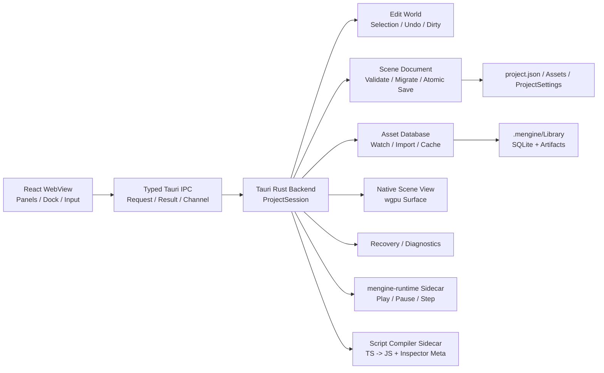

# MEngine 本地编辑器整体技术方案

> 文档状态：实施基线
>
> 编写日期：2026-07-16
>
> 作者：MiYu / Codex
>
> 首要目标：Windows x64 本地编辑器
>
> 参考方案：`jenkins-workbench-technical-design.md`

## 1. 文档目的

MEngine 当前已经具备 React 编辑器界面、Tauri 壳骨架、Rust `mengine-editor-host`、ECS、场景序列化和 wgpu Runtime，但日常编辑仍通过 Vite 浏览器完成。浏览器版本同时存在以下结构性问题：

- 场景在 Vite 私有 HTTP 文件接口和 `localStorage` 之间自动降级，数据位置不明确。
- React 内存 Store 与 Rust `EditorSession` 分别维护场景、选择、撤销和 Play Mode，形成双事实源。
- 当前 Scene/Game 视图是 Canvas2D 模拟渲染，不是 MEngine wgpu Runtime 的真实输出。
- 浏览器生成的 `.mscene` 与 Rust `WorldSnapshot` 字段和组件保留规则已经发生漂移。
- 项目根目录、资源结构、Asset GUID、脚本编译、恢复和发布链路没有统一契约。

本方案建设一个正式的 MEngine 本地编辑器。它不是“把网页套进桌面窗口”，而是以 Rust Host 为唯一真实状态源，以 Tauri 作为受控桌面边界，以 React 复用现有高密度工具面板，并让 Scene View 和 Play Mode 走真实引擎路径。

## 2. 核心决策

| 领域 | 决策 |
| --- | --- |
| 桌面壳 | Tauri 2，不引入 Electron |
| 编辑器 UI | 继续使用 React + TypeScript + 当前 Dock/Panel 体系 |
| 唯一事实源 | Rust `ProjectSession` / `EditorSession` |
| Scene View | Tauri Rust 进程内的原生 wgpu Surface |
| Play Mode | 独立 `mengine-runtime` 子进程，Stop 后销毁 |
| 脚本编译 | 隔离的编译器子进程，生成 Runtime JS 与 Inspector Meta |
| 项目数据 | `project.json` + `Assets` + `ProjectSettings` |
| 本地缓存 | `.mengine/Library`，不进入版本控制 |
| 浏览器版本 | 只作为 Mock UI 开发环境，不承担正式项目编辑 |

## 3. 产品范围

### 3.1 首个正式版本包含

- 最近项目、打开项目、创建项目和项目迁移报告。
- Hierarchy、Inspector、Project、Console、Scene View、Game View。
- 场景新建、打开、保存、另存为、原子写入和异常恢复。
- 实体创建、删除、复制、重排、激活、组件增删改。
- Host 事务级 Undo/Redo、Dirty 状态和保存点。
- 原生 wgpu Scene View、选择、相机和 Transform Gizmo。
- Play、Pause、Step、Stop；Stop 不污染 Edit World。
- Asset GUID、资源扫描、导入队列、缓存和基础热更新。
- TypeScript Behaviour 编译、Inspector 元数据和错误展示。
- Windows x64 可安装/便携构建，运行时不要求安装 Node.js。

### 3.2 首个正式版本不包含

- 多项目同时编辑。
- 插件市场和不受信任的第三方原生插件。
- 完整 Prefab Stage、动画时间轴、粒子编辑器和材质图编辑器。
- 跨平台原生视口一致性；macOS/Linux 放到后续阶段。
- 多人实时协作和远程场景编辑。

## 4. 总体架构



### 4.1 进程边界

#### React WebView

只负责：

- 面板布局、筛选、滚动位置、输入框草稿和弹窗状态。
- 展示 Host Snapshot/Event 形成的只读投影。
- 把用户意图转换为结构化 `EditorRequest`。

不得负责：

- ECS World、正式场景数据、Undo/Redo、Play World。
- 任意文件系统、Shell、网络请求和项目脚本执行。
- 把 `localStorage` 当作场景或项目存储。

#### Tauri Rust Backend

- 持有当前 `ProjectSession` 和 `EditorSession`。
- 验证项目根目录和所有项目内路径。
- 管理场景、撤销、资源、编译、恢复、诊断和原生视口。
- 启动白名单 Runtime/Compiler 子进程。
- 只暴露显式的业务命令和有界 Channel。

#### Play Runtime

- 从编辑器生成的临时场景快照启动。
- 使用正式 `mengine-runtime`、Boa、RHI、物理和音频路径。
- 独立维护 Play World；Stop 直接销毁进程和临时目录。

### 4.2 为什么 Edit Host 不做 Sidecar

Edit World、Scene View、Gizmo、输入、DPI 和窗口生命周期属于高频紧耦合链路。如果 Edit Host 独立进程，需要跨进程传递原生窗口关系、输入和每帧状态，复杂度和延迟都会显著增加。现阶段 Edit Host 静态链接到 Tauri Rust 进程；需要崩溃隔离的项目脚本和 Play Runtime 使用子进程。

## 5. 状态与 IPC 协议

### 5.1 请求模型

```text
EditorRequest
- requestId: UUID
- projectId: UUID
- baseRevision: u64
- transactionId?: UUID
- operation: EditorOperation
```

```text
EditorResult
- requestId: UUID
- acceptedRevision: u64
- result?: payload
- error?: EditorError
```

```text
EditorEvent
- sequence: u64
- revision: u64
- causeRequestId?: UUID
- patches: EditorPatch[]
- dirty: bool
- undoState: { canUndo, canRedo, undoLabel?, redoLabel? }
```

### 5.2 同步规则

- 打开项目、打开场景、事件缺号和恢复后发送完整 `SessionSnapshot`。
- 日常操作只发送增量 Patch，不按渲染帧发送完整 World。
- Host 的 Revision 单调递增，是 Dirty、冲突和事件顺序的依据。
- UI 只能对纯视觉状态做本地预测；实体和组件修改必须等待 Host 接受。
- Host 拒绝过旧、越权、路径非法或 Schema 非法的请求。
- 单次 IPC 限制实体数、字符串长度和负载字节数；大列表使用分页或流式 Channel。

### 5.3 事务和撤销

- Inspector 单字段提交形成一个事务。
- Gizmo 使用 `BeginTransaction -> Preview -> Commit/Cancel`。
- 一次拖动只产生一条 Undo，Preview 不进入历史栈。
- Undo 项同时保存 Forward 与 Inverse，Redo 不得重复应用 Inverse。
- `saveRevision` 记录最近成功保存点，`revision != saveRevision` 即 Dirty。

## 6. 项目模型

```text
MyGame/
├─ project.json
├─ Assets/
│  ├─ Scenes/
│  ├─ Scripts/
│  ├─ Prefabs/
│  ├─ Materials/
│  └─ Textures/
├─ ProjectSettings/
└─ .mengine/
   ├─ Library/
   ├─ Recovery/
   ├─ Temp/
   └─ Logs/
```

- `project.json` 是项目识别入口，使用版本化 Schema。
- `Assets` 和 `ProjectSettings` 进入版本控制。
- `.mengine` 默认忽略，保存导入缓存、恢复数据和诊断日志。
- 窗口布局、最近项目和 Scene Camera 放入当前用户 `%LOCALAPPDATA%`。
- 项目根路径在打开时 canonicalize；后续路径必须验证仍位于该根目录。

## 7. Scene v2

### 7.1 磁盘契约

- 磁盘字段统一使用 `snake_case`，IPC 可映射为 `camelCase`。
- Scene Entity 使用稳定 UUID；ECS Entity 只在加载后临时分配。
- `parent`、事件目标和 Prefab 关系引用稳定 UUID。
- 资产引用使用 Asset GUID，不使用易变的绝对路径。
- 组件数据由 IDL 生成 JSON Schema。
- 未知组件和未知字段必须保留，不能静默丢弃。

### 7.2 保存和迁移

保存顺序：

1. 从 Host 生成 Scene Document。
2. Schema 和引用完整性校验。
3. 写入同目录临时文件。
4. Flush/Sync。
5. 原子替换目标文件。
6. 更新 `saveRevision` 和 Recovery 元数据。

迁移 v1 时先创建备份并执行内存往返比较。发现组件、引用或字段丢失时，只读打开并返回迁移报告，不覆盖源文件。

## 8. Asset Database

- `.meta`/MEngine Meta 提供稳定 Asset GUID 和 Importer 设置。
- 兼容外部 Meta 时保留未知字段，不破坏性重写。
- SQLite 保存路径、GUID、类型、源哈希、导入设置哈希、Importer 版本和 Artifact。
- `notify` 文件监听事件先合并、去重，再进入 `mengine-jobs`。
- Artifact Key 由 `sourceHash + settingsHash + importerVersion` 决定。
- Project 面板通过分页接口读取真实数据库，不硬编码资源。
- 导入失败保留旧 Artifact，并在 Console/Inspector 中展示错误。

## 9. TypeScript Behaviour

编译器生成两份产物：

1. Boa Runtime 使用的 JavaScript Bundle。
2. Inspector 使用的字段、装饰器、按钮、依赖和校验元数据。

React WebView 不执行用户项目脚本。正式发行包携带编译器，不要求用户安装 Node.js。编译失败只阻止受影响脚本刷新和 Play，不阻止打开场景或编辑其他组件。

## 10. 原生视口

- Tauri Rust 进程创建专用原生 Window/Surface。
- React 只报告逻辑矩形、物理尺寸、DPI、可见性和激活状态。
- Host 管理 wgpu Surface、Resize、Suspend、Recreate 和渲染帧。
- GPU 帧不通过 IPC，不使用截图流或 CPU 像素回读。
- 输入直接进入原生视口，再转成选择/Gizmo 事务。
- Scene View 使用 Edit World；Game View 使用 Play Runtime。

Windows 原生嵌入必须先完成 WebView2、焦点、DPI、多显示器、最小化和 Dock Resize 验证。验证失败时首版使用独立可停靠原生视口窗口，不回退 Canvas2D 正式渲染。

## 11. 界面设计

- Project Hub：最近项目、打开、创建、迁移结果。
- 顶部菜单：File/Edit/Assets/GameObject/Component/Window/Help。
- 工具栏：Gizmo、坐标系、Play/Pause/Step、保存状态。
- 左侧：Hierarchy。
- 中央：Scene/Game 原生视口。
- 右侧：Inspector。
- 底部：Project、Console、Import Queue。

### 11.1 可扩展菜单与对象创建

顶部 `GameObject` 菜单和 Hierarchy 右键菜单必须读取同一个菜单注册表，禁止在两个组件里分别维护对象清单。菜单路径采用 Unity `MenuItem` 语义：`GameObject/UI/Health Bar` 会自动生成 `UI` 悬浮子菜单；`priority` 控制排序，`separatorBefore` 控制分组，校验函数控制当前上下文中是否可执行。运行时上下文包含 Store、选择对象、来源、日志和刷新入口，因此同一条命令可同时服务顶部菜单与 Hierarchy。

用户扩展在 `.ts` 模块中可以使用装饰器注册自定义控件；模块需由编辑器入口或扩展入口导入一次：

```ts
import { MenuItem, type MenuItemContext } from './editorWindow';

class MyUiMenu {
  @MenuItem('GameObject/UI/Health Bar', false, 330)
  static create(context: MenuItemContext) {
    context.store.createUiControl('Health Bar', {
      RectTransform: {
        anchor_min: [0.5, 0.5],
        anchor_max: [0.5, 0.5],
        pivot: [0.5, 0.5],
        anchored_position: [0, 0],
        size_delta: [240, 24],
        local_rotation: 0,
        local_scale: [1, 1],
      },
      Image: { color: [0.15, 0.15, 0.15, 1] },
      HealthBar: { value: 1 },
    });
    context.log('GameObject/UI/Health Bar');
    context.refresh();
  }

  @MenuItem('GameObject/UI/Health Bar', true)
  static validate(context: MenuItemContext) {
    return context.store.mode === 'edit';
  }
}
```

`.tsx` 模块使用命令式形式，避免 Babel 装饰器差异：

```ts
registerMenuItem('GameObject/UI/Health Bar', createHealthBar, {
  priority: 330,
  validate: (context) => context.store.mode === 'edit',
});
```
- 状态栏：项目、场景、Host、Revision、资源导入和脚本编译状态。

沿用当前编辑器的专业工具方向：零圆角、紧凑尺寸、1 px 分隔线、无渐变、颜色只承担状态语义。

## 12. 安全设计

- Tauri CSP 必须显式配置，禁止 `csp: null`。
- Capability 按窗口限定，不授予 WebView 通用 FS/Shell 权限。
- 自定义 Command 继续校验窗口标签、Project ID、路径和负载。
- Shell 仅由 Rust Backend 启动白名单 Sidecar。
- 项目脚本运行在 Boa/Runtime 隔离边界，不能取得编辑器文件系统能力。
- 日志、错误和诊断包清除项目外绝对路径、环境变量和潜在凭据。

## 13. 恢复与诊断

- 每个已提交事务更新内存恢复状态。
- 空闲周期和固定事务数写增量 Recovery。
- 异常退出后展示源场景、保存版本和恢复版本差异。
- Console 使用有界 Ring Buffer；落盘日志按大小和时间淘汰。
- 诊断包包含版本、项目 Schema、最近操作、编译/导入错误和 GPU 信息，不包含项目脚本正文。

## 14. 测试与验收

### 14.1 自动化测试

- 项目根路径和路径穿越。
- Scene v1/v2 加载、迁移和未知字段保留。
- Rust -> JSON -> TS -> JSON -> Rust 无损往返。
- 原子保存中断恢复。
- Undo/Redo Forward/Inverse 对称。
- Revision、事件缺号和重新同步。
- 超大 IPC、非法组件和损坏场景拒绝。
- Play Stop 后 Edit World 不变。

### 14.2 性能基线

- 10,000 实体 Hierarchy 使用虚拟化，普通交互 P95 小于 50 ms。
- Scene View 基准场景稳定 60 FPS。
- React 面板不跟随渲染帧整树刷新。
- Project 资源列表分页加载，不一次传输完整数据库。
- Console DOM 保持有界，超大日志不进入单次 IPC。

### 14.3 发布验收

- Windows x64 无 Node/Vite 环境可启动。
- 正式项目数据不写入 `localStorage`。
- 打包版使用内置前端资源，不启动本地 HTTP 开发服务器。
- 应用异常退出不会产生截断 Scene。
- Play Runtime 崩溃不会损坏 Edit Scene。

## 15. 实施阶段

### P0：技术门禁

- Tauri 包加入 Cargo Workspace，建立可重复构建。
- 建立 Typed Transport、ProjectSession、Revision 和错误模型。
- 修复 Scene 未知组件保留、字段兼容和原子保存。
- 修复 Undo/Redo 语义并建立测试。
- 验证原生 wgpu Viewport。
- 验证不依赖外部 Node 的脚本编译器打包。

### P1：本地编辑 MVP

- Project Hub 和项目生命周期。
- React 全面切换到 Tauri Transport。
- Host 权威 Hierarchy、Inspector、Undo/Redo、Dirty 和保存。
- 原生 Scene View、选择和 Gizmo。
- 移除正式路径 Vite FS API 和 `localStorage` 场景后端。

### P2：Runtime 闭环

- Runtime Sidecar、Game View、Play/Pause/Step/Stop。
- TypeScript 编译、Boa 加载、Console 和脚本热更新。

### P3：生产资源链路

- Asset DB、Importer、缓存、Prefab 和 PC Build。

### P4：跨平台

- macOS/Linux Viewport Adapter、签名、安装和升级。

## 16. 两轮自省结论

### 第一轮：架构复杂度

曾考虑将 Edit Host 独立为 Sidecar，但原生视口、输入、DPI 和 Gizmo 会变成跨进程高频同步。最终选择 Edit Host 静态链接 Tauri，Play Runtime 和 Compiler 才使用 Sidecar。

### 第二轮：大爆炸风险

完整方案不能一次迁移。P0 把原生视口、场景无损迁移和编译器打包设为硬门禁；P1 只交付可靠的场景编辑闭环。迁移期间可以保留 Vite Mock，但一个正式项目会话不得混用新旧状态源。

## 17. 最终原则

Rust `ProjectSession` 是项目和场景的唯一真实状态来源；React 是投影和交互层；wgpu 是正式视口；`mengine-runtime` 是 Play Mode 的真实执行路径。任何缓存、预测状态和恢复数据最终都必须能与 Host Revision 和磁盘项目契约校准。

## 18. 2026-07-16 落地状态

本次已完成可安装的 P0 桌面纵向闭环：

- Tauri 2 进入 Cargo/npm/pnpm 构建链，可生成 Windows MSI、NSIS 安装包和独立 EXE。
- Project Hub 通过系统目录选择器打开包含 `project.json` 的项目。
- Project Hub 支持选择父目录并新建项目；创建由 Rust Host 执行，生成标准资源目录、ProjectSettings、`.mengine` 缓存树和可立即打开的默认主场景，WebView 不获得通用文件系统写权限。
- Rust `ProjectSession` 负责项目根目录、受限相对路径、当前 Scene、Revision、Dirty 和保存点。
- 桌面正式打开/保存路径使用 Tauri Command；Scene 正文不再以 `localStorage` 为持久化后端。
- Scene 保存采用同目录临时文件、Flush/Sync 和原子替换。
- 未知组件、Hierarchy 顺序和 Active 字段可以经过加载、编辑快照和保存后保留。
- Undo/Redo 同时保存 Forward/Inverse，Redo 重放 Forward。
- Tauri Capability 只开放基础窗口和目录选择器，不给 WebView 通用 Shell/文件系统权限。

仍未越过的门禁必须保持显式：

- 当前 React Store 在打开与保存之间仍保留一份过渡编辑模型；Hierarchy、Inspector、Gizmo 的每一次修改尚未全部改为 Host typed command，因此还不能宣称完成 P1 的“Host 唯一状态”。
- 当前 Scene View 仍是既有 Canvas2D 路径；Tauri + wgpu 原生 Surface、DPI、焦点和多显示器验证尚未完成。
- 内置 TypeScript Compiler Sidecar、Runtime Sidecar、Asset Database、Prefab 与导入链路尚未实施。
- 桌面场景 Rename/Delete 尚未开放，避免在 Host 提供安全事务接口前从 WebView 直接操作文件。

所以下一实施顺序固定为：先把 UI mutation 全部迁入 typed command 和事务化 Undo，再完成原生 wgpu Viewport 技术门禁，随后接入 Compiler/Runtime Sidecar；不得以现有过渡 Store 或 Canvas2D 冒充最终桌面架构。

后续完成的 2D Canvas 自动合批、常用控件以及 3D 摄像机/灯光/材质第一阶段实现，见 [mengine-2d-3d-rendering-upgrade.md](./mengine-2d-3d-rendering-upgrade.md)。该实现已经提供独立原生 Runtime 的真实 wgpu 验证路径，但不改变上述“编辑器内嵌原生视口尚未完成”的边界判断。

## 19. 2026-07-18 PC Build SDK 落地

桌面发行构建不再把源码仓库、系统 Node.js 和 Rust 工具链作为最终用户前置条件：

- 编辑器打包前生成宿主平台专用 `build-sdk`，包含固定版本的 Node.js、MEngine CLI、TypeScript Compiler，以及 Debug/Release `mengine-runtime`。
- Tauri 将 Build SDK 作为只读 Resource 随安装包分发；Rust Host 校验 SDK schema、宿主平台/架构、相对路径和非符号链接文件后才允许执行。
- PC Build 优先使用内置 SDK，并保留源码 checkout 作为开发回退；自动化环境可通过 `MENGINE_BUILD_SDK` 指向同契约的独立 SDK。
- Build Result 回读 manifest，显示引擎版本、平台架构、场景数、已校验资源/引用、文件数、总字节数、内容哈希和实际工具链。

PC Build 当前边界仍保持显式：只构建当前宿主平台，尚未提供交叉编译、代码签名、安装包生成、增量内容包和远程 Build Farm。Play Mode Runtime Sidecar 与编辑器内嵌原生 Viewport 仍属于独立门禁，不能由 Build SDK 的完成状态替代。

## 20. 2026-07-18 Game View 与 Timeline 可用性闭环

- Game View 不再维护独立横屏/竖屏开关；显示方向、letterbox 和 Canvas 逻辑尺寸只由当前分辨率宽高派生。预设和自定义宽高共用同一个状态模型，旧比例/方向偏好只在载入时迁移。
- Timeline 支持在播放头复制/粘贴关键帧和动画事件，粘贴保留 Hermite tangent 与事件参数，并提供 `Ctrl/Cmd+C/V` 操作入口。
- Timeline 可通过工具栏或 `Shift+Space` 进入最大化编辑模式；最大化后 Details 作为保留宽度的右侧检查器，不再覆盖时间轴末端。
- Timeline 局部工具栏采用无边框图标按钮，关键帧命中区域扩展到 24px，轨道、详情和横向时间轴使用 6px 方形滚动条。

该切片解决的是动画资源的基础创作可用性，不代表完整动画系统已完成。后续仍需 Dope Sheet/Curve 双模式、动画层与 Avatar Mask、Timeline Sequencer 轨道类型以及运行时事件调度的系统化完善。

## 21. 2026-07-18 Timeline 多关键帧编辑闭环

- Timeline 选择模型从单一关键帧扩展为稳定的关键帧集合；普通点击设置主关键帧，`Ctrl/Cmd+Click` 切换离散选择，`Shift+Click` 选择同轨连续范围。
- 轨道空白区域支持跨轨框选；`Ctrl/Cmd/Shift` 配合框选可在原选择上追加，选区命中按真实轨道和时间范围计算。
- 拖动任一已选关键帧会对整个选区执行帧对齐偏移，并在片段首尾统一限位；Details 同时提供前后 1 帧的精确偏移按钮。
- 复制、粘贴和删除作用于整个选区。组粘贴保留跨轨时间间隔、值和 Hermite tangent；超出片段末端时扩展 duration，目标片段缺少绑定轨道时给出部分跳过提示。
- 多选状态保存在未落盘的 Clip draft 中，切换资源再返回不会把选区退化为单选；批量移动、覆盖同帧关键帧和删除均由独立纯函数覆盖自动化测试。

动画系统边界仍保持显式：当前完成的是 Animation Clip 的 Dope Sheet 基础批量编辑，不等同于完整 Sequencer。后续阶段继续补齐曲线批量编辑、轨道分组/折叠、动画层混合与 Avatar Mask，再推进音频、粒子、信号和镜头轨道。

## 22. 2026-07-18 可编辑 Curve View

- Timeline 提供 `Dope Sheet / Curves` 双模式切换；Curve 模式保留播放控制、播放头、横向缩放和 Details，并提供独立的数值轨道选择器，离散轨道不会误入曲线编辑。
- Curve View 对标专业引擎的基础曲线工作区：最多同时显示 X/Y/Z/W 四个通道、时间/数值网格、当前播放头、通道显隐焦点和随缩放变化的可视时间窗。
- 曲线关键点支持直接选择和二维拖动；时间仍按 Clip FPS 吸附，数值按曲线坐标连续编辑，移动后沿用统一的关键帧冲突覆盖与 tangent 保留契约。
- Cubic 轨道显示入/出 Hermite 切线手柄，手柄拖动写入指定通道斜率；工具栏提供 Auto 与 Flat 模式，非 Cubic 轨道可在 Curve View 内一键切换为 Cubic。
- 坐标映射、视口逆变换、值域拟合、关键帧单通道编辑、切线斜率与 Auto/Flat 状态均落在无 UI 依赖的纯函数层，并由自动化测试覆盖。

当前 Curve View 完成的是 Animation Clip 曲线的第一阶段编辑闭环。后续仍需曲线点框选与批量变换、垂直缩放/平移、切线联动/断开模式、阶梯与加权切线显示、轨道分组，以及与 Sequencer 轨道和动画层混合的统一时间域。

## 23. 2026-07-18 自定义材质发布依赖闭环

- 自定义材质的发布契约统一为 `.mmat/.mat -> custom_shader -> .mshader`。编辑器负责创作期诊断，CLI 负责构建场景的传递依赖扫描，最终包内的 `mengine-runtime --validate-package` 使用运行时实际加载器再次校验，三层都不能把无效引用当成普通告警。
- 最终包校验不再只遍历材质的五类 PBR 贴图；`shader: custom` 会强制要求非空 `.mshader` 引用，并使用与运行时热加载相同的项目相对路径边界，拒绝绝对路径和 `..` 穿越。
- Surface Shader 必须通过资源层的 UTF-8、大小和 Hook 检查，并继续通过 RHI 的完整 WGSL 组合、解析与验证。缺失文件、损坏源码或与引擎绑定/入口冲突都会让发布校验失败，不再等到首帧渲染才静默退回默认表面。
- 已验证的 Surface Shader 会进入最终运行时资源计数，保证构建结果面板和 `--validate-package` 输出反映真实材质依赖闭包；重复引用仍按规范化路径去重。

这次闭环解决的是现有 PBR/Unlit/Custom 材质从创作到发布的一致性，不代表成熟材质系统已经完备。后续仍需 Shader Graph、材质实例与参数覆盖、全局/局部 Shader Variant 管理、GPU Instancing/SRP Batcher 等价能力、烘焙与运行时关键字、渲染调试视图，以及移动端/桌面端质量分级和离线 Shader Cache。

## 24. 2026-07-18 PC Build 验证与原子发布

- PC Build 的完整暂存目录现在必须先通过包内 Player 的 `--validate-package`，才能进入发布重命名；最终验证覆盖清单哈希、场景加载、脚本载入和运行时资源闭包，不再对已经公开的输出目录做事后检查。
- 首次构建验证失败时删除隐藏暂存目录，不创建目标输出；使用 `--clean` 替换已有构建时，旧成功包在新暂存包验证完成前保持原位，验证失败后文件与 manifest 均不改变。
- 暂存验证成功后仍沿用“旧输出改名为备份 -> 暂存目录原子改名 -> 删除备份”的提交协议；最终改名失败时恢复旧输出。因此资源验证失败和文件系统发布失败都具备明确的回滚边界。
- `--skip-verify` 仅保留给受控自动化和诊断场景；编辑器标准 Build 路径不会使用该开关。底层 `buildPcPackage` 通过显式暂存验证回调保持可测试性，默认库调用方若需要可发布保证，必须提供等价验证器。

该改进保证“Build 成功”不会指向一个已知无效的目录，但不等同于完整发行流水线。代码签名、安装器、符号与崩溃映射上传、分平台矩阵、可复现工具链锁定、增量 Patch、远程 Build Farm 和发布审批仍是后续生产门禁。

## 25. 2026-07-18 官方最小工程契约

- `samples/spinning-cube` 已从仅供 Runtime 特殊入口读取的扁平文件迁移为标准工程：`project.json`、`Assets/Scenes`、`Assets/Scripts` 和 `ProjectSettings` 与编辑器新建工程、PC Build 使用同一目录契约。
- 场景包含可编辑的 Camera3D、DirectionalLight、MeshRenderer 和 PbrMaterial；启动脚本通过 CommandBuffer 更新 Transform，并由 PC Build 从 TypeScript 重新编译为包内 JavaScript，因此样例同时覆盖场景、脚本、3D 灯光/材质和运行时命令桥。
- `npm run build:samples` 优先发现标准工程的 `Assets/Scripts/Main.ts`，仍兼容尚未迁移的旧样例；Runtime `--sample` 同样优先加载标准路径，避免编辑器/打包器与示例运行入口维护两套源码。
- CLI 测试直接把仓库官方样例构建成包，检查标准场景与编译脚本落位；真实 Debug Player 的暂存验证确认该包可载入 1 个场景、3 个实体和启动脚本。

官方最小工程现在是可执行的发布契约，而不是旁路 Demo。后续新增样例必须从标准工程模板派生并进入相同构建回归；旧 `hello-triangle` 仍保留为无场景脚本兼容性样例，待独立迁移或明确降级为底层 Runtime smoke test。

## 26. 2026-07-18 Animator 同步层与 Avatar Mask

- Animator Controller schema 升级到 v2，旧 v1 Controller 在 Rust 资产层和 TypeScript 创作层都会无损迁移；原 `states/transitions/default_state` 继续作为 Base Layer，避免破坏现有场景、脚本 API 和运行时调试字段。
- 附加层提供 Enabled、Weight、Override/Additive 混合模式、Avatar Mask 路径集合，以及按 Base State 配置的 Motion Override。附加层复用 Base Layer 的状态、过渡进度和归一化时间，Base State 改名/删除时编辑器同步维护层 Motion 引用。
- Avatar Mask 使用相对动画目标路径作为包含列表，路径命中时包含完整子树；空列表或 `*` 表示全部目标，`.` 只作用于 Animator 根节点。这样既能覆盖骨骼层级，也能过滤普通节点动画，不依赖模型专有骨骼编号。
- Runtime 先应用 Base Layer，再按列表顺序叠加启用层。Override 从当前值按权重插值；Additive 对标量/向量应用加权增量，对 Transform 四元数使用单位四元数到增量旋转的球面插值后相乘，避免线性相加破坏单位长度。
- Base Layer 过渡期间，附加层对源/目标 Motion 使用相同过渡权重；只有一侧配置 Motion 时自动淡入或淡出。层 Clip 按 Base Clip 的归一化相位采样，不会因片段时长不同产生循环漂移。
- CLI 构建依赖扫描和最终 Player `--validate-package` 都会遍历层 Motion Clip，缺失或越界引用无法发布。资产规范化、层引用、遮罩、Override/Additive、四元数和过渡同步均有自动化回归。

当前落地的是“同步层”第一阶段：附加层共享 Base State Machine，并兼容内嵌 Mask 路径。独立层状态机、独立层参数/权重的运行时脚本控制、Humanoid Body Mask、IK Pass、层级动画事件与 Root Motion 合成仍需后续实现；编辑器本轮通过类型检查与构建验证，未在本轮重新启动浏览器做视觉验收。

## 27. 2026-07-18 可复用 Avatar Mask 资产

- 新增版本化 `.mavatar` 资源，保存名称与相对 Animator 根节点的目标路径集合。路径自动清理分隔符、去重并拒绝 `..`；空集合或 `*` 表示全部目标，`.` 表示根节点，普通路径自动包含子树。
- Project 窗口和桌面/Web 两套资产扫描均识别 Avatar Mask；`Assets/Create/Avatar Mask` 可直接创建资源，双击后在 Animator 窗口编辑，支持未保存标记、Save 与 Save All。
- Animator Controller 升级为版本 3。每个附加层可选择一个外部 Avatar Mask，并保留内联路径作为补充集合；运行时按修改时间缓存外部资源，热更新后重新加载，并在加载失败时报告具体资源路径而不是静默退化。
- PC 构建依赖扫描把层引用的 `.mavatar` 纳入传递闭包，校验扩展名、JSON 结构和路径安全；最终运行时包启动前再次解析资源，防止编辑器可运行但发布包缺失或损坏。

该切片完成的是通用 Transform 路径 Mask，不等同于 Humanoid Avatar 系统。骨骼导入映射、人体部位开关、IK Pass 和独立动画层状态机仍是下一阶段；现有同步层行为保持兼容。

## 28. 2026-07-18 Animator 独立层状态机

- Animator Controller 版本升级为 4。附加层新增 `timing_mode`：`synced` 保持原有 Base State Motion Override 行为；`independent` 则拥有自己的 Default State、State/Clip/Speed 与 Transition/Condition 集合。
- 独立层共享 Controller 参数，但独立维护当前 State、状态时间和过渡进度。运行时会按层推进、按各层 Transition Duration 混合，再通过层 Weight、Override/Additive 和 Avatar Mask 合成到 Base Layer 结果。
- Animator 编辑器可在每层切换 Synced/Independent，直接创建、重命名和删除独立 State，选择 Clip 与速度，配置 Default State、Any State/普通 Transition、Exit Time、Blend Duration 和参数条件。参数改名、类型变更或删除会同步修复 Base 与独立层条件引用。
- CLI 构建依赖扫描和最终运行时包校验均遍历独立层 State Clip；缺失 Clip、无效默认 State、损坏过渡或不兼容参数条件会在发布前失败，不会生成部分输出。

在该切片完成时，层权重覆盖、指定层 Play、独立层实时调试状态和动画事件尚未暴露给脚本/Inspector；其中前三项在下节继续完成，层动画事件仍保留为后续边界。

## 29. 2026-07-18 Animator 层实例控制与实时调试

- Animator 组件新增 `layer_weights_json` 作为实例级启动/运行权重覆盖，并新增只读调试字段 `layers_json`。每个层状态包含 Enabled、Timing Mode、有效 Weight、当前 State、State Time、Normalized Time、Transition To 与 Transition Progress。
- 脚本 API 新增 `engine.setAnimatorLayerWeight(entity, layer, weight)` 与 `engine.playAnimatorLayerState(entity, layer, state)`；前者只接受 `[0,1]`，后者只允许有 Animator 的实体，并在动画更新阶段验证独立层和 State 名称。
- Runtime 将层播放请求排队到下一动画帧，确保脚本在 Animator 首次初始化前调用也不会丢失。有效权重按“实例覆盖优先、Controller 默认兜底”计算，参与 Synced/Independent 两类层的最终混合。
- Animator 面板新增 Instance Layer Weights / Live Layers 区域，可在 Edit Mode 配置启动覆盖，在 Play Mode 查看层状态、归一化时间、过渡目标与进度，并实时调整权重；Reset 会恢复 Controller 默认权重。
- IDL 是组件字段的单一事实源，本轮通过 codegen 同步 Rust Component、TypeScript API 与 JSON Schema；CLI 的项目 TypeScript 声明同时暴露两项层控制 API。

这仍不是完整 Mecanim：层动画事件、IK Pass、Root Motion 分层合成、StateMachineBehaviour 与运行时状态哈希尚未完成。当前完成的是可创作、可构建、可脚本驱动、可观察的层状态机基础闭环。

## 30. 2026-07-18 Timeline Sequencer 信号轨道闭环

- 新增版本化 `.mtimeline` 资源与 `TimelineDirector` 组件。资源采用可扩展的 `tracks[] + type` 结构，首个正式轨道类型为 Signal Track；每个标记保存时间、名称与可选 JSON Payload，轨道具备稳定 ID、名称和静音状态。
- Project 窗口、桌面/Web 资产扫描与导入白名单均识别 Timeline；`Assets/Create/Timeline` 可创建独立资源，双击后进入 Sequencer。原 `.manim` Animation Clip 同时补齐 `Assets/Create/Animation Clip` 与独立双击打开，不再要求先绑定场景实体。
- Sequencer 提供播放/暂停/停止、可编辑播放头、帧吸附、轨道增删/改名/静音、信号增删、时间与 Payload Inspector、标记横向拖拽和双击轨道添加信号。资源可一键绑定到选中实体；Animation Clip 与 Sequencer 面板常驻挂载，切换资源时草稿进入 Save All，不因 Dock/视图切换丢失。
- Runtime 使用独立 Director 时钟推进 Hold/Loop、正播和倒播，按真实跨界顺序派发信号，并设置单帧 4096 条安全上限。信号在项目 `onTick` 前通过 `onTimelineSignal({ entity, track, signal, time, payload })` 交给脚本；首次进入当前时间点的信号只触发一次。
- CLI 依赖扫描把场景中的 Timeline 引用纳入发布闭包，验证版本、时长、轨道 ID/类型和标记范围；最终 Player `--validate-package` 再使用 Rust 资产加载器解析包内资源。无效 Timeline 会在暂存发布前失败，不产生部分输出。

这一阶段完成了可扩展 Sequencer 的第一条真实运行轨道，不宣称 Timeline 已完整；后续的 Activation Track 继续复用同一 Director 时间域。Audio、Animation、Particle、Camera/Cinemachine 风格镜头与嵌套 Timeline 轨道，以及轨道分组、混合区、绑定表、Extrapolation、录制和 Undo/Redo 仍是后续工作。

## 31. 2026-07-18 TimelineDirector 脚本控制与实时调试

- 项目脚本新增 `engine.playTimeline(entity, restart?)`、`pauseTimeline`、`stopTimeline` 与 `seekTimeline`。接口同时接受数字和字符串实体 ID，完整保留 64 位 ID；Seek 拒绝负数、非有限值和超出 `f32` 的时间，运行时仍按资源时长执行最终夹取或循环。
- Restart/Stop 会重置 Director 的运行时激活记录，确保下一次从 0 秒进入时只派发一次 time-zero Signal；Seek 会在下一帧从目标时间重新进入，Pause 保留当前时间。缺失 `TimelineDirector` 的请求输出明确警告，不会写入错误组件。
- Sequencer 在 Play Mode 检测选中实体是否绑定当前 `.mtimeline`，显示 `LIVE PLAYING/PAUSED`、实际 Director 时间，并把播放、暂停、停止和播放头 Scrub 写回 Director；Edit Mode 继续使用无副作用的本地预览时钟。
- CLI 与新工程生成的 `mengine.d.ts` 同步暴露四个接口，脚本桥自动化测试覆盖精确实体 ID、Restart、Pause、Stop、Seek 与无效时间拒绝，避免编辑器声明领先于 Player 实现。

该切片完成 Director 的基础生命周期控制，但尚未提供按轨道/片段级别跳转、Signal 接收器绑定表、已触发通知抑制策略、嵌套 Director 控制和网络确定性同步；这些能力将在更多轨道类型落地后统一设计，避免每种轨道各自维护一套时间状态。

## 32. 2026-07-18 Timeline Activation Track

- `.mtimeline` 新增 `activation` 轨道：轨道用 Director 子节点相对路径绑定目标，片段以 `[start, start + duration)` 控制目标的本地 Active 状态。路径统一为 `/`，禁止空段、`.`、`..` 和绝对路径；同一 Timeline 禁止两条 Activation Track 控制同一目标。
- 运行时在首次覆盖前保存目标的 authored Active 与 sibling index。离开片段、轨道静音、播放停止、Director 失活、资源加载失败、绑定热重载或轨道移除时恢复原状态，避免一次 Timeline 播放永久污染场景；目标不存在时只报告一次带轨道名和路径的错误。
- Sequencer 支持新建 Activation Track、设置子节点路径、新建/拖动/删除片段、编辑起点、时长和 Active/Inactive 值；轨道和片段使用与 Signal 不同的硬边专业工具视觉。保存前拒绝越界片段、重叠片段和目标竞争。
- Rust 资产加载器、编辑器解析器与 PC Build 依赖校验执行同一版本、帧率、路径、时间范围和重叠规则；最终 Player 包验证仍通过 Rust 加载器复核。回归测试覆盖片段应用/还原、停止还原、缺失绑定去重诊断、路径规范化、重叠拒绝和构建失败不发布半成品。

Activation Track 当前故意只绑定 Director 的后代，尚未引入跨层级/跨场景 Binding Table；这避免把不稳定实体 ID 写入资产。后续先建立稳定绑定表，再在其上实现 Animation、Audio、Particle 与 Camera Track，共用一套绑定丢失诊断、Post Playback 策略和预览还原机制。

## 33. 2026-07-18 Lit Surface Shader 与材质契约加固

- Surface Shader 新增推荐入口 `mengine_lit_surface_hook(surface, uv, world_position) -> MEngineSurface`。`MEngineSurface` 暴露 `base_color`、`alpha`、`normal`、`metallic`、`roughness`、`occlusion` 与 `emissive`，Hook 在环境光和直接光 BRDF 之前运行，因此自定义材质可以改变真实光照输入，而不再只能给最终颜色叠效果。
- RHI 在 Hook 返回后重新约束颜色、Alpha、金属度、粗糙度、遮蔽和自发光，并对零长度法线回退到贴图/顶点法线；Hook 修改后的 Alpha 会参与正向 Cutout 判断。旧 `mengine_surface_hook(color, uv, world_position, world_normal)` 保持最终颜色后处理语义；仅实现旧 Hook 的资产无需迁移，同时实现两者时先修改光照表面、再处理最终颜色。
- 新建 `.mshader` 默认生成 Lit Hook。编辑器诊断、CLI 依赖验证、Rust 资源加载器和最终 RHI Naga 组合验证都接受 Lit 或旧 Hook，但继续拒绝用户自定义绑定和着色器入口；构建测试使用 Lit Hook 走完整的场景到发布依赖路径。
- `.mmat/.mat` 明确只接受版本 1–4，旧版本加载后升级到 v4，版本 0 和未来版本拒绝；编辑器保存固定写出 v4。编辑器与 CLI 同步拒绝未知 Shader、Surface、Blend、Wrap、Filter 枚举，防止拼写错误或未来格式被静默降级为 PBR/Repeat/Linear 后进入包体。

这仍不是完整的 Shader Graph 或材质实例系统：参数反射、属性块、关键字与 Variant 预热、离线管线缓存、GPU Instancing、渲染调试视图和平台质量分级仍需继续实现。当前切片补齐的是“自定义表面真正参与 PBR”以及“创作、构建、Player 对资产契约一致失败”的基础。

## 34. 2026-07-18 EditorOnly 发布剔除

- PC Build 在计算最终清单和 SHA-256 前生成 Player 专用场景：带 `EditorOnly` 组件的实体及其全部后代从 `.mscene` 中剔除，被剔除的选中项会清空，保留实体上的 `__*` 编辑器元数据不会进入包体。
- Prefab 使用相同的递归规则：`EditorOnly` 子树整体剔除；根节点为 `EditorOnly` 的 Prefab 属于纯创作资产，最终包中不写入该文件。依赖扫描也忽略已剔除子树，不会因编辑器辅助节点引用了不可发布资源而阻断 Player 构建。
- 剔除数量写入 `assetValidation.strippedEditorEntities`，CLI 和桌面编辑器 Build Result 都显示实际结果。回归用例覆盖场景父子节点、Prefab 子树、EditorOnly Prefab 根、选中项与元数据清理，并核对构建报告计数。

为保持脚本动态加载兼容性，PC Build 的默认模式仍复制完整 `Assets` 树。因此本节完成的是“运行实体与 Prefab 节点剔除”；未引用资源文件裁剪与 Always Include 白名单在下一节作为可选发布模式独立落地。

## 35. 2026-07-18 可选依赖闭包裁剪

- `project.json` 新增 `assetMode: "all" | "referenced"` 和 `alwaysInclude: string[]`。旧工程缺省为 `all`，保持完整 Assets/Scripts 复制行为；`referenced` 只发布 Build Scenes、JavaScript 启动脚本或 TypeScript 编译产物、场景组件引用、材质/动画/Timeline/Spine/glTF 传递依赖与 Always Include 根。
- Always Include 接受 `Assets`/`Scripts` 下的文件或目录，不超过 256 项；目录递归展开后每个资产仍经过同一依赖校验、路径边界和符号链接拒绝。因此白名单不是绕过验证的复制后门。
- 普通图片引用会自动携带已存在的 `.sprite.json` 导入 sidecar，带 `#slice` 的引用仍校验具体切片；重复引用按规范化绝对路径去重。裁剪后文件先进入暂存目录，EditorOnly 改写、TypeScript 编译、清单哈希和 Player `--validate-package` 仍按原子发布顺序执行。
- 桌面编辑器和浏览器开发模式的 Build Settings 都可编辑模式与白名单，Rust ProjectSession 使用原子替换保存工程清单。Build Result 和 CLI 输出显示实际 `assetMode`、裁剪文件数和源文件字节数，避免将全量包误认为已裁剪包，也让体积收益可被直接核对。

Referenced Only 是可用的单包裁剪基础，仍不等同于完整 Addressables/AssetBundle 系统。脚本拼接的动态路径无法被静态推导，必须纳入 Always Include；资源分组、共享包去重、远程内容、增量 Patch、剔除原因/体积报告和可视化依赖图仍是后续发布系统工作。

## 36. 2026-07-18 AudioSource 可定位播放基础

- `AudioSource` 新增可序列化的 `time` 秒数字段。首次播放从该位置启动；运行时把 Kira 的真实播放位置持续回写组件，暂停保留时间，停止销毁底层声音并归零，因此 Inspector、场景序列化和运行时观察使用同一个状态源。
- 音频同步层区分自然推进与外部时间修改。显式修改会调用底层 `seek_to`，新建或切换声音则使用 `start_position`，避免先从 0 播放一帧再跳转；负数和非有限时间在脚本边界被拒绝，底层仍执行有限范围清理作为第二道防线。
- 项目脚本新增 `engine.seekAudio(entity, time)`，与 Play/Pause/Stop 共用精确保留 64 位实体 ID 的请求通道。CLI 与桌面新建工程模板、示例声明和脚本桥回归测试同步更新，避免声明先于 Player 实现或不同脚手架产生不一致 API。

本节完成的是 Timeline Audio Track 所需的底层定位与状态闭环，不宣称音频序列轨已经完成。下一切片仍需把音频片段、绑定、裁剪入点、Scrub/暂停/停止策略、Sequencer 创作、构建依赖与 Player 校验作为同一条链路交付。

## 37. 2026-07-18 Timeline Audio Track 闭环

- `.mtimeline` 新增 `audio` 轨道，绑定 Director 后代路径上的既有 `AudioSource`。片段保存 Timeline 起点/时长、项目内 WAV/OGG/MP3/FLAC、音频入点、音量、音调与循环；同一目标禁止被多条音频轨竞争，片段禁止重叠，路径、数值范围和轨道 ID 在 Rust、编辑器与 CLI 三端保持一致。
- 运行时只在进入片段、Scrub、资源热变更、Director 回卷或漂移超过阈值时定位声音，正常播放由 Kira 时钟推进，避免每帧 Seek。正向 Director 速度参与播放速率；底层暂不支持运行中反向切换，反播时轨道保持静音并更新定位，不伪装成倒放能力。
- Timeline 首次覆盖前保存完整 authored `AudioSource`。Pause 保留轨道覆盖并冻结声音；Stop、播放结束、空隙、静音、资源失败、Director 失活或轨道移除会恢复原组件。Sequencer 的归零 Stop 可与保留时间的 Pause 区分，Activation Track 同步采用冻结/还原语义，恢复播放不会重复触发当前时间点 Signal。
- Sequencer 可创建 Audio Track 和 Audio Clip、拖动片段，并编辑后代绑定、项目音频、Clip In、音量、音调和循环；音频资产输入带项目候选列表，轨道与片段保持零圆角专业工具样式。`AudioSource.time` 的 Inspector 约束同步为非负秒数。
- Referenced Only 构建把 Timeline 音频作为传递依赖纳入闭包；CLI 在暂存发布前拒绝丢失、越界、重叠和非法路径，最终 Player 再用真实 Kira 解码器校验文件并核对 `clip_in` 小于解码时长。损坏音频或越过音频尾部的入点不能生成可发布包。

当前音频轨仍不是完整 DAW：没有波形缓存/峰值预览、淡入淡出和交叉混合、轨道 Mixer 路由自动化、运行时反向播放、音频 DSP 图与采样级 Timeline 时钟。现有切片完成的是可创作、可播放/暂停/停止/跳转、可还原、可裁剪打包且最终包可解码的第一条可靠音频序列轨。

## 38. 2026-07-18 Timeline Animation Track 闭环

- `.mtimeline` 新增 `animation` 轨道，绑定 Director 后代上的专用 `AnimationPlayer`；片段保存 Timeline 起点/时长、`.manim`、动画入点与 `-4..4` 采样速度。同一目标禁止多轨竞争，片段禁止重叠，目标同时带 `Animator` 时明确失败，避免状态机与 Sequencer 同时写同一姿势。
- Runtime 帧序调整为 Timeline 先求值、Animation 再采样、Audio 最后同步。动画轨把目标播放器设为 `playing=true`、`speed=0` 并写入精确采样时间，因此播放、暂停和 Scrub 都在当前帧出姿势，不再晚一帧；负速片段通过时间反向采样，不依赖播放器自然推进。
- AnimationRuntime 现在记录每个活动播放器的 Clip 身份与上次采样时间；Clip 变化会重新进入并重新武装当前时间事件，Timeline 以零自然速度外部推进时仍按前后采样区间派发正向/反向 Animation Event。停止/空隙/静音/Director 失活或轨道移除恢复完整 authored `AnimationPlayer` 后，原动画不会沿用 Timeline Clip 的活动状态。Pause 保留零速采样姿势，Stop 还原原组件。
- Sequencer 可创建 Animation Track/Clip、拖动片段，并编辑后代绑定、项目动画、Clip In 与 Speed；项目动画候选来自 Asset Database。编辑器解析/保存、Rust 资产加载、CLI 依赖闭包与最终 Player 校验共享轨道、路径和范围契约，最终包还会加载 `.manim` 并拒绝超过动画时长的入点。

该轨道目前控制基础 `AnimationPlayer`，尚未实现 Animator State/Layer Track、片段交叉混合、Avatar Mask 覆盖、Root Motion 合成、录制模式和嵌套 Timeline。下一阶段应先抽象稳定 Binding Table 与通用 Clip Blend，再扩展 Animator/Camera/Particle 轨，避免每种轨道各自维护混合规则。

## 39. 2026-07-18 材质采样质量闭环

- `.mmat/.mat` 升级到 v5，新增独立 `mipmap_filter` 与 `anisotropy`。旧 v1–v4 材质继续无损加载并补齐 Linear mip 与 1x 各向异性默认值；版本 0 和未来版本继续拒绝，编辑器保存统一写出 v5。
- Texture Filter 控制放大/缩小采样，Mipmap Filter 独立选择双线性或三线性，Anisotropy 提供 1x/2x/4x/8x/16x。高于 1x 时资产规范化与 Inspector 同时强制两级过滤为 Linear，满足 wgpu 的 sampler 契约；不支持各向异性过滤的适配器安全回退到 1x，不让材质加载导致设备验证失败。
- Runtime 将三项采样状态纳入 sampler cache key，因此具有不同 mip/各向异性设置的材质不会错误复用同一个 GPU sampler。CLI 在暂存发布前校验版本、枚举、范围与组合约束，最终 Player 仍通过 Rust v5 资产加载器复核，避免编辑器可保存但打包后静默降级。

该切片补齐的是基础纹理采样质量，不代表材质系统已经成熟完备。Material Instance/Property Block、Shader 参数反射、关键字与 Variant 预热、GPU Instancing、烘焙/离线 Shader Cache、平台质量分级和渲染调试视图仍需继续实现。

## 40. 2026-07-18 可追责的 Build Content Report

- `mengine-build.json` 的每个 `files[]` 条目除路径、大小和 SHA-256 外，新增稳定内容类别与 `includedBy[]` 来源。依赖闭包会保留所有去重后的“依赖类型 + 引用资产”，全量模式下未被静态引用的资源明确标记为 `all assets mode <- project.json`，Player、配置、项目清单、ProjectSettings 与编译后的启动脚本也都有独立来源，不再出现无法解释的包内文件。
- 构建阶段按 runtime、scene、script、material、shader、texture、model、animation、timeline、audio、prefab、spine、settings、metadata 和 other 汇总文件数与字节数。汇总按字节降序确定性写入；内容哈希仍只覆盖路径、大小和文件 SHA-256，因此诊断字段不会改变相同产物的内容指纹。
- 桌面 Host 回读清单时重新汇总并核对 `contentSummary.totalBytes`，拒绝缺失类别、缺失包含原因或汇总不一致的构建结果。Build Settings 在成功结果中显示分类占用、Top 20 最大文件、悬停可见的包含原因和实际报告路径，包体优化可以从证据出发。

当前报告解决单次构建的包体归因，尚未覆盖两次构建差异、资源依赖图交互浏览、重复纹理/网格检测、压缩前后体积、AssetBundle/共享组归属、增量 Patch 与远程制品追踪。这些仍是后续构建内容系统的明确工作项。

## 41. 2026-07-19 Timeline Sequencer 基础编辑可用性

- Sequencer 轨道区新增 1x–32x 横向缩放、适配全局、指针锚点缩放与播放头自动跟随；时间刻度按可视像素密度选择稳定的 1/2/5 级距，并保留精确终点。轨道标题在横向滚动时固定，不再随长时间轴移出视口。
- 非 Signal 片段支持主体拖动与首尾边缘裁剪，所有结果按 Timeline 帧率吸附，并受相邻片段与时间轴边界约束。新增片段会寻找下一个可用空隙，轨道已满时明确报错，不再先产生重叠数据、等保存时才失败。
- 拖动保留鼠标按下点与片段/Signal 的原始偏移，避免首次移动跳到指针中心。音频和动画首边裁剪同步修正 `clip_in`，并按正向/反向采样速度限制源时间不得越过 0，保证裁剪前后的内容时间映射连续。
- 工具栏将四个大号“Add Track”按钮收敛为方形弹出菜单，保存、绑定和关闭使用带提示的图标按钮；轨道区与 Inspector 使用窄方形滚动条。`Ctrl/Cmd+S`、Space 和 Delete/Backspace 分别覆盖保存、播放/暂停和删除选中项，输入控件保持文字编辑优先级。

这一切片把现有 Signal、Activation、Audio、Animation 四类轨道推进到基础可编辑状态，但成熟 Timeline 仍需多选/复制粘贴、Undo/Redo、轨道分组与锁定、稳定 Binding Table、片段混合/淡入淡出、Camera/Particle/Animator 轨道、嵌套 Timeline、录制模式和运行时性能分析。后续轨道类型应建立在统一绑定与混合契约上，避免重复实现各自的生命周期。

## 42. 2026-07-19 Material Property Block

- 新增引擎级 `MaterialPropertyBlock` 组件，为 Base Color、Metallic、Roughness、Emissive 与 Emissive Strength 分别提供显式覆盖开关。默认所有开关关闭，因此组件加入旧场景或通过缺省字段反序列化时不会改变渲染结果。
- Player 先完整解析 MeshRenderer 的 `.mmat/.mat`、自定义 Surface Shader 或内置材质预设，再应用 Property Block。覆盖只修改启用的数值参数，材质的纹理、Shader、透明/裁剪模式、混合、深度写入、渲染队列、UV 与采样器状态保持不变；非法数值在运行时边界执行有限值与物理范围清理。
- IDL、Rust 组件工厂、TypeScript API 与 JSON Schema 由同一代码生成源同步。Inspector 只在对应覆盖开关启用时显示数值字段；Add Component 将 Property Block 声明为依赖 MeshRenderer，缺少时自动补齐，避免产生静默无效组件。
- Scene View 预览采用与 Player 相同的“完整材质或旧 PbrMaterial → Property Block”优先级。为 MeshRenderer 重新分配材质资产时仍会移除会完全遮蔽资产的旧 `PbrMaterial`，但保留 Property Block，使实例级调色和粗糙度差异可跨材质替换继续工作。

该切片完成的是不复制材质资产的实例参数覆盖，不等同于 GPU Instancing 或完整 Material Instance 资产系统。后续仍需 Shader 参数反射驱动任意属性、纹理属性块、材质实例继承、SRP Batcher/GPU Instancing 兼容布局、关键字与 Variant 管理、烘焙缓存和渲染调试视图；旧 `PbrMaterial` 继续作为兼容整材质替换存在，后续应提供显式迁移工具而不是静默改变其语义。

## 43. 2026-07-19 Build-to-Build Content Comparison

- 桌面 Host 在启动当前平台与 Debug/Release 配置构建前，读取同一输出目录中上一次已发布的 `mengine-build.json`。只接受普通目录与普通 manifest 文件，符号链接、损坏 JSON、旧格式或缺失哈希会安全跳过比较，不会阻断当前构建。
- 当前构建完成并通过原有 manifest 回读校验后，按规范化文件路径、SHA-256 与大小比较前后清单，分别统计 Added、Removed、Changed、Unchanged 与总字节增量。同路径同大小但哈希不同仍属于 Changed，避免漏掉等尺寸二进制或压缩资源变化。
- 差异明细按字节变化绝对值降序、路径升序确定性排列，向编辑器返回前 20 项；汇总计数不受截断影响。每项保留变化类型、内容类别、前后大小与有符号字节差，完全相同时明确显示上一构建内容哈希的 Byte-identical 结果。
- Build Settings 在单次内容分类和最大文件列表之后显示跨构建摘要与明细。比较基线来自磁盘上的已发布清单，因此关闭并重新打开编辑器后再构建仍可比较；构建失败继续由原子发布协议保留旧输出，也不会伪造一次成功差异。

当前比较解决单一平台/配置输出的相邻两次构建差异，不是完整制品历史库。长期仍需持久化多版本索引、任意两次构建选择、分类/依赖原因变化、重复资源诊断、压缩前后体积、CI 制品 URL、符号与崩溃映射、签名/安装器状态、增量 Patch 生成和远程 Build Farm 追踪。

## 44. 2026-07-19 Timeline Sequencer 可逆编辑与剪贴板

- Sequencer 新增每资产最多 100 步的 Undo/Redo 历史，覆盖轨道创建/删除、Signal 与 Clip 创建/删除、Inspector 字段修改、片段移动/裁剪以及粘贴。历史快照同时保存选择和播放头时间；保存后仍可撤销到已保存版本并正确恢复 Dirty 状态，未保存资产切换时历史随 draft 一起保留。
- 拖拽采用单事务语义：跨过半帧阈值后才记录一次原始快照，后续 Pointer Move 只更新当前事务，不会为每个像素堆积 Undo；`pointercancel` 同时恢复资产、选择、时间和拖拽前的 Undo/Redo 栈。
- Signal、Activation、Audio、Animation 项支持 `Ctrl/Cmd+C/X/V/D` 复制、剪切、粘贴与重复。剪贴板深拷贝 Signal Payload 和 Clip 参数；粘贴优先使用选中的同类型轨道，其次使用源轨道 ID 或第一个兼容轨道，并按播放头/片段尾部寻找不重叠空隙，失败时给出明确诊断。
- 工具栏新增方形 Undo、Redo、Copy、Paste 图标按钮与可访问标签；`Ctrl/Cmd+Z`、`Ctrl/Cmd+Shift+Z` 和 `Ctrl/Cmd+Y` 均可恢复历史。轨道空白区和标尺会聚焦 Sequencer，按钮焦点仍响应组合快捷键；输入框、文本域与下拉框保留系统文字编辑快捷键。

该切片完成的是单项选择下的基础可逆编辑。成熟 Timeline 仍需多选 Clip/Signal、跨轨道组复制、框选、Ripple Edit、吸附参考线、轨道分组、命名剪贴板、跨 Timeline Undo 服务，以及与全编辑器统一 Undo 栈的事务合并；Inspector 的 Focus/Blur 事务合并见第 46 节。

## 45. 2026-07-19 Timeline 持久化轨道锁定与排序

- 四类 Timeline Track 统一新增向后兼容的 `locked` 编辑元数据；旧资产缺省为 `false`，TypeScript 与 Rust 解析器、规范化和序列化保持同一契约。Lock 不影响 Player 求值和打包播放，只保护创作内容。
- 锁定轨道禁止新增、剪切、重复、删除、粘贴、片段移动/裁剪及 Inspector 内容修改；复制、Mute 和解除锁定仍可使用。粘贴算法只解析未锁定的兼容目标轨道，并保持源资产不可变。
- 全局 Duration 缩短不会再暗中裁剪锁定内容：锁定 Marker/Clip 的最晚结束时间成为合法最小时长，实际收缩只调整未锁定轨道。轨道列表以条纹、锁图标和禁止光标明确反馈状态。
- Track Inspector 提供带边界检查的 Move Up/Move Down，排序使用纯函数生成新资产并进入同一 Undo/Redo 历史；锁定、越界和目标失效均返回明确诊断。

轨道锁定解决的是单轨内容保护，不等同于成熟组织系统。后续仍需 Track Group、折叠、组级 Mute/Lock、拖拽排序、多选、Ripple Edit、吸附参考线、通用 Binding Table，以及 Animator 和嵌套 Timeline 轨道；Camera Track 的第一阶段实现见第 48 节。

## 46. 2026-07-19 Timeline Inspector 编辑事务

- Sequencer Inspector 的文本、数字、下拉框按一次 Focus 到 Blur 手势合并历史：首次真实变化记录原始资产、选择和播放头，持续输入只更新同一事务，不再每个字符占用一个 Undo 步骤。
- 事务开始时保留原 Undo/Redo 栈；若用户通过系统文字 Undo 或重新输入把字段改回原值，Blur 时移除空事务并恢复原 Redo 分支。Checkbox 继续作为单次原子历史，Signal Payload 继续在 Blur 完成 JSON 校验后记录一次。
- 资产切换会明确终止正在编辑的事务；保存不会清空历史，因此保存后仍能撤销，并依据序列化指纹正确恢复 Dirty 状态。

该实现先收敛 Timeline 自有历史的手势粒度。成熟编辑器仍应把场景、材质、动画、Timeline 等资源编辑统一到带事务名称、资源路径和合并键的全局 Undo 服务，并在菜单中显示下一步可撤销/重做动作。

## 47. 2026-07-19 Timeline Particle Track 闭环

- `.mtimeline` 新增第五类 `particle` 轨道，使用 Director 后代路径绑定 `ParticleEmitter2D` 或 `ParticleEmitter3D`。片段保存 Start、Duration 与 Clip In/Prewarm；同一资产禁止多条 Particle Track 控制同一路径，片段禁止重叠。
- `ParticleWorld` 新增实体级确定性 Seek 与 Reset。进入片段、暂停 Scrub、循环跳转、倒放、非 1 倍速或单帧跨度超过增量模拟安全上限时，从固定 Seed 按运行时相同子步重建到片段本地时间，并跳过当帧普通更新，避免重复推进或卡顿帧失步；连续 1 倍速正向播放继续使用增量模拟。
- 暂停 Timeline 的播放头变更现在按“资产路径 + 上次求值时间”检测并重采样所有 Activation、Audio、Animation 与 Particle Track，不触发 Signal、也不推进 Director 时间。显式 Stop/Reset 与 Seek 使用独立入口，Stop 仍恢复 authored 状态，Seek 才强制重新求值。
- Pause 冻结现有粒子；离开片段、Mute、Stop、绑定失效或 Director 失活时恢复 authored 粒子组件并清空 Timeline 瞬时粒子。Sequencer 支持创建轨道/片段、拖动和两侧裁剪、Prewarm、Undo/Redo、锁定、复制粘贴与碰撞安全放置。
- Editor、CLI 与 Rust 资产解析共享 300 秒的单片段最大确定性模拟时间（`clip_in + duration`），同时由 `ParticleWorld` 入口兜底，防止异常资产产生无界重建。PC Build 会接受并校验 Particle Track、锁定字段、绑定路径、范围与重叠。

当前 Particle Track 是基础发射控制，不是 Unity Particle System Timeline 的完整替代：尚缺 Burst/Emission Curve、颜色和尺寸曲线、Sub Emitter、碰撞、Trails、GPU 粒子、独立 Time Scale、片段混合和缓存快照。世界空间粒子 Seek 使用目标当帧 Transform 重建，不能还原过去每一帧移动发射器的历史轨迹；后续需引入模拟缓存或可采样的 Transform 历史。恢复 authored 组件时会重置瞬时粒子而非恢复进入 Timeline 前的粒子快照。

## 48. 2026-07-19 Timeline Camera Cut 与 Blend

- `.mtimeline` 新增单一 `camera` 轨道，每个 Shot 片段保存 Director 后代 Camera 路径、Blend In 和 Linear/Ease In-Out 曲线。资产层、Sequencer 和 PC Build 共同校验单轨约束、后代路径、片段范围、非重叠、Blend 范围和曲线枚举。
- Timeline Runtime 不改写 `Camera2D/Camera3D.primary`，而是生成当前帧临时相机覆盖；Pause/Scrub 保留或重采样覆盖，Mute、空隙、Stop 和 Director 失活自动释放。多个 Director 同时控制相机时按 Director 实体 ID 稳定仲裁，结果不依赖 HashMap 遍历顺序。
- 相邻 Shot 的 Blend 从上一台 Camera 过渡；首个或非相邻 Shot 从 authored primary Camera 过渡。兼容的透视相机插值世界位置、旋转、FOV、Near/Far，兼容的正交相机插值姿态、Size、Near/Far，同时平滑背景颜色；透视与正交投影不做矩阵硬插值，而在中点执行明确 Cut。
- Sequencer 支持创建 Camera Track/Shot、拖动和裁剪、片段级 Camera 绑定、Blend In/Curve、锁定、Undo/Redo、复制粘贴和可视化 Blend 区域。轨道资产最多一个，避免多个 Camera Track 的未定义混合优先级。

当前实现是稳定的基础 Camera Cut/Blend，不等同于 Cinemachine：尚缺 Virtual Camera 状态、LookAt/Follow、阻尼、构图器、镜头碰撞、噪声、路径 Dolly、Target Group、镜头事件、Blend Preset 资产和 Scene View Shot Preview。跨透视/正交采用 Cut 是显式限制；后续如需跨投影过渡，应设计投影变形模型，而不是线性插值投影矩阵。

## 49. 2026-07-19 Timeline 多选与 Ripple Delete

- Sequencer 以统一的 `track + item index` 选择模型支持跨轨道多选：`Ctrl/Cmd+Click` 切换单项，`Shift+Click` 在同一轨道内连续范围选择，`Ctrl/Cmd+A` 选择全部项目，`Escape` 清空选择。普通点击与开始单项拖动会收敛为单选，避免旧的单项拖动代码意外移动整组。
- 多选状态与主选择同时进入草稿、Undo/Redo 快照和 Inspector 编辑事务；切换未保存 Timeline 后仍能恢复整组选择。轨道、片段和 Signal 分别显示清晰的选中反馈，工具栏显示选择数量，Inspector 明确提示属性只编辑主选择项。
- 普通 Delete 对所有选中项目执行一次原子事务。删除前先校验全部轨道和索引，只要其中一条轨道锁定或选择失效就整体拒绝，不产生部分删除；成功后只写入一个 Undo 步骤。轨道标题选择仍保留原有整轨删除语义。
- `Shift+Delete` 与工具栏 Ripple Delete 对所有涉及的 Clip 轨道执行逐轨道闭合：删除选中片段后，后续片段按已完全位于其前方的删除时长累计左移，并按 Timeline 帧率吸附。Signal Marker 不参与时长闭合，但可与 Clip 在同一原子操作中删除；仅选 Marker 时明确拒绝 Ripple，Timeline 总时长保持不变。
- 锁定项目可以被纳入多选以便审查和复制语义保持一致，但任何包含锁定轨道的删除都会原子失败。当前组复制、剪切与重复尚未提供可靠的落点/碰撞契约，因此多选时会显示明确错误，而不是静默只处理主选择项。

这一阶段完成的是可撤销的基础多选删除和逐轨道 Ripple Delete。成熟 Timeline 仍需框选、组拖动、组复制/粘贴/重复、Ripple Insert/Move、跨轨道全局 Ripple、吸附参考线、轨道分组与跨资产命名剪贴板；这些能力必须继续建立在同一选择模型和事务边界上，不能为每种手势各自维护一套隐式状态。

## 50. 2026-07-19 Timeline 组剪贴板与组拖动

- 多选项目现在可以整体 `Copy/Cut/Paste/Duplicate`。组剪贴板深拷贝 Signal Payload 和所有 Clip 参数，以最早项目为时间锚点，保留跨轨道相对时间、项目顺序、源轨道 ID 与主选择项；切换 Timeline 资产后也可以把组粘贴到结构兼容的目标。
- 组粘贴优先复用未锁定的同 ID、同类型源轨道；缺失时将每条源轨道独立映射到未占用的兼容目标轨道，绝不把两条源轨道静默压缩到同一轨道。目标映射、组内碰撞、既有片段碰撞和 Timeline 边界全部通过后才一次性插入；任何失败都保持资产不变。
- 粘贴位置从播放头按帧吸附后开始搜索，整体形状无法放下时跳到阻挡片段末尾继续搜索，尾部无空间时再尝试头部。成功后所有新项目进入一次 Undo 事务并保持组选择，主选择与播放头指向组剪贴板原先的主项目。
- 在已选组中按下任一项目主体会拖动整组；边缘裁剪仍明确只作用于主项目。移动算法为所有 Signal/Clip 计算同一个帧吸附增量，同时受 Timeline 两端和每条轨道全部未选片段约束，所以不会改变组内相对间距、穿越阻挡片段或产生部分移动。包含任意锁定轨道时整组拒绝移动、剪切和重复。
- 组 Cut 在复制和删除校验全部通过后才同时更新剪贴板与资产；组 Duplicate 复用同一粘贴放置器，不维护第二套碰撞规则。拖动越过半帧才写入一个 Undo 步骤，回到原位会移除空历史，Pointer Cancel 会恢复资产、选择、播放头和 Undo/Redo 栈。

这一阶段补齐了多选之后最常用的组操作，但 Timeline 仍缺框选、键盘逐帧移动、吸附参考线、Ripple Insert/Move、跨轨道全局 Ripple、轨道分组/折叠和跨进程命名剪贴板。组粘贴当前只映射到已有兼容轨道，不自动创建轨道；这是为了让粘贴保持可预测，后续若增加自动建轨必须作为用户可见选项并纳入同一事务。

## 51. 2026-07-19 全局命名 Undo 事务基础

- 新增编辑器级 `EditorUndoService`，历史项统一包含 Scope、用户可见动作名称、旧快照、当前状态捕获器与恢复器。Undo 在恢复前捕获当前状态形成对称 Redo；新分支自动清空 Redo，默认全局容量为 128，最旧事务按顺序淘汰。
- 服务提供按 Scope 清理，加载/新建场景只清除 `scene` 历史，不会误删后续接入的 Timeline、材质或动画事务。Checkpoint 可以完整保存 Undo/Redo 分支，场景无变化的 Transform 手势会恢复 Checkpoint，因此不会留下空 Undo，也不会破坏手势开始前已有的 Redo。
- 捕获或恢复抛错时历史项不出栈；恢复阶段禁止嵌套 Record、再次 Undo/Redo 或清理历史，避免回调重入破坏栈顺序。订阅者异常被隔离，不会阻断其他窗口更新；App 订阅 Revision，因此历史由非场景面板写入后 Edit 菜单也能立即刷新。
- Scene Store 已从私有 `undoStack/redoStack` 迁移到共享服务，创建、删除、重命名、激活、层级调整、Prefab、组件、材质分配、Transform/UI 手势等入口写入具体动作名称。Edit 菜单现在显示 `Undo <Action>` / `Redo <Action>`，Store 的快捷键入口作为全局历史门面，可恢复最新 Scope 的事务。
- 场景快照仍复用经过验证的深拷贝与选择修复逻辑；这次迁移改变历史编排而不改变场景序列化。服务自身由纯 Node 单测覆盖命名、对称恢复、容量、分支、Scope、Checkpoint、失败原子性和恢复重入保护，Store 接入由完整 TypeScript/Vite 构建覆盖。

这只是统一 Undo 的基础设施和第一位迁移者，不代表所有编辑器已接入。Sequencer 当前仍保留每资产本地历史以维护未保存草稿切换语义；Animation、Animator、Material、Shader、Sprite 与 Project Settings 也需要定义各自 Scope、当前状态捕获器、失活资产恢复策略和保存点 Dirty 计算后逐步迁移。迁移过程中 Edit 菜单只应展示已进入全局服务的事务，本地面板按钮仍负责其尚未迁移的历史，直到对应资产通过完整回归门禁。

## 52. 2026-07-19 Sequencer 全局 Undo 迁移

- Sequencer 删除每资产私有 `undo/redo` 数组，所有创建、Inspector 合并编辑、删除/Ripple、剪切粘贴、轨道排序、单项/组拖动和裁剪都写入共享 `EditorUndoService`，Scope 为 `timeline:<asset path>`。Edit 菜单、全局 `Ctrl/Cmd+Z/Y` 与 Sequencer 工具栏读取同一栈和同一动作名称，不再出现本地已撤销但全局菜单仍指向旧场景事务的双历史漂移。
- Timeline 文档快照包含资产、主选择、多选集合和播放头。恢复器按路径判断目标是否正在显示：当前文档直接更新 React 状态与同步 Ref，非当前文档更新后台草稿；因此按 A、B 两个 Timeline 交替编辑后，可以在仍显示 B 时撤销 A，随后打开 A 会看到正确结果。
- 后台文档不再只缓存 Dirty 资产；打开过的干净文档也保留轻量状态，作为仍在全局历史中的捕获/恢复目标。Dirty 计算逐个比较资产与各自保存基线，Save All 只写入真正变化的后台文档，并更新而不是删除其保存基线，使“保存后撤销”“跨资产撤销后再保存”保持一致。
- Inspector Focus/Blur 事务和 Pointer Drag 使用共享 Checkpoint：连续输入或拖动只产生一个命名步骤，回到原值、组拖回原位或 Pointer Cancel 恢复操作前的 Undo/Redo 分支。加载新文档不会清除其他 Timeline/Scene Scope，保存也不清空历史。
- Timeline 内已处理的 `Ctrl/Cmd+A/C/X/V/D/Z/Y` 和 Delete 会阻止继续传播；App 的窗口级快捷键也先检查 `defaultPrevented`。这修复了过去 Timeline 操作可能同时触发场景复制、重复或删除的双派发问题，资源编辑和场景编辑现在只会产生一个全局事务。

迁移后的历史是主进程 WebView 内的全局顺序；当前原生分离窗口仍有独立 JS 运行上下文，尚不能共享闭包式捕获器。要实现跨原生窗口 Undo，需要把事务状态变为可序列化命令，通过桌面 Host 的单一历史服务和窗口消息总线恢复，而不能简单同步栈标签。Material、Animation、Animator 等资产编辑器仍待迁移，下一阶段应复用同一“路径 Scope + 后台文档”适配模式。

## 53. 2026-07-19 Material Editor 全局 Undo 与安全 Assign

- Material Editor 从“完全没有撤销”迁移到共享全局历史，Scope 为 `material:<asset path>`。Name、Shader/Surface/Blend、颜色、PBR 标量、纹理引用、UV、Wrap/Filter、Anisotropy 等全部修改写入命名事务；Anisotropy 自动联动 Linear Filter 的多个字段保持一个原子步骤。
- 文本、数字、颜色、滑条和下拉框按一次 Focus 到 Blur 合并，连续拖 Metallic/Roughness/Alpha/Occlusion 不再为每个浏览器 `change` 事件生成一步。Checkbox、对象选择、清空和拖放纹理作为单次事务；改回原值时恢复 Checkpoint，不留下空历史。材质工具栏新增带下一动作名称的全局 Undo/Redo。
- 当前材质和后台材质文档都保留独立保存基线；跨材质 Undo 直接恢复非当前草稿，Dirty 状态随之刷新。Save All 仅写变化文档并保留干净后台状态作为仍在历史中的恢复目标；普通 Save 会规范化回读但不清空 Undo，因此支持保存后撤销再保存。
- Assign 现在保证磁盘与用户看到的材质一致：当前材质 Dirty 时按钮显示 `Save & Assign`，先完成序列化、引用刷新和错误校验，成功后才给 MeshRenderer 写入场景引用。保存失败不会产生场景 Assign 事务，也不会让 Scene/Player 继续读取旧材质却显示已分配成功。
- Material 与 Scene 事务共享全局顺序：修改材质后 Assign 会先结束材质输入事务，再记录 `Assign Material` 场景事务，连续 Undo 依次恢复场景引用和材质参数。纹理缺失诊断、Property Block 保留与旧 PbrMaterial 完整覆盖规则保持不变。

这次完成的是材质资产编辑可靠性，不代表材质系统已经完备。仍缺 Shader 参数反射驱动的任意属性面板、Material Instance 继承资产、关键字/Variant 管理与预热、SRP Batcher/GPU Instancing 兼容布局、渲染状态模板、纹理导入语义、烘焙 Shader Cache、平台质量分级、材质依赖图和 Frame Debugger。当前预览球仍是 CSS 近似色块，不是 Player 同管线离屏渲染；这是下一轮材质可视化必须消除的真实性缺口。

## 54. 2026-07-19 Animation Clip 全局 Undo 迁移

- Animation Clip 编辑器从“仅有 Dirty 草稿、没有撤销”迁移到共享 `EditorUndoService`，Scope 为 `animation:<asset path>`。轨道创建/删除、录制关键帧、关键帧与事件增删改、组移动、曲线与切线、复制粘贴、Clip 时长/帧率/循环模式和轨道绑定字段都写入带动作名称的全局事务；Edit 菜单、窗口快捷键与动画工具栏读取同一顺序。
- 历史快照同时保存 Clip、播放头、轨道、主关键帧、多关键帧选择和事件选择。恢复当前文档会同步 React 状态与捕获 Ref，并立即驱动 Scene 预览重新采样；恢复非当前文档则按路径更新后台草稿，因此交替编辑多个 `.manim` 后仍可按真实全局顺序 Undo/Redo。
- 打开过的干净动画也保留后台文档作为历史捕获目标，Dirty 只逐个比较序列化内容与各自保存基线。Save All 仅写入变化的后台动画，写入后更新并保留保存基线；普通 Save 不清空历史，所以保存后撤销会重新变 Dirty，随后可再次保存。
- 文本、数字、下拉框和关键帧值编辑按一次 Focus 到 Blur 合并；返回原值会恢复历史 Checkpoint，不产生空事务。关键帧/事件和曲线拖动只在 Pointer Up 提交一个事务，录制产生的同一批属性变化也作为一个原子步骤。面板处理的 `Ctrl/Cmd+S/Z/Y` 会阻止传播，文本输入继续保留系统文字 Undo。

这次补齐的是 Animation Clip 资产编辑的基础可靠性，不代表成熟动画系统已经完备。仍缺导入模型动画的分段与重定向工作流、Humanoid/通用骨骼 Avatar、Root Motion、动画压缩与误差预览、曲线过滤、批量关键帧工具、Onion Skin/轨迹可视化、嵌套动画层和运行时性能分析；Animator Controller 仍需迁移到同一全局历史。与其他资源面板一样，原生分离窗口目前拥有独立 WebView 历史，跨窗口统一 Undo 必须下沉到桌面 Host 的可序列化命令服务。

## 55. 2026-07-19 Animator Controller 全局 Undo 迁移

- Animator Controller 的全部资产写入口统一经过共享 `EditorUndoService`，Scope 为 `animator:<asset path>`。Controller、Layer、同步/独立状态机、Motion、Parameter、State、Transition、Condition、Avatar Mask 引用和图节点位置修改不再绕过历史；工具栏、Edit 菜单与 `Ctrl/Cmd+Z/Y` 使用同一全局顺序。
- 历史快照包含完整 Controller、当前 State 选择和 Transition 选择。非当前 Controller 也保留带独立保存基线的后台文档，因此跨 Controller Undo/Redo、保存后撤销和 Save All 后继续重做都不会因为草稿被删除而失去恢复目标；Save All 只写真实变化的后台 Controller。
- 文本、数字和下拉框按 Focus 到 Blur 合并，字段动作名优先使用 `aria-label` 或所属 Label，例如 Name、Weight、Blend；Checkbox 与增删按钮保持单次原子事务。输入改回原值会恢复 Checkpoint，保留操作前已有的 Redo 分支；文本框继续使用系统文字 Undo，数字、下拉和面板按钮走全局历史。
- 状态图拖动新增明确的 Pointer 事务：Pointer Down 捕获 Controller、选择和全局历史分支，任意数量 Pointer Move 只更新同一 `Move Animator State` 事务，Pointer Up 提交一次；拖回原位移除空历史，Pointer Cancel 同时恢复资产、选择和 Undo/Redo 分支。运行时参数、Layer Weight、Play/Start 和 Assign 仍通过 Scene Store 记录场景事务，不会被误并入 Controller 资产。

这一阶段解决的是 Animator Controller 创作可靠性，不代表动画状态机已达到成熟引擎标准。仍缺 Blend Tree 与参数化 Motion、Sub-State Machine/Exit 节点、StateMachineBehaviour、Transition 中断源和有序中断、状态标签与 Any-State 细化、图框选/多选/复制粘贴/缩放、运行时断点与条件诊断、动画层性能分析，以及模型 Avatar/Root Motion 的端到端联调。`.mavatar` Avatar Mask 编辑器仍是同一 Animator 面板中的独立资产编辑器，下一切片需要单独接入路径 Scope 与后台文档；跨原生分离窗口历史仍需桌面 Host 服务。

## 56. 2026-07-19 Avatar Mask 全局 Undo 与后台保存

- `.mavatar` 编辑器接入共享全局历史，Scope 为 `avatar-mask:<asset path>`。Mask 重命名、路径编辑、添加与删除路径全部成为命名事务；Animator 面板切换 Controller 与 Avatar Mask 时，两类资产各自保持独立路径 Scope，却共同参与 Edit 菜单、工具栏和窗口快捷键的真实全局顺序。
- 文本输入按 Focus 到 Blur 合并，改回原值恢复 Checkpoint；工具栏 Undo/Redo 读取全局下一动作名称，`Ctrl/Cmd+S` 保存 Mask，文本框继续保留浏览器文字 Undo。打开过的干净 Mask 也保留后台文档，支持切到 Controller 后撤销 Mask、保存后撤销和跨 Mask Redo。
- Dirty 依据每个 Mask 与各自保存指纹计算。Save All 只写真实变化的后台 Mask，保存成功后更新并保留其基线，不再删除历史仍需捕获的文档；后台保存完整进入 `saving/try/finally` 生命周期，避免重复触发，并且没有后台变化时不再重复刷新 Project 资源列表。

当前 Avatar Mask 仍是路径列表级工具，不是成熟骨骼遮罩工作流。后续需要从模型/Spine 骨架生成可搜索层级树、父子联动与部分权重、Scene/Animation 预览高亮、缺失骨骼诊断、Humanoid Body Part 快捷掩码、Mask 比较/合并，以及模型重导入后的路径迁移。跨原生分离窗口的 Mask 历史同样受独立 WebView 限制，必须由桌面 Host 的可序列化历史服务统一。

## 57. 2026-07-19 Build Settings 草稿安全与构建门禁

- Build Settings 的 `Always Include` 不再是游离于编辑器状态之外的文本框。输入按与磁盘上已规范化路径列表的精确差异进入 Dirty；空行和首尾空白不会伪造修改，顺序和重复项仍如实比较。
- Scene/Project 刷新触发的 Build Settings 重读会保留未应用草稿，不再用旧磁盘值覆盖用户输入。`Apply Paths` 可单独持久化；`Save All` 通过统一参与者机制保存同一份草稿，失败会让 Save All 整体返回失败并留下诊断。
- 未应用的构建资源路径会在 Build 页签和窗口标题显示星号，进入浏览器和桌面原生窗口关闭保护。主窗口与分离 Dock 窗口都注册原生关闭检查，并扩展到所有已跟踪资源，不再只检查 Scene。
- `Build Player` 和 `Build & Run` 在草稿 Dirty 时硬性禁用，执行入口也有二次校验，防止用户看到新路径却实际构建旧配置。修改草稿会废弃页面上的上一次构建结果，避免把旧报告误认为当前配置产物。

两轮自审后，这一切片解决的是“编辑器显示值与实际打包输入一致”，不代表 Build Pipeline 已成熟。当前构建过程仍缺结构化进度、安全取消与分阶段耗时；多目标与跨编译、签名/公证/安装器、符号和崩溃映射、增量缓存与 Patch、远程 Build Farm、CI 配置锁定和长期制品索引仍是达到成熟引擎构建系统前的必做项。

## 58. 2026-07-19 Surface Shader 权威编译校验

- 桌面编辑器 Host 直接依赖 `mengine-rhi` 暴露的 Player Surface Shader 校验器，不在 TypeScript 中复制一份会漂移的 WGSL 契约。校验先经 `mengine-assets` 执行 UTF-8、256 KiB、NUL 和 Hook 存在性检查，再把用户 Hook 注入真实 Forward WGSL，由 Naga 执行完整解析与类型验证。
- Surface Shader 工具栏新增 `Validate`。在桌面编辑器中，它与 `Save` 走同一权威链路；未知 `MEngineSurface` 字段、错误返回类型、语法错误或保留绑定在落盘前立即拒绝，不再等到运行 Player 或打包才暴露。
- Save All 中未激活的 Surface Shader 草稿也逐个经过同一组合校验；任意一个失败会保留该草稿并进入 Save All 失败诊断。浏览器版因没有本地 RHI，只执行快速结构检查，界面和日志会明确说明尚需桌面/Build 校验，不伪装为已完整编译。
- Rust 回归用例同时证明：合法 Lit Hook 可通过，而只靠函数名字符串检查无法发现的未知材质字段会被完整 Player Shader 契约拒绝。

该切片前移了自定义 Shader 错误发现时机，但材质系统仍未完备。当前编辑器材质球仍是 CSS 近似，不会展示纹理、Normal/Metallic-Roughness/Occlusion、环境光、透明混合或自定义 Hook 的真实结果；同管线离屏预览、Shader 参数反射、Material Instance、Keyword/Variant 与预热、Shader Cache、GPU Instancing 和 Frame Debugger 仍需继续实现。

## 59. 2026-07-19 Surface Shader 全局 Undo 与异步文档安全

- Surface Shader 文本编辑迁移到共享 `EditorUndoService`，Scope 为 `surface-shader:<asset path>`。Edit 菜单、全局顺序和 Shader 工具栏的 Undo/Redo 指向同一个命名事务，不再出现材质可撤销、Shader 不可撤销的编辑器断层。
- 一次 Textarea Focus 到 Blur 只生成一个 `Edit Surface Shader` 事务；输入回原文会恢复 Checkpoint，不留空历史也不破坏旧 Redo 分支。`Ctrl/Cmd+S` 会先封口当前文本事务，保存不清理历史，因此保存后撤销会正确重新进入 Dirty。
- 打开过的干净 Shader 也作为轻量后台文档保留，使全局历史能在当前显示 B 时撤销 A。Dirty 只比较源文本与各自保存基线；Save All 仅写入真实变化的后台文档，保存成功后保留干净文档作为历史恢复目标。
- Validate/Save 在启动时捕获资源路径与源码快照。若用户在异步 Naga 校验或落盘期间切到另一个 Shader，旧任务只更新旧路径的后台文档和日志，不会覆盖新编辑器的源码、保存基线或错误面板。

两轮自审额外修复了“保留干净后台文档后 Save All 重写所有已打开 Shader”和“异步保存跨文档回写”两个问题。当前历史仍属于每个 WebView；分离原生窗口之间要实现单一全局历史，仍需把可序列化命令和文档仓库下沉到桌面 Host。本切片也不替代第 58 节列出的真实材质预览、参数反射与 Variant/Cache 工作。

## 60. 2026-07-19 Timeline 跨轨框选与连续自动滚动

- Sequencer 可从任意轨道空白区拖出方形选区，一次命中跨轨的 Signal、Activation、Audio、Animation、Particle 和 Camera 项。普通拖拽替换选择，`Shift` 添加，`Ctrl/Cmd` 按命中集切换；重复 DOM 命中和非法索引会在纯选择合并器中去重/拒绝。
- 选区与项目使用实际布局矩形相交，因此短 Clip、Signal Marker 和缩放后的可视宽度都按用户真正看到的范围命中，不依赖重复的时间到像素近似。粘性轨道头和标尺的实际边界参与裁剪，没有把 180/32 像素布局常量写死在手势代码中。
- 指针进入轨道视口四周 28 像素区域后，水平和垂直滚动由 `requestAnimationFrame` 持续推进；即使指针停在边缘不再移动，仍能扩展到长 Timeline 和离屏轨道。框选锚点保存为滚动内容坐标，早先经过的离屏项不会因自动滚动而错误退出选择。
- 手势超过 4 像素才进入框选；普通单击继续移动播放头并选中轨道，空白区双击创建项的旧交互不被 `preventDefault` 破坏。`pointercancel` 恢复手势前的主选择和整组选择，不留下半完成状态。

这一切片让已有的组移动、组剪贴板、Duplicate、Delete 和 Ripple Delete 有了实用的多选入口，但成熟 Timeline 仍缺可视吸附线、键盘逐帧移动、Track Group/折叠/组级 Mute/Lock、Ripple Insert/Move、稳定 Binding Table、Animator/Blend Track、嵌套 Timeline、录制模式与性能分析。框选只改变编辑器选择状态，不伪造一条资产 Undo 事务；后续组级编辑继续复用已有的单事务全局 Undo 边界。

## 61. 2026-07-19 Timeline 键盘逐帧组移动

- Sequencer 获得焦点且已选中一个或多个项时，`Left/Right` 将整组左右移动一帧，`Shift+Left/Right` 移动十帧。跨 Signal/Clip 轨道选择仍使用同一个 `moveSequencerItems` 解算器，统一经过帧吸附、Timeline 边界、未选 Clip 碰撞和轨道 Lock 校验，没有为键盘另写一套绕过规则的移动逻辑。
- 按住方向键的任意数量操作系统 Repeat 只生成一个 `Nudge Timeline Items` 全局 Undo 事务。Key Up、窗口失焦、鼠标接管或资产切换会封口手势；同一手势移回原位时恢复 Checkpoint，不留空历史。
- 键盘手势保存开始时的 Asset、主选择、整组选择和播放头。若按键重复期间全局历史 Token 已不在栈顶，或选择集被 `Ctrl/Cmd+A`、框选等操作更换，旧事务立即封口，后续移动以新状态建立事务，不向失效历史追加修改。
- 选中项到达最左/最右或相邻 Clip 边界时显示明确诊断，不移动播放头。没有选中项时，相同快捷键改为按一/十帧步进播放头，Play Mode 中仍通过已绑定 Director 的 Scrub 通道。

这一阶段完成了逐帧精调的基础交互，但可视 Snap Guide、吸附开关/阈值、数值偏移对话框、Ripple Move 和音频波形仍未实现。键盘移动不改变 `.mtimeline` 格式或 Runtime 语义，保持现有 Player/Build 契约。

## 62. 2026-07-19 Timeline 磁性吸附与可视 Guide

- Sequencer 工具栏新增持久化 Magnet 开关，默认开启，用户关闭后只保留资产强制要求的逐帧量化。磁性阈值固定为屏幕空间 8 像素，再按当前缩放和 Timeline 时长换算为秒，因此 Fit 和 32x 放大下保持一致的手感，不会因时间单位变化而忽松忽紧。
- 单项、跨轨多选组移动和左右边裁剪统一吸附到播放头、Timeline 起止、未选 Marker、未选 Clip 起止边。选中组内部的边不会互相充当目标，避免多个相邻 Clip 在拖动时把整组错误拉回原位；全部候选与输出仍按资产帧率量化。
- 命中时在标尺和每条轨道绘制贯穿的黄色 Guide，并在标尺显示最终时间。只有碰撞、边界、源素材偏移和粒子最大模拟时间等全部约束后的真实落点仍与候选一致时才显示，禁止“线吸住了但资产落在别处”的虚假反馈。
- 单项移动也迁移到 `moveSequencerItems`，与组移动共用 Lock、碰撞和边界解算；Undo 依据最终有效位移创建，碰撞钳制为零不再产生空历史。Pointer Cancel 或拖回原值会同时恢复资产、选择、播放头和操作前全局 Undo/Redo 分支。
- 吸附候选先按时间排序，每个移动边通过二分查找最近候选，避免大量 Clip/多选拖动时在每个 Pointer Move 做选中边与全部候选的平方比较。纯函数测试覆盖边吸附、阈值外不吸附、排除选中项和单边裁剪。

该切片仍不是完整的高级 Timeline 编辑体验。数值偏移/对齐对话框、临时按键反转吸附、用户可调阈值、Ripple Move/Insert、音频波形、Track Group、嵌套 Timeline 和录制模式仍需继续实现；本次仅改变编辑器手势与偏好，不修改 `.mtimeline`、Runtime 或构建格式。

## 63. 2026-07-19 Timeline Track Group 资产与 Runtime 契约

- `.mtimeline` 在保持 `version: 1` 向后兼容的前提下新增可选顶层 `groups`。每组用稳定 `id`、显示名、Mute/Lock/Collapsed 状态和 `track_ids` 记录成员；旧资产缺少字段时规范化为空数组，轨道改名不会破坏引用。
- TypeScript 编辑器解析、Rust `mengine-assets` 和 CLI 打包器共同校验：组 ID/名称非空、组 ID 唯一、成员轨道必须存在，并且同一轨道只能属于一个组。非法关系在编辑保存、Player 加载和发布构建三条路径都会失败，不允许编辑器能开、打包后才静默变义。
- Rust Player 的 Signal、Activation、Audio、Animation、Particle、Camera 六类调度统一读取有效 Mute：轨道自身 Mute 或所属组 Mute 任一开启就停止该轨道。编辑器的删除、移动、轨道排序、粘贴目标选择和锁定内容边界也统一读取有效 Group Lock，不能通过快捷键或剪贴板绕过组锁。
- Group Lock 只影响创作权限，不影响 Player；Collapsed 只影响编辑器显示；Group Mute 属于明确的 Runtime 语义。跨语言回归覆盖旧资产升级、Round Trip、组 Mute、缺失成员、重复成员、组锁编辑门禁和构建校验。

这一提交先固定数据和运行契约，尚未把组行、折叠、成员编辑和组级 Inspector 接入 Sequencer；下一切片将在不再改动 Runtime 语义的基础上完成编辑器工作流。

## 64. 2026-07-19 Timeline Track Group 编辑器工作流

- Sequencer 的 Track 菜单新增 Group。创建时会把当前轨道或跨轨多选项所属轨道收进新组；空选择也可创建空组。组使用稳定 ID，删除组只解除组织关系而不删除成员轨道，删除轨道则同步清理全部组引用。
- 轨道区新增独立组行、展开/折叠、组级 Mute/Lock 和成员数量摘要。折叠只隐藏成员行，组内仍被选中的项目会显示计数，避免隐藏选择在 Delete、Duplicate 或逐帧移动时成为无提示操作；组 Mute/Lock 同时以成员轨道标签、透明度和锁图标反馈有效状态。
- Group Inspector 支持改名、Mute、Lock、Collapsed 和完整成员列表；把轨道加入新组时自动从旧组移出，Track Inspector 也可直接选择归属。组选择、折叠、成员变更和组级状态全部进入同一全局 Undo、Dirty、Save All 与后台文档生命周期，保存后关闭并重新打开仍能恢复成员和状态。
- 第二遍锁定语义自审封堵了结构绕过：已锁定组不可改名、增删成员或删除，成员轨道也不可从 Track Inspector 脱组；不能把轨道移入另一个已锁定组，不能把已锁定轨道直接收进新组。Mute、折叠和解锁仍可操作，符合“锁内容与结构、但不锁可见性/播放控制”的编辑器约定。
- 浏览器真实交互覆盖了创建两类轨道、建组、跨组成员变更、组级 Mute/Lock、折叠/展开、锁定门禁、保存、关闭和 Project 双击重开；全新页面无控制台错误。纯函数回归覆盖唯一归属与锁定组拒绝重分配，编辑器生产构建通过。

这一切片完成的是单层 Track Group 的可靠创作闭环，不代表高级 Timeline 已完备。仍缺组与轨道的拖拽排序/拖拽入组、嵌套组、Solo、组颜色与高度、数值偏移/对齐、Ripple Move/Insert、音频波形、稳定 Binding Table、嵌套 Timeline、录制模式、运行时性能分析，以及跨原生分离窗口的 Host 级统一历史。

## 65. 2026-07-19 Material v6 Clear Coat 分层 PBR

- `.mmat/.mat` 升级到 v6，新增 `clearcoat` 与 `clearcoat_roughness`。旧 v1–v5 资产分别补齐 0 强度和 0.1 粗糙度后安全升级；强度规范到 0–1，粗糙度规范到 0.04–1，编辑器、Rust 资产加载器和 CLI 都接受并发布同一 v6 契约，未来版本继续拒绝。
- Forward HDR 不把 Clear Coat 当作简单增亮。环境 IBL 和方向光、点光、聚光分别计算固定 F0=0.04 的第二层 GGX 高光，并按视角 Fresnel 衰减下层 Base PBR 能量，再叠加清漆层反射；Clear Coat 为 0 时明确走原有 Base 路径，Unlit 在分层光照前返回，不被误加高光。
- Clear Coat 参数走 Object Uniform，不进入 Pipeline/Texture Cache Key，不会为每个强度制造新 Shader Variant。现有 `MEngineSurface` Hook 结构保持不变，旧 `.mshader` 不因新增材质层而 ABI 失效；自定义 Lit Hook 继续修改下层表面，清漆层在其后以材质资产参数组合。
- Material Inspector 为 Lit/Custom Surface 提供 Clear Coat 与条件显示的 Coat Roughness 控件，遵循原有全局 Undo、Dirty、Save All 和后台文档流程。材质球与 Scene Canvas 近似预览同步增强清漆高光，Runtime 仍以真实 GGX/IBL 为权威。
- 回归覆盖 v1–v5 默认升级、v6 范围规范与 Round Trip、Runtime 到 RenderMaterial 的字段传递、Uniform 打包、Forward WGSL 解析/验证、Clear Coat 分层函数存在性，以及 CLI 对 v6 材质的暂存发布。CLI 测试必须先重建 `dist`，避免用陈旧 v5 产物伪造版本失败。

两遍自审确认：Clear Coat 不改变透明混合、深度写入、阴影接收、贴图采样键或旧 Surface Hook ABI；0 强度保持旧材质语义。材质系统仍未完备，后续需要 Clear Coat 独立 Normal/Mask、Specular/IOR、Sheen、Transmission/Thickness、Subsurface、各层贴图 UV、Material Instance、Shader 参数反射与 Keyword/Variant、同 Player 管线的离屏材质预览、Shader Cache 预热和 Frame Debugger。

## 66. 2026-07-19 发布构建成品验真

- Build Settings 在成功构建后新增 `Verify Published Build`。它不是读取编辑器缓存或只检查文件是否存在，而是直接从最终发布目录启动该 Player 的 `--validate-package`，复用 Runtime 对构建清单 SHA-256、全部 Build Scene、脚本加载和场景引用资源的权威校验。
- 验证入口只能接受当前工程正规 `Builds` 目录中的非符号链接可执行文件，并要求它与同目录 `mengine-build.json` 声明完全一致。编辑器把刚构建报告中的预期 Content Hash 一起提交；清单被替换为另一个合法构建时也会因身份不一致而拒绝。
- 后端在运行 Player 前后各读取一次构建身份。验证过程中清单发生切换会作为失败返回；成功结果回传最终 SHA-256、文件数、总字节和 Runtime 验证日志，Build Settings 显示独立的 `VERIFIED` 状态并允许再次验证。
- 构建报告带有仅在编辑器内维护的修订号；构建场景、资源收集设置或新构建使旧报告失效后，在途验证即使成功返回也只能写日志，不能把新配置错误标成已验证。验证失败保留原构建报告，便于修复最终目录后直接重试。
- 该能力覆盖暂存验证之后的风险：发布目录被人工覆盖、同步工具漏文件、磁盘内容损坏或后处理破坏资源引用时，不必启动到具体关卡才发现。构建阶段原有“暂存包先验证、成功后发布”仍保留，成品验真是第二道可重复执行的交付门禁。

两遍自审确认：成品验证不会信任前端传入任意路径，不会把验证失败误标成可运行成功，也不会用编辑器侧较弱的重复实现取代 Runtime。它仍不是完整的成熟构建系统；下一阶段必须继续补结构化阶段进度与安全取消、阶段耗时、增量缓存、Patch、符号/崩溃映射、签名/公证/安装器、多目标/跨编译、CI 配置锁和长期制品索引。

## 67. 2026-07-19 结构化构建进度、耗时与安全取消

- 桌面 Host 把一次 PC Build 建模为单实例任务并分成五个稳定阶段：校验工程与设置、解析工具链、准备构建工具、构建/验证/发布 Player、读取发布报告。每个阶段通过 Tauri 事件发送 Build ID、阶段 ID、用户可读名称、序号、总阶段数、状态和总耗时；Build Settings 显示真实阶段进度，不再用无来源的循环动画冒充百分比。
- 成功报告新增逐阶段耗时与总耗时。Bundled SDK 和源码 Checkout 使用同一结果结构；源码模式会把 CLI 编译明确计入 `Prepare build tools`，Player Runtime 编译、资源收集、暂存验证和原子发布计入 `Build, validate, and publish Player`，便于定位时间究竟消耗在哪个边界。
- 同一桌面 Host 同时只允许一个 Player Build，多主窗口/分离 Dock 不能并发覆盖同一输出。`Cancel Build` 写入由后端生成的临时取消标记；Rust 在外部工具阶段之间检查，CLI 在依赖扫描、逐文件复制、TypeScript 编译、内容哈希、暂存 Player 验证和最终发布前检查。
- 取消是协作式而不是粗暴杀进程：Cargo/TypeScript/单文件复制等不可分割步骤先安全结束，再在下一边界停止。CLI 的 `try/finally` 删除暂存目录，且最终一次取消检查位于原子替换之前；因此旧的发布成品不会因为取消落入半目录状态。如果取消恰好晚于原子发布，构建按成功完成而不是谎报“已取消”。
- 构建 UI 区分 `BUILDING` 与 `CANCELLING`，取消请求被接受后提示等待当前安全步骤；取消完成作为非错误结果记录，同时明确旧发布成品已保留。构建报告修订号继续防止旧的异步验证/进度污染已变化的配置。
- 活动任务槽和取消文件由阻塞构建线程持有的 RAII Guard 清理，而不是依赖发起窗口在 `await` 后仍然存活；构建期间关闭或分离 Dock/WebView 不会把 Host 永久锁在“已有构建运行”的假状态，线程异常展开也会释放任务槽。

两遍自审覆盖了最危险的“暂存验证完成、原子发布尚未开始”取消点：旧 Manifest 保持字节不变、暂存目录无残留；真实编辑器构建还验证五阶段事件严格成对、序号递增、总耗时不小于各阶段之和。当前进度仍是阶段级而非 Cargo/文件级精确百分比；成熟构建系统后续仍需可恢复增量缓存、Patch/Chunk、符号与崩溃映射、签名/公证/安装器、多目标/跨编译、远程 Build Farm、CI 配置锁和长期制品索引。

## 68. 2026-07-19 Animator v5 Base 1D Blend Tree

- `.mcontroller` 升级到 v5，Base State Motion 可以在单个 `clip` 和 `blend_tree` 中二选一。1D Blend Tree 使用一个 Float/Int 参数和 2–32 个 Motion；Threshold 在规范化时排序，保存、Rust 资源加载与 CLI 构建都要求有限且严格递增，重复点、空 Clip、未知或非数值参数会在各自入口明确失败。
- Runtime 按参数值在相邻 Threshold 间线性计算权重，区间外钳制到端点。不同长度 Clip 先以加权 Motion 时长求状态归一化时间，再分别映射到各自采样时间，因此混合不会因素材长度不同而立即失步；状态过渡、Exit Time、调试 Normalized Time 与同步动画层都读取同一 Motion 时长语义。
- Blend Tree 子 Clip 的动画事件携带子 Motion 权重，再与状态过渡权重相乘。零权重子 Motion 不派发事件；普通 Clip 状态和过渡目标零时刻事件保持既有语义。运行时回归覆盖 0.25/0.75 插值、区间外钳制、参数热更新和双子 Clip 事件权重。
- Animator 面板提供 Motion Type、数值参数、Motion 增删、Threshold 与 Clip 编辑；所有操作复用 Animator 路径 Scope 的全局 Undo、Dirty、Save All 和后台文档。重命名参数会同步更新 Blend Tree 引用；正在被 Blend Tree 使用的参数不能删除或改成 Bool/Trigger，避免 UI 主动制造失效 Controller。
- CLI 将所有子 Clip 纳入依赖闭包，发布前校验树结构和参数类型；Player 的最终包校验也逐个加载子 Clip。由此编辑保存、构建收集、暂存验证、成品验真和 Runtime 实际采样使用同一资源闭包，不会只打进 Controller 而漏掉 Motion。

第一遍自审修复了跨语言漂移：Rust/编辑器原先会静默清除同时存在的 Clip，而 CLI 会拒绝；现在三端统一为严格二选一。第二遍自审又封堵了非对象 `blend_tree` 被 CLI 当作不存在，以及过渡起点事件被新采样器跳过的旧语义回归。

当前是 Base State Machine 的 1D 基础闭环，不代表 Animator 已完备。同步层 Motion 与独立层 State 仍只支持单 Clip；后续需要 Direct/2D Simple Directional/2D Freeform Directional/Cartesian、嵌套 Blend Tree、子 Motion Speed/Cycle Offset/Mirror、可视化参数游标、Sub-State Machine/Exit、Transition 中断、StateMachineBehaviour、Humanoid Avatar/重定向、Root Motion、动画压缩与运行时分析。

## 69. 2026-07-19 可验证的本地增量构建缓存

- PC Build 在工程 `.mengine/Library/BuildCache/v1` 建立项目级确定性中间产物缓存。首阶段缓存 Player Scene/Prefab 的 EditorOnly/编辑元数据剥离结果，以及完整 TypeScript Program 的单文件 Bundle；原始纹理、模型、音频和 Runtime 仍按原路径复制，不把“有缓存目录”伪装成全管线增量化。
- Scene/Prefab Key 由源文件 SHA-256、产物域和转换器版本组成；TypeScript Key 还覆盖 TypeScript 版本、固定编译选项、启动脚本以及 Program 实际加载的全部 SourceFile 路径与源码。修改任一脚本、声明文件或编译器契约都会 miss 并重新执行诊断/Emit，不使用 mtime 猜测内容是否变化。
- 缓存 Entry 只引用按输出 SHA-256 命名的 Object。命中时重新检查 Entry Schema、对象类型、大小和完整哈希；对象丢失、截断、篡改或错误 Entry 会被删除并从权威源重建。恢复和写入只用普通复制，不把发布目录与缓存做硬链接，避免用户修改成品反向污染缓存。
- `.mengine`、`Library`、`BuildCache`、`entries`、`objects` 及对象分片目录逐级拒绝符号链接和非目录节点；缓存不可用或单项 I/O 失败只降低为非缓存构建。协作式取消在 Key、查找、恢复和写入边界继续向上终止；取消或暂存验证失败留下的确定性缓存对象不参与发布事务，也不会触碰旧成品。
- 命中/未命中、复用/写入字节、损坏恢复和 I/O 回退作为独立 CLI 诊断传给桌面 Host，并在 Build Settings 显示。它们不进入 `mengine-build.json`，因此同一输入在冷缓存与热缓存下仍产生字节一致的发布 Manifest 和 Content Hash；旧 Build SDK 没有该诊断时编辑器保持兼容并隐藏缓存行。

第一遍自审修复了缓存恢复阶段吞掉取消信号和符号链接目录可能越出缓存根的问题；第二遍验证冷缓存、热缓存、对象损坏重建和脚本内容变更四条路径都保持原子发布与 Manifest 可复现。当前仍是本地中间产物缓存基础：后续必须增加容量配额/LRU 与显式清理、纹理/模型导入产物、Shader 编译与 Variant Cache、Runtime 编译指纹、跨平台命名空间、远程共享缓存、命中原因明细和 CI Cache 协议。

## 70. 2026-07-19 Animation Timeline 可视区域与滚动交互修复

- Animation Timeline 的 Dope Sheet 网格现在至少撑满可用编辑区域。最大化面板且只有少量轨道时，轨道区不再停在内容高度后留下大片不可交互空白，水平滚动条固定在工作区底部；普通 Dock 和大量轨道仍由外层统一纵向滚动，标签、轨道和值列保持同一行高。
- 100% Fit 下不再因为时间尺两端标签和关键帧命中热区溢出数个像素而生成伪横向滚动。时间标签在首尾使用可视范围钳制，Lane 自身裁剪命中热区的视觉溢出；只有 Zoom 大于 100% 且内容确实超过视口时才出现横向滚动。
- Timeline 横向滚动条改为有明确深色轨道和方形 Thumb 的工具型样式，不使用圆角或透明悬浮细条；纵向滚动条与 Details 面板统一为可辨识的 8px 方形样式。放大后支持原生横向滚动，并补充 `Shift + Wheel` 横向浏览和 `Ctrl + Wheel` 缩放提示。
- 尚未绑定 Animation Clip 时明确说明新资源写入 `Assets/Animations`，并会自动添加或更新当前对象的 Animation Player，减少用户面对 Create 按钮时对保存位置和绑定副作用的猜测。Dope Sheet 增加可访问 Region 名称，自动化与辅助技术可以稳定定位真实轨道区域。

第一遍自审在真实 1280×720 编辑器中创建 Clip、添加 `Transform.position` 轨道并最大化 Timeline：修复前网格只有 98px、剩余近 480px 为空区，修复后网格完整占用 577px；100% 时 Lane 的 `scrollWidth` 与 `clientWidth` 都为 890px，不再有伪滚动条。第二遍恢复普通 Dock 并执行 Zoom In、横向滚动和 Fit：156% 时内容宽 1388px、横向滚动可到 180px，Fit 后普通 Dock 的宽度重新严格一致；252 项 Editor 测试与生产构建全部通过。

本切片解决的是 Animation Clip Dope Sheet 的基础可见性和导航阻塞，不代表 Timeline/动画系统已经完备。后续仍需音频波形与 Onion Skin/运动轨迹、模型动画切片与 Avatar 重定向、Root Motion、批量关键帧工具、稳定 Binding Table、录制冲突诊断、嵌套 Timeline、运行时性能分析，以及把 Animation Timeline 与 `.mtimeline` Sequencer 的快捷键和选择语义进一步统一。

## 71. 2026-07-19 Scene 与 Game 工具栏紧凑化

- Scene 工具栏的 Frame、Grid、Tile Brush、Smart Guide、Pivot、Anchors、Snap 和 Align 从文字按钮改为 26px 方形图标命令；Snap Settings 与 Align 使用独立的下拉指示，2D 与缩放数值继续保留文字，因为它们本身承载状态而不是普通命令名称。
- 每个图标命令保留稳定的 `aria-label`、完整 Title、Pressed/Expanded/Disabled 状态。2D 与 Snap 补齐 `aria-pressed`，因此视觉简化没有以牺牲键盘、自动化和辅助技术语义为代价；原有点击处理、设置 Popup 与对齐门禁不变。
- Scene 工具栏间距从通用 Game 工具栏的 12px 收紧到 4px；长操作提示只占剩余空间，强制单行并按可用宽度省略，不再通过多行换行把 Canvas 向下挤压。Game 分辨率下拉同步使用零圆角工具风格，方向标签仍只展示由 W×H 分辨率推导的结果。

第一遍自审在真实默认 Dock 的 696px Scene 宽度下测量：改动前工具栏被提示文字撑到 84px，改动后为 35px；固定命令宽度由 40–55px 降到 20–38px，提示获得 271px 单行空间，工具栏自身没有横向溢出。第二遍逐项验证 Grid Pressed 切换、Snap Settings 打开/关闭、Scene/Game 页签切换和 1080×1920 → portrait 派生；Game 工具栏保持 33px 单行，252 项 Editor 测试及生产构建通过。

这次只统一了高频 Viewport 工具栏，不代表全编辑器视觉系统已经收敛。后续仍需建立共享 IconButton/ToolbarGroup/DropdownButton 组件与尺寸 Token，继续迁移 Hierarchy、Project、Inspector、Sprite、Material、Animator、Build Settings 和 Sequencer，并补 Dock 极窄宽度下的溢出菜单、全局快捷键映射与可配置工具栏。

## 72. 2026-07-19 Animation Timeline 一步式 Add Property

- Animation Timeline 的属性下拉从“选择属性 → 再点 Track”改为选择即创建轨道，成功后立即选中新轨道并生成首尾关键帧，继续复用原有全局 Undo、Dirty、Save All 和 Scene Preview。下拉始终回到 `Add Property...`，可连续添加多个属性。
- 候选项按“目标对象 / 组件”分组，只显示组内短属性路径；已经存在于当前 Clip 的完整 `target + component + property` 绑定不再继续显示。Undo 删除轨道后候选自动恢复，Redo 后再次移除，选项状态由当前权威 Clip 推导而不是维护第二份易漂移缓存。
- 高级 `Component.property` 手工路径不再长期占据工具栏，收进独立 Code 图标。展开后仍支持 Enter 创建、Escape 关闭和显式 Add；成功创建后自动收起。普通用户获得一步式主路径，高级用户没有失去对尚未进入反射列表属性的兜底入口。
- 新增纯函数分组器，保持目标和组件首次出现顺序，并从完整 Label 稳定生成组名。单测覆盖 Root/子对象、同组件多属性和同对象多组件，避免 UI 自行用字符串切割拼装出不一致菜单。

第一遍真实运行自审创建 `Button.manim` 后检查六个组件分组，选择 `Button / Transform / position` 即刻得到 `Transform.position` 与 0s/1s 两个关键帧，候选列表同步移除 position。第二遍验证高级路径展开/Escape、Undo/Redo 与候选恢复；工具栏保持 31px 单行、340px 属性选择区且 `scrollWidth === clientWidth`。测试资产和编辑器状态差异在提交前全部清理。

这次消除了 Animation Clip 最常见建轨动作中的一次多余确认，但成熟动画编辑器仍需可搜索的虚拟化 Property Popup、多属性批量添加、属性收藏、Binding 丢失修复、模型动画曲线映射、Onion Skin/运动轨迹和录制冲突诊断。HTML Select 在超大层级下不是最终形态，后续应升级为键盘可导航、按目标/组件折叠且支持模糊搜索的专用菜单。

## 73. 2026-07-19 Animation Timeline 可搜索 Property Popup

- `Add Property` 从原生 HTML Select 升级为专用搜索弹窗。搜索同时覆盖目标路径、组件名、属性路径与完整标签，空格分隔的多个 Token 必须全部命中；结果继续按“目标 / 组件”分组，最多渲染 240 条并明确显示总命中数与截断提示，避免超大场景一次生成无上限 DOM。
- 弹窗打开后自动聚焦搜索框，支持 Escape、点击外部关闭；选择属性仍然一步创建轨道并自动关闭。已存在的完整 Binding 从权威 Clip 实时排除，因此筛选结果、Undo、Redo 与轨道列表不会维护相互漂移的第二份状态。高级手工路径入口与搜索弹窗互斥，避免两个创建面板同时占用工具栏。
- Property Popup 使用 `createPortal` 挂载到 `document.body`，固定定位在 Add Property 锚点附近，并根据上下可用空间自动选择方向；宽度、最大高度和左右位置都按当前视口钳制，窗口调整尺寸时重新定位。它不再受 Timeline Dock 的 overflow、局部层叠上下文或相邻 Scene/Inspector/Animator 面板遮挡。
- 搜索器抽为纯函数，确定性使用 Unicode 小写匹配并保留原候选顺序；单测覆盖多 Token AND 匹配、空查询顺序、结果上限、真实命中数与截断状态。弹窗保留稳定的 dialog/searchbox/button 辅助语义，视觉继续使用零圆角、方形滚动条和紧凑工具风格。

第一遍自审在 1280×720 的底部 Timeline Dock 中发现原绝对定位弹窗从 y=579.8 延伸到视口外；修正方向计算后向上展开为 y=119.8–549.8，搜索框自动聚焦。第二遍继续执行真实点击，发现局部 `z-index` 下弹窗虽可见但点击会穿透并误切到 Animator；改为全局 Portal 后，底部 Dock 向上、最大化 Timeline 向下的弹窗都挂在 `BODY` 且完整处于视口内。随后以 `transform pos` 精确筛出一项、创建 `Transform.position` 与 0s/1s 关键帧、确认重复候选消失，并验证 Escape、点击外部、Undo/Redo。测试 Clip 与编辑器状态差异在回归前全部清理。

这一切片补齐了大量属性下的基础发现与可点击可靠性，但仍不是成熟动画 Binding 工作流。后续需要方向键/Enter 的完整 roving-focus 导航、真正虚拟化列表、分组折叠、多选批量添加、最近使用与收藏、丢失 Binding 修复/重映射、属性类型和当前值预览，以及模型骨骼层级、Onion Skin、运动轨迹和录制冲突诊断。

## 74. 2026-07-19 Animation Property Popup 全键盘导航

- 搜索输入升级为可编辑 Combobox，结果区使用 Listbox、Group 与 Option 语义；输入焦点始终保留在搜索框，通过 `aria-activedescendant` 指向唯一活动属性。筛选变化会保留仍然有效的活动 Binding，否则选择第一条结果；鼠标悬停与键盘活动项共用同一状态，不维护两套高亮。
- ArrowUp/ArrowDown 在结果首尾循环，PageUp/PageDown 按十项跳转并在边界钳制；活动项变化后使用 `scrollIntoView({ block: 'nearest' })` 保证长列表中的选择可见。Enter 一步创建活动 Binding，空结果时不产生轨道也不触发 Timeline 播放；Escape 继续关闭弹窗。裸 Home/End 保留给可编辑搜索框的文本光标，不用列表导航破坏浏览器原生编辑约定。
- 键盘索引迁移抽成无 DOM 的纯函数，显式处理无结果、无当前项、首尾循环、分页钳制与 First/Last 基础命令。结果按钮保留鼠标点击能力但退出 Tab 顺序，避免键盘用户在搜索框和数百个属性之间逐项 Tab；底栏显示紧凑快捷键提示，实时状态区域只播报结果数量。
- 分组标题从会被辅助技术误识别为页面 Banner 的 `header` 改为由 Group 引用的普通标签；选项暴露稳定的 selected 状态，弹窗关闭后不会残留活动 Binding。样式以同一方形蓝灰高亮覆盖 Hover 与 Keyboard Active，不新增圆角或浏览器默认焦点噪声。

第一遍真实自审在 Button 的十条 `transform` 结果中验证 ArrowDown、首尾滚动可见性，并用 `transform pos`、ArrowDown、Enter 创建 `Transform.position` 与 0s/1s 两个关键帧；随后发现裸 Home/End 与文本编辑语义冲突、分组标题暴露 Banner、状态栏重复包含快捷键提示，均在第二遍前修正。第二遍在 Cube 的 18 条结果中用 PageDown 从首项跳到第 11 项 `is_trigger`，活动项完整位于 Listbox 可视范围且焦点仍在 Combobox；无匹配结果按 Enter 不建轨、不播放，分组不再出现 Banner，440px 弹窗和底栏 `scrollWidth === clientWidth`。测试 Clip 与编辑器状态差异在全量回归前全部清理。

这一切片完成的是单属性发现和创建的键盘闭环，不等同于成熟动画属性管理器。后续仍需真正虚拟化、分组折叠、多选批量添加、最近使用/收藏、类型与当前值预览、丢失 Binding 修复与重映射；Timeline 本体还需要框选后的键盘移动/缩放、轨道层级、录制冲突诊断、Onion Skin、运动轨迹、模型骨骼与 Root Motion 工作流。

## 75. 2026-07-19 Timeline 关键帧精确微调与历史隔离

- Timeline 工作区新增与普通播放头方向键不冲突的精确移动契约：选中关键帧后，Alt+Left/Right 整体移动一帧，增加 Shift 时整体移动十帧；无关键帧选择时 Left/Right 继续只逐帧移动播放头。快捷键映射抽为纯函数并与现有 `moveTimelineKeySelection` 共用同一帧吸附、Clip 边界钳制、同轨碰撞覆盖和选区重映射语义，不在 UI 复制第二套移动算法。
- 详情面板显示权威帧范围：单选展示 Frame 与秒值，多选展示首尾帧和 Span；`−1f/+1f` 改为带 Chevron 的紧凑方形命令，暴露 `aria-keyshortcuts`、完整 Title，并依据整组选区能否继续移动实时禁用。帧范围计算同样是无 DOM 纯函数，覆盖跨轨选择、失效引用与帧率换算。
- 选择 Keyframe 或 Event 后，详情滚动容器自动把对应 Section 定位到可见区域；帧范围和微调命令排在值/切线编辑器之前。由此普通底部 Dock 只有约 90px 详情高度时，也不会先显示 Clip/Track 而把当前选择操作藏在折叠区下方。
- Property Popup 搜索框与高级手工 Binding 输入显式标记为非 Animation 资产字段，提交 Binding 前也防御性结束瞬态编辑事务。它们不再因为 React Portal 的 Focus 事件冒泡而把“Add Animation Track”和后续关键帧移动错误合并成同一 Undo 步骤；属性建轨、每次微调和后续编辑恢复为独立的全局历史顺序。

第一遍真实自审在 Button 的 `Transform.position` 轨道选择 0 帧：向左按钮正确禁用，Alt+Right 移到 1 帧，Shift+Alt+Right 再移到 11 帧；但 Undo 直接删除了轨道。追踪确认搜索 Combobox 在 Portal 中仍向 Timeline 冒泡 Focus，遗留的输入事务吞并了后续移动。修复后第二遍在 Cube 上验证 Undo 标题为 `Move Animation Keys`，撤销只把 1 帧恢复到 0 帧且轨道保留，Redo 回到 1 帧；进一步选择 15–30 帧，十帧整体移动到 25–40 帧后一次 Undo 同时恢复两个关键帧和多选状态。最终 1280×720 小高度 Dock 中详情范围位于 y=605.8–629.8、微调命令位于 y=635.8–657.8，均完整处于 y=578.8–668.8 的详情视口内。测试 Clip、状态差异和本地服务在回归前全部清理。

这一切片解决的是帧级定位、可发现性和 Undo 正确性，不代表 Timeline 关键帧工具已经成熟。后续仍需按住快捷键时合并连续 Repeat 为单一手势、可配置 Nudge 步长、数值/时间批量 Offset、Scale/Reverse/Retiming、碰撞覆盖预览、关键帧标签与颜色、切线批处理、曲线框选联动，以及 Onion Skin、运动轨迹、音频波形和 Root Motion 诊断。

## 76. 2026-07-19 Timeline 批量重定时与拖拽手势闭环

- 多关键帧详情新增 Start/End 帧区间编辑。修改任一端点会对整组选区做线性重定时，保持跨轨相对时间、值和切线；单关键帧详情同时显示可直接编辑的 Frame 与 Time，不再要求用户只用小数秒定位。重定时模型按 Clip 帧率取整并钳制到时长边界，同一轨道的多个选中关键帧若被压缩到同一帧会拒绝操作并记录明确警告，避免静默丢键。
- 关键帧或事件拖动期间显示贯穿轨道的帧导引。单选显示目标帧，多选显示目标首尾帧和带符号的移动量；靠近右边界时标签自动翻到导引线左侧，不再被 Lane 裁掉。释放后继续使用统一的帧吸附与组选区重映射，点击事件不再用拖动前的旧时间把播放头拉回原位。
- 拖拽生命周期不再只依赖关键帧按钮自身收到 `pointerup`：捕获阶段的全局 Pointer/Mouse Up、`lostpointercapture` 都能提交，窗口失焦或 `Escape` 会取消并恢复拖动前时间。由此 Dock 跨窗、浏览器捕获丢失或自动化输入不会留下永久的 Dragging 状态和导引残影。
- 按住 Alt+Left/Right 产生的浏览器 Key Repeat 现在共享一次显式历史事务，直到对应方向键抬起或焦点离开；长按移动多帧只生成一个 `Move Animation Keys` Undo，而两个独立按键仍是两个可撤销操作。快速重复时读取 Clip 与选区 Ref 的最新权威值，避免 React 重渲染间隙用旧关键帧索引继续移动。

第一遍真实自审在 60 FPS Clip 中选择 15–30 帧，将 Start 改为 20 后得到 20–30 帧；Undo 标题为 `Retime Animation Keys`，一次撤销完整恢复 15–30 帧和双关键帧选择。第二遍通过真实拖拽复现释放事件丢失后导引残留，补齐全局捕获兜底后同一路径会结束手势，`Escape` 也能立即清除导引并恢复 15 帧；截图复核普通底部 Dock 中 Frame/Range、微调和蓝色帧导引保持紧凑方形工具风格。测试 Clip、状态文件和本地服务在回归前全部清理。

这一切片补齐了基础批量 Scale、拖拽反馈和手势历史，但仍不代表动画编辑完成。后续需要 Selection Pivot/Center 缩放、Offset/Reverse/Loop/Align/Distribute 命令、碰撞覆盖预览与策略、框选后的曲线联动、关键帧标签/颜色、切线批处理、可配置 Snap、Onion Skin、运动轨迹、音频波形、模型动画切片、Root Motion 与运行时性能诊断。

## 77. 2026-07-19 Timeline 批量时间命令与统一重排内核

- Timeline 关键帧时间变换收敛到统一的无 DOM 重排内核：先按轨道移除选中关键帧，再通过同一帧吸附与覆盖路径重新写入，最后按原选区顺序重映射引用。Retime、Reverse、Align 和 Distribute 不再各自维护删除、排序、覆盖与选区恢复逻辑；同轨多个选中关键帧被变换到同一帧时会在写入前拒绝，避免部分改写。
- 多选详情新增 Reverse、Start、End、Even 四个方形紧凑命令。Reverse 以整个选区首尾帧为轴镜像时间；Cubic 曲线同步交换入/出切线并取反斜率，保持真正的时间反向形状。Start/End 只允许每条轨道选择一个关键帧，避免同轨对齐造成破坏性折叠；Even 对每条拥有至少三个选中关键帧的轨道独立均分，其他已选轨道和关键帧保持原时间与选中状态。
- 原固定 `-1f/+1f` 命令升级为可配置 Step Offset，步长按整数帧钳制，按钮依据整组选区与 Clip 边界实时禁用。快捷键仍保留 Alt+Left/Right 一帧、增加 Shift 十帧的高频约定；可配置按钮和快捷键共用现有 Move 内核、碰撞覆盖语义、选区重映射与全局 Undo，而不是引入第二套时间移动实现。
- 批处理 UI 根据当前选区派生能力：同轨多选禁用 Align，少于三个同轨关键帧禁用 Even，没有时间跨度禁用 Reverse。每次按钮命令仅记录一条具名历史，成功后把播放头、主关键帧和多选引用同步到变换结果；失败只记录警告，不产生 Dirty 或空 Undo。

第一遍真实自审在 60 FPS 同轨选区中验证 0 / 0.2 / 0.7 秒均分为 0 / 0.35 / 0.7 秒，反转为 0 / 0.5 / 0.7 秒；两项分别只生成 `Distribute Animation Keys` 和 `Reverse Animation Keys` 一条 Undo，同轨 Align 正确禁用。第二遍使用 `Transform.position` 与 `Transform.scale` 跨轨选择 0.2 / 0.4 秒关键帧，Start 对齐得到 0.2 / 0.2 秒，恢复后以 Step 5 偏移得到 0.283 / 0.483 秒；普通 Dock 的 319px Details 和最大化的 311px Details 均满足 `scrollWidth === clientWidth`，四命令工具栏没有横向溢出。审计 Clip、状态差异与本地服务在全量回归前全部清理。

这一切片补齐了常用批量时间变换，但成熟 Timeline 仍需碰撞覆盖预览与 Keep/Overwrite/Merge 策略、Selection Pivot/Center 缩放、Loop/Repeat、可配置 Snap、关键帧标签与颜色、曲线视图框选和批量切线模式、Onion Skin、运动轨迹、音频波形、模型动画切片与重定向、Root Motion、动画层混合，以及和 `.mtimeline` Sequencer 共享时间选择与命令体系。

## 78. 2026-07-19 Timeline 关键帧碰撞预检与原子保护

- 统一关键帧重排内核新增显式碰撞结果：在删除任何源关键帧之前，按 `track + frame` 检查目标位置已有且不属于当前选区的关键帧，返回稳定排序的轨道、键索引和目标帧。选区内部关键帧互换或整体移动不会被误报为外部碰撞；同轨选中键折叠仍作为另一类非法变换提前拒绝。
- Details 新增 `Conflicts` 策略，`Overwrite` 保留动画编辑器常见的目标键覆盖语义并明确报告覆盖数量，`Protect Existing` 则在发现任意冲突时原子取消整次操作，不允许只移动一部分选区。策略覆盖按钮 Offset、键盘微调、真实指针拖拽、Retime、Reverse、Align、Distribute 和关键帧 Paste；所有路径共用同一预检，而不是只在某个按钮外围做提示。
- 拖拽期间使用纯函数预检当前帧偏移；存在冲突时贯穿轨道的帧导引切换为红色，并在帧范围/偏移后显示 `N overwrite` 或 `N blocked`。落点后，Overwrite 生成正常具名 Undo 并重映射剩余选区；Protect 恢复拖拽前播放头和选区，不改变 Clip、不设置 Dirty，也不增加空 Undo。
- 碰撞结果在详情区以紧凑状态条反馈，并同步写入 Console 警告。连续按键重复撞到同一受保护目标时对相同消息去重；切换策略、切换 Clip、Undo/Redo 恢复文档或后续无碰撞操作会清理旧提示，避免把上一资源或上一历史状态的警告留在当前编辑上下文。

第一遍真实自审在 60 FPS 的 0 / 0.5 / 1.0 秒三关键帧轨道中选择 0 秒键，以 Step 30 和 Protect 向前移动：三键时间完全不变，状态为 `Protected 1 existing key; move cancelled.`，Undo 标题仍停留在此前的 `Record Animation Key`；同一策略下粘贴到 0.5 秒和真实指针拖到 0.5 秒也保持原子取消。第二遍切到 Overwrite 后向前移动 30 帧，轨道变为 0.5 / 1.0 秒并报告覆盖一个目标键，Undo 标题为 `Move Animation Keys`，一次撤销恢复三键及原选区。319px Details 和 303px 策略控件均满足 `scrollWidth === clientWidth`；审计 Clip、状态差异与本地服务已清理。

本阶段的 `Protect Existing` 等价于非破坏性的 Keep/Abort，而不是删除冲突源键后保留目标键；后者会静默改变组选区形状，因此没有伪装成“Merge”。后续若加入 Merge，必须先定义数值、离散值、Cubic 切线和事件载荷的逐类型合并契约，并提供冲突目标列表、逐项覆盖选择与操作前 Ghost 预览。Timeline 仍需曲线框选联动、批量切线模式、Selection Pivot 缩放、Loop/Repeat、可配置 Snap、Onion Skin、运动轨迹、音频波形和模型动画工作流。

## 79. 2026-07-19 Curve View 多选、框选与批量切线

- Curve View 与 Dope Sheet 现在共享同一组关键帧级选择：在任意视图建立的多选切换视图后仍保留，当前曲线通道只决定点的显示与数值编辑维度，不另造一套会与 Dope Sheet 漂移的通道选区。Ctrl/Cmd 点击切换单个关键帧，Shift 点击按当前轨道索引连续选择；按下已选关键帧时保留整组选区，并把实际按下项提升为主关键帧，使播放头、详情与切线手柄始终跟随用户正在操作的项。
- 曲线空白区支持矩形框选，命中计算使用纯函数把当前通道的可见关键帧映射到 Curve View 坐标；Ctrl/Cmd/Shift 框选追加到原选区，普通框选替换，单击空白则定位播放头并清空选择。框选矩形采用方形蓝灰工具样式，实时选中反馈只高亮当前通道，但选中实体仍是完整关键帧，保证跨视图命令语义一致。
- 拖动任意已选曲线点会批量移动全部已选关键帧的时间，并只对当前通道批量增加相同数值偏移。时间移动复用 Dope Sheet 的帧吸附、Clip 边界钳制、碰撞预检、Protect/Overwrite 策略和选区重映射；成功只生成一条 `Move Animation Curve Keys` Undo，受保护碰撞会恢复原播放头且不产生 Dirty 或空历史。拖动期间显示碰撞数量，所有点使用同一预览偏移。
- Cubic 曲线的 Auto/Flat 从单关键帧操作升级为当前轨道选区批处理，整组选区只记录一条具名 Undo。指针手势统一由根 SVG 路由捕获事件，解决子 Circle 获得 Pointer Capture 后根工作区收不到提交的问题；`pointercancel`、`lostpointercapture`、窗口失焦与 Escape 分别执行提交或回滚，不留下永久拖动与框选状态。

第一遍真实自审在 Button 的 `Transform.position` 曲线中框选 0.25 / 0.75 秒两个当前通道点，切到 Dope Sheet 后两键保持选中，再切回 Curves 仍完整恢复；启用 Cubic 后批量 Flat 只生成 `Set 2 Animation Tangents Flat` 一条 Undo，保存回读确认两键入/出切线均为零。第二遍真实拖动将两键整体从 0.25 / 0.75 移到 0.30 / 0.80 秒，Undo 一次恢复原时间与双选，Redo 再次恢复目标时间；期间发现 Pointer Capture 事件落在子 SVG 节点导致根级拖动未提交，改为根 SVG 统一路由后复测通过。审计动画、编辑器状态差异与本地服务在全量回归前全部清理。

当前选择仍是关键帧级而非“关键帧 × 通道”独立选区，这是为了先保持 Dope Sheet 与 Curve View 的确定性同步；批量拖动因此修改所有已选键的时间、只修改活动通道的值。成熟 Curve Editor 仍需通道级选择模型、Broken/Free/Weighted tangent、切线锁定与复制、纵向 Fit/Pan/Zoom、框选缩放手柄、Ghost 碰撞预览、可配置 Snap、曲线降噪/简化、Euler 过滤、Onion Skin、运动轨迹、Root Motion 与动画层混合。

## 80. 2026-07-19 Curve View 导航与 Dock 视口约束

- Curve View 新增独立的视口导航模型。工具栏提供 Frame All 与 Frame Selection，后者支持 `F` 快捷键并按当前活动通道框定选中关键帧；单点至少保留四帧上下文，空选区的 `F` 回退到完整曲线。视口时间、数值范围和缩放均由无 DOM 纯函数计算，非法数值、反向范围、Clip 边界与重复关键帧引用会被确定性规整。
- 鼠标滚轮以指针为锚同时缩放时间轴和值轴，Shift 仅缩放时间轴，Alt 仅缩放值轴，Alt+Shift 恢复双轴缩放；中键或 Alt+左键平移，Alt+右键二维缩放。视口手势使用 Pointer Capture，Escape 或窗口失焦恢复手势前范围；导航不修改 Clip、不设置 Dirty，也不产生 Undo，关键帧拖动与切线拖动仍保留原有资产事务边界。
- 最大时间缩放不再使用固定的 8 倍或盲目的 64 倍：上限为 `min(64, duration × frameRate)`，因此任何 Clip 都不能缩到小于一帧。1 秒、60 FPS 的真实编辑器实例在 6000% 自动禁用 Zoom In；Fit 恢复 100%，指针缩放和顶部命令共享同一上限与钳制逻辑。
- 普通 Dock 中 Timeline 面板现在严格继承宿主槽高度，Curve SVG 可以收缩到剩余空间；最大化模式再恢复 180px 最小绘图区。Details 打开时在足够宽的容器内占据独立右列，而不是以绝对层覆盖 Curve 工具栏和曲线；普通 Dope Sheet、普通 Curve、最大化 Curve 都不再横向溢出。时间轴首尾标签使用 start/end 锚点，最右侧时间不再被 SVG 或 Details 边界裁掉。

第一遍真实自审在 1280×720 普通 Dock 中发现 Timeline 面板实际高 492px、宿主仅 179px，Curve 工具栏又被 Details 从 x=950 开始覆盖；约束面板高度并建立 950px Curve + 330px Details 分栏后，面板与宿主同为 179px，Curve 与 Details 的 `scrollWidth === clientWidth`。选择 0.25 / 0.75 秒两键后按 F 得到 0.190–0.810 秒、-6.800–11.800 的视口，滚轮缩放到 0.355–0.695 秒时选区和 Undo 标题均保持不变。第二遍使用全新编辑器文档排除热更新残留，验证 1 秒、60 FPS 在 19 次 Zoom In 后稳定停在 6000%；最大化后 Curve 为 958×577、SVG 为 958×546、Details 为 322×608，均处于 1280×720 可视区且无横向溢出。最终截图复核发现 1.00 秒尾标签被裁切，改为首尾锚点后完整显示；纯函数测试覆盖选区框定、指针锚定缩放、边界平移、异常范围回退和一帧缩放上限。

这一切片补齐的是成熟 Curve Editor 的基础导航，不代表动画系统已经完备。后续仍需通道级选择、框选变换手柄、独立轴数值输入、Broken/Free/Weighted tangent 与切线权重、曲线复制/粘贴和降噪、可配置 Snap、Euler 过滤、Onion Skin、运动轨迹、Root Motion、Avatar 重定向、动画压缩、录制冲突诊断和动画层混合；Timeline 还要继续统一 Animation Clip、`.mtimeline` Sequencer 与 Animator 的时间域、选择模型和快捷键。

## 81. 2026-07-19 Curve Tangent 模式与运行时一致性

- `.manim` 关键帧新增可选的 `in_tangent_mode`、`out_tangent_mode` 与 `broken` 契约，TypeScript 编辑器预览和 Rust Player 共同支持 Clamped Auto、Free、Linear、Constant。字段保持可选：旧资源没有模式且没有手写切线时按 Clamped Auto 读取，已有手写切线的旧资源按 Free 读取；编辑器保存会输出稳定的蛇形字段，运行时不再与编辑器各自猜测插值语义。
- Clamped Auto 使用相邻割线同号检查与加权调和斜率，局部极值或变号处斜率归零，端点使用相邻区间斜率，从而避免普通自动 Hermite 在单调关键帧间产生过冲。Linear 每侧实时指向相邻关键帧，Constant 在该区间保持左值并隐藏数值手柄，Free 使用作者切线；反转关键帧时入/出切线及其模式同步交换，复制、粘贴、移动和替换均保留模式与 Broken 状态。
- Curve 工具栏新增 Clamped Auto、Free Smooth、Broken、Flat 四个紧凑方形命令。Free Smooth 保持入/出斜率共线，Flat 是零斜率的 Free Smooth 特例，Broken 只解除两侧联动而不偷偷改形；Details 为入、出两侧分别提供 Clamped Auto / Free / Linear / Constant，单侧修改自动进入 Broken。拖动自动切线会转换为 Free，批量命令只生成一条具名 Undo，保存、Dirty、Undo/Redo 继续走现有动画资产事务。
- 多通道重叠关键帧的绘制顺序显式把活动通道放到最后。这样 X/Y/Z 数值完全相同时，先在图例选择 X 再点击重叠关键帧，命中的仍是 X，而不是固定被最后枚举的 Z 截获；无效活动通道则保留稳定的原始顺序。该规则由无 DOM 纯函数测试覆盖，不依赖 SVG 浏览器碰巧采用的命中顺序。

第一遍自审发现把一侧从 Free 改回 Clamped Auto 时，旧手写切线仍可能残留并在后续模式切换中重新生效；现在切回自动模式会同时清理该侧作者值。Broken 最初也会把两侧强制改为 Free，造成 Linear/Constant 曲线在“解除联动”时悄悄变形，现已改为只设置断开标记。真实编辑器中验证 Free Smooth、Broken、单侧 Constant、Undo/Redo 与保存回读：Constant 隐藏出切线手柄，撤销恢复 Free 和手柄，重做再次恢复 Constant，磁盘资源保留两侧模式和 Broken。

第二遍自审在三通道零值曲线中发现 X/Y/Z 关键帧完全重叠时 Z 抢占 X 的点击；活动通道后绘制后，真实界面选择 X 并点击重叠点，选中状态稳定落在 `channel 1`。最大化 1280×720 布局中 Curve 列 958px、Details 322px，两个 108px 模式选择器与 195px 切线工具组均满足 `scrollWidth === clientWidth`，没有新增横向溢出；TypeScript 与 Rust 测试分别覆盖模式归一化、单调自动切线、Linear/Constant 采样、切线联动/断开、复制与时间反转。

当前实现仍不是完整的 Unity Animation Curve：尚缺 Weighted Tangent 与手柄权重、逐通道独立多选、切线复制/粘贴、框选缩放、曲线简化与误差预算、Euler 过滤、Quaternion 连续化、Onion Skin、运动轨迹、动画压缩、导入模型 Clip 的重定向和 Root Motion。后续切片应继续沿同一份 `.manim` 契约扩展，不在编辑器预览和 Player 之间建立第二套曲线定义。
