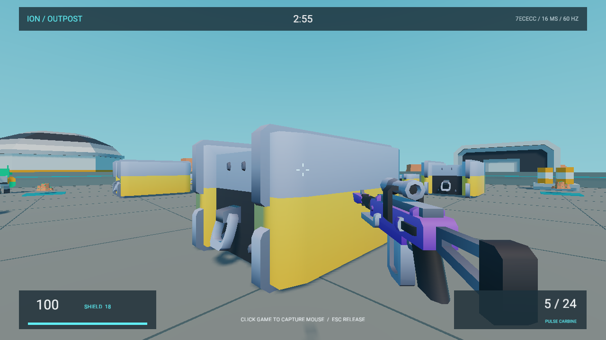

# Ion Outpost / 离子前哨

原生 MEngine FPS：在沙漠科研前哨与玩家、机器人交战。脉冲步枪、散射枪、爆头、掩体遮挡、弹匣换弹、冲刺跳跃、护盾补给、死亡复活、击杀信息和计分板构成完整循环；每局 3 分钟，或先达到 20 次击杀。默认加入 5 名机器人，最多 8 个角色同时参战。



## 运行

用编辑器打开本目录，切到 Game 并 Play。标题页按 **F1** 开始离线机器人对战，按 **Enter** 创建联机房间。生成后的 Windows Player 位于 `Builds/windows-x64-release/Ion Outpost.exe`，无需编辑器即可运行。

联机需要运行 Node.js 20+ 服务端，从仓库根目录执行：

```powershell
node samples/ion-outpost/server.mjs
```

默认监听 `127.0.0.1:7777`，适合同机多客户端。局域网主机执行：

```powershell
node samples/ion-outpost/server.mjs --host 0.0.0.0 --port 7777
```

其他电脑在标题页按 **F3** 输入主机的局域网 IP 和端口，格式为 `192.168.1.10:7777`。需要主机网络允许入站 TCP 7777；程序不自动修改防火墙。按 **F2** 浏览房间，方向键选择、Enter 加入，或按 **J** 输入六位房间码。标题页 F4 修改玩家名。

房间内 **R** 切换准备，所有在线玩家准备后房主按 **Enter** 开局。对局允许中途加入；新玩家不会继承别人的分数。掉线保留席位 15 秒，客户端在 12 秒内自动尝试凭私有令牌恢复身份、位置与分数。房主离开会移交给在线玩家；最后一名人类玩家离开后回收房间。结算页房主按 Enter 再开一局。

| 操作 | 按键 |
| --- | --- |
| 移动 / 冲刺 / 跳跃 | WASD / Shift / Space |
| 捕获鼠标 / 射击 | 点击 Game / 鼠标左键 |
| 瞄准 / 换弹 / 换枪 | 鼠标右键 / R / 1、2 |
| 计分板 | 按住 Tab |
| 释放鼠标 / 暂停菜单 | Escape；Enter 继续 |
| 离开当前对局 | F10 |
| 键盘验收输入 | 方向键转向、F 射击 |

离线暂停会冻结战斗；联机菜单中世界继续运行，当前玩家停止输入。

## 同步与边界

服务端以 **60 Hz 固定步长**裁决移动、武器、命中、伤害、机器人和比赛结果。客户端只提交按键、朝向、输入序号和帧号；服务端约束移动幅度、射速、弹药和输入队列，拒绝重复序号、非法值与越界帧。每三个服务端帧发送逐帧人类输入记录和完整权威快照（20 Hz）。本地角色预测移动，并从服务器确认的输入序号重放尚未确认的输入；远端角色按两个快照插值。机器人执行同一套碰撞、视线遮挡、射击规则，并使用固定网格绕行掩体、跟踪敌人、横移射击和换弹。

客户端从检查点重放收到的逐帧输入，同时推进机器人与战斗，核对服务端的量化状态校验值。通过校验的重放结果用于呈现；缺帧、成员变化或校验不符时采用权威快照恢复。因此完整快照也负责重连与误差校正，不要求不同 JavaScript VM 永久保持位级一致。当前传输为可靠 TCP JSON-lines，适合本机、局域网和可直接访问的自建服务器。未提供公网中继、NAT 穿透、账户认证、TLS、历史回溯命中补偿或跨服匹配；未做真实广域网弱网和跨设备压力验收。

服务端限制 32 个房间、64 条连接、每地址 16 条连接、每连接每秒 180 条消息、单请求 16 KiB，以及 12 帧待处理输入；无输入 250 ms 停止移动/射击，闲置连接 12 秒断开。慢接收端写缓冲超过 256 KiB 时断开。客户端传输线程限制收发队列各 128 条、每条 64 KiB，套接字连接/读写不会阻塞脚本帧。

## 免费模型与来源

实际下载并保留了 Kenney 的 26 个 CC0 模型：宇航员、外星怪物、方块角色、武器、弹药箱、机库、通讯设备、车辆、岩石和晶体。游戏中的角色、武器与装饰来自这些模型。

| 来源 | 内容 | 许可 |
| --- | --- | --- |
| [Kenney Space Kit](https://kenney.nl/assets/space-kit) | 20 个角色、怪物与场景模型 | CC0 |
| [Kenney Blaster Kit](https://kenney.nl/assets/blaster-kit) | 两把武器、两个箱体 | CC0 |
| [Kenney Blocky Characters](https://kenney.nl/assets/blocky-characters) | 两个可复用角色 | CC0 |
| [Quaternius Ultimate Monsters](https://quaternius.com/packs/ultimatemonsters.html) | 核对为 CC0 的后续怪物资源来源；本包未下载 | CC0 |

`SourceAssets/` 保存原始模型及其贴图，`Licenses/` 保存作者许可证，`asset-sources.json` 记录原始链接和 SHA-256。字体许可位于 `Assets/Fonts/LICENSE.txt`。合成音效由本仓库生成器产生。

当前引擎的单个 MeshRenderer 使用一个材质。资产适配脚本遍历完整 glTF 场景节点，烘焙变换、法线、颜色与 UV；角色保留独立肢体枢轴用于行走摆动，武器附件合并为完整模型。原始文件可直接用于后续骨骼动画扩展。

## 修改与验证

```powershell
# 下载/重新适配模型；需要 Python numpy、Pillow
python scripts/import-ion-assets.py

# 从共享模拟、客户端、模型目录生成游戏脚本与场景
node scripts/build-ion-outpost.mjs

# 战斗与真实 TCP 协议检查
node scripts/test-ion-outpost.mjs

# QuickJS / 原生 World 输入检查
cargo test -p mengine-editor-host --test ion_sample

# 两个隔离配置的 Release 原生编辑器进程联机验收
node scripts/qa-ion-outpost.mjs

# 构建独立 Windows Player
node packages/cli/dist/cli.js build samples/ion-outpost --runtime target/release/mengine-runtime.exe --skip-runtime-build --out samples/ion-outpost/Builds/windows-x64-release --clean
```

游戏逻辑编辑 `game/simulation.js` 与 `game/client.js`，然后运行生成器。`Assets/Scripts/Main.js` 是生成产物。场景生成器读取共享碰撞数据，确保可见掩体与服务端射线/移动边界一致。测试、截图与性能口径见[验收报告](../../docs/designs/ion-outpost/README.md)。
