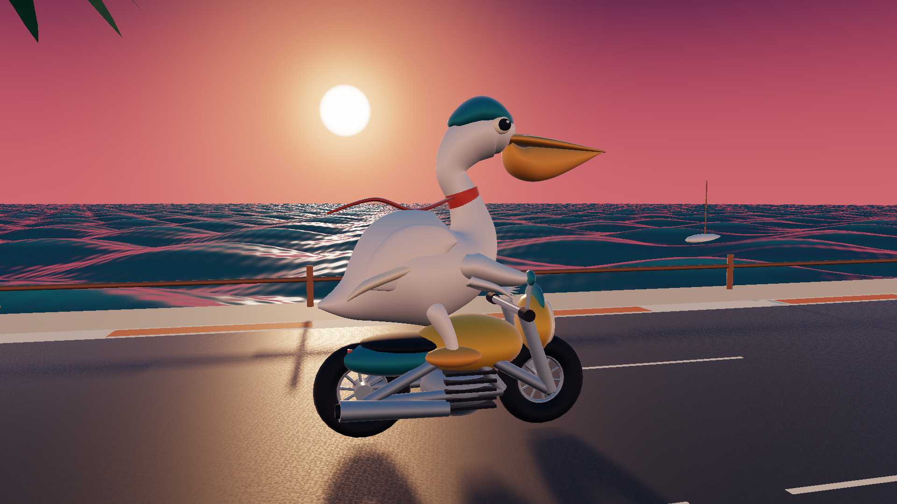

# Pelican Road Rage / 鹈鹕暴力摩托

原创 3D 海岸竞速与近身战斗示例。六名鹈鹕骑手沿 2.7 km 海岸公路穿过棕榈海岸、滨海村落和灯塔，拾取沙丁鱼补充氮气与体力，利用漂移、超车和左右翼攻击累积连击分数。



## 运行

在 MEngine 编辑器中打开本目录的 `project.json`，进入 Game / Play，按 Enter 开始。独立 Windows Player 可直接运行 `Builds/windows-x64-release/Pelican Road Rage.exe`；构建目录不提交到 Git。

| 操作 | 键位 |
| --- | --- |
| 开始、继续、再赛一场 | Enter；菜单按钮也支持鼠标 |
| 油门 / 刹车 | W / S 或 ↑ / ↓ |
| 转向 | A / D 或 ← / → |
| 氮气加速 | Space |
| 漂移 | Shift + 转向；松开后结算漂移分数 |
| 左 / 右翼攻击 | J / K |
| 暂停、继续 | Esc |
| 重开 | R |
| 切换跟随、近景、侧视镜头 | C |
| 显示 / 隐藏 HUD | V |
| 静音 | M |

## 美术与实现

- 鹈鹕的身体、S 形长颈、头部以连续曲面建模，独立制作长喙、喙囊、头盔条纹、眼睛、围巾与层叠羽翼。车身含前叉、车架、油箱、座垫、散热片、排气管和旋转辐条车轮。
- 海面使用起伏网格、解析法线、细波动画、Fresnel 夕阳反射和太阳高光；网格密度集中在近岸。天空、海面、路面均使用可编辑 `.mshader` / `.mmat` 资源。阴影由原生方向光生成。
- 公路几何与驾驶使用同一条参数曲线。游戏逻辑以 120 Hz 固定步长计算，采用街机式轨道坐标和扫掠碰撞；尚未实现刚体摩托车悬挂、倒车或完整 3D 车辆物理。
- 三种带阻尼的镜头、对手追赶与近身攻击、击倒恢复、路障、32 个拾取物、氮气、漂移、连击、音效和结算均由 `Assets/Scripts/Main.ts` 驱动。
- 模型与音频可由 `scripts/create-pelican-road-rage.py` 确定性重建。该命令会覆盖本示例的场景、模型和 WAV；修改美术时同步修改生成器。
- 菜单封面为 AI 生成插画。本文首图和 `docs/designs/pelican-road-rage/` 中的 Game 截图来自原生渲染，封面不代表游戏中的几何细节。

## 构建与复验

从仓库根目录运行；先按仓库 README 构建 CLI。

```powershell
python scripts/create-pelican-road-rage.py
node scripts/test-pelican-road-rage.mjs
cargo test -p mengine-editor-host --test pelican_sample -- --ignored --nocapture
cargo build --release -p mengine-runtime
node packages/cli/dist/cli.js build samples/pelican-road-rage --runtime target/release/mengine-runtime.exe --out samples/pelican-road-rage/Builds/windows-x64-release
& 'samples/pelican-road-rage/Builds/windows-x64-release/Pelican Road Rage.exe' --validate-package
```

`scripts/qa-pelican-road-rage.mjs` 使用真实编辑器 Agent API 验证开始、加速、氮气、暂停冻结、刹车、重开和 Stop 恢复，并保存原生截图。必须设置独立的 `MENGINE_EDITOR_CONFIG_DIR` 和 `MENGINE_EDITOR_EXECUTABLE`；`--preview --model` 生成侧视照片镜头的截图。

`gameplay-test.json` 记录 Node 逻辑验收，`native-race.json` 记录真实 EditorPlayRuntime / Boa / 原生 World 的完整比赛。原生比赛通过输入跑完 2700 m，拾取 32 个沙丁鱼、命中 4 次并完成结算。测试没有移动赛手或跳过比赛。

本机独立 Player 完成打包校验及进程启动；桌面自动化抓取窗口失败（`GetCursorPos: 0x80070005`、`SetIsBorderRequired: 0x80004002`），独立窗口的键鼠操作与音频听感仍需人工确认。原生编辑器的截图和比赛验证不代替这一步。

当前 debug 脚本帧耗时约 47 ms（不含渲染）；这是性能测量，不是 60 FPS 验收。海面仍使用程序化天空反射，未提供屏幕空间反射、折射、泡沫模拟或完整海洋物理。

## 资源来源

- 模型、关卡、脚本、着色器与合成音效：本项目原创，遵循仓库 MIT 许可证。
- `Assets/Art/cover.png`：本任务通过图像生成工具制作的原创鹈鹕骑手插画。提示方向：青绿色头盔与奶油色条纹、橙色围巾、芥末黄咖啡赛车、海岸落日、棕榈与灯塔，无文字和商标。
- Roboto 字体：许可证见 `Assets/Fonts/LICENSE.txt`。
- 用户提供的骑行截图仅作为轮廓、海面和夕阳色调参考，未复制其中的模型或贴图。本示例不宣称是 Unity 官方项目或第三方演示的移植。
