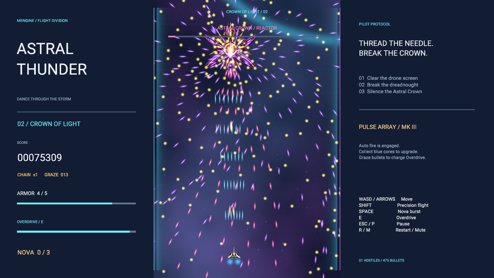

# Astral Thunder / 雷霆战机

MEngine 原创纵向弹幕射击游戏。两段关卡、两名 Boss、五种 Boss 弹幕阶段，包含发光花瓣、交叉针弹、六臂螺旋、预警激光阵列和终局放射弹幕。



在 MEngine 编辑器打开本目录，点击 Play，再按 Enter 出击。战场按 16:9 画布设计，中央为纵向飞行区域，两侧显示资源和操作说明。

| 操作 | 行为 |
| --- | --- |
| WASD / 方向键 | 移动；武器自动开火 |
| Shift | 精确低速移动，显示机身中央判定点 |
| Space | Nova：清除弹幕、破坏敌机并短暂无敌；初始 3 次 |
| E | 能量满时开启 5 秒 Overdrive，强化火力 |
| Esc / P | 暂停、继续 |
| Enter | 出击、继续或结算后再战 |
| R / M | 重开 / 静音 |

擦过敌弹可获得分数和能量。蓝色核心提升武器，最高三级，升级后获得追踪导弹。连续击落提升连击倍率；击破 Boss 恢复一点装甲和一枚 Nova。五点装甲耗尽后可立即重试。

## Windows Player

从仓库根目录执行：

```powershell
npm.cmd --prefix packages/cli run build
cargo build --release -p mengine-runtime
node packages/cli/dist/cli.js build samples/thunder-fighter --runtime target/release/mengine-runtime.exe --out samples/thunder-fighter/Builds/windows-x64-release
& 'samples/thunder-fighter/Builds/windows-x64-release/Astral Thunder.exe' --validate-package
& 'samples/thunder-fighter/Builds/windows-x64-release/Astral Thunder.exe'
```

重新构建已有输出时，在 CLI build 命令末尾加 `--clean`。构建目录已忽略，不提交二进制 Player。

## 引擎与美术

- `SpriteBatch2D` 用 16 个效果/舰队实体更新成组精灵，支持图集、逐实例颜色、局部位置、旋转、尺寸、排序和自定义材质。共享材质直接沿用原生 UI 合批渲染路径，减少 ECS 实体和脚本命令数量。
- 弹幕使用 120 Hz 固定步模拟和线段碰撞，最多保留 900 发敌弹、240 个火花。玩家的判定点小于机体轮廓。
- 八个源着色器构成星云、星点、光晕、光环、针弹、球弹、核心与激光。激光发射前提供 1.3 秒整条航道预警。
- `Assets/Art/fleet.png` 是为本项目生成的六舰图集，切片见同名 `.sprite.json`。美术来源与生成要求见 [ASSETS.md](ASSETS.md)。
- 场景和合成音效由 `python scripts/create-thunder-fighter.py` 重建；玩法源文件为 `Assets/Scripts/Main.ts`，生成器不会覆盖玩法或图集。着色器直接维护源文件。

## 验证

```powershell
node scripts/test-thunder-fighter.mjs
cargo test -p mengine-editor-host --test thunder_sample -- --ignored --nocapture
```

第一条使用真实编译脚本和输入机器人验证完整关卡、精确移动、暂停、Nova、失败和重试，并产生物理按键回放。第二条把同一回放送入 `EditorPlayRuntime / Boa / native World`，断言胜利和五种 Boss 阶段，导出真实状态用于画面检查。当前原生结果：约 109 秒通关、56 次击落、16 次擦弹、4 次 Nova、1 次受伤、峰值 478 发敌弹。

`scripts/qa-thunder-fighter.mjs` 使用独立 QA 编辑器，通过 Agent 验证实况移动、Nova、暂停、继续、重开及 Stop 恢复原始场景。运行前设置 `MENGINE_EDITOR_CONFIG_DIR`、`MENGINE_EDITOR_EXECUTABLE` 指向隔离配置和当前构建的编辑器。标题和 `live-nova.png` 为实时 Play 截图，其余图片是原生通关回放的状态，经 `scene.load_json` 在原生 Game 渲染器中重绘。查看 [原生结果](../../docs/designs/thunder-fighter/native-campaign.json)、[Agent 结果](../../docs/designs/thunder-fighter/agent-checks.json)。

Windows 包通过资源与 SHA-256 校验，Player 启动 8 秒后仍正常运行。桌面自动化因 `GetCursorPos 0x80070005` 未能完成独立 Player 窗口操作，当前机器无默认音频输出设备，键鼠实窗体验和音频听感需人工确认；上述回放验证不代表 60 FPS 性能验收。浏览器 Canvas 回退可显示精灵布局，自定义着色效果需原生编辑器或 Player。
